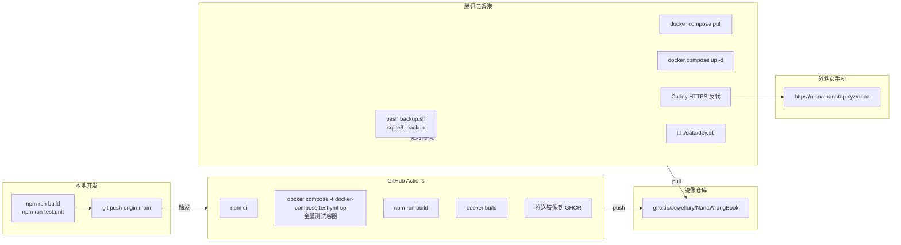
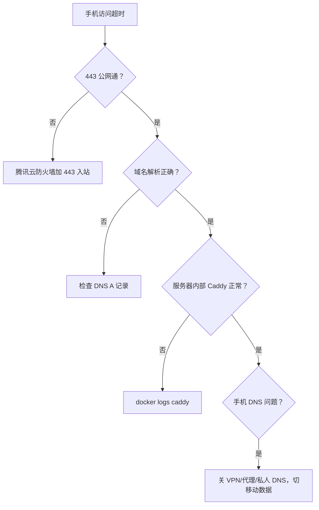

# NanaWrongBook 部署指南

> 部署路线：GitHub Actions CI 构建 Docker 镜像 → GHCR → 服务器 `docker compose pull` 运行
> 服务器：腾讯云香港 Lighthouse，2核2G，Ubuntu 22.04
> 域名：`nana.nanatop.xyz` → `119.28.42.208`

---

## 目录

1. [架构总览](#1-架构总览)
2. [发布流程](#2-发布流程)
3. [服务器初始化](#3-服务器初始化)
4. [回滚指南](#4-回滚指南)
5. [备份策略](#5-备份策略)
6. [故障排查](#6-故障排查)
7. [密钥管理](#7-密钥管理)

---

## 1. 架构总览



### 容器架构

| 容器 | 镜像 | 端口 | 说明 |
|------|------|------|------|
| `wrong-notebook` | `ghcr.io/jewellury/nanawrongbook:TAG` | 3000（仅 internal） | Next.js 应用 |
| `caddy` | `caddy:2-alpine` | 80/443（公网） | HTTPS 反代 → wrong-notebook:3000 |

---

## 2. 发布流程

### 日常发布

```bash
# ===== 本地 =====
npm.cmd run build                          # 验证本地构建
npm.cmd run test:nana:unit                  # 验证本地测试
git checkout dev && git status              # 确认工作区干净
git checkout main && git merge dev          # 合入 main
git push origin main                        # 触发 GitHub Actions

# ===== GitHub Actions 自动 =====
# 1. npm ci
# 2. npx prisma generate
# 3. npm run build（DATABASE_URL=file:./data/test/test.db）
# 4. test container: migrate + seed + test:all
# 5. docker build + push → GHCR（三个 tag）

# ===== 服务器 =====
ssh root@119.28.42.208
cd /opt/nana
bash backup.sh                              # 备份 SQLite（失败则停）
docker compose -f docker-compose.prod.yml pull   # 拉新镜像
docker compose -f docker-compose.prod.yml up -d  # 重建容器
docker logs --tail 80 wrong-notebook        # 确认启动正常
```

### CI 门禁

workflow 文件：`.github/workflows/build-and-push.yml`

触发条件：push 到 `main` 分支

每次构建产三个镜像 tag：
| Tag | 格式 | 用途 |
|-----|------|------|
| 精确回滚 | `sha-<短sha>` | 与 commit 一一对应 |
| 时间戳 | `main-YYYYMMDD-HHMMSS` | 按时间查找 |
| 当前版本 | `latest` | 服务器默认拉取 |

### 纪律

- 部署前必须先 `bash backup.sh`（失败不得继续）
- CI 失败时不跳过、不手动 build
- 服务器只用 `main` 分支
- 不得在服务器上直接编辑源码

---

## 3. 服务器初始化

仅首次部署时需要。之后只需 `git pull` + `docker compose pull && up -d`。

```bash
# ===== 基础环境 =====
ssh root@119.28.42.208
apt update && apt upgrade -y
curl -fsSL https://get.docker.com | sh
apt install -y sqlite3

# ===== 项目 =====
git clone https://github.com/Jewellury/NanaWrongBook.git /opt/nana
cd /opt/nana && git checkout main
mkdir -p data config backups

# ===== GHCR 认证（private 包需要）=====
echo '<classic PAT with read:packages>' | docker login ghcr.io -u Jewellury --password-stdin

# ===== 环境变量 =====
cat > /opt/nana/.env << 'EOF'
DATABASE_URL="file:/app/data/dev.db"
NEXTAUTH_SECRET="$(openssl rand -base64 32)"
NEXTAUTH_URL="https://nana.nanatop.xyz"
AUTH_TRUST_HOST=true
EOF

# ===== 腾讯云防火墙 =====
# 轻量应用服务器 → 防火墙 → 添加入站规则：
# TCP 22  → 0.0.0.0/0  → SSH
# TCP 80  → 0.0.0.0/0  → HTTP（Let's Encrypt HTTP-01）
# TCP 443 → 0.0.0.0/0  → HTTPS

# ===== 启动 =====
bash backup.sh
docker compose -f docker-compose.prod.yml pull
docker compose -f docker-compose.prod.yml up -d
docker logs --tail 80 wrong-notebook

# ===== 验证 =====
curl -sk https://nana.nanatop.xyz/nana
# 预期：307 redirect 或登录页 HTML

# ===== 备份 crontab（每日凌晨 2:00）=====
(crontab -l 2>/dev/null; echo '0 2 * * * /opt/nana/backup.sh') | crontab -
```

---

## 4. 回滚指南

```bash
# 1. 查看当前镜像 tag
docker inspect wrong-notebook --format '{{.Config.Image}}'

# 2. 从 GHCR 或 git log 找到要回滚的 sha
#    列出 GHCR 可用 tag:
#    curl -sH "Authorization: Bearer $PAT" https://ghcr.io/v2/jewellury/nanawrongbook/tags/list | python3 -m json.tool

# 3. **必须先备份数据库**
bash backup.sh

# 4. 设置回滚 tag（不改 compose 文件，只改 .env）
echo 'NANA_IMAGE=ghcr.io/jewellury/nanawrongbook:sha-<目标短sha>' >> /opt/nana/.env

# 5. 重启
docker compose -f docker-compose.prod.yml up -d

# 6. 验证
docker logs --tail 80 wrong-notebook
```

---

## 5. 备份策略

### 备份脚本（`/opt/nana/backup.sh`）

- 每日 2:00 crontab 自动执行
- 备份到 `/opt/nana/backups/dev.db.<YYYYMMDD_HHMMSS>`
- 保留最近 14 天，旧文件自动删除
- 首次部署（`dev.db` 不存在）时跳过并 exit 0

### 手动备份

```bash
bash /opt/nana/backup.sh
```

### 恢复

```bash
cp /opt/nana/backups/dev.db.<目标时间戳> /opt/nana/data/dev.db
docker compose -f docker-compose.prod.yml restart wrong-notebook
```

---

## 6. 故障排查

### 容器 crash

```bash
docker logs --tail 120 wrong-notebook
```

常见原因：
| 错误 | 根因 | 修复 |
|------|------|------|
| `bcryptjs/umd/index.js` not found | standalone 未跟踪 | `next.config.ts` 加 `outputFileTracingIncludes` |
| `Admin seed failed`（非致命） | 管理员已存在 | 日志 WARN，不影响使用 |

### HTTPS 不通



验证步骤（从服务器内）：
```bash
docker exec caddy curl -sk --resolve nana.nanatop.xyz:443:127.0.0.1 https://nana.nanatop.xyz/nana -o /dev/null -w '%{http_code}'
# 预期：307（重定向到 /login）
```

### DNS 验证

> ⚠️ 本机 agent/WSL 沙箱的 DNS 可能被网络层拦截（返回 `198.18.x.x`），不能用作判断依据。

可靠 DNS 验证方式（优先级）：
1. **手机移动数据** — 浏览器打开 `https://nana.nanatop.xyz`（最可靠）
2. **腾讯云服务器** — `getent hosts nana.nanatop.xyz`
3. **公共 DNS 工具** — https://dnschecker.org
4. **本机 `nslookup`（仅无代理环境）** — `nslookup nana.nanatop.xyz 1.1.1.1`

---

## 7. 密钥管理

| 密钥 | 位置 | 说明 |
|------|------|------|
| `NEXTAUTH_SECRET` | 服务器 `/opt/nana/.env` | `openssl rand -base64 32` 生成，不入 git |
| `GITHUB_TOKEN` | GitHub Actions 自动提供 | 仓库 Settings → Secrets → Actions |
| GHCR PAT | 服务器 `docker login` | GitHub Settings → classic PAT → `read:packages`，90 天轮换 |
| AI Key（未来） | 服务器 `/opt/nana/.env` | 部署后由用户手动写入 |

---

## 附：关键文件索引

| 文件 | 用途 |
|------|------|
| `doc/plan/ci-image-deployment-plan.md` | CI 方案完整设计（背景、对比、架构图） |
| `doc/executionlog/tencent-cloud-deployment-log.md` | 部署执行日志（含问题修复记录） |
| `docker-compose.prod.yml` | 生产 compose（image 方式，不含 build） |
| `docker-compose.yml` | 本地开发 compose（build 方式） |
| `.github/workflows/build-and-push.yml` | CI workflow（push main 触发） |
| `Dockerfile` | 多阶段构建（deps → builder → runner） |
| `backup.sh` | SQLite 每日备份脚本 |
| `Caddyfile` | Caddy HTTPS 反代配置 |
| `next.config.ts` | Next.js 配置（standalone + outputFileTracingIncludes） |
