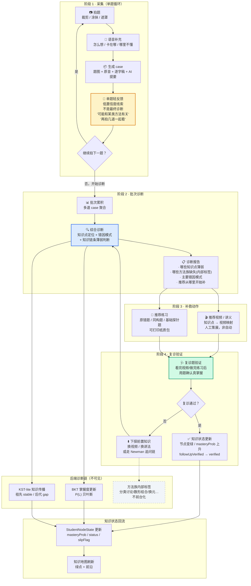

# 采集到诊断闭环重设计

> 性质：`/plan` 阶段产出。重新设计"采集到诊断的闭环"，同步修订优先级和方案边界。
> 产生日期：2026-06-27
> 关联工单：`2026-06-27_project-ai-capture-to-diagnosis-loop-revision-workorder.md`
> 必读输入：诊断闭环研究报告、视频资源调研报告、外部调研工单、现有前端方案、M2 归因计划

---

## A. 一页结论

### 采纳的研究结论

1. **批量诊断是主干能力，单题诊断只限高诊断性题目**。Nana 现有 8 步状态机和编排器本身就是批量工作模式，方向一致。单题轻反馈只做情绪闭环（低置信度线索），不做教学闭环（终诊）。
2. **case 必须是核心对象**。一条 case 持有多模态 artifact（题图、原音、逐字稿、AI 提要），采集壳、诊断、补救、复诊都围绕 case 展开，不是单张图或单段录音。
3. **知识图谱是主图层，方法族只做内部标签**。Nana 已有 48 节点图谱。方法族地图没有公开成熟产品在首屏展示，教师标注一致性未验证，首期不前台化。
4. **视频推荐必须配复诊验证**，否则发生假性闭合。TECH_PLAN_v2 §0.1 已有这条硬约束，ErrorRecord 已埋 `followUpVerified` 字段，本轮只差把"推荐→复诊"画成闭环写进方案。
5. **Newman-lite 形态是追问链，不是前台独立功能**。属于诊断后端受控扩展步骤，仅在批次诊断中"答案对但解释可疑"时触发。启用时机：M4 或用户提升优先级，需先开 LLM 调用。

### 暂缓的结论

6. **方法族地图前台化**——等内部标签积累 + 教师一致性验证通过后再评估。首期只做内部聚类维度，不在地图中展示。
7. **全自动变式题生成**——研究报告指出 LLM 生成的干扰项教学对齐度不足。首期走"模型起草 + 人工审核"，或直接用已有题库推荐。
8. **FSRS 自适应复习排程**——等诊断→补救→复诊闭环稳定后再接入。算法成熟，接入成本可控，不是当前瓶颈。

### 不吸收的结论

9. **外部调研报告的 6-10 周全链路 Gantt 图**——时间线和范围假设与 Nana 当前切片节奏冲突。Nana 切片 1 是 1-2 周轻量壳，不是自建编辑器 + 全链路语音 + 教育分析全家桶。

### 闭环新定义

```
采集（单题循环）→ 单题轻反馈（低置信度线索，情绪闭环）
→ 批量累积 → 批次诊断（较稳综合判断，教学闭环）
→ 补救动作（视频/讲义/练习，开方转诊）
→ 复诊验证（用题确认真掌握，疗效确认）
→ 结果回流（更新知识状态）
```

四步的本质区别：

| 步骤 | 角色 | 置信度 | 用户感知 |
|------|------|--------|----------|
| 单题轻反馈 | **情绪闭环**——让她感到被回应 | 低，明确标注"只是线索" | "有人在听我说" |
| 批次诊断 | **教学闭环**——真正可信的判断 | 中高，多题交叉验证 | "原来我卡在这几个点上" |
| 补救动作 | **开方转诊**——不是终点 | — | "看这个视频/做这几道题" |
| 复诊验证 | **疗效确认**——防止假性闭合 | 高，用题验证 | "做完确认一下是不是真懂了" |

**"单题轻反馈"是情绪闭环、"批次诊断"才是教学闭环。** 前者不能替代后者。

---

## B. 新闭环图



---

## C. 优先级调整表

| # | 能力 | 优先级 | 为什么 | 如果现在不做 |
|---|------|:--:|------|------|
| 1 | **case / artifact API** | **P0** | 采集壳需要存 case，没有它采集壳只是截图工具 | 采集壳只能 mock，无法存真实数据 |
| 2 | **采集壳（/nana + /nana/capture）** | **P0** | 产品主验证点。不变的结论 | 没有入口，所有后续页面无处挂载 |
| 3 | **单题轻反馈** | **P1** | 情绪闭环的关键——她拍完题不能只看到"保存成功"。只做轻量提示，不伪装成终诊 | 采集壳变成"拍完就没了"的冷淡体验，违背低压感原则 |
| 4 | **批次诊断报告** | **P1** | 真正的教学闭环。M3c 后端编排器和 session-items API 已就绪，前端只需展示层 | 诊断能力只留在后端，用户看不到任何结论，闭环断裂 |
| 5 | **知识地图** | **P1** | 产品灵魂界面。阶段 1 只做绿点+前沿，后端 map API 已就绪 | 缺少"看到进步"的可视化证据，领先指标无载体 |
| 6 | **Session UI** | **P1** | 后端 API 100% 就绪，技术上可独立开建。入口体验依赖采集壳 | "答题→提交→纸质包"流程没法在界面上跑 |
| 7 | **Newman-lite** | **P2** | 形态是诊断后端的追问链，不是前台独立功能。在批次诊断给出"答案对但解释可疑"的场景下触发 | 当前不调 LLM（D-8），即使提前也只能做规则版 stub |
| 8 | **视频推荐** | **P2** | 诊断→补救动作。必须在批次诊断和知识图谱可用后才有挂载点。首期人工策展最小集 | 诊断报告只有"你卡在这"，没有"去看这个解决"，补救链缺一环 |
| 9 | **复诊验证** | **P2** | 必须与视频推荐成对出现。ErrorRecord 已有 `followUpVerified` 字段 | 出现假性闭合——学生没看懂，系统却以为补上了 |
| 10 | **方法族内部标签** | **P2** | 只做后端内部标签层，不前台化。在批次诊断时作为辅助聚类维度 | 失去"跨知识点的同方法模式识别"能力 |
| 11 | **方法族地图前台化** | **暂缓** | 公开产品无一在首屏展示方法族地图，教师标注一致性未验证 | 不会损失首期体验。强行前台化会让学生困惑 |
| 12 | **复习排程** | **开放项** | 诊断→补救→复诊闭环稳定后再接入 | 复习靠人工节奏，缺少自适应提醒 |
| 13 | **全自动变式题** | **暂缓** | AI 生成的干扰项教学对齐度不足 | 首期用已有题库推荐，不走自动生成 |

---

## D. 方案边界

### MVP 里明确不做什么

| 不做什么 | 原因 |
|----------|------|
| 不把"单题轻反馈"做成终诊 | 单题置信度不足以判断理解程度。轻反馈只能给线索和情绪回应 |
| 不把方法族地图前台化 | 没成熟先例，教师一致性未验证 |
| 不做全自动 AI 变式题 | 数学题生成风险高，必须人工审核。首期用已有题库推荐 |
| 不做块编辑器 | 采集壳用普通 React 组件 + 固定布局 |
| 不做 ASR 后端实现 | 采集壳 UI 先用 mock，切片 4 再接 |
| 不引入 AFFiNE/BlockSuite/SiYuan 运行时依赖 | 只作结构参考，不是 npm install 对象 |
| 不把视频推荐做成自动推荐引擎 | 首期人工策展最小集 |
| 不做 FSRS 自适应复习排程 | 开放项，等闭环稳定 |
| 不把 Vosk/whisper.cpp 替代豆包流式 ASR 主线 | 等出现隐私或离线刚需再评估 |
| 不需要 Newman 归因 UI——追问链不暴露为前台独立步骤 | 追问应内嵌在答题流程中，不标"Newman 第 X 步" |

### 哪些能力只保留字段和开放项

| 能力 | 保留什么 | 何时启用 |
|------|---------|----------|
| 方法族标签 | 后端 internal tags，不暴露给学生 | 等内部积累 + 教师一致性验证 |
| 复习排程 | `reviewSchedule` 作为字段名预留，不阻塞数据模型 | 闭环稳定后 |
| Newman 归因 | ErrorRecord 表已有 `newmanStage`/`errorType`/`crossTag`/`rootNodeId` 字段 | M4 或用户提升优先级 |
| 本地 ASR | whisper.cpp / Vosk 作为开放项 | 出现隐私或离线刚需时 |
| 方法族地图 | 仅设计文档开放项 | 后续轮次评估 |

### 哪些能力不应该进入首期前台

| 能力 | 为什么 | 替代方案 |
|------|------|---------|
| 方法族地图（前台可视化） | 没有公开产品在首屏做这个。学生看到一份"方法族地图"会困惑 | 方法族只在诊断报告中作为文字描述出现（如"你在这几道题里都不太会分类讨论"） |
| Newman 归因 UI | 追问链是后端能力，不应暴露为前台步骤让学生感知 | 追问发生在答题流程中，对她只是自然的"再看这道题" |
| 掌握度百分比 | P4 铁律：前台不评判 | 知识地图只亮绿点 + 前沿，不显示数字 |

---

## E. 文档修订建议

### E.1 `project-architecture-map-and-priority-plan.md`

| 改哪里 | 改成什么 |
|--------|---------|
| §1 Mermaid 架构图 | ① 采集壳和 API 层之间新增"单题轻反馈"节点（标注：低置信度线索，不是终诊）② 新增"批次诊断报告"节点 ③ 新增"补救→复诊"闭环箭头（视频推荐 → 复诊题验证 → 知识回流） |
| §2.3 API 层表格 | 新增一行：`POST /api/nana/cases/:id/feedback`（单题轻反馈），状态标记为 P1 |
| §3 接口缺口清单 | 新增 3.7 节：单题轻反馈接口。说明这是采集壳"拍完就给回应"的关键 API：输入（case 的逐字稿+AI 提要），输出（低置信度提示文本）。 |
| §4 优先级建议 | 方案 A/B/C 框架不变。补充："单题轻反馈是切片 1 采集壳内部的子任务，不是独立切片。采集壳 UI 里拍完题的 3 秒内必须给出文字回应。" |
| §5 当前不做 | 新增：不把方法族地图前台化入首期；不把单题轻反馈做成终诊；不做全自动变式题 |
| §2.2 诊断逻辑层 | Newman 归因行改为："Newman 追问链规则设计完成。定位：P2，诊断后端受控扩展步骤，非前台功能。先决条件：启用 LLM 调用（D-8 解除）" |

### E.2 `frontend-architecture-plan.md`

| 改哪里 | 改成什么 |
|--------|---------|
| §5.2 采集壳 | 在"界面要素"中新增第 5 个要素：**单题轻反馈区**——拍完题+说完语音后 3 秒内出现文字回应。模板：①"收到这道题"②"你说的 XX 可能和 YY 有关"③"不是终诊，再拍几道后一起看"。措辞守 P4。 |
| §5.4 知识地图 | 补充："方法族 = 内部标签层，不进前台知识地图。" |
| §6 建设顺序 | 切片 1 新增子任务：单题轻反馈的 3 秒即时回应。切片 3 新增子任务：批次诊断报告页（聚合多 case 的综合诊断结论展示）。 |
| §9 技术附录 | 新增 §9.6：单题轻反馈 API 契约（`POST /api/nana/cases/:id/feedback`：输入 case.voiceTranscript + case.aiSummary → 输出低置信度提示文本 + 关联知识点/方法族 hints） |

### E.3 `M2-attribution-flow-plan.md`

| 改哪里 | 改成什么 |
|--------|---------|
| §1 概述 | "本轮不做的事"追加一条："不做单题即时诊断反馈（那是采集壳层的事，不归 M2。M2 的 Newman 追问是批次诊断内部的受控扩展，和单题轻反馈是两个不同概念。）" |
| 末尾附注（新增） | **Newman-lite 重新定位**：当前是诊断后端的受控扩展步骤。触发条件：仅在批次诊断中"答案对但解释可疑"时走追问链。形态：不是前台独立 UI，是 session 答题流程中内嵌的追问步骤。启用先决条件：① LLM 调用启用（D-8 解除）② ErrorRecord 字段已就绪（`newmanStage`/`evidenceRound`/`followUpVerified`）。 |

### E.4 `DECISIONS.md`

| 改哪里 | 改成什么 |
|--------|---------|
| 开放项速查 | 新增：方法族地图前台化（暂缓，待内部标签积累 + 教师一致性验证）。新增：全自动变式题生成（暂缓，首期走人工审核）。新增：单题轻反馈与批次诊断的关系定位（P1 情绪闭环 vs P1 教学闭环，措辞约束在 `asr-and-case-api-boundary-note.md` 或 `diagnosis-closed-loop-spec.md` 中钉死）。 |

### E.5 建议新增短文档

**建议新增**：`doc/plan/diagnosis-closed-loop-spec.md`（不超过 150 行）

专门钉死四个步骤的边界和契约：

```text
1. 单题轻反馈
   - 触发时机：拍题 + 口述完成后 3 秒内
   - 输入：case.voiceTranscript + case.aiSummary
   - 输出：提示文本（必须含不确定性表达："可能"、"初步线索"、"再拍几道后一起看"）
   - 约束：不伪装成终诊，不出现掌握度/百分比/分数

2. 批次诊断
   - 触发时机：用户主动触发"开始诊断"或累积 N 道 case 后系统提示
   - 输入：n 条 case 的 artifact 数据 + StudentNodeState
   - 输出：知识点列表 + 错因模式 + 方法族内部标签 + 推荐补救动作
   - 约束：前端只展示结论卡片，不暴露后端算法细节

3. 补救动作
   - 视频推荐规则：知识点 → 视频映射（人工策展），方法族视频暂缓
   - 什么场景不推荐视频：运算断层/读题偏差/表达不完整 → 推荐检查清单或练习
   - 练习推荐规则：从已有题库中选同难度同知识点的 drill 题

4. 复诊验证
   - 确认题类型：原错题同构题（验证方法理解）或基础探针题（验证前置知识）
   - 通过标准：答对 + 无需追问链进一步怀疑
   - 失败后路径：换视频 → 换讲法 → 下探前置知识点
```

这段短文不涉及代码实现，只定输入输出和边界，可以传给 execute-agent 直接消费。

---

> 本文件覆盖的修订将在用户确认后分别写入 `project-architecture-map-and-priority-plan.md`、`frontend-architecture-plan.md`、`M2-attribution-flow-plan.md`、`DECISIONS.md` 和新增的 `diagnosis-closed-loop-spec.md`。
