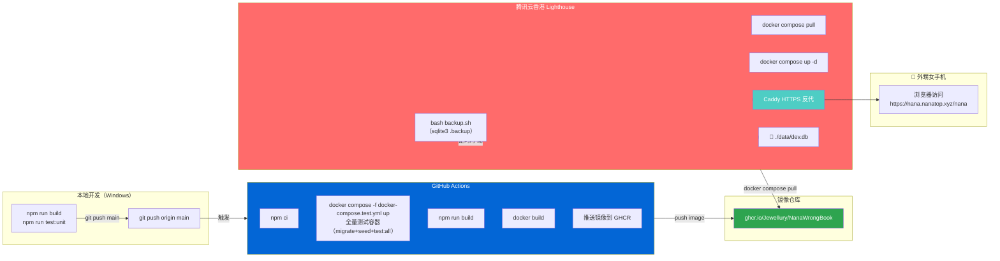

# CI 镜像部署方案

> 性质：`/plan` 阶段产出。重新设计的部署方案——从"服务器现场构建"切换到"CI 构建镜像，服务器拉取运行"。
> 产生日期：2026-06-30
> 废弃原方案：`doc/plan/tencent-cloud-hk-deployment-plan.md`（服务器现场 build 路线）
> 关联复盘：`doc/reference/deployment-postmortem-2026-06-28.md`、`doc/executionlog/tencent-cloud-deployment-log.md`

---

## 1. 结论

**推荐方案：GitHub Actions CI 构建 Docker 镜像 → 推送 GHCR → 服务器 docker compose pull 运行**

放弃原方案"服务器现场 `docker compose build`"路线。原因：

| 旧方案（服务器 build） | 新方案（CI 构建） |
|------------------------|-------------------|
| ❌ 依赖服务器 2核2G 做 Node 编译 | ✅ 本地/CI 构建，服务器只拉取运行 |
| ❌ Docker Hub 镜像拉取慢，npm install 超时 | ✅ GitHub → GHCR 同一生态，推拉稳定 |
| ❌ 每次部署在服务器上编译 2-5 分钟 | ✅ 服务器只 pull 镜像，通常显著快于现场 build |
| ❌ 服务器内存不足可能 OOM | ✅ 无编译内存压力 |
| ❌ 无法回滚到旧版本（现场 build 无版本） | ✅ 镜像带 tag，回滚即切 tag |
| ❌ 无法验证构建结果（直到服务器跑起来才报错） | ✅ CI 通过才推送，构建失败不部署 |

---

## 2. 当前约束与问题复盘

### 已暴露的问题

| 问题 | 出现阶段 | 当前方案如何避免 |
|------|---------|-----------------|
| Docker Desktop Pipe 间歇断裂 | 本地开发、构建 | **不依赖** Windows Docker Desktop 作为上线门禁 |
| 服务器 npm install 超时 | 服务器 build | 服务器不再跑 npm install |
| 服务器 `node:22-alpine` 拉取慢 | 服务器 build | 服务器只需拉取最终应用镜像（大小取决于构建产物） |
| `tsconfig.json` exclude 遗漏 | 服务器 build 暴露 | CI 构建失败即阻断，不部署 |
| Google Fonts CDN 不可达 | Docker 构建 | 已修（系统字体替代），CI 重复验证 |
| `main` 分支未同步 `dev` 修复 | 发布纪律 | CI 只在 main 推送时触发，强制定分支纪律 |
| 2核2G 内存 OOM | 服务器 build | 服务器只运行，不编译 |

### 真实约束重申

1. Windows 开发机，Docker Desktop 不稳定——**不依赖它做上线门禁**
2. 孩子真机测试需要 HTTPS 公网地址——**这是刚需，不能绕过**
3. 不需要商业级高可用——**但必须可回滚、可备份、可重复**
4. SQLite 保留——**单文件备份恢复简单，不改**

---

## 3. 方案对比

| 维度 | 旧方案（服务器 build） | 新方案（CI 镜像构建） | 结论 |
|------|----------------------|---------------------|:----:|
| 构建环境 | 服务器现场 | GitHub Actions | ❌ 旧 |
| 构建失败影响 | 服务器上卡住，用户不知所措 | CI 日志输出，不部署 | ✅ 新 |
| 服务器内存压力 | 高（Node 编译 + npm） | 低（仅运行容器） | ✅ 新 |
| 回滚能力 | 无（无 tag，每次新 build） | 有（镜像 tag） | ✅ 新 |
| 部署速度 | 2-5 分钟 build + 上传 | 仅 pull + up（远快于 build） | ✅ 新 |
| 依赖 Windows Docker | ✅ 不依赖 | ✅ 不依赖 | 持平 |
| 发布纪律 | 手动合 main，无强制 | CI 只响应 main push | ✅ 新 |
| 复杂度 | 低（仅 compose） | 中（+ CI 配置 + 密钥管理） | ⚠️ 稍高但可控 |

**结论**：新方案总收益远大于额外复杂度。

---

## 4. 推荐架构图



---

## 5. 镜像仓库选择：GHCR

| 维度 | GHCR（推荐） | 腾讯云 TCR |
|------|:----------:|:----------:|
| Actions 推送 | ✅ GitHub 原生，无额外认证 | ❌ 需要额外登录腾讯云 |
| 服务器拉取 | ✅ 香港到 GitHub 通常可达 | ✅ 腾讯云内网拉取快 |
| 登录凭证 | `GITHUB_TOKEN` 自动可用 | 需要手动配置 TCR 密码 |
| 国内网络 | ⚠️ 部分时段 GitHub 可能慢 | ✅ 腾讯云内网稳定 |
| 维护复杂度 | 低（无需额外注册） | 中（多一套凭证管理） |

- **首选 GHCR（private + classic PAT + read:packages）**，原因：
- GitHub Actions 推送用 `GITHUB_TOKEN`，原生集成，无需额外配置
- 服务器拉取私有镜像需要配置一个 **classic PAT**：
  - 在 GitHub Settings → Developer settings → Personal access tokens → Tokens (classic) 创建
  - 权限：勾选 `read:packages`（仅读取包）
  - 有效期：可设 90 天或自定义
  - 服务器上登录：`echo "<PAT>" | docker login ghcr.io -u <用户名> --password-stdin`
  - PAT 存入服务器 `.env` 不存 git
- GitHub Packages / GHCR 当前要求 classic PAT 作为服务器拉取凭证
- 也可以将 GHCR package 设为 public（无需登录即可拉取），但首期建议 private + PAT 更安全
- 不引入第二个云厂商的密钥管理

**备选方案**：如果遇到 GHCR 拉取速度长期无法接受（从香港服务器拉取 > 3 分钟），可改为腾讯云 TCR。切换成本低——只需改 `docker-compose.yml` 的 `image` 地址和 GitHub Actions 的 push 目标。

---

## 6. GitHub Actions 门禁设计

### 首期门禁（严格，但够用）

```yaml
name: build-and-push
on:
  push:
    branches: [main]

jobs:
  build-and-push:
    runs-on: ubuntu-latest
    permissions:
      contents: read
      packages: write
    steps:
      - uses: actions/checkout@v4

      - uses: actions/setup-node@v4
        with:
          node-version: 22

      - name: Install dependencies
        run: npm ci

      - name: Generate Prisma client
        run: npx prisma generate

      - name: Build
        run: npm run build
        env:
          DATABASE_URL: "file:./data/test/test.db"
          NEXTAUTH_SECRET: "ci-build-secret"
          AUTH_TRUST_HOST: "true"

      - name: Run integration tests
        env:
          DATABASE_URL: "file:./data/test/test.db"
          NEXTAUTH_SECRET: "ci-build-secret"
          AUTH_TRUST_HOST: "true"
        run: |
          cp .env.test.example .env.test
          docker compose -f docker-compose.test.yml up --abort-on-container-exit --exit-code-from test

      - name: Cleanup test containers
        if: always()
        run: docker compose -f docker-compose.test.yml down -v

      - name: Login to GHCR
        run: echo "${{ secrets.GITHUB_TOKEN }}" | docker login ghcr.io -u ${{ github.actor }} --password-stdin

      - name: Build and push Docker image
        env:
          SHA: ${{ github.sha }}
        run: |
          SHORT_SHA=$(echo "$SHA" | cut -c1-7)
          TIMESTAMP=$(date +%Y%m%d-%H%M%S)
          TAG="sha-${SHORT_SHA}"
          docker build -t ghcr.io/jewellury/nanawrongbook:$TAG .
          docker tag ghcr.io/jewellury/nanawrongbook:$TAG ghcr.io/jewellury/nanawrongbook:${TIMESTAMP}
          docker tag ghcr.io/jewellury/nanawrongbook:$TAG ghcr.io/jewellury/nanawrongbook:latest
          docker push ghcr.io/jewellury/nanawrongbook:$TAG
          docker push ghcr.io/jewellury/nanawrongbook:${TIMESTAMP}
          docker push ghcr.io/jewellury/nanawrongbook:latest
```

**说明**：
- `npm run build` 验证生产构建，设置 DATABASE_URL 避免连接真实数据库
- 测试复用 `docker-compose.test.yml`：复制 `.env.test.example` → 启动测试容器 → 自动跑 migrate/seed/test:all → `down -v` 清理。DB 护栏（guard-db）生效，不碰生产库
- 每次 push main 都构建并推送三个 tag：`sha-<短sha>`（精确回滚点）+ 时间戳 + `latest`
- **不上传 `dev` 分支**（强化 main 纪律）

### 首期门禁后续优化方向

当前复用 `docker-compose.test.yml` 跑全量测试（含上游测试和 seed），CI 总时长可能较长。后续可优化为：
- 拆分轻量测试（nana 专用）和全量集成测试
- 并行化 build 和 test 步骤
- 缓存 `node_modules` 和 `.next` 加速构建

但首期不走捷径绕过 DB 护栏——全量测试更安全。

### 后续可追加

| 门禁 | 何时加 | 原因 |
|------|--------|------|
| `npm run test:all` | 上游测试稳定后 | 防回归 |
| Dockerfile lint | 镜像安全问题 | 可先不加 |
| 多架构构建 | 有 ARM 部署需求时 | 当前 x86 够用 |

---

## 7. Compose 文件设计

### 新建 `docker-compose.prod.yml`（入仓库，服务器从仓库拉取）

此文件进入 Git 仓库，服务器 `git pull` 获取。**服务器不执行 `build` 操作**。

```yaml
services:
  wrong-notebook:
    image: ${NANA_IMAGE:-ghcr.io/jewellury/nanawrongbook:latest}
    container_name: wrong-notebook
    restart: always
    expose:
      - "3000"
    env_file:
      - .env
    volumes:
      - ./data:/app/data
      - ./config:/app/config

  caddy:
    image: caddy:2-alpine
    container_name: caddy
    restart: always
    ports:
      - "80:80"
      - "443:443"
    volumes:
      - ./Caddyfile:/etc/caddy/Caddyfile
      - caddy_data:/data
      - caddy_config:/config
    depends_on:
      - wrong-notebook

volumes:
  caddy_data:
  caddy_config:
```

**回滚方式**：在服务器 `.env` 中添加 `NANA_IMAGE=ghcr.io/jewellury/nanawrongbook:sha-<短sha>`，然后 `docker compose -f docker-compose.prod.yml up -d` 即可切到指定版本。不改 compose 文件，只改 `.env`。

### 现有 `docker-compose.yml`（本地开发用，保留不动）

```yaml
services:
  wrong-notebook:
    build:
      context: .
      dockerfile: Dockerfile
    ports:
      - "3003:3000"
    # ... 其余不变
```

### 关键设计决策

| 要素 | 决策 | 理由 |
|------|------|------|
| 生产/开发 compose 分拆 | ✅ 新建 `docker-compose.prod.yml` | 开发用 build，生产用 image，不易混淆 |
| Caddy 放在同一 compose | ✅ 是 | 生产 compose 一站式启动 |
| SQLite 挂载 | `./data:/app/data` | 保留已有路径 |
| `./config:/app/config` | ✅ 保留 | 上游已有挂载，不动 |
| app 端口暴露 | `expose` 不 `ports` | 只让 Caddy 访问，不暴露公网 |
| .env 路径 | `env_file: .env` | 与现有一致，放在 `/opt/nana/.env` |

---

## 8. 镜像 tag 与回滚设计

### Tag 策略

| Tag | 用途 | 更新时机 |
|-----|------|---------|
| `sha-<短sha>` | **精确回滚点**，与 commit 一一对应 | 每次 CI 构建（主推） |
| `main-YYYYMMDD-HHMMSS` | **时间戳版本**，便于按时间查找 | 每次 CI 构建 |
| `latest` | **当前版本**，服务器默认拉取 | 每次 CI 构建覆盖 |

**回滚时优先推荐使用 `sha-<短sha>`**——与 git commit 绑定，可精确回溯到某次代码变更。

### 回滚步骤

```bash
# 1. 查看当前容器使用的镜像 tag
docker inspect wrong-notebook --format '{{.Config.Image}}'

# 2. 从 GHCR 列出可用 tag
#    或从 GitHub Actions 日志、git log 找到上一个版本的 sha
docker pull ghcr.io/jewellury/nanawrongbook:sha-<上一个短sha>

# 3. 备份当前数据库（回滚前必须做）
bash backup.sh

# 4. 在服务器 .env 中设置回滚 tag
#    echo 'NANA_IMAGE=ghcr.io/jewellury/nanawrongbook:sha-上一个短sha' >> /opt/nana/.env

# 5. 重启（compose 从 .env 读取 NANA_IMAGE）
docker compose -f docker-compose.prod.yml up -d
```

---

## 9. SQLite 备份与恢复

### 备份脚本（`/opt/nana/backup.sh`）

```bash
#!/bin/bash
BACKUP_DIR="/opt/nana/backups"
DB_PATH="/opt/nana/data/dev.db"
TIMESTAMP=$(date +%Y%m%d_%H%M%S)

if ! command -v sqlite3 &>/dev/null; then
  echo "ERROR: sqlite3 not installed. Install it: apt install -y sqlite3"
  exit 1
fi

mkdir -p "$BACKUP_DIR"
sqlite3 "$DB_PATH" ".backup '$BACKUP_DIR/dev.db.$TIMESTAMP'"
echo "[$(date)] backup: dev.db.$TIMESTAMP"
find "$BACKUP_DIR" -name "dev.db.*" -mtime +14 -delete
```

### 强制规则

- **部署前必须先备份**——`bash backup.sh` 失败不得继续
- **回滚前必须先备份**——同一条命令
- 每日定时备份：`crontab -e` 添加 `0 2 * * * /opt/nana/backup.sh`
- 每周手动下载到本地电脑

---

## 10. 标准发布流程

### 完整流程

```
本地（Windows）:
  1. npm.cmd run build                  # 验证本地构建
  2. npm.cmd run test:nana:unit          # 验证本地测试
  3. git checkout dev
  4. git status                          # 确认工作区干净
  5. git checkout main
  6. git merge dev                       # 合入 main
  7. git push origin main                # 触发 GitHub Actions

GitHub Actions（自动）:
  8. npm ci
  9. npx prisma generate
  10. npm run build（DATABASE_URL=file:./data/test/test.db）
  11. cp .env.test.example .env.test
  12. docker compose -f docker-compose.test.yml up --abort-on-container-exit
  13. docker compose -f docker-compose.test.yml down -v
  14. docker build
  15. docker push → GHCR（三个 tag：sha-<短sha> + 时间戳 + latest）
  16. 以上任一失败 → 不推送，不部署，检查日志

服务器（SSH）:
  16. cd /opt/nana
  17. bash backup.sh                     # 备份当前 SQLite
  18. docker compose -f docker-compose.prod.yml pull   # 拉新镜像
  19. docker compose -f docker-compose.prod.yml up -d  # 重建容器
  20. docker logs --tail 80 wrong-notebook             # 确认启动正常
```

### 纪律

- **部署前不备份 = 违规**，可能导致数据丢失
- CI 失败时不跳过、不手动 build
- 服务器只用 `main` 分支，不用 `dev`

---

## 11. 真机测试流程

### 前提

- `https://nana.nanatop.xyz/nana` 可访问
- 域名已解析到服务器 IP
- 80/443 防火墙已放行
- Caddy HTTPS 证书自动申请成功

### DNS 验证（不要用 agent 终端测）

本机 agent/WSL 沙箱的 DNS 查询可能被网络层拦截（返回 `198.18.x.x`），**不能用作公网 DNS 判断依据**。

DNS 生效判断标准（优先级从高到低）：

| 验证方式 | 命令/工具 | 期望结果 |
|---------|----------|---------|
| **手机移动数据**（最可靠） | 手机浏览器打开 `https://nana.nanatop.xyz` | 不走你家 WiFi，避免本地 DNS 劫持 |
| **腾讯云服务器** | `getent hosts nana.nanatop.xyz` | `119.28.42.208` |
| 公共 DNS 网页工具 | https://dnschecker.org 查询 `nana.nanatop.xyz` | A 记录 = `119.28.42.208` |
| 本机 `nslookup`（仅限无代理环境） | `nslookup nana.nanatop.xyz 1.1.1.1` | `119.28.42.208` |

### 验收顺序

```
DNS A 记录生效（域名→119.28.42.208）
→ 80/443 端口连通（防火墙放行）
→ Caddy 自动申请 Let's Encrypt 证书成功
→ https://nana.nanatop.xyz/nana 页面可访问
→ 手机拍照/麦克风权限可触发
```

前一项不通过，后一项不用测。

### Checklist

1. 手机打开 `https://nana.nanatop.xyz/nana` — 首页应加载
2. 点击"拍一下这道题" — 弹出拍照/相册权限
3. 点击录音按钮 — 弹出麦克风权限
4. 完成一次"拍题→说思路→轻反馈"全流程
5. 知识地图页面可打开
6. Session 列表页可打开
7. 刷新页面后数据不丢失
8. 关闭浏览器重新打开后登录态保持

**若 HTTPS 未完成**：拍照/麦克风权限无法触发，其余功能（首页/地图/列表）可在 HTTP 下测试。

---

## 12. 安全与密钥管理

| 密钥 | 存放位置 | 管理方式 |
|------|---------|---------|
| `NEXTAUTH_SECRET` | 服务器 `/opt/nana/.env` | `openssl rand -base64 32` 生成，不入 git |
| `GITHUB_TOKEN` | GitHub Actions 自动提供 | 仓库 Settings → Secrets → Actions |
| GHCR PAT（服务器拉取用）| 服务器 `/opt/nana/.env` 或 `docker login` 配置 | GitHub Settings → PAT → `read:packages`，90 天轮换 |
| AI Key（未来）| 服务器 `/opt/nana/.env` | 部署后由用户手动写入 |

---

## 13. 不做事项

| 事项 | 理由 |
|------|------|
| 不迁移 PostgreSQL / MySQL | SQLite 够用，备份恢复简单 |
| 不上 K8s | 单容器应用，K8s 过度设计 |
| 不上对象存储 | 当前无大文件上传需求 |
| 不做多环境（staging/prod） | 仅一个生产环境，足够 |
| 不做自动破坏性数据库迁移 | 遵守铁律 1，迁移前用户确认 |
| 不接 ASR/VLM 作为部署前置条件 | 有真实需求时再加 |
| 不再依赖本地隧道（Serveo/Cloudflare Tunnel） | 服务器公网部署后不再需要 |
| **不依赖 Windows Docker Desktop 作为上线门禁** | CI 替代 |

---

## 14. 分阶段实施计划

| 阶段 | 内容 | 前置 |
|------|------|------|
| **Phase 0**（本方案确认） | 拍板 GHCR / CI / compose 分拆 | — |
| **Phase 1** | 服务器迁移：备份旧目录 → 停止旧容器 → 拉取新 compose → 保留 `.env`/`data/`/`backups/`。确认新方案成功后再归档旧目录 | Phase 0 确认 |
| **Phase 2** | GitHub Actions 配置：新建 `.github/workflows/build-and-push.yml` | Phase 0 确认 |
| **Phase 3** | CI 首次运行，推送第一个镜像 | Phase 2 完成 |
| **Phase 4** | 服务器 pull 镜像启动，HTTPS 验证 | 域名审核通过 |
| **Phase 5** | 安装备份 crontab，真机测试 | Phase 4 完成 |

---

## 15. 待用户拍板问题

| # | 问题 | 选项 |
|---|------|------|
| 1 | **是否切换为 CI 镜像构建方案？**（废弃原"服务器 build"方案） | 是 / 否 |
| 2 | **镜像仓库首选 GHCR？** | GHCR / 腾讯云 TCR |
| 3 | **CI 首期跑哪些门禁？** | 方案：`build + docker compose -f docker-compose.test.yml up --abort-on-container-exit`（全量测试容器） |
| 4 | **生产 compose 是否分拆为 `docker-compose.prod.yml`？** | 是，与开发 `docker-compose.yml` 分离 |
| 5 | **Tag 策略是否含 `sha-<短sha>` + `latest`？** | 是（sha 做精确回滚点）/ 仅时间戳 |

---

## 16. 验收标准

- [ ] GitHub Actions 在 `main` push 后自动触发，通过所有门禁
- [ ] 构建成功后在 GHCR 中可以看到带 tag 的镜像
- [ ] 服务器 `docker compose pull` 成功拉取镜像
- [ ] 服务器 `docker compose up -d` 启动成功
- [ ] `https://nana.nanatop.xyz/nana` 可访问
- [ ] 部署前备份脚本 `bash backup.sh` 成功运行
- [ ] 备份文件保留 14 天后自动清理
- [ ] 回滚：切换 tag 后容器正常启动
- [ ] 数据不回滚：回滚应用不影响 SQLite（`data/` volume 独立）
- [ ] 不再依赖 Windows Docker Desktop 作为上线门禁
- [ ] 服务器不再执行 `docker compose build`
