# Nana 项目全景架构图 + 下一步优先级盘点

> 性质：`/plan` 阶段产出。只盘点架构和优先级，不写实现代码。
> 产生日期：2026-06-27
> 关联工单：`2026-06-27_project-architecture-map-workorder.md`

---

## 1. 当前全景架构图

> 图例：✅ 已完成并验证 | 🟡 方案已定待建 | ⬜ 开放项/后续阶段 | 🔗 外部服务

```mermaid
flowchart TB
    subgraph Frontend["前端 · /nana 路由命名空间 （全部 🟡 待建）"]
        direction TB
        Entry["🟡 /nana · 场景入口\n两个行动按钮：拍题 / 口述"]
        Capture["🟡 /nana/capture · 采集壳\n上半屏：题图固定可见\n下半屏：录音 / 逐字稿 / AI 提要 tab"]
        Map["🟡 /nana/knowledge-map · 知识地图\n阶段 1：绿点 + 1-2 前沿"]
        Session["🟡 /nana/session · 周末诊断\nitem_dispatch → answer_collect → probe_drill → paper_pack"]
        PaperPack["🟡 /nana/paper-pack · 纸质包预览\n复用已有 /diagnosis/paper-pack 打印页"]
    end

    subgraph Components["前端组件 （全部 🟡 待建）"]
        VoiceRecorder["🟡 VoiceRecorder\nAsrProvider 抽象\n波形可视化 + 实时转写流"]
        CaseCard["🟡 CaseCard\n四层 artifact 容器"]
        TransPanel["🟡 TranscriptionPanel\n逐字稿可编辑"]
        MapCanvas["🟡 KnowledgeMapCanvas\nReact Flow / Cytoscape"]
        SessionFlow["🟡 SessionFlow\n答题卡片 + 探针交互"]
    end

    subgraph API_Top["API 层"]
        subgraph API_Diag["✅ /api/diagnosis/* （9 个路由，已实现）"]
            D_Sessions["POST/GET sessions"]
            D_SessionItems["POST session-items"]
            D_SubmitAnswers["POST submit-answers"]
            D_Probes["POST sessions/:id/probes"]
            D_Errors["POST sessions/:id/errors"]
            D_Map["GET map"]
            D_Initial["POST initial"]
            D_PaperPack["GET paper-pack"]
        end
        subgraph API_Nana["⬜ /api/nana/* （全部待建）"]
            N_Cases["⬜ POST /api/nana/cases\n⬜ GET /api/nana/cases/:id"]
            N_ASR["⬜ /api/nana/asr/stream\n豆包流式 ASR 中转"]
            N_ASRFile["⬜ /api/nana/asr/file\n文件 ASR fallback"]
            N_CaptureBridge["⬜ capture → diagnosis 桥接"]
        end
    end

    subgraph Logic["诊断逻辑层 （全部 ✅ 已实现）"]
        Graph["✅ lib/graph.ts\n内存邻接表\nprereqsOf / dependentsOf / frontier"]
        KST["✅ lib/kst-lite.ts\n祖先/后代传播\n仅一层 dependents"]
        BKT["✅ lib/bkt.ts\nP(L) 贝叶斯更新\nT=0.15 G=0.20 S=0.10"]
        StateMachine["✅ lib/session-machine.ts\n8 步状态机\nidle → ... → closed"]
        Orchestrator["✅ lib/diagnosis-orchestrator.ts\nboundary 选题 / BKT 作答\nKST 传播 / 纸质包节点选择"]
    end

    subgraph Data["数据层 （全部 ✅ 已实现）"]
        direction LR
        Models["Prisma 12 张新表\nKnowledgeNode / KnowledgeEdge\nMainline / NodeMainline / MainlineBridge\nItem / StudentNodeState / DiagnosisSession\nProbeRecord / ErrorRecord\nMisconception / MistakeNode"]
        Seeds["种子数据\n48 节点 / 36 边 / 18 桥\n101 题 batch1\n20+ 误解四联体 （未灌）"]
    end

    subgraph ExtServices["🔗 外部 AI 服务"]
        DoubaoASR["🔗 豆包流式 ASR\n热词表 300+ 数学术语"]
        DoubaoVLM["🔗 豆包 Seed2.0 VLM\n真题逐页识图"]
        DeepSeek["🔗 DeepSeek-V3\n对话 / 归因 （当前未启用）"]
    end

    subgraph Others["其它已实现"]
        VLMScript["✅ scripts/vlm-transcribe.ts\n真题转写用，非产品识图链"]
        ExistingPaper["✅ src/app/diagnosis/paper-pack/\n打印预览页 242 行"]
        PhotoGuide["✅ doc/guide/photo-guide-*.md\n拍照指引 + HTML 打印版"]
    end

    subgraph OpenItems["⬜ 开放项 / 后续阶段"]
        direction LR
        O1["⬜ Newman 归因 / AI 追问"]
        O2["⬜ FSRS 复习排程"]
        O3["⬜ OATutor 掌握度对比"]
        O4["⬜ block editor 选型\nAFFiNE/BlockSuite 参考"]
        O5["⬜ step/block 级地图展开\nSiYuan 参考"]
        O6["⬜ 本地 ASR\nwhisper.cpp / Vosk"]
    end

    %% 连接关系

    Entry --> Capture
    Entry --> Map
    Entry --> Session
    Session --> PaperPack
    PaperPack --> ExistingPaper

    Capture --> VoiceRecorder
    Capture --> CaseCard
    Capture --> TransPanel
    Map --> MapCanvas
    Session --> SessionFlow

    VoiceRecorder --> N_ASR
    VoiceRecorder --> N_ASRFile
    CaseCard --> N_Cases
    Capture --> N_CaptureBridge

    N_ASR --> DoubaoASR
    N_ASRFile --> DoubaoASR

    Session --> D_Sessions
    Session --> D_SessionItems
    SessionFlow --> D_SubmitAnswers
    SessionFlow --> D_Probes
    SessionFlow --> D_Errors
    Map --> D_Map
    PaperPack --> D_PaperPack
    Entry --> D_Sessions

    D_SessionItems --> Orchestrator
    D_SubmitAnswers --> BKT
    D_SubmitAnswers --> KST
    D_Map --> Graph
    D_Map --> BKT
    Orchestrator --> Graph
    Orchestrator --> BKT
    Orchestrator --> KST

    StateMachine --> D_Sessions

    BKT --> Models
    KST --> Models
    Graph --> Models
    Orchestrator --> Models
    StateMachine --> Models

    DoubaoVLM --> VLMScript
    DeepSeek -.-> O1

    O2 -.-> Models
    O3 -.-> BKT
    O4 -.-> Capture
    O5 -.-> Map
    O6 -.-> VoiceRecorder
```



---

## 2. 已完成 / 待完成矩阵

### 2.1 数据层

| 已完成 | 待完成 | 风险/备注 |
|--------|--------|-----------|
| 12 张 Prisma 新表（M1 8 张 + M2 3 张 + M3a Item 表），全部 CREATE TABLE | — | 铁律 3：不改上游 model |
| 种子数据：48 节点 / 36 边 / 18 桥 / 101 题 batch1 | 长尾配题（M1 B/C 层、M2a 其余、M3–M8、BG001-099） | 教研持续线，不阻塞前端 |
| Misconception 表已建 | 20+ 条四联体种子未灌 | 小活，可并入归因轮 |
| StudentNodeState 支持 masteryProb / status / slipFlag | slipFlag 仅单 boolean，复诊需 slipCount | 设计债 TD-1 |

### 2.2 诊断逻辑层

| 已完成 | 待完成 | 风险/备注 |
|--------|--------|-----------|
| 内存图引擎 `lib/graph.ts`：prereqsOf / allPrereqsOf / dependentsOf / mainlineSubgraph / frontier / 环检测 | — | <400 节点，毫秒级 |
| KST-lite：祖先传播 stable / 后代传播 gap | 递归传播深层 dependents | 已知限制：只传一层，M4 补 |
| BKT：P(L) 贝叶斯更新，T=0.15, G=0.20, S=0.10 | — | 专家参数，首版不学习 |
| 8 步状态机：idle → boundary_select → item_dispatch → answer_collect → bkt_update → kst_propagate → gap_detect → paper_pack → closed | — | probe_drill 可选跳转 |
| 诊断编排器：boundary 选题 / BKT 作答 / KST 传播 / 纸质包节点选择 / 练习题选择 | — | 24 单元测试 |
| Newman 归因：五阶段 Prompt 设计已完成 | 未启用 LLM 调用 | 决策 D-8：当前不调 LLM |
| 探针下探：二分定位病根逻辑设计完成 | 未实现自动化 | M4 深化 |

### 2.3 API 层

| 已完成 | 待完成 | 风险/备注 |
|--------|--------|-----------|
| `POST /api/diagnosis/sessions` | — | 创建 session |
| `GET /api/diagnosis/sessions/[id]` | — | 查询 session 详情 |
| `POST /api/diagnosis/sessions/[id]/probes` | — | 探针下探 |
| `POST /api/diagnosis/sessions/[id]/errors` | — | 记录答题错误 |
| `GET /api/diagnosis/map` | — | 返回 StudentNodeState 地图 |
| `POST /api/diagnosis/initial` | — | 一步式初诊（设计债 TD-2：后续废弃） |
| `POST /api/diagnosis/session-items` | — | 编排器分发题目 |
| `POST /api/diagnosis/submit-answers` | — | 提交答案 → BKT+KST → StudentNodeState |
| `GET /api/diagnosis/paper-pack` | — | 生成纸质包 |
| — | `POST /api/nana/cases` | **核心缺口**：采集壳需要存 case |
| — | `GET /api/nana/cases/:id` | **核心缺口**：采集壳需要读 case |
| — | `/api/nana/asr/stream` | **核心缺口**：豆包流式 ASR 中转 |
| — | `/api/nana/asr/file` | 文件 ASR fallback |
| — | capture → diagnosis 桥接 | case 完成后如何触发生成 session |

### 2.4 前端页面层

| 已完成 | 待完成 | 风险/备注 |
|--------|--------|-----------|
| — | `/nana` 场景入口首页 | 切片 1 |
| — | `/nana/capture` 采集壳 | 切片 1，产品主验证点 |
| — | `/nana/knowledge-map` 知识地图 | 切片 2 |
| — | `/nana/session` 周末诊断 | 切片 3 |
| — | `/nana/paper-pack` 纸质包预览 | 切片 3，可复用已有打印页 |
| `src/app/diagnosis/paper-pack/page.tsx`（242 行） | — | 已有雏形，切片 3 包一层到 /nana 下 |

### 2.5 采集 / ASR 层

| 已完成 | 待完成 | 风险/备注 |
|--------|--------|-----------|
| — | VoiceRecorder 组件（波形 + 实时转写） | 切片 1 壳可先用 mock |
| — | AsrProvider 抽象接口定义 | **需先定契约再开工** |
| — | 豆包流式 ASR 中转后端 | 切片 4 接通 |
| — | 文件 ASR fallback 链路 | 切片 4 接通 |
| whisper.cpp / Vosk 调研完成 | — | 开放项，非当前主线 |

### 2.6 题库 / 内容层

| 已完成 | 待完成 | 风险/备注 |
|--------|--------|-----------|
| batch1 101 题（34 节点，确定性 ID） | M1 B/C 层、M2a 其余、M3–M8、BG001-099 | 持续教研线 |
| 八条主线节点设计完成 | 其余主线节点内容生产 | LLM 起草 + 人工过审 |

### 2.7 真题 / VLM 管线

| 已完成 | 待完成 | 风险/备注 |
|--------|--------|-----------|
| `scripts/vlm-transcribe.ts`（385 行） | — | 提示词 A 就绪 |
| 2024 真题完整版人工核实 | — | 24 页全卷逐题转写 |
| 2025 / 2026 真题 VLM draft | 我方核对数字/符号/公式 → 入库 | 逐卷核对 |
| — | 产品内 VLM 识图链路 | 不等于真题转写脚本；切片 4 接通 |

### 2.8 运营 / 人肉回路

| 已完成 | 待完成 | 风险/备注 |
|--------|--------|-----------|
| 拍照指引（双版 + HTML 打印版） | — | 外甥女极简版 + 舅舅说明版 |
| 外甥女已启动错题拍照 | 素材用于诊断链路验证 | E 线，持续进行 |
| 运营反馈闭环 backlog | 实施 | 前置：真实使用数据积累 |

---

## 3. 前后端接口缺口清单

> 只盘点 API 契约缺口，不涉及 Prisma schema 修改或数据库迁移。

### 3.1 采集壳核心缺口：case API

| 接口 | 状态 | 缺口说明 |
|------|:--:|----------|
| `POST /api/nana/cases` | ⬜ 不存在 | 创建 case（含四层 artifact：题图 URL / 录音 URL / 逐字稿文本 / AI 提要文本）。后端尚无此路由。 |
| `GET /api/nana/cases/:id` | ⬜ 不存在 | 读取单条 case 及其 artifact 列表。 |
| `GET /api/nana/cases` | ⬜ 不存在 | case 列表（学生名下，含分页/筛选）。切片 1 可暂不建，等 case 累积后再做列表页。 |

**建议**：切片 1 前端先用 mock 数据跑通 UI 流程，case API 在切片 1 期间并行推进后端实现（API 只有 CRUD，不重），或等切片 4 一并接通。

### 3.2 ASR 缺口

| 接口 | 状态 | 缺口说明 |
|------|:--:|----------|
| `/api/nana/asr/stream` | ⬜ 不存在 | WebSocket 或 SSE 流式中转。前端录音 → 后端转发豆包 ASR → 回推转写文字流到前端。这是采集壳"实时转写"体验的前提。 |
| `/api/nana/asr/file` | ⬜ 不存在 | HTTP 文件上传 → 后端调豆包文件 ASR → 返回完整逐字稿。作为流式失败时的 fallback。 |

**建议**：VoiceRecorder 组件的 AsrProvider 抽象应预先定义两个方法签名（`streamTranscribe` / `fileTranscribe`），切片 1 先用 mock 实现，ASR 后端在切片 4 接通。不要在切片 1 阻塞于 ASR 后端。

### 3.3 capture → diagnosis 桥接缺口

**当前状态**：采集壳和诊断流程是两条独立链路，尚无连接点。

采集壳产出一条 case（题图 + 原音 + 逐字稿 + AI 提要）→ 如何进入诊断流程？

三种路径（待选择）：

| 路径 | 说明 | 复杂度 |
|------|------|--------|
| A：case → session | 从 case 创建诊断 session，把 case 的节点标注传给 session 作为边界提示 | 中 |
| B：case 只做归档 | case 存为独立实体，session 仍从零选题（不读 case 数据） | 低 |
| C：人工桥接 | 用户手动触发"开始诊断"，case 数据作为上下文传入 session 创建 | 中 |

**建议**：切片 1 期间先不做桥接设计。采集壳 MVP 只需要存 case、读 case。case 和 session 的连接在切片 3（Session UI）时再定契约。

### 3.4 知识地图接口评估

| 接口 | 是否够用 | 说明 |
|------|:--:|------|
| `GET /api/diagnosis/map` | ✅ 够用 | 返回 StudentNodeState 列表（含 masteryProb / status），前端阶段 1 只需要据此渲染绿点 + 前沿。当前接口字段已覆盖。 |

**不需要新 API**。如后续需要节点间边数据和主线分组，可扩展现有 map 接口的返回字段，不新建路由。

### 3.5 Session 流程接口评估

| 步骤 | 前端 UI | 后端 API | 是否够用 |
|------|---------|----------|:--:|
| 创建 session | SessionFlow 入口 | `POST /api/diagnosis/sessions` | ✅ |
| 查看题目 | 答题卡片列表 | `POST /api/diagnosis/session-items` | ✅ |
| 提交答案 | 答题卡片 → 提交按钮 | `POST /api/diagnosis/submit-answers` | ✅ |
| 探针下探 | 探针交互组件 | `POST /api/diagnosis/sessions/[id]/probes` | ✅ |
| 生成纸质包 | 纸质包预览 | `GET /api/diagnosis/paper-pack` | ✅ |

**结论**：Session UI 的后端 API 已 100% 就绪，这是它相对于采集壳的最大优势——前端开建即能接通真实数据。

### 3.6 纸质包接口评估

| 接口/页面 | 是否可复用 | 说明 |
|-----------|:--:|------|
| `GET /api/diagnosis/paper-pack` | ✅ | 已有 API，返回 frontier + gap 选题 |
| `src/app/diagnosis/paper-pack/page.tsx` | ✅ | 已有 242 行打印预览页，含封面 + 练习区 + 答案分页 + @media print |
| `/nana/paper-pack` | 🟡 | 待建：在已有雏形上包一层，统一 `/nana` 路由入口 |

**不需要新 API**。`/nana/paper-pack` 页面复用已有 `paper-pack` API 和打印逻辑。

---

## 4. 下一步优先级建议

### 推荐方案：先定接口契约，再开建切片 1

**一句话**：先花 1-2 天定稿 `case API` 和 `AsrProvider` 的接口契约（短文），然后切到切片 1 开工——场景入口 + 采集壳轻量 UI。

### 三个候选方案

| | 方案 | 做什么 | 周期 |
|---|------|--------|------|
| A | **架构图 + API 契约定稿**（推荐先做） | ① 本条文档最终确认 ② 写 `doc/plan/asr-and-case-api-boundary-note.md`：定义 `AsrProvider` 接口签名 + `case/artifact` 字段草图 ③ 更新 `DECISIONS.md` 开放项 | 1-2 天 |
| B | **切片 1：场景入口 + 采集壳 UI** | 建 `/nana` 首页 + `/nana/capture` 采集页 + VoiceRecorder/CaseCard/TransPanel 组件壳 | 1-2 周 |
| C | **切片 3：Session UI** | 串 M3c 已有的全部 API：答题卡片 + 提交按钮 + 纸质包预览 | 2-3 周 |

### 详细分析

#### 方案 A：架构图 + API 契约定稿 ⭐ 推荐先做

**做什么**：
- 确认本条架构图文档（与用户对齐"已完成/待完成/开放项"）
- 产出 `doc/plan/asr-and-case-api-boundary-note.md`（不超过 100 行）：
  - `AsrProvider` 抽象接口（`streamTranscribe` / `fileTranscribe` 方法签名）
  - `POST /api/nana/cases` 的请求/响应字段草图（case 包含四层 artifact）
  - 文件 ASR fallback 状态流转
- 更新 `DECISIONS.md`：新增 block editor / step 展开 / ASR 备选 / FSRS / OATutor 开放项

**为什么现在做**：
- 后端 M1-M3c 积累了不少，但前端方案和采集壳还没有落到运行时
- 新增了 ASR、case/artifact、开源轮子开放项，容易让架构认知变散
- 接口契约不定，切片 1 的组件无从下手（VoiceRecorder 调什么？CaseCard 存什么？）
- 1-2 天成本极低，但能避免"开工后才发现接口没对齐"的返工

**依赖**：无（纯设计文档）

**不做什么**：不改代码、不建数据库迁移、不新增 Prisma model、不写 ASR 后端实现

**验收标准**：
- 架构图被用户确认
- `asr-and-case-api-boundary-note.md` 产出，字段清楚到可以传给 execute-agent
- `DECISIONS.md` 开放项新增完成

**风险**：低。唯一风险是定稿过程中发现需要澄清的方向比预想多，但这是好事（提前暴露比开工后返工好）。

---

#### 方案 B：切片 1 — 场景入口 + 采集壳 UI

**做什么**：
- `/nana` 首页（两个行动按钮："拍一下这道题""补一段你当时怎么想的"，不出现诊断结论）
- `/nana/capture` 采集页（上半屏题图固定 + 下半屏录音/转写/提要 tab）
- `src/components/nana/capture/`：VoiceRecorder / CaseCard / TranscriptionPanel 组件
- `src/components/nana/shared/`：段级 layout + 不评判按钮
- 先用 mock 数据跑通 UI，不接真实 ASR/VLM

**为什么现在做**：
- 这是产品的**主验证点**——验证"题图固定可见的陪伴式录音"这个超越点能否在 UI 上成立
- `/nana` 入口和采集壳是一个闭合体验单元，不依赖知识图谱或 session
- slice 1 是后面所有前端切片的基础（知识地图、session 都从 /nana 入口进出）

**依赖**：前端方案已定、API 契约建议先定（方案 A 先行 1-2 天）、无后端新依赖

**不做什么**：不接真实 ASR/VLM 后端、不做知识地图、不做 session、不引入 block editor

**验收标准**：
- `/nana` 和 `/nana/capture` 页面可访问，通过鉴权
- 题图区域展示静态图片，不滚动不遮挡
- 录音按钮可点击，mock 转写文字出现在下半屏
- 布局在不同屏幕下不崩

**风险**：
- 如果不先定 AsrProvider 契约，VoiceRecorder 组件可能写到 callback hell
- 如果不先定 case API 字段，CaseCard 可能存了错误的数据结构

---

#### 方案 C：Slice 3 — Session UI

**做什么**：
- `/nana/session` 列表页 + `/nana/session/[id]` 流程页
- SessionFlow / QuestionCard / ProbeInteraction 组件
- `/nana/paper-pack` 纸质包预览（复用已有打印页）
- 接真实后端 API（全部已就绪）

**为什么现在做（对比切片 1 的取舍）**：
- 后端 API 100% 就绪，风险最低、最快可跑通闭环
- "答题→提交→纸质包"是可用功能，不是壳
- 技术上独立于采集壳

**为什么不是首推**：
- 缺少 `/nana` 入口和采集壳，session 的入口从哪进？
- session 题目由编排器分发，不依赖采集链——但不是用户的心智入口
- 产品验证逻辑应该是：先验证采集体验 → 再验证诊断流程

**依赖**：所有 `/api/diagnosis/*` 已就绪、诊断编排器已就绪、已有 paper-pack 打印页可复用

**不做什么**：不做采集壳、不做知识地图

**验收标准**：
- 从 `/nana/session` 走到 `/nana/paper-pack` 完整闭环可跑通
- BKT+KST 更新写入 StudentNodeState 可验证

**风险**：低（后端就绪）。唯一风险是缺少采集壳前门，session 入口体验割裂。

---

### 推荐排序

```
方案 A（1-2 天）→ 方案 B（1-2 周）→ 方案 C（2-3 周）
  定契约             建采集壳             建 Session UI
```

**推荐理由**：
- 方案 A 成本极低（1-2 天纯设计），但能消除方案 B 开工时的最大不确定性——接口契约不清
- 方案 B 是产品主验证点，也是后面所有前端切片的前门
- 方案 C 后端全就绪、可独立开工，但缺少采集壳做前门体验不完整；建议在切片 1 期间并行评估（不同人）或紧随其后

**一个务实折中**：如果 1-2 天也觉得奢侈，方案 A 可以压缩到和方案 B 的头 1 天重叠——在写 VoiceRecorder 组件之前先定 AsrProvider 接口，在写 CaseCard 之前先定 case 字段。但需要明确：若跳过方案 A 直接开工，execute-agent 必须承认"接口契约是边做边定的"这个风险。

---

## 5. 当前不建议做的事

| 不做什么 | 原因 |
|----------|------|
| **不引入 block editor** | 切片 1 是轻量采集壳，用普通 React 组件 + 固定布局即可。block editor（AFFiNE/BlockSuite/SiYuan）会让 MVP 膨胀到 6-10 周。 |
| **不接入 AFFiNE / BlockSuite / SiYuan 运行时依赖** | 它们只作为结构参考写入 DECISIONS.md 开放项，不是当前 npm install 对象。 |
| **不把 Vosk / whisper.cpp 替代豆包流式 ASR 主线** | TECH_PLAN_v2 §5 已定豆包为首选 ASR。本地 ASR 是降级/离线开放项，等出现隐私或离线刚需再评估。 |
| **不做 FSRS 复习排程实现** | 复习系统不在当前 MVP 切片内。只需在 case/session 契约中不阻塞未来的 reviewSchedule 字段。 |
| **不做 OATutor 集成** | BKT 已实现（lib/bkt.ts），OATutor 的 BKT 变体是未来算法迭代参考，非当前瓶颈。 |
| **不做 Newman 归因（除非用户改优先级）** | 决策 D-8：当前不调 LLM。Newman 追问依赖 LLM 调用，等 M4 或用户主动提升优先级。 |
| **不改上游目录结构或文件** | 铁律 2 + 铁律 3。 |
| **切片 1 不修改 Prisma schema** | 采集壳 UI 可先用 mock case 跑通。后续 case 持久化如需新增表或 artifact 表，必须单独出计划并按铁律确认。 |
| **不按调研报告 6-10 周 Gantt 图排期** | 那个时间线假设了自建编辑器 + 全链路语音 + 教育分析全家桶，与当前切片节奏冲突。 |
| **不把学生端做成 PKM 或知识库后台** | SiYuan 的 SQL embed / 自定义属性 / block zoom-in 能力只适合老师端或后台，学生端保持"场景入口 + 低压感"的简洁路线。 |

---

## 6. 需要用户拍板的问题

| # | 问题 | 选项 | 影响 |
|---|------|------|------|
| 1 | **下一步先做哪个？** | A：架构图 + API 契约定稿（1-2 天）<br>B：直接开建切片 1 采集壳 UI（1-2 周）<br>C：先建 Session UI（2-3 周） | 决定项目 AI 下一个 `/execute` 轮次的任务范围。推荐 A→B→C。 |
| 2 | **采集壳首期是否必须接真实 ASR？** | 是：切片 1 就接豆包流式 ASR<br>否：切片 1 用 mock 转写先跑通 UI，切片 4 再接真实 ASR | 如果选"是"，切片 1 范围扩大到含 ASR 后端开发，很可能从 1-2 周变 3-4 周。推荐否。 |
| 3 | **是否把 Session UI 放到采集壳之前？** | 是：先做切片 3<br>否：保持切片 1→2→3 顺序 | Session 后端全就绪、技术风险低，是务实选择。但它缺少采集壳做前门，入口体验割裂。 |
| 4 | **是否允许新增 `doc/plan/asr-and-case-api-boundary-note.md`？** | 是：作为接口短文档<br>否：把接口定义直接写进前端方案附录 | 建议是。短文不超过 100 行，独立于前端方案，方便后续执行代理直接消费。 |
| 5 | **case 存什么？** | 选项 1：挂接已有 MistakeNode + 独立 artifact 表<br>选项 2：纯 JSON 字段存在新表<br>选项 3：先用 mock，等采集后端轮再定 schema | 建议选项 3。切片 1 无需建表，case 用内存 mock，等切片 4 再定持久化方式。 |

---

## 附录：关键文件路径速查

| 文件 | 用途 | 状态 |
|------|------|:--:|
| `lib/graph.ts` | 内存图引擎（邻接表，prereqsOf / dependentsOf / frontier） | ✅ |
| `lib/kst-lite.ts` | KST-lite 传播（祖先 stable / 后代 gap，仅一层） | ✅ |
| `lib/bkt.ts` | BKT 贝叶斯更新（T=0.15 G=0.20 S=0.10） | ✅ |
| `lib/session-machine.ts` | 8 步状态机（idle → ... → closed） | ✅ |
| `lib/diagnosis-orchestrator.ts` | 诊断编排器（选题 / BKT 作答 / KST 传播 / 纸质包节点） | ✅ |
| `scripts/vlm-transcribe.ts` | 豆包 Seed2.0 逐页识图（真题转写用） | ✅ |
| `src/app/api/diagnosis/*` | 9 个诊断 API 路由 | ✅ |
| `src/app/diagnosis/paper-pack/page.tsx` | 纸质包打印预览（242 行） | ✅ |
| `src/app/nana/` | Nana 前端路由命名空间 | ⬜ 不存在 |
| `src/components/nana/` | Nana 前端组件目录 | ⬜ 不存在 |
| `src/lib/nana/` | Nana 前端工具目录 | ⬜ 不存在 |
| `doc/plan/frontend-architecture-plan.md` | 前端架构方案（570 行） | ✅ 待 Codex 评审 |
| `doc/DECISIONS.md` | 技术决策台账 | ✅ 待新增开放项 |
