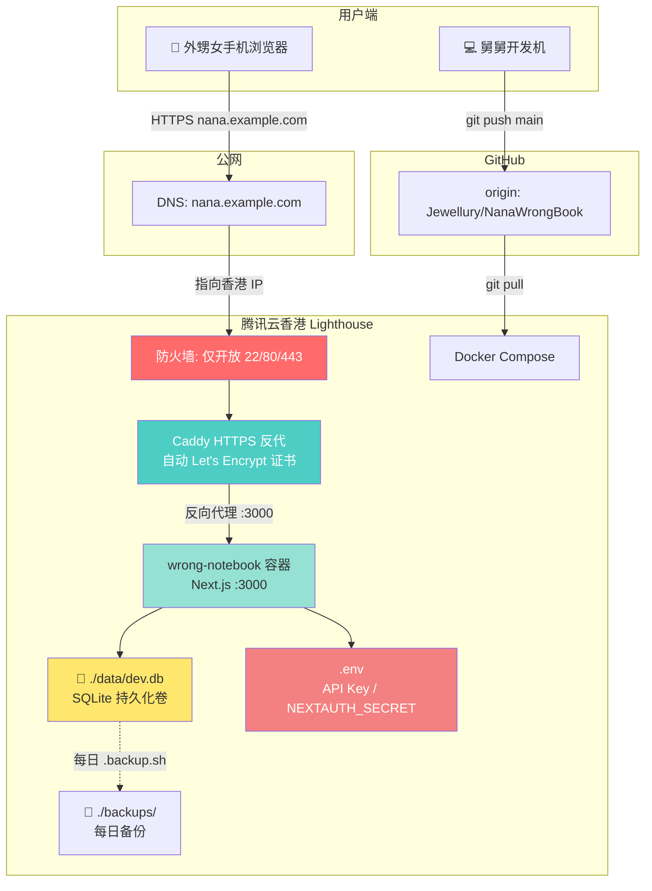

# 腾讯云香港部署方案

> 性质：`/plan` 阶段产出。部署方案文档，不执行实际部署。
> 产生日期：2026-06-29
> 关联文件：`docker-compose.yml`、`Dockerfile`、`.env`、`doc/reference/deployment-postmortem-2026-06-28.md`

---

## 1. 结论

推荐方案：**腾讯云轻量应用服务器 Lighthouse（香港地域）+ Docker Compose + Caddy HTTPS 反代 + SQLite 持久化卷**

代替当前 Serveo 临时隧道方案，让孩子可通过手机浏览器直接访问，无需依赖用户本机开机和 VPN 状态。

---

## 2. 当前项目约束

| 约束 | 说明 |
|------|------|
| 用户无 ICP 备案域名 | 大陆地域服务器需要备案，香港可绕过 |
| 用户平时开 VPN | 本地 Serveo 方案与 VPN 冲突，服务器部署不受影响 |
| 家庭验证阶段，非商业上线 | 不需要高可用/多节点/对象存储 |
| 数据存本地更安心 | SQLite 单文件，备份恢复简单 |
| HTTPS 必须 | 浏览器拍照/麦克风需要安全上下文 |
| 不改 Prisma 表结构 | 铁律 3——不改上游 model |
| 不接入真实 AI Key | 本部署方案不需要 ASR/VLM Key 作为前置条件 |

---

## 3. 推荐部署架构



**关键设计决策**：
- 外部只暴露 22/80/443
- Next.js 容器端口 3000 不直接暴露公网
- SQLite 文件通过宿主机 volume 持久化，不放在容器内
- `.env` 仅存服务器上，不进 git

---

## 4. 服务器与域名选择

### 服务器

| 项目 | 推荐值 |
|------|--------|
| 云厂商 | **腾讯云** |
| 产品 | 轻量应用服务器 Lighthouse |
| 地域 | **中国香港** |
| 规格 | 2核2G |
| 系统 | Ubuntu 22.04 LTS |
| 磁盘 | 40GB+（SSD） |
| 带宽 | 30Mbps（香港 Lighthouse 标配） |
| 流量 | 1TB/月（家庭验证阶段绰绰有余） |

**为什么选香港不选大陆**：
- 用户没有 ICP 备案域名，大陆服务器无法合法开通 80/443
- 备案周期通常 10-20 天，与验证阶段急迫性冲突
- 香港服务器可立即使用，延迟也在可接受范围（安徽到香港约 40-60ms）

### 域名

| 项目 | 建议 |
|------|------|
| 购买 | 一个普通 `.com` 或 `.xyz` 域名（约 30-60 元/年） |
| 用途 | nana.example.com → 指向香港服务器公网 IP |
| 备案 | 不需要。域名指向香港服务器不需要大陆 ICP 备案 |
| 注册商 | 建议直接在腾讯云买，管理方便 |

**不推荐长期使用裸 IP**：HTTPS 需要域名，浏览器拍照/麦克风 API 需要 HTTPS 安全上下文。

---

## 5. HTTPS 方案

| 方案 | 推荐度 | 理由 |
|------|:----:|------|
| **Caddy** | ⭐ 首选 | 自动申请 Let's Encrypt 证书，零配置 HTTPS，自带反向代理 |
| Nginx + Certbot | 备选 | 功能等价但多一步配置，Caddy 更省心 |
| 自签证书 | ❌ | 浏览器不信任，拍照/麦克风权限会被拒绝 |
| HTTP 裸奔 | ❌ | 浏览器安全策略会阻止摄像头/麦克风 |

---

## 6. 详细部署步骤

> ⚠️ 以下步骤仅为方案描述，**不要在此次会话中执行**。待用户确认后由 execute-agent 执行。

### 6.1 购买服务器与基础配置

1. 登录腾讯云控制台 → 轻量应用服务器 → 新建
2. 选择：香港地域、Ubuntu 22.04 LTS、2核2G、40GB SSD
3. 购买后获取公网 IP（记为 `SERVER_IP`）
4. 防火墙规则：放行 22、80、443

### 6.2 服务器初始化

```bash
# SSH 登录
ssh root@SERVER_IP

# 更新系统
apt update && apt upgrade -y

# 安装 Docker
curl -fsSL https://get.docker.com | sh

# 安装 Docker Compose 插件
apt install -y docker-compose-plugin

# 验证
docker --version && docker compose version
```

### 6.3 拉取项目与配置

```bash
# 拉取仓库
git clone https://github.com/Jewellury/NanaWrongBook.git /opt/nana
cd /opt/nana

# 切换到稳定分支
git checkout main

# 创建 .env 文件
touch .env
# 编辑 .env，填入以下内容（见第 7 节）
nano .env

# 创建备份目录
mkdir -p backups

# 创建数据目录（已有挂载点）
mkdir -p data
```

### 6.4 构建并启动

```bash
# 构建镜像
docker compose build --no-cache

# 应用数据库迁移
docker compose run --rm wrong-notebook npx prisma migrate deploy

# 启动服务
docker compose up -d

# 验证
docker compose ps
docker logs --tail 40 wrong-notebook
```

### 6.5 配置 Caddy 反代

创建 `Caddyfile`：

```caddyfile
nana.example.com {
    reverse_proxy wrong-notebook:3000
}
```

修改 `docker-compose.yml`，新增 Caddy 服务：

```yaml
services:
  caddy:
    image: caddy:2-alpine
    container_name: caddy
    restart: always
    ports:
      - "80:80"
      - "443:443"
    volumes:
      - ./Caddyfile:/etc/caddy/Caddyfile
      - caddy_data:/data
    depends_on:
      - wrong-notebook

  wrong-notebook:
    # ... 现有配置不变，移除 ports 的 3002:3000，容器内 3000 仍保留
    ports: !reset []
    networks:
      - default
```

### 6.6 验证部署

```bash
# 检查 Caddy 日志
docker logs caddy

# 浏览器访问
curl https://nana.example.com/nana
# 确认返回 200

# 手机测试
# 浏览器打开 https://nana.example.com/nana
# 登录 → 进入采集壳 → 触发拍照/录音权限
```

---

## 7. 环境变量清单

创建在服务器 `/opt/nana/.env` 中：

```bash
# === 数据库（SQLite，文件挂载到宿主 ./data/dev.db）===
DATABASE_URL="file:./data/dev.db"

# === NextAuth（必须重新生成）===
NEXTAUTH_SECRET="<运行 openssl rand -base64 32 生成>"
NEXTAUTH_URL="https://nana.example.com"
AUTH_TRUST_HOST=true

# === 以下为可选，本阶段不需要 ===
# AI API Key（后续接入时再填）
# VOLCENGINE_API_KEY=
# VOLCENGINE_BASE_URL=
# PRO_ENDPOINT_ID=
```

**安全规则**：
- `.env` 不在 git 中（已在 `.gitignore`）
- 每个环境（开发/生产）使用不同的 `NEXTAUTH_SECRET`
- AI Key 仅在需要时追加，不在文档中写明文

---

## 8. 数据备份与恢复

### 数据文件位置

| 路径 | 说明 |
|------|------|
| `/opt/nana/data/dev.db` | SQLite 主数据库文件 |
| `/opt/nana/data/` | Docker volume 宿主机挂载目录 |

### 备份脚本

```bash
# backup.sh — 每日备份脚本
#!/bin/bash
BACKUP_DIR="/opt/nana/backups"
DB_PATH="/opt/nana/data/dev.db"
TIMESTAMP=$(date +%Y%m%d_%H%M%S)

mkdir -p "$BACKUP_DIR"
cp "$DB_PATH" "$BACKUP_DIR/dev.db.$TIMESTAMP"
echo "[$(date)] backup created: dev.db.$TIMESTAMP"

# 清理超过 14 天的旧备份
find "$BACKUP_DIR" -name "dev.db.*" -mtime +14 -delete
```

### 最小备份策略

| 频次 | 操作 | 方式 |
|------|------|------|
| 每日 | 复制 SQLite 到 `backups/` | crontab 或 systemd timer |
| 每次发版前 | 手动运行一次备份 | 手动 `bash backup.sh` |
| 每周 | 下载最新备份到本地电脑 | `scp` 或 rsync |

### 恢复

```bash
# 停止服务
docker compose down

# 备份当前（以防万一）
cp data/dev.db data/dev.db.before-restore

# 用备份文件替换
cp backups/dev.db.20260629_120000 data/dev.db

# 重启
docker compose up -d
```

### 腾讯云快照

可选辅助手段：在腾讯云控制台对服务器磁盘做定期快照（免费额度内）。但不依赖快照作为主要备份手段——快照是整机级别，恢复成本高。

---

## 9. 发布更新流程

结合项目 Git 规则（三分支模型）：

```bash
# 1. 本地开发 → dev 分支 → 测试通过
git checkout dev
# ...开发、测试...

# 2. 稳定后合入 main
git checkout main
git merge dev
git push origin main

# 3. 服务器拉取
ssh root@SERVER_IP
cd /opt/nana
git pull origin main

# 4. 备份数据库（每次更新前必须做）
bash backup.sh

# 5. 重构建并重启
docker compose build --no-cache
docker compose up -d

# 6. 验证
docker logs --tail 80 wrong-notebook
```

**纪律**：
- 新增路由后必须先 `docker compose build --no-cache`，否则旧容器找不到新路由
- 更新前不备份 = 违规，可能导致数据丢失
- 服务器部署用 `main` 分支（稳定版），`dev` 分支不在服务器上跑

---

## 10. 安全清单

| # | 项目 | 建议 |
|---|------|------|
| 1 | `.env` 不进 git | ✅ 已在 `.gitignore` |
| 2 | `NEXTAUTH_SECRET` 生产独立 | 必须用 `openssl rand -base64 32` 生成新值 |
| 3 | 防火墙 | 仅开放 22/80/443 |
| 4 | SSH 密码登录 | 增强项：改用密钥登录，关闭密码 |
| 5 | AI Key | 未来只放服务器 `.env`，不在文档中写 |
| 6 | 备份文件 | 包含学生数据，不能公开存放 |
| 7 | 容器非 root 运行 | 增强项：Dockerfile 可用非 root user |
| 8 | 定期安全更新 | `apt update && apt upgrade -y` 每月一次 |

---

## 11. 验收清单

部署完成后逐项打勾：

- [ ] `https://nana.example.com/nana` 可访问
- [ ] 手机浏览器（非 WiFi 也可）打开正常
- [ ] 登录/注册页正常显示
- [ ] 登录后进入 `/nana` 首页
- [ ] 点击"拍一下这道题"触发拍照权限弹窗
- [ ] 点击录音按钮触发麦克风权限弹窗
- [ ] 采集壳 mock 题图正常展示
- [ ] 知识地图页面正常加载
- [ ] Session 答题流程正常
- [ ] 刷新页面后登录态保持
- [ ] Case API 提交记录可写入
- [ ] `docker logs caddy` 无 error
- [ ] `docker logs wrong-notebook` 无明显 error
- [ ] 备份脚本运行后 `backups/` 下生成文件
- [ ] 重启服务器后容器自动启动
- [ ] 关掉本地电脑后网站仍可访问

---

## 12. 回滚方案

### 应用回滚

```bash
# 回退到上一个 git commit
cd /opt/nana
git log --oneline -5
git checkout <上一个稳定 commit>

# 重构建并重启
docker compose build --no-cache
docker compose up -d
```

### 数据回滚

```bash
# 1. 备份当前数据库（回滚前必须做）
bash backup.sh

# 2. 停止服务
docker compose down

# 3. 用指定备份替换
cp backups/dev.db.20260628_120000 data/dev.db

# 4. 重启
docker compose up -d
```

**铁律**：回滚前必须再次备份当前数据库。任何时候不允许用破坏性命令覆盖数据而不备份。

---

## 13. 后续升级路线

| 阶段 | 内容 | 条件 |
|------|------|------|
| **Phase 0（当前）** | 部署方案确认 + 购买服务器 | 用户拍板 |
| **Phase 1** | 服务器初始化 + Docker + 应用部署 | 用户确认后执行 |
| **Phase 2** | HTTPS 配置 + 域名绑定 | 域名购买后 |
| **Phase 3** | 备份脚本部署 + 验证全链路 | 部署完成后 |
| **未来** | 如真实 ASR/VLM 需要 GPU | 升级到 GPU 实例 |
| **未来** | 如验证通过需要更高可用性 | 考虑多容器或迁移数据库 |

---

## 14. 待用户拍板问题

| # | 问题 | 选项 |
|---|------|------|
| 1 | **是否首选腾讯云香港 Lighthouse 2核2G？** | 是 / 否（说明倾向其他方案） |
| 2 | **是否愿意购买一个普通域名用于 HTTPS？** | 是（约 30-60 元/年）/ 先用裸 IP HTTP 演示（拍照/麦克风不可用） |
| 3 | **域名放在哪里管理？** | 腾讯云买 / 已有其他注册商 |
| 4 | **服务器部署分支用哪个？** | `main`（稳定）/ `dev`（最新但有未审计代码） |
| 5 | **备份保留多久？** | 7 天 / 14 天 |
