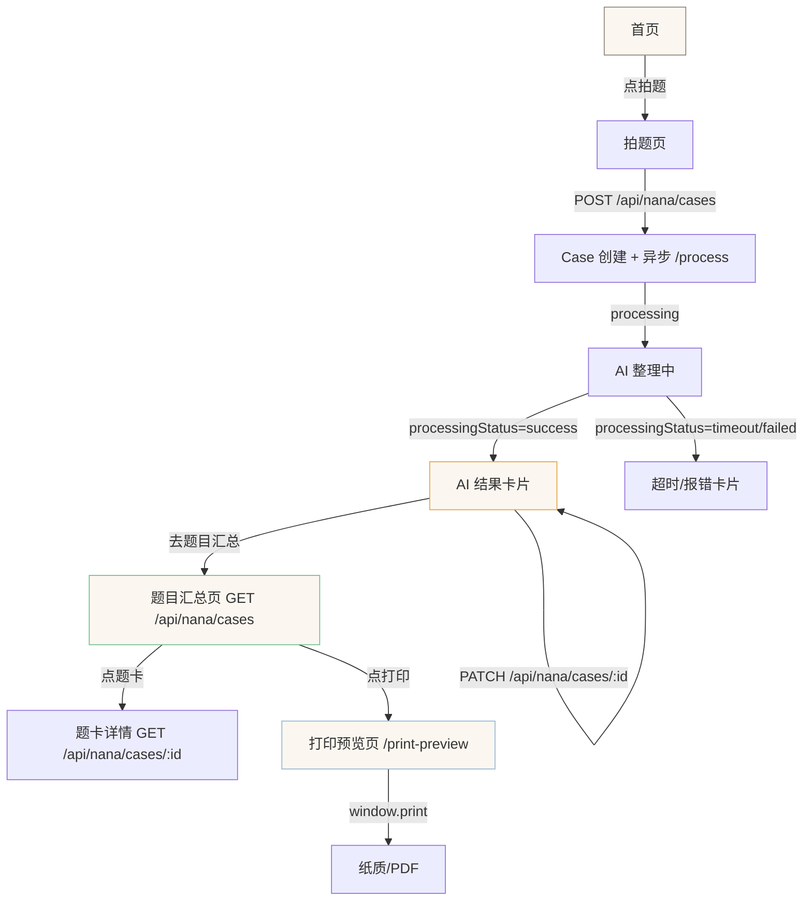

# Nana 产品行为手册 v1

> 面向：开发和设计（含项目 AI agent）
> 目标：开发不要自由发挥，设计不要语义漂移
> 关联：用户说明手册见 `nana-user-manual-v1-draft.md`，技术方案见 `doc/plan/stage3-ai-integration-plan-v3-revised.md`
> 权威：本文档是前端文案、状态机、数据落库行为的**唯一权威**。与代码冲突时，以本文档为准并修代码。
> 更新日期：2026-07-05（同步 v3-revised r3 产品定版）

---

## 0. v1 定位

v1 是 **"AI 错题卡片闭环"**：拍题 → AI 摘要/课本分类/轻反馈/下一步建议 → 持久化 → 题目汇总 → 可打印。

**v1 不做**：完整 OCR、完整解题步骤、答案、深度归因、StudentNodeState 绿色点亮。

---

## 1. 入口点

| 入口 | URL | 触发条件 | 行为 |
|------|-----|---------|------|
| 首页 | `/nana` | 登录后默认 | 三卡片（拍题/知识地图/周末小检查）+ RecapBar |
| 拍题 | `/nana/capture` | 点"拍题" | 拍照 + 录音 + 保存 + AI 整理 + AI 结果展示 |
| 知识地图 | `/nana/knowledge-map` | 点"知识地图" | 三 tab：题目汇总（**手机+桌面都默认**）/ 图谱 / 列表 |
| 题目汇总 | `/nana/knowledge-map` → "题目汇总"tab | 默认 tab | 按课本章节分组的错题卡片列表 + 打印入口 |
| 打印预览 | `/nana/print-preview` | 题目汇总页点"打印/导出" | 按课本章节整理的打印样式 |
| 周末小检查 | `/nana/session` | 点"周末小检查" | 做题 → 报告 → 点亮节点 |

---

## 2. 两层分类体系

### 2.1 TextbookTopic（课本章节）— 孩子看到的分类层

- **面向用户**：题目汇总页按课本章节分组、手动改分类的下拉框、打印页的章节标题
- **数据来源**：16 个种子章节（TB-001 ~ TB-016），覆盖当前 48 个系统知识点对应的课本章节
- **覆盖范围**：必修第一册第一章~第四章（14 个）+ 必修第二册第七章复数（2 个）
- **不是完整教材目录**：后续知识图谱扩展时同步追加
- **展示规则**：
  - 选择器只展示有节点的 topic
  - 未覆盖章节不出现
  - AI 返回清单外 topicId → 代码层过滤掉，归入"未分类/暂未覆盖"

### 2.2 KnowledgeNode（系统知识点）— 系统内部图谱层

- **面向系统**：知识地图图谱视图、诊断引擎、BKT 追踪
- **数据来源**：48 个系统节点（seed_graph_batch1.ts）
- **不直接展示给孩子**：图谱 tab 仍展示，但题目汇总页用 TextbookTopic 分组

### 2.3 两层关系

```
TextbookTopic (16 个)  ←→  KnowledgeNode (48 个)
     通过 TextbookNodeMapping 连接（48 条映射，每节点恰好映射 1 个 topic）
```

### 2.4 数据表职责划分

| 表 | 存什么 | source 白名单 | 说明 |
|----|--------|--------------|------|
| `CaseTextbookTopicTag` | Case ↔ 课本章节挂载 | `manual` / `vlm` | 孩子看到的分类 |
| `CaseKnowledgeTag` | Case ↔ 系统知识点挂载 | `manual` / `vlm` | 系统内部图谱层，**不扩展** |
| `CaseAiResult` | AI 分析结果快照 | — | 持久化 AI 全部输出 |

> **铁律**：CaseKnowledgeTag 保持原样不扩展，只表示系统 KnowledgeNode。课本分类用独立表 CaseTextbookTopicTag。

---

## 3. CaseAiResult 持久化字段

`CaseAiResult` 是 1:1 关联 Case 的 AI 结果快照表，持久化以下字段：

| 字段 | 类型 | 说明 | 展示位置 |
|------|------|------|---------|
| `questionSummary` | String? | AI 一句话题目摘要 | 采集页、题目汇总、打印页 |
| `questionSummaryEdited` | Boolean | 用户是否手动纠错 | — |
| `transcript` | String? | 转写文字快照 | 采集页、题目汇总、打印页 |
| `textbookTopicId` | String? (FK) | 最高置信课本分类 | 采集页、题目汇总、打印页 |
| `textbookTopicConfidence` | Float | 置信度 | — |
| `textbookTopicEdited` | Boolean | 用户是否手动修正 | — |
| `initialFeedback` | String? | 鼓励文案 | 采集页、题目汇总、打印页 |
| `possibleMistakeReason` | String? | 可能的错因方向 | 采集页、题目汇总、打印页 |
| `nextActionSuggestion` | String? | 下一步建议 | 采集页、题目汇总、打印页 |
| `audioStatus` | String | success/skipped/failed/timeout | — |
| `processingStatus` | String | success/failed/timeout/pending | — |
| `tokenUsage` | String? (JSON) | token 用量 | — |

### 3.1 nextActionSuggestion 全链路一致性

`nextActionSuggestion` **必须在三个位置一致展示**：

| 展示位置 | 标签文案 | 说明 |
|---------|---------|------|
| 采集页（AI 结果面板） | "下一步：" | 拍题后即时展示 |
| 题目汇总（题卡） | "下一步" | 历史题卡中展示 |
| 打印预览页 | "下一步：" | 打印输出中展示 |

> **纪律**：如果 CaseAiResult 中 nextActionSuggestion 为空，三处统一不展示该区块（不显示"下一步：（空）"）。

### 3.2 课本章节覆盖范围声明

**当前只覆盖 48 个系统知识点对应的课本章节（16 个 TextbookTopic），不是完整教材目录。**

- TB-001 ~ TB-014：必修第一册（第一章~第四章）
- **TB-015 / TB-016：必修第二册第七章复数**（复数在必修第二册，不是必修第一册）
  - TB-015：第七章 复数 → 7.1 复数的概念（映射 M1-26, M1-27, M1-28）
  - TB-016：第七章 复数 → 7.2 复数的四则运算（映射 M1-29, M1-30）

### 3.3 重复 /process 覆盖保护

| 字段 | 保护条件 | 行为 |
|------|---------|------|
| `questionSummary` | `questionSummaryEdited === true` | 不覆盖，保留用户编辑 |
| `textbookTopicId` | `textbookTopicEdited === true` | 不覆盖，保留用户选择 |

---

## 4. 状态机

### 4.1 采集页状态机（`capture/page.tsx`）

```
photoState: "empty" | "photoTaken"
saveState:  "idle" | "saving" | "saved" | "processing" | "processed" | "error"
recorderState: "idle" | "recording" | "completed"

状态转换：
  empty → photoTaken（拍照/选图）
  photoTaken → empty（重新拍一张）

  idle → saving（点"收好这道题"）
  saving → saved（POST /cases 201）
  saving → error（POST /cases 失败）

  saved → processing（自动调 POST /cases/:id/process）
  processing → processed（/process 200 返回）
  processing → error（/process 网络错误）

门禁：
  - 无照片 → 禁保存（按钮灰，提示"先拍一下这道题"）
  - 录音中 → 禁保存、禁切tab、禁换图（提示"先把话说完，再收这道题"）
  - payload > 3MB → 禁保存（提示"材料太大，请重新拍一张或录短一些"）
```

### 4.2 /process 结果状态

```
status: "success" | "failed" | "timeout"
audioStatus: "success" | "skipped" | "failed" | "timeout"

组合矩阵：
  status=success + audioStatus=success → 有转写 + 有AI结果（理想）
  status=success + audioStatus=skipped → 无转写 + 有AI结果（webm/无音频）
  status=success + audioStatus=success(空转写) → 无转写 + 有AI结果（WAV但AI没听出内容）
  status=failed → CaseAiResult 写入 processingStatus=failed，UI 显示"没接上"
  status=timeout → CaseAiResult 写入 processingStatus=timeout，UI 显示"超时了"
```

### 4.3 采集页 processed 子状态

```
processed 状态下的子状态（根据 /process 返回内容）：
  success + 有摘要 + 有分类 → "整理好了 · 可能属于：XXX"
    └─ 展示 AI 摘要 + 课本分类 + 轻反馈 + [编辑] + [改分类]
    └─ possibleMistakeReason 非空时展示"可能的方向"，为空时隐藏该区块
    └─ nextActionSuggestion 非空时展示"下一步"，为空时隐藏该区块
  success + 有摘要 + 无分类 → "整理好了，但不太好分类，可以手动选"
  success + 无摘要 + 有分类 → "可能属于：XXX"（AI 没看懂题面但判断了分类）
  success + 都无 → "整理好了，但不太好分类，可以手动整理"
  failed → "识别没接上，可以手动整理"
  timeout → "整理超时了，可以重试或手动整理"
```

### 4.4 知识地图节点分组（`knowledge-map-list-view.tsx`）

```
分组优先级（互斥完备）：stable > frontier > collected > untested

  stable → "已点亮"（绿色 #6BBF8A）
  frontier → "下一个"（蓝色 #93B8D6）
  collected → "收过题"（琥珀色 #E8A33D）
  untested → "未探索"（灰色 #D9D1C3）

判定条件：
  isStable = node.status === "stable"（来自 StudentNodeState）
  isFrontier = frontier数组包含 nodeId（来自学习前沿算法）
  hasEvidence = caseEvidenceCount > 0（来自 CaseKnowledgeTag，distinct caseId 计数）

分组规则：
  if isStable → lit
  else if isFrontier → next
  else if hasEvidence → collected
  else → untested

叠加规则：
  lit/next 组中若 hasEvidence=true → 额外显示"收过 N"琥珀小角标
  collected 组本身用琥珀色，不再重复角标
```

---

## 5. UI 文案规范

### 5.1 采集页文案

| 状态 | 文案 | 备注 |
|------|------|------|
| 按钮初始（无照片） | "先拍一下这道题" | 灰色禁用 |
| 按钮初始（有照片） | "收好这道题" | 绿色 |
| 保存中 | "正在收…" | 不说"正在保存""正在上传" |
| 保存成功→processing | "正在整理这题…" | 不说"正在识别""正在诊断" |
| success + 有摘要 + 有分类 | "整理好了 · 可能属于：XXX" | "可能"留余地 |
| success + 有摘要 + 无分类 | "整理好了，但不太好分类，可以手动选" | |
| success + 无摘要 + 有分类 | "可能属于：XXX" | |
| success + 都无 | "整理好了，但不太好分类，可以手动整理" | 给出路 |
| failed | "识别没接上，可以手动整理" | 不说"失败" |
| timeout | "整理超时了，可以重试或手动整理" | 不说"超时失败" |
| 录音中禁保存 | "先把话说完，再收这道题" | |
| payload 超限 | "材料太大，请重新拍一张或录短一些" | |

### 5.2 AI 结果面板文案

| 元素 | 文案 | 备注 |
|------|------|------|
| 摘要标签 | "AI 摘要：" | 不说"识别出的题目""题目原文" |
| 摘要替代说法 | "这题大概在问" | 另一种友好说法 |
| 摘要为空 | "这题不太好概括，可以自己写一句" | 给出路 |
| 课本分类标签 | "可能属于：" | 不说"属于""已分类" |
| 反馈标签 | "AI 想对你说：" | 不说"解析""答案" |
| 错因标签 | "可能的方向：" | 不说"诊断结果""错因分析"；**留空时整个区块隐藏**，不显示"暂无提示" |
| 下一步标签 | "下一步：" | 不说"你应该""必须"；**不承诺视频链接**，只写"复看课本章节+小动作"；留空时整个区块隐藏 |
| 编辑按钮 | "编辑" | |
| 改分类按钮 | "改分类" | 不说"纠错""修正错误" |
| 用户纠错后 | "已更新" | 不说"已修正" |

### 5.3 题目汇总页文案

| 元素 | 文案 | 备注 |
|------|------|------|
| 页面标题 | "题目汇总" | |
| Tab 名称 | "题目汇总" / "图谱" / "列表" | 题目汇总为默认 tab（**手机+桌面统一**） |
| 分组标题 | "第一章 集合与常用逻辑用语" / "未分类/暂未覆盖" | 未分类分组上方显示温和提示："这类题还没放进当前知识地图，先帮你收在这里。" |
| 题卡摘要标签 | "AI 摘要" | |
| 题卡分类标签 | "课本分类" | |
| 题卡反馈标签 | "AI 想对你说" | |
| 题卡错因标签 | "可能的方向" | |
| 题卡建议标签 | "下一步" | |
| 题卡时间 | "拍摄于 7月3日" | Case.createdAt |
| 有转写标记 | "有语音记录" 图标 | |
| 无转写标记 | 不显示 | |
| AI 角标 | "AI 候选" | 区分来源 |
| 手动角标 | "手动" | 区分来源 |
| 打印按钮 | "打印/导出" | |

### 5.4 打印预览页文案

| 元素 | 文案 | 备注 |
|------|------|------|
| 标题 | "我的错题汇总 — 按课本章节整理" | |
| 生成时间 | "生成时间：YYYY-MM-DD" | |
| 每题标签 | "AI 摘要：" / "拍摄时间：" / "转写：" / "AI 反馈：" / "可能的方向：" / "下一步：" | 全部展示 |
| 未分类分组标题 | "未分类/暂未覆盖" | 放最后 |

### 5.5 知识地图文案

| 元素 | 文案 | 备注 |
|------|------|------|
| 分组标题 | "已点亮" / "下一个" / "收过题" / "未探索" | 不变 |
| 收过题计数 | "收过 N" 或 "N 道" | |
| AI 标签角标 | "AI 候选" | 区分来源 |
| 手动标签角标 | "手动" | 区分来源 |
| 无标签 | "未分类" | 不说"待分类""未识别" |
| 首页回顾条（有点亮） | "上次你点亮了：XXX" / "你的地图上已经有 N 个光点了 ✦" | |
| 首页回顾条（只收过题） | "你最近收过题的知识点有 N 个" / "还没做小检查，做完就能点亮它们 ✦" | 不说"点亮了" |

### 5.6 转写面板文案

| 状态 | 文案 | 备注 |
|------|------|------|
| 占位（未转写） | "尚未转写" | createCase 恒写入 |
| 占位提示 | "转写稍后接入，录音已经收好。" | 当前 Stage 1 |
| 转写成功 | 显示转写文字 + "转写仅供参考，原音为准" | editable=true |
| 音频格式不支持 | "语音暂未转写" | webm/mp4 |
| 转写为空 | 保留"尚未转写"占位 | 不覆盖 |

### 5.7 禁用词清单

| 禁用词 | 替代 | 理由 |
|--------|------|------|
| 诊断 | 整理 / 看看 | OPS §4：术语清零 |
| 已诊断 | 已整理 | |
| 薄弱 | 还没点亮 | 不做负向判断 |
| 得分 | — | 不出现 |
| 掌握 | 点亮 | "掌握"暗示绝对状态，"点亮"更直观 |
| 未掌握 | 还没点亮 | |
| 失败 | 没接上 | 不怪用户 |
| 错误 | 没接上 / 再试一次 | 不出现技术术语 |
| 已识别 | 可能属于 | 不做确定性承诺 |
| 已分类 | 可能属于 | |
| 识别出的完整题目 | AI 摘要 | v1 不做完整 OCR |
| 超时失败 | 超时了 | 去"失败"字 |
| 网络错误 | 没接上 | 不说技术术语 |
| 服务器错误 | 没接上 | |
| 解析 / 答案 | 轻反馈 / 可能的方向 | v1 不做完整解析 |
| 错因分析 | 可能的方向 | 不做确定性诊断 |

---

## 6. 数据落库规范

### 6.1 落库表

| 表 | 何时写 | 写什么 | source | 持久化 |
|----|--------|--------|--------|:------:|
| `Artifact` (question_image) | createCase | Base64 题图 | — | ✅ |
| `Artifact` (audio_note) | createCase | Base64 录音 | — | ✅ |
| `Artifact` (audio_meta) | createCase | durationSec/mime/sizeBytes | — | ✅ |
| `Artifact` (transcript) | createCase | "尚未转写" 占位 | — | ✅ |
| `Artifact` (transcript) 更新 | /process 成功 + 转写非空 + 原内容是占位 | 转写文字 | — | ✅ |
| `CaseAiResult` | /process 成功 | questionSummary, transcript, textbookTopicId, initialFeedback, possibleMistakeReason, nextActionSuggestion, audioStatus, processingStatus, tokenUsage | — | ✅ |
| `CaseKnowledgeTag` | /process 成功 + confidence ≥ 0.5 | nodeId, confidence, note | "vlm" | ✅ |
| `CaseKnowledgeTag` | 用户手动挂载 | nodeId, confidence=1.0 | "manual" | ✅ |
| `CaseTextbookTopicTag` | /process 成功 + confidence ≥ 0.5 | textbookTopicId, confidence, note | "vlm" | ✅ |
| `CaseTextbookTopicTag` | 用户手动改分类 | textbookTopicId, confidence=1.0 | "manual" | ✅ |
| `StudentNodeState` | 周末小检查做对 | status="stable" | — | ✅ |

### 6.2 不落库

| 数据 | 为什么不落库 |
|------|-------------|
| 低置信候选 (confidence < 0.5) | v1 不持久化，只在 /process 即时响应中返回 |
| AI 原始输出 (rawOutput) | 只写日志，不入库 |
| recognizedQuestionText | v1 不做完整 OCR，此字段从 JSON schema 移除 |

### 6.3 CaseAiResult 写入时机

```
/process 端点执行流程：
1. Case Analyzer 调用成功
2. upsert CaseAiResult（caseId 关联）：
   - questionSummary = result.questionSummary
   - transcript = result.transcript（非空时）
   - textbookTopicId = 最高置信候选（≥0.5 时）
   - textbookTopicConfidence = 对应置信度
   - initialFeedback = result.initialFeedback
   - possibleMistakeReason = result.possibleMistakeReason
   - nextActionSuggestion = result.nextActionSuggestion
   - audioStatus = 推导
   - processingStatus = "success"
3. transcript 回写 Artifact（同 v3 原版逻辑）
4. knowledgeNodeCandidates (≥0.5) → upsert CaseKnowledgeTag(source="vlm")
5. textbookTopicCandidates (≥0.5) → upsert CaseTextbookTopicTag(source="vlm", textbookTopicId=...)
```

### 6.4 覆盖规则

**transcript artifact 覆盖守则**（铁律）：
1. 只有 `isPlaceholderTranscript(content) === true` 时才覆盖
2. 空字符串不覆盖（保留占位）
3. 非占位不覆盖（人 > AI）
4. 无 transcript artifact 不创建（createCase 恒创建，理论不会缺失）

**CaseAiResult 重复 /process 覆盖保护**：
- `questionSummaryEdited === true` → 不覆盖 questionSummary
- `textbookTopicEdited === true` → 不覆盖 textbookTopicId
- 其他字段（initialFeedback, possibleMistakeReason, nextActionSuggestion）每次覆盖最新

### 6.5 caseEvidenceCount 计数规则

```
按 distinct(caseId, nodeId) 计数，不按行数计数。

同一 case 的 manual + vlm 双 source 指向同一 nodeId → 只算 1 道题（不是 2 道）。
不同 case 指向同一 nodeId → 算多道。

实现：findMany + distinct(['nodeId', 'caseId']) → Map 聚合
```

### 6.6 CaseTextbookTopicTag.source 白名单

**只允许两个值**：`"manual"` | `"vlm"`。不预留 asr/rule/pending。

```typescript
export const TEXTBOOK_TOPIC_TAG_SOURCES = ["manual", "vlm"] as const;
export type TextbookTopicTagSource = (typeof TEXTBOOK_TOPIC_TAG_SOURCES)[number];
```

---

## 7. 八个场景（技术视角）

### 场景 1：清晰题图，无录音，AI 成功分类

| 维度 | 内容 |
|------|------|
| 用户行为 | 拍照 → "收好这道题" |
| 请求序列 | POST /cases（artifacts: question_image + transcript 占位）→ 201 → POST /cases/:id/process |
| /process 输入 | imageDataUrl=题图, audioBase64=无, audioFormat=无 |
| /process 输出 | status=success, audioStatus=skipped, questionSummary=有, textbookTopic=有, initialFeedback=有, possibleMistakeReason=有, nextActionSuggestion=有, transcript=无 |
| UI 文案 | "整理好了 · 可能属于：函数的基本性质" |
| 落库 | Artifact(transcript) 不更新; CaseAiResult(全部字段); CaseTextbookTopicTag(source=vlm); CaseKnowledgeTag(source=vlm) |
| 时间戳 | Case.createdAt = 拍摄时间 |
| 误解风险 | "AI 摘要"被理解为"完整 OCR" |
| 防误解 | "AI 摘要"不说"识别出的题目"; "可能属于"留余地 |

### 场景 2：清晰题图 + 语音，AI 转写并给轻反馈

| 维度 | 内容 |
|------|------|
| 用户行为 | 拍照 → "讲讲思路"tab → 录音 → "收好这道题" |
| 请求序列 | POST /cases（artifacts: question_image + audio_note + audio_meta + transcript 占位）→ 201 → POST /cases/:id/process |
| /process 输入 | imageDataUrl=题图, audioBase64=WAV纯Base64, audioFormat="wav" |
| /process 输出 | status=success, audioStatus=success, transcript=转写文字, questionSummary=有, textbookTopic=有, initialFeedback=有, possibleMistakeReason=有, nextActionSuggestion=有 |
| UI 文案 | "整理好了 · 可能属于：函数的基本性质" + 转写面板显示文字 |
| 落库 | Artifact(transcript) 更新; CaseAiResult(全部字段); CaseTextbookTopicTag(source=vlm); CaseKnowledgeTag(source=vlm) |
| 时间戳 | Case.createdAt = 拍摄时间; CaseAiResult.updatedAt = 整理时间; "有语音记录"图标 |
| 误解风险 | 转写被理解为标准答案; 轻反馈被理解为完整解析 |
| 防误解 | "转写仅供参考，原音为准"; "AI 想对你说"不说"解析"; "可能的方向"不说"诊断" |

### 场景 3：图片不清楚，AI 只能给摘要或无法分类

| 维度 | 内容 |
|------|------|
| 用户行为 | 拍了歪照 → "收好这道题" |
| 请求序列 | POST /cases → 201 → POST /cases/:id/process |
| /process 输入 | imageDataUrl=歪题图, audioBase64=无 |
| /process 输出 | status=success, audioStatus=skipped, questionSummary=可能有(也可能空), textbookTopicCandidates=[]或低置信, knowledgeNodeCandidates=[]或低置信 |
| UI 文案 | "整理好了，但不太好分类，可以手动选" 或 "整理好了，但不太好分类，可以手动整理" |
| 落库 | Artifact(transcript) 不更新; CaseAiResult(questionSummary如有, textbookTopicId=空, processingStatus=success); CaseTextbookTopicTag 不写; CaseKnowledgeTag 不写 |
| 时间戳 | Case.createdAt = 拍摄时间 |
| 误解风险 | "不好分类"被理解为"题太差" |
| 防误解 | "不太好分类"不说"题不清晰"; "可以手动选"给出路 |

### 场景 4：AI 课本分类错了，孩子手动改

| 维度 | 内容 |
|------|------|
| 用户行为 | 采集页/题目汇总 → 点"改分类" → 选新课本章节 → 保存 |
| 请求序列 | PATCH /cases/:id/ai-result { textbookTopicId: 新ID } |
| UI 变化 | 课本分类更新; 角标从"AI 候选"变"手动"; 显示"已更新" |
| 落库 | CaseAiResult.textbookTopicId=新ID, textbookTopicEdited=true; CaseTextbookTopicTag(source=manual, confidence=1.0) |
| 不删除 | AI 标签(source=vlm) 保留 |
| 覆盖保护 | 后续 /process 不覆盖 textbookTopicId（textbookTopicEdited=true） |
| 误解风险 | "AI 挂错了"被理解为"AI 不好用" |
| 防误解 | "改分类"不说"纠错"; "已更新"不说"已修正" |

### 场景 5：AI 给了"下一步建议"，但不承诺完整解析

| 维度 | 内容 |
|------|------|
| 用户行为 | 拍题 → AI 整理完成 → 看到"下一步：可以看看 XX 的视频" |
| /process 输出 | nextActionSuggestion 非空 |
| 落库 | CaseAiResult.nextActionSuggestion 持久化 |
| 展示位置 | 采集页 + 题目汇总题卡 + 打印页（三处一致） |
| 误解风险 | "下一步建议"被理解为"解题步骤" |
| 防误解 | "下一步可以"不说"你应该""答案是"; **不承诺视频链接，只写"复看课本章节+小动作"**; nextActionSuggestion 为空时三处统一不展示; possibleMistakeReason 为空时三处统一不展示 |

### 场景 6：题目属于当前 48 节点覆盖外章节，进入"未分类/暂未覆盖"

| 维度 | 内容 |
|------|------|
| 用户行为 | 拍了一道三角函数的题 |
| /process 输出 | status=success, questionSummary=有, textbookTopicCandidates=[]（清单外 topicId 被过滤）, knowledgeNodeCandidates=[] |
| UI 文案 | "整理好了，但不太好分类，可以手动选" |
| 落库 | CaseAiResult(questionSummary, textbookTopicId=空, processingStatus=success); CaseTextbookTopicTag 不写; CaseKnowledgeTag 不写 |
| 题目汇总 | 归入"未分类/暂未覆盖"分组 |
| 误解风险 | "未分类"被理解为"AI 不会" |
| 防误解 | "未分类/暂未覆盖"不说"无法识别""不支持"; 分组提示用温和语气"这类题还没放进当前知识地图，先帮你收在这里。"; 仍展示 AI 摘要和轻反馈 |

### 场景 7：网络慢或 AI 失败，题已保存，可稍后重试/手动整理

| 维度 | 内容 |
|------|------|
| 用户行为 | 拍题 → "收好这道题" → 等很久 |
| 请求序列 | POST /cases → 201（题图已存）→ POST /cases/:id/process → 超时/报错 |
| /process 输出 | status=timeout 或 status=failed, error=原因 |
| UI 文案 | "整理超时了，可以重试或手动整理" 或 "识别没接上，可以手动整理" |
| 落库 | Artifact(question_image) 已保存; CaseAiResult(processingStatus=failed/timeout, 其他字段空); CaseTextbookTopicTag 不写; CaseKnowledgeTag 不写 |
| 题目汇总 | 归入"未分类/暂未覆盖"分组 |
| 误解风险 | "没接上是不是题没存" |
| 防误解 | "可以手动整理"暗示题已存; 不说"失败""错误" |

### 场景 8：题目汇总打印给孩子复习

| 维度 | 内容 |
|------|------|
| 用户行为 | 题目汇总页 → 点"打印/导出" → 跳转 /nana/print-preview → 浏览器打印/另存PDF |
| 展示内容 | 按课本章节分组; 每题: 题图+摘要+时间+转写+反馈+错因(非空时)+下一步(非空时); 未分类放最后 |
| 打印样式 | @media print: 隐藏所有交互按钮; 题图固定宽度; 字号适配A4; **按章节分组但不强制每章分页**; 章节标题 break-after: avoid; 题卡尽量不跨页 (page-break-inside: avoid) |
| 误解风险 | 打印输出被理解为"标准答案" |
| 防误解 | 打印的是错题汇总清单; AI 摘要和轻反馈只是辅助参考 |

---

## 8. 颜色语义

| 颜色 | Hex | 语义 | 用于 |
|------|-----|------|------|
| 绿色 | `#6BBF8A` | 已点亮 | 节点 status=stable; 保存成功确认; 主操作按钮 |
| 蓝色 | `#93B8D6` | 下一个 | 学习前沿节点 |
| 琥珀色 | `#E8A33D` | 收过题 | caseEvidenceCount > 0 的节点; AI 候选角标; "挂知识点"按钮 |
| 灰色 | `#D9D1C3` | 未探索 | 无证据无状态的节点; 禁用按钮 |
| 暖白 | `#FBF7F0` | 背景 | 采集页背景 |
| 深褐 | `#403A33` | 主文字 | 标题、正文 |
| 浅褐 | `#8C857B` | 次文字 | 提示、说明 |

**颜色铁律**：
- 绿色 **只** 表示"已点亮"（StudentNodeState status=stable）
- 琥珀色 **只** 表示"收过题"（CaseEvidenceCount > 0）
- 不得用绿色表示"AI 成功"——AI 成功用文字"整理好了""可能属于"表达
- 不得用红色表示"失败"——用浅褐文字 + "没接上"文案

---

## 9. 时间戳规范

| 信息 | 数据来源 | 展示位置 | v1 |
|------|---------|---------|:--:|
| 拍摄/保存时间 | `Case.createdAt` | 采集页、题目汇总、打印页 | ✅ |
| 有语音记录 | `CaseAiResult.transcript` 非空 或 有 audio_note artifact | 题目汇总题卡图标 | ✅ |
| 整理时间 | `CaseAiResult.updatedAt` | 题目汇总题卡（如有 AI 结果） | ✅ |
| 音频逐句时间轴 | — | — | ❌ v2 待办 |

> **v1 不做音频逐句时间轴**。当前数据结构（Artifact + CaseAiResult）不支持逐句时间戳。如有需要列入 v2 待办。

---

## 10. v1 不做的能力

| 能力 | 延后理由 |
|------|---------|
| 图片裁剪 | 已有 `react-image-crop` 依赖，但接入采集页非闭环必需 |
| 图片旋转 | Canvas transform 可实现，但同上 |
| 涂抹/马赛克 | v1 不做图片编辑 |
| 疑似重复题提醒 | 文本相似度算法+UI 交互，非闭环核心 |
| 完整 OCR | v1 用 questionSummary 一句话摘要够用 |
| 完整解题步骤/答案 | v1 只做轻反馈，不误导 |
| Problem/Attempt 模型 | v1 仍 1 Case = 1 拍题 |
| PDF 直接导出 | 浏览器打印另存为 PDF 够用 |
| 选择性打印（勾选题目） | v1 全部打印，v2 加勾选 |
| 音频逐句时间轴 | 当前数据结构不支持，v2 待办 |
| 深度归因/绿色点亮 | 拍题不触发 StudentNodeState，只有周末小检查做对了才点亮 |
| 图片 embedding 去重 | 过重 |
| recognizedQuestionText | v1 不做完整 OCR，此字段从 JSON schema 移除 |

---

## 11. v2 遗留文件标注

以下文件在 v2 Round 1 创建，**v3 不再进入主路径**，但保留文件不删除（避免 git 历史混乱）：

| 文件 | v2 用途 | v3 状态 | 处置 |
|------|---------|---------|------|
| `src/lib/nana/asr-transcribe.ts` | 独立 ASR 管线 | **废弃** | 保留文件，不 import，不引用 |
| `src/lib/nana/vlm-classify.ts` | 独立 VLM 管线 | **废弃** | 保留文件，不 import，不引用 |
| `src/__tests__/unit/nana/asr-transcribe.test.ts` | ASR 单测 | **废弃** | 保留文件，不运行 |
| `scripts/stage3-asr-format-check.ts` | Round 0 格式验证 | **保留参考** | 保留文件，结论已写入 v3 方案 |
| `src/lib/nana/transcript-utils.ts` | isPlaceholderTranscript | **复用** | v3 仍使用 |
| `src/lib/nana/case-classify.ts` | source 白名单 | **复用** | v3 仍使用（source 收窄为 manual+vlm） |

> **注意**：execute-agent 在 v3 Round 1 中应新建 `case-analyzer.ts`，不修改 `asr-transcribe.ts` 和 `vlm-classify.ts`。如果 build 时这两个文件有 lint 错误（如 unused import），可加 `// @ts-nocheck` 或直接删除，不尝试修复。

---

## 12. 失败分支汇总

| 场景 | status | audioStatus | UI 文案 | 数据写入 | 用户出路 |
|------|--------|-------------|---------|----------|---------|
| 正常+转写+AI结果 | success | success | "整理好了 · 可能属于：XXX" | transcript + CaseAiResult + vlm tag | 查看/手动改 |
| 正常+无转写+AI结果 | success | skipped | "整理好了 · 可能属于：XXX" | CaseAiResult + vlm tag | 查看/手动改 |
| 正常+转写+无分类 | success | success | "整理好了，但不太好分类，可以手动选" | transcript + CaseAiResult(无topicId) | 手动选分类 |
| 正常+都无 | success | skipped | "整理好了，但不太好分类，可以手动整理" | CaseAiResult(摘要如有) | 手动整理 |
| 超时 | timeout | timeout | "整理超时了，可以重试或手动整理" | CaseAiResult(processingStatus=timeout) | 重试/手动整理 |
| 报错 | failed | failed | "识别没接上，可以手动整理" | CaseAiResult(processingStatus=failed) | 重试/手动整理 |
| JSON 解析失败 | failed | failed | "识别没接上，可以手动整理" | CaseAiResult(processingStatus=failed) | 重试/手动整理 |
| 无题图 | failed | skipped | "缺少题图，无法分析" | 无 | 拍照 |
| 无音频 | success | skipped | "整理好了 · 可能属于：XXX" | CaseAiResult + vlm tag | 查看/手动改 |
| webm/mp4 格式 | success | skipped | "整理好了 · 可能属于：XXX" | CaseAiResult + vlm tag | 查看/手动改 |
| 覆盖外章节 | success | skipped/ | "整理好了，但不太好分类，可以手动选" | CaseAiResult(无topicId) | 手动选或等待扩展 |
| 跨用户访问 | 404 | — | — | — | — |

---

## 13. 手机端页面状态与信息架构推演

> 本节用 ASCII 手机线框图推演 Stage 3 v3-revised 改版后的真实使用路径，帮助开发前检查信息架构、文案、反馈节奏和误解风险。
> 对应用户手册"手机端线性流程图"一节，两份手册的图保持一致。
> 手机端按 390px 宽体验绘制，只表现上下顺序、按钮位置、主次关系。

### 13.1 全局路径概览



---

### 13.2 图 1：首页入口

```
┌─────────────────────────────┐
│  Nana 错题本          7月5日 │
│                             │
│  ┌────────────────────────┐ │
│  │    📷  拍题             │ │
│  │    拍下做过的题          │ │
│  │    AI 帮忙初步整理       │ │
│  └────────────────────────┘ │
│                             │
│  ┌────────────────────────┐ │
│  │    📋  题目汇总         │ │
│  │    按课本章节看错题      │ │
│  │    可打印复习            │ │
│  └────────────────────────┘ │
│                             │
│  ┌────────────────────────┐ │
│  │    ✦  周末小检查        │ │
│  │    做几道题，点亮知识点   │ │
│  └────────────────────────┘ │
│                             │
│  你最近收过题的知识点有 3 个 │
│  还没做小检查，做完就能点亮 ✦│
└─────────────────────────────┘
```

**信息架构检查点**：
- 三个入口卡片，第一阶段突出"拍题"和"题目汇总"
- **不出现重复的"看看知识地图"入口**——知识地图与题目汇总合并，进入后默认"题目汇总"tab
- 底部回顾条用"收过题"而非"掌握"，区分琥珀色（收过题）和绿色（已点亮）
- 不写营销文案

**误解风险**：孩子看到回顾条可能以为已经"学会了"——文案明确"做完小检查才能点亮"，"收过题 ≠ 掌握"

---

### 13.3 图 2：拍题页

```
┌─────────────────────────────┐
│  ← 返回        拍题          │
│                             │
│  ┌────────────────────────┐ │
│  │    [题图预览区域]        │ │
│  │    （拍照或选图）         │ │
│  └────────────────────────┘ │
│  [重新拍一张]                │
│  ─ ─ ─ ─ ─ ─ ─ ─ ─ ─ ─ ─ ─ │
│  📷 拍题    🎙 讲讲思路（可选）│
│  ┌────────────────────────┐ │
│  │  按住录音，讲讲你的思路   │ │
│  │  （不想讲可以跳过）       │ │
│  └────────────────────────┘ │
│  ─ ─ ─ ─ ─ ─ ─ ─ ─ ─ ─ ─ ─ │
│  ┌────────────────────────┐ │
│  │     ✦ 收好这道题        │ │
│  └────────────────────────┘ │
│  拍摄时间：7月5日 15:30      │
└─────────────────────────────┘
```

**信息架构检查点**：
- 题图预览在上，录音可选在下（明确"可选""可以跳过"）
- 主按钮"收好这道题" → `POST /api/nana/cases`，返回 caseId 后跳转整理中页
- `Case.createdAt` = 保存时间，页面底部展示
- v1 **不做裁剪/旋转/涂抹/完整 OCR**——拍清楚就行

**误解风险**：孩子以为必须录音才能保存——文案明确"可选""可以跳过"

**状态字段**：
- `Case.imageUrl`：题图 URL
- `Case.audioStatus`：pending / success / skipped
- `Case.processingStatus`：pending（刚保存时）

---

### 13.4 图 3：AI 整理中 + 整理完成卡片

```
┌─────────────────────────────┐
│  ← 返回        拍题          │
│  ┌────────────────────────┐ │
│  │    [题图预览]            │ │
│  └────────────────────────┘ │
│  ┌────────────────────────┐ │
│  │  ⏳ 正在整理这题…        │ │
│  │  （大约 30 秒）          │ │
│  └────────────────────────┘ │
│      ↓ 整理完成后 ↓          │
│  ┌────────────────────────┐ │
│  │ ✅ 整理好了              │ │
│  │   可能属于：函数的基本性质│ │
│  │ AI 摘要：判断 f(x)=x²-2x │ │
│  │  在 [0,3] 上的单调性     │ │
│  │ [编辑]                  │ │
│  │ AI 想对你说：推导很详细…  │ │
│  │ 可能的方向：符号变换时…   │ │
│  │ 下一步：回看 3.2 函数…    │ │
│  │ 整理于 7月5日 15:31      │ │
│  └────────────────────────┘ │
│  [去题目汇总]  [再拍一道]    │
└─────────────────────────────┘
```

**信息架构检查点**：
- "正在整理这题…"对应 `processingStatus=pending`，前端轮询 `/api/nana/cases/:id`
- 整理完成对应 `processingStatus=success`，渲染 `CaseAiResult` 各字段
- **字段名 → 展示文案映射**：

| 字段 | 展示文案 | 空值处理 |
|------|---------|---------|
| `questionSummary` | AI 摘要 | 空时显示"AI 没能概括这道题" |
| `textbookTopicId` → topic.name | 可能属于：{name} | 空 → "不太好分类，可以手动选" |
| `aiMessage` | AI 想对你说 | 空时隐藏区块 |
| `possibleMistakeReason` | 可能的方向 | **空时隐藏整个区块**，不显示"暂无提示" |
| `nextActionSuggestion` | 下一步 | 空时隐藏区块 |

- **禁用词**：不写"已诊断""薄弱""掌握""得分"
- `nextActionSuggestion` **不写"看 XX 视频"**，只给"回看课本章节+小动作"

**误解风险**：
- "AI 摘要"被当成完整题目——叫"AI 摘要"不叫"识别出的题目"
- "可能属于"被当成确定分类——留"可能"余地
- "可能的方向"为空时如果显示"暂无"会让孩子觉得 AI 没用——直接隐藏

---

### 13.5 图 4：题目汇总默认页

```
┌─────────────────────────────┐
│  ← 返回    题目汇总   📲打印 │
│ ┌─题目汇总─┐ ┌─图谱─┐ ┌列表┐│
│ │  默认 ◀  │ │      │ │    ││
│ └──────────┘ └──────┘ └────┘│
│  第一章 集合与常用逻辑用语    │
│  1.1 集合的概念（2 道）       │
│  ┌────────────────────────┐ │
│  │ [缩略图] AI 摘要…        │ │
│  │ 课本分类：集合概念        │ │
│  │ 拍摄于 7月3日 🎙         │ │
│  └────────────────────────┘ │
│  3.2 函数的基本性质（1 道）   │
│  ┌────────────────────────┐ │
│  │ [缩略图] AI 摘要…        │ │
│  └────────────────────────┘ │
│  未分类/暂未覆盖（1 道）      │
│  这类题还没放进当前知识地图， │
│  先帮你收在这里。             │
│  ┌────────────────────────┐ │
│  │ [缩略图] AI 摘要…        │ │
│  └────────────────────────┘ │
└─────────────────────────────┘
```

**信息架构检查点**：
- 手机和桌面**默认都停在"题目汇总"tab**，图谱是第二视图
- 三 tab：题目汇总（默认）/ 图谱 / 列表
- `GET /api/nana/cases` 返回按 `TextbookTopic.chapterOrder` + `topicOrder` 分组的题卡
- "未分类/暂未覆盖"分组 = `textbookTopicId=null` 的 Case，放在最后，带温和提示
- 每题卡显示：缩略图、`questionSummary`、topic.name、`createdAt`、有音频标🎙
- **这里只有题目卡片，没有绿色点亮**——"收过题"不等于"点亮掌握"

**误解风险**：
- 看到"未分类"以为 AI 不行——温和提示"还没放进当前知识地图，先帮你收在这里"不像报错
- 以为图谱是默认——明确"题目汇总"是默认 tab

**覆盖范围说明**：
- 当前 48 个系统知识点对应 16 个课本章节（必修第一册 1-4 章 + 必修第二册第七章复数 TB-015/TB-016）
- **不是完整教材目录**，后续随知识图谱扩展追加

---

### 13.6 图 5：题卡详情 / 手动修正

```
┌─────────────────────────────┐
│  ← 返回      题目详情        │
│  ┌────────────────────────┐ │
│  │    [原题图]              │ │
│  └────────────────────────┘ │
│  拍摄于 7月5日 15:30         │
│  ─ ─ ─ ─ ─ ─ ─ ─ ─ ─ ─ ─ ─ │
│  AI 摘要：判断 f(x)=x²-2x…   │
│  [编辑]                     │
│  课本分类：                  │
│  函数的基本性质  [AI 候选]   │
│  [改分类]                   │
│  ─ ─ 改分类下拉框 ─ ─ ─ ─ ─ │
│  第三章 函数的概念与性质      │
│   ○ 3.1 函数的概念及其表示   │
│   ● 3.2 函数的基本性质（当前）│
│   ○ 3.3 幂函数（暂未覆盖）   │
│  ─ ─ ─ ─ ─ ─ ─ ─ ─ ─ ─ ─ ─ │
│  AI 想对你说：推导很详细…     │
│  可能的方向：符号变换时…      │
│  下一步：回看 3.2 函数…       │
│  🎙 有语音记录               │
│  整理于 7月5日 15:31         │
└─────────────────────────────┘
```

**信息架构检查点**：
- `GET /api/nana/cases/:id` 返回完整 Case + CaseAiResult + transcript（如有）
- 改分类 → `PATCH /api/nana/cases/:id` 更新 `textbookTopicId`，设 `textbookTopicEdited=true`
- 改分类后标"手动"角标，AI 原标签保留（`source=vlm` tag 不删）
- **手动分类不会让知识点变绿**——绿色只来自周末小检查做对题
- `textbookTopicEdited=true` 后后续 `/process` 不覆盖用户选择
- 选择器只展示有节点的 topic，未覆盖章节不出现
- `possibleMistakeReason` 为空时隐藏区块

**误解风险**：
- 孩子手动改了分类以为"点亮了"——手动改只是"孩子认为这题属于这里"，不是系统确认
- "AI 候选"角标让人以为 AI 确认了——明确标"AI 候选"不是"确认"

---

### 13.7 图 6：打印预览

```
┌─────────────────────────────┐
│  ← 返回   打印预览   🖨 打印 │
│  我的错题汇总                │
│  按课本章节整理              │
│  生成时间：2026-07-05        │
│  ─────────────────────────  │
│  第一章 集合与常用逻辑用语    │
│  ─────────────────────────  │
│  1.1 集合的概念              │
│  ┌──────┐ AI 摘要：已知集合  │
│  │[题图]│ 拍摄时间：7月3日    │
│  │200px │ AI 反馈：你很仔细…  │
│  └──────┘ 可能的方向：注意... │
│           下一步：回看 1.1... │
│  ─────────────────────────  │
│  第三章 函数的概念与性质      │
│  ─────────────────────────  │
│  3.2 函数的基本性质          │
│  ┌──────┐ AI 摘要：判断...   │
│  │[题图]│ 下一步：回看 3.2... │
│  └──────┘                   │
│  ─────────────────────────  │
│  未分类/暂未覆盖             │
│  ─────────────────────────  │
│  ┌──────┐ AI 摘要：正弦定理  │
│  │[题图]│ 拍摄时间：7月5日    │
│  └──────┘                   │
│  [🖨 打印]    [⬇ 另存 PDF]  │
└─────────────────────────────┘
```

**信息架构检查点**：
- 路由：`/print-preview`，`GET /api/nana/cases` 获取全部题目
- 按课本章节分组排列，每题含：题图缩略图（200px）、AI 摘要、拍摄时间、转写（如有）、`aiMessage`、`possibleMistakeReason`、`nextActionSuggestion`
- **CSS Print Media 规则**：
  - `@media print`：按章节分组但不强制每章分页
  - 章节标题 `break-after: avoid`（不与题卡分离）
  - 题卡 `page-break-inside: avoid`（尽量不跨页）
- `possibleMistakeReason` / `nextActionSuggestion` 为空时**打印页也隐藏对应行**
- 浏览器原生打印/另存 PDF，不引入 PDF 库
- v1 全部打印，不做选择性勾选（v2 加）

**误解风险**：
- 以为打印出来是标准答案——只是错题汇总清单，AI 摘要和轻反馈是辅助参考
- 以为每章会强制翻新页——不会，按内容流式排列，省纸

---

### 13.8 推演结论与待确认项

| 检查项 | 结论 | 待确认 |
|--------|------|--------|
| 默认视图 | 手机和桌面都默认"题目汇总" | ✅ 已确认 |
| 收过题 ≠ 掌握 | 琥珀色 vs 绿色，文案区分 | ✅ 已确认 |
| possibleMistakeReason 空值 | 隐藏区块，不显示"暂无" | ✅ 已确认 |
| nextActionSuggestion 不承诺视频 | 只给课本章节+小动作 | ✅ 已确认 |
| 课本章节覆盖范围 | 48 知识点 / 16 章节，非完整教材 | ✅ 已确认 |
| TB-015/TB-016 定位 | 必修第二册第七章复数 | ✅ 已确认 |
| v1 不做清单 | 裁剪/旋转/涂抹/重复题/完整OCR/解题答案/逐句时间轴 | ✅ 已确认 |
| 打印分页 | 按章节分组不强制分页，题卡不跨页 | ✅ 已确认 |
| 题图缩略图尺寸 | 打印页 200px | 待 Round 1 确认 |
| 整理中轮询间隔 | 推测 3-5s | 待 Round 1 确认 |
