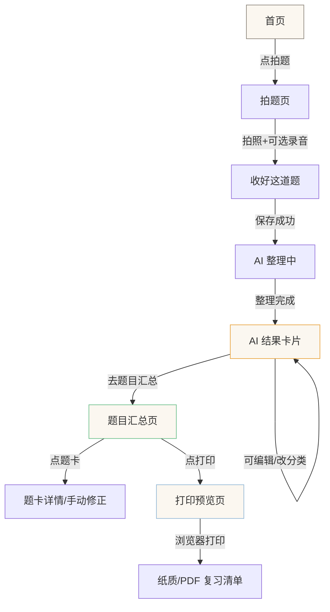

# Nana 错题本 · 用户说明手册 v1（草案）

> 面向：孩子（外甥女）和家长（舅舅）
> 目标：看完这份手册，能正确使用 Nana 错题本，不误会、不害怕、不被 AI 过度承诺
> 关联：产品行为手册（面向开发）见 `nana-product-behavior-manual-v1.md`
> 技术方案：`doc/plan/stage3-ai-integration-plan-v3-revised.md`
> 更新日期：2026-07-05（同步 v3-revised r4 推演修订）

---

## 这是什么

Nana 错题本帮孩子做一件事：**把做过的题收起来，AI 帮忙整理，按课本章节汇总，可以打印出来复习**。

它不是刷题软件，不是讲解软件，也不是考试打分软件。它像一个小本子：

- 拍下做过的题 → AI 帮忙看看大概是哪个课本章节、给个摘要和轻反馈 → 收进题目汇总
- 做周末小检查 → 真正测出来哪些知识点通了 → 地图上点亮绿色

**最重要的一句话：AI 只是帮忙整理，真正点亮一个知识点，要靠孩子自己做对题。**

### AI 能做什么、不能做什么

| AI 能做（v1） | AI 不能做（v1） |
|---------------|----------------|
| 用一句话概括题目大意（AI 摘要） | 完整 OCR（把题目逐字识别出来） |
| 判断大概属于课本哪一章哪一节 | 完整解题步骤 |
| 给一句温和的鼓励（轻反馈） | 给答案 |
| 提示可能的方向（"可能在符号变换时出了差错"） | 深度归因诊断（"你的薄弱点是 XX"） |
| 给下一步建议（"回看 2.3 一元二次不等式，重点检查移项后不等号方向"） | 判断对错、打分 |
| 把录音转成文字（仅 WAV 格式） | 图片裁剪/旋转/涂抹 |

**简单说：AI 摘要不是完整 OCR，轻反馈不是完整解析。** AI 只是"帮忙看一眼、大概归个类"，不是"帮你解题"。

### Lite v1 只做轻反馈，不做完整诊断

**以下说法永远不会出现在 Nana 里**：
- ❌ "你的薄弱点是……"
- ❌ "已诊断……"
- ❌ "你掌握/没掌握……"
- ❌ 完整解题步骤和答案

**AI 只会说**：
- ✅ "这题大概在考一元二次不等式。可以重点检查移项后不等号方向有没有变化。"
- ✅ "这题可能和函数单调性有关。下一步可以回看函数增减性的判断方法，再检查区间端点。"

---

## 第一次怎么用

### 第 1 步：拍一道题

1. 打开 Nana → 点"拍题"
2. 用手机拍下做过的题（作业本、试卷、练习册都行）
3. 照片会显示在上方，确认拍清楚了

### 第 2 步：可选 — 讲讲思路

- 切到"讲讲思路"tab → 按住录音 → 讲自己的思路（比如"我觉得这个函数应该是增函数因为…"）
- 不想讲也没关系，直接跳到下一步

### 第 3 步：等 AI 整理

- 点"收好这道题" → 显示"正在收…"（题图存进去了，不会丢）
- 然后显示"正在整理这题…"（大约等 30 秒，AI 在看题图）

### 第 4 步：看到 AI 整理结果

整理完会显示：

- **AI 摘要**：一句话概括题目大意（比如"已知函数 f(x)=a-2/(2^x+1)，判断奇偶性"）
- **可能属于**：课本章节名（比如"函数的基本性质"）
- **AI 想对你说**：一句温和的鼓励
- **可能的方向**：如果从图片或录音里看到了明显的错误痕迹，提示可能的方向（不确定就留空）
- **下一步**：建议回看哪个课本章节、做什么小动作（不确定就留空，留空时不显示这一栏）

### 第 5 步：可以手动修改

- **改摘要**：点"编辑" → 改文字 → 保存（AI 写的不保留历史，只存最新版）
- **改课本分类**：点"改分类" → 选一个课本章节 → 保存
- AI 给的和手动改的都保留记录，但分类会以你选的为准

### 第 6 步：去"题目汇总"按课本章节看错题

- 打开"知识地图" → 默认进"题目汇总"tab
- 题目按课本章节分组（比如"第一章 集合与常用逻辑用语"下面有"1.1 集合的概念（3 道）"）
- **主卡默认不展示原图**，只展示：课本分类、AI 摘要、AI 想对你说、下一步可以、操作按钮
- 点"展开看原题"才会懒加载原图和时间等辅助信息
- 没有归类的题放在"未分类/暂未覆盖"分组里，会显示一句温和提示："这类题还没放进当前知识地图，先帮你收在这里。"

### 第 7 步：可以打印/导出作为复习清单

- 题目汇总页右上角有"打印/导出"按钮
- 点了会跳到打印预览页 → 按课本章节分好类 → 可以用浏览器打印或另存为 PDF
- 打印出来就是一份按章节整理的错题复习清单
- 按课本章节分组排列，但不会每章强制翻新页（省纸）；章节标题不会和题卡分离，题卡尽量不跨页
- 打印页只展示：课本章节、AI 摘要、小题图、AI 想对你说、下一步可以——不打印时间、转写、置信度等技术元信息

---

## "收过题"和"点亮"的区别

这是最容易误会的地方，先说清楚：

| | 收过题（琥珀色） | 点亮（绿色） |
|---|---|---|
| 意思 | 这道题收进来了，AI 觉得可能跟这个知识点有关 | 孩子真的做对了题，确认这个知识点通了 |
| 怎么来的 | 拍题后 AI 自动挂的，或者手动挂的 | 周末小检查做对了才会点亮 |
| 靠谱程度 | **可能不准**，只是"大概属于" | **确认过了**，做对了才算 |
| 颜色 | 琥珀色（橙黄色） | 绿色 |
| 能消失吗 | 不会消失，但可以手动改 | 点亮了就是点亮了 |

**简单说：收过题 = "这道题好像跟这个有关"；点亮 = "这个我真的会了"。**

拍题 **不会** 让知识点变绿。只有周末小检查做对了才会点亮。

---

## 课本章节覆盖说明

AI 课本分类目前**只覆盖 48 个系统知识点对应的课本章节**，不是完整的高中数学教材目录。

- 当前覆盖：必修第一册第一章到第四章（14 个章节）+ 必修第二册第七章复数（2 个章节），共 16 个课本章节
- 未覆盖的章节：如果拍的题属于当前没覆盖的章节，会归入"未分类/暂未覆盖"，页面会显示温和提示："这类题还没放进当前知识地图，先帮你收在这里。"
- 后续会随知识图谱扩展追加更多课本章节

**举例**：复数相关的题（如复数的概念、复数的四则运算）属于必修第二册第七章，目前已覆盖。

---

## 时间戳说明

时间信息是辅助信息，不喧宾夺主：

| 信息 | 展示位置 | 说明 |
|------|---------|------|
| 拍摄时间 | 采集页、题目汇总展开后 | `Case.createdAt`，即"拍摄于 7月3日" |
| 有语音记录 | 题目汇总展开后 | 如果有录音，显示🎙图标 |
| 整理时间 | 题目汇总展开后（如有 AI 结果） | `CaseAiResult.updatedAt` |

> **v1 修订**：题目汇总主卡默认不展示时间，展开后才显示。打印页不打印时间。

> **v1 不做音频逐句时间轴**。当前数据结构不支持逐句时间戳，如有需要列入 v2 待办。

---

## 八个真实场景

### 场景 1：清晰题图，无录音，AI 成功分类

**孩子做了什么**：做作业遇到一道函数题，做错了。打开 Nana → 拍题 → 直接点"收好这道题"，没录音。

**页面显示什么**：
- 拍完照 → 照片显示在上方
- 点"收好这道题" → 显示"正在收…" → "正在整理这题…"（约 30 秒）
- 整理完 → 显示：
  - "AI 摘要：已知函数 f(x)=a-2/(2^x+1)，判断奇偶性"
  - "可能属于：函数的基本性质"
  - "AI 想对你说：你在这道题上写了很详细的推导…"
  - "可能的方向：可能在符号变换时出了差错"
  - "下一步：回看 3.2 函数的基本性质，重点检查单调性判断步骤"
- 底部出现"去知识地图看看"和"再拍一道"

**系统实际做了什么**：
- 题图存进数据库
- AI 看了题图，生成了摘要、课本分类、轻反馈、错因提示、下一步建议
- 课本分类置信度 ≥ 0.5 → 自动挂上课本章节标签 + 系统知识点标签
- 这些结果**全部持久化**到 `CaseAiResult` 表

**数据落在哪里**：
- 题图 → `Artifact` 表（永久保存）
- AI 整理结果 → `CaseAiResult` 表（questionSummary、textbookTopicId、initialFeedback、possibleMistakeReason、nextActionSuggestion）
- 课本分类标签 → `CaseTextbookTopicTag` 表（source="vlm"）
- 系统知识点标签 → `CaseKnowledgeTag` 表（source="vlm"）
- 拍摄时间 → `Case.createdAt`

**孩子可能误解什么**：
- ❌ "AI 摘要就是完整题目了？"
- ✅ 不是。AI 摘要是一句话概括，不是逐字识别的完整题目。看不清的地方 AI 不会编造。
- ❌ "它说'可能属于'，是不是已经确认了？"
- ✅ 不是。"可能属于"就是字面意思——AI 看图猜的，不一定对。可以手动改。

**我们怎么用文案避免误解**：
- 用"AI 摘要"而不是"识别出的题目"
- 用"可能属于"而不是"属于"
- 不说"已识别""已分类""已诊断"

---

### 场景 2：清晰题图 + 语音，AI 转写并给轻反馈

**孩子做了什么**：拍下一道题，切到"讲讲思路"tab，按住录音讲了自己的思路（比如"我觉得这个函数应该是增函数因为…"），然后点"收好这道题"。

**页面显示什么**：
- 保存成功 → "正在整理这题…"（约 30 秒）
- 整理完 → 显示：
  - "AI 摘要：判断 f(x)=x²-2x+1 在 [0,3] 上的单调性"
  - "可能属于：函数的基本性质"
  - "AI 想对你说：你在这道题上写了很详细的推导过程，这个习惯很好。"
  - "可能的方向：可能在符号变换时出了差错，可以检查一下这一步。"
  - "下一步：回看 3.2 函数的基本性质，重点检查单调性判断步骤。"
- 切到"我的话"tab → 能看到自己刚才说的话变成了文字
- 文字下面写着"转写仅供参考，原音为准"

**系统实际做了什么**：
- 题图和录音都存进数据库
- AI 一次性处理题图 + 录音，生成了摘要、转写、课本分类、轻反馈、错因提示、下一步建议
- 转写文字回写到 transcript artifact
- AI 结果全部持久化到 `CaseAiResult`

**数据落在哪里**：
- 题图 + 录音 → `Artifact` 表
- 转写文字 → `Artifact` 表（type="transcript"）+ `CaseAiResult.transcript`
- AI 整理结果 → `CaseAiResult` 表
- 课本分类标签 → `CaseTextbookTopicTag` 表
- 系统知识点标签 → `CaseKnowledgeTag` 表

**孩子可能误解什么**：
- ❌ "转写的文字就是标准答案？"
- ✅ 不是。转写只是把录音变成了文字，方便回看。原音才是真相源。
- ❌ "轻反馈就是完整解析？"
- ✅ 不是。轻反馈只是鼓励和可能的方向提示，不是完整解题步骤。AI 不给答案。

**我们怎么用文案避免误解**：
- "转写仅供参考，原音为准"
- "AI 想对你说"——不说"解析""答案"
- "可能的方向"——不说"诊断结果""错因分析"
- "下一步可以"——不说"你应该""必须"

---

### 场景 3：图片不清楚，AI 只能给摘要或无法分类

**孩子做了什么**：手抖拍了张歪的，题目部分被截掉了。点"收好这道题"。

**页面显示什么**：
- 保存成功 → "正在整理这题…"
- 整理完 → 两种情况：
  - **AI 看懂了一部分**：显示"AI 摘要：…" + "整理好了，但不太好分类，可以手动选"
  - **AI 完全看不清**：显示"整理好了，但不太好分类，可以手动整理"
- 如果 AI 给了低置信候选（置信度 < 0.5），不会自动挂分类
- 题目会出现在"未分类/暂未覆盖"分组里，分组上方显示温和提示："这类题还没放进当前知识地图，先帮你收在这里。"

**系统实际做了什么**：
- AI 看了题图，觉得不太确定
- 低置信候选**不会自动挂载**，也不持久化
- 如果 AI 能给摘要，摘要会持久化到 `CaseAiResult`
- `CaseAiResult.processingStatus = "success"` 但 `textbookTopicId` 为空

**数据落在哪里**：
- 题图 → `Artifact` 表（永久保存）
- AI 摘要（如有）→ `CaseAiResult.questionSummary`
- 课本分类标签 → **没写**（低置信不持久化）
- 拍摄时间 → `Case.createdAt`

**孩子可能误解什么**：
- ❌ "它说不好分类，是不是我的题太差了？"
- ✅ 不是。可能是照片歪了、光线暗、题目截掉了。重新拍一张就好。
- ❌ "题目存哪了？"
- ✅ 在"题目汇总"页的"未分类/暂未覆盖"分组里。

**我们怎么用文案避免误解**：
- "整理好了，但不太好分类"——不说"识别失败""照片质量差"
- "可以手动选"——给出路，不让孩子卡住
- 不怪用户

---

### 场景 4：AI 课本分类错了，孩子手动改

**孩子做了什么**：拍了一道二次函数题，AI 自动挂了"函数的基本性质"，但孩子/家长觉得应该是"函数的概念及其表示"。

**怎么改**：
1. 在采集页直接点"改分类"，或者去"题目汇总"找到这道题
2. 点"改分类" → 弹出课本章节选择器（按章节分组）
3. 选"第三章 函数的概念与性质 → 3.1 函数的概念及其表示" → 保存
4. 显示"已更新"

**页面显示什么**：
- 课本分类从"函数的基本性质"变成"函数的概念及其表示"
- 角标从"AI 候选"变成"手动"

**系统实际做了什么**：
- `CaseAiResult.textbookTopicId` 更新为新 ID，`textbookTopicEdited = true`
- 写入一条新的 `CaseTextbookTopicTag`（source="manual"，confidence=1.0）
- AI 自动挂的标签（source="vlm"）保留不删除
- **用户修正后的分类不会被后续 /process 覆盖**（textbookTopicEdited=true 时保护）

**数据落在哪里**：
- 更新 → `CaseAiResult.textbookTopicId` + `textbookTopicEdited=true`
- 新标签 → `CaseTextbookTopicTag`（source="manual"）
- AI 标签不删除 → 保留原始记录

**孩子可能误解什么**：
- ❌ "AI 挂错了是不是说明 AI 不好用？"
- ✅ AI 看图分类不可能 100% 准，尤其是手写+倾斜的照片。手动改是正常操作，不是"纠错"。

**我们怎么用文案避免误解**：
- "改分类"——不说"纠错""修正错误"
- "已更新"——不说"已修正"
- AI 角标标"AI 候选"——暗示可以改

---

### 场景 5：AI 给了"下一步建议"，但不承诺完整解析

**孩子做了什么**：拍了一道指数函数的题，AI 整理完了。

**页面显示什么**：
- "AI 摘要：比较 2^0.3 和 2^3.1 的大小"
- "可能属于：指数函数"
- "AI 想对你说：这道题你尝试了不同的方法，很好。"
- "可能的方向：注意指数函数的单调性"
- "下一步：可以看看指数函数这节的视频，再做几道类似的题。"

**孩子可能误解什么**：
- ❌ "下一步建议是不是就是解题步骤？"
- ✅ 不是。"下一步回看 XX 课本章节"只是一个建议方向，不是完整解析。AI 不会给你答案。
- ❌ "可能的方向是不是告诉我哪里错了？"
- ✅ "可能的方向"只是提示，用"可能""也许"等措辞，不是确定性诊断。

**我们怎么用文案避免误解**：
- "下一步可以"——不说"你应该""答案是"
- "可能的方向"——不说"错因分析""诊断结果"
- "回看 XX 课本章节"——给方向，不给答案。v1 不承诺视频链接。

---

### 场景 6：题目属于当前 48 节点覆盖外章节，进入"未分类/暂未覆盖"

**孩子做了什么**：拍了一道三角函数的题（比如正弦定理），AI 没有对应的课本章节可选。

**页面显示什么**：
- "AI 摘要：在△ABC 中，已知 a=2, b=3, A=30°，求 B"
- "可能属于：未分类/暂未覆盖"
- 分组提示："这类题还没放进当前知识地图，先帮你收在这里。"
- "AI 想对你说：这道题你尝试了…"

**系统实际做了什么**：
- AI 识别出题目内容，生成了摘要和轻反馈
- 但课本章节清单里没有三角函数相关章节（当前只覆盖 48 个系统节点对应的 16 个章节）
- `CaseAiResult.textbookTopicId` 为空
- 题目归入"未分类/暂未覆盖"分组

**数据落在哪里**：
- AI 摘要 + 轻反馈 → `CaseAiResult`（持久化）
- 课本分类标签 → 没写（清单外 topicId 被代码层过滤）
- 系统知识点标签 → 没写（48 节点中没有三角函数节点）

**孩子可能误解什么**：
- ❌ "为什么 AI 说'未分类'？是不是 AI 不会？"
- ✅ 不是 AI 不会，是当前课本章节覆盖还没到这部分。后续会扩展。

**我们怎么用文案避免误解**：
- "未分类/暂未覆盖"——不说"无法识别""不支持"
- 分组提示用温和语气："这类题还没放进当前知识地图，先帮你收在这里。"——不像报错，不像产品坏了
- 仍然展示 AI 摘要和轻反馈——说明 AI 看懂了题，只是暂时没有对应的课本分类

---

### 场景 7：网络慢或 AI 失败，题已保存，可稍后重试/手动整理

**孩子做了什么**：拍了一道题，点"收好这道题"，等了很久（超过 30 秒），最后显示"整理超时了"或"识别没接上"。

**页面显示什么**：
- 超时 → "整理超时了，可以重试或手动整理"
- 报错 → "识别没接上，可以手动整理"
- 题图已经保存了（这道题不会丢）
- 题目会出现在"题目汇总"的"未分类/暂未覆盖"分组里

**怎么办**：
1. **重试**：等网络好了，再点一次这道题的"重新整理"
2. **手动整理**：去"题目汇总"找到这道题 → 手动选课本分类 → 手动写摘要
3. **不管它**：题图已经存好了，什么时候想整理都行

**系统实际做了什么**：
- 题图在保存那一步已经成功了
- AI 调用超时或报错 → `CaseAiResult` 写入 `processingStatus = "failed"` 或 `"timeout"`
- 没有写 AI 摘要、课本分类标签

**数据落在哪里**：
- 题图 → `Artifact` 表（已保存，不丢）
- AI 结果 → `CaseAiResult`（processingStatus=failed/timeout，其他字段为空）
- 拍摄时间 → `Case.createdAt`

**孩子可能误解什么**：
- ❌ "没接上是不是我的题没存？"
- ✅ 题已经存好了，只是 AI 没帮忙整理。可以手动整理，也可以重试。
- ❌ "是不是我的手机有问题？"
- ✅ 可能是网络慢，也可能是 AI 服务忙。不是手机的问题。

**我们怎么用文案避免误解**：
- "识别没接上"——不说"失败""错误"
- "整理超时了"——不说"超时失败"
- "可以重试或手动整理"——给出路，不让孩子卡住
- 不说"网络错误""服务器错误"——不说技术术语

---

### 场景 8：题目汇总打印给孩子复习

**孩子/家长做了什么**：攒了一周的错题，周末想打印出来复习。

**怎么操作**：
1. 打开"知识地图" → 默认进"题目汇总"tab
2. 看到题目按课本章节分组排列
3. 点右上角"打印/导出" → 跳到打印预览页
4. 预览页显示按章节整理的错题清单
5. 用浏览器打印或另存为 PDF

**打印内容**：
- 标题："我的错题汇总 — 按课本章节整理"
- 生成时间
- 按课本章节分组（第一章 → 第二章 → …）
- 每道题显示：
  - 题图缩略图
  - AI 摘要
  - 拍摄时间
  - 转写文字（如有）
  - AI 反馈
  - 可能的方向
  - 下一步建议
- 未分类/暂未覆盖的题放最后
- 打印时隐藏所有编辑/改分类按钮

**孩子可能误解什么**：
- ❌ "打印出来就是标准答案了？"
- ✅ 不是。打印的是错题汇总清单，AI 摘要和轻反馈只是辅助参考，不是答案。

---

## v1 不做的能力

以下能力在 v1 **不做**，避免用户产生错误期待：

| 能力 | 为什么不做 |
|------|-----------|
| 图片裁剪/旋转/涂抹 | v1 不做图片编辑，拍清楚就行 |
| 疑似重复题识别 | 文本相似度算法+UI 交互，非闭环核心 |
| 完整 OCR（逐字识别题目） | v1 用 AI 摘要一句话概括够用 |
| 完整解题步骤/答案 | v1 只做轻反馈，不误导 |
| 深度归因/绿色点亮 | 拍题不触发 StudentNodeState，只有周末小检查做对了才点亮 |
| 音频逐句时间轴 | 当前数据结构不支持，列入 v2 待办 |
| PDF 直接导出 | 浏览器打印另存为 PDF 够用 |
| 选择性打印（勾选题目） | v1 全部打印，v2 加勾选 |

---

## 常见问题

### Q：AI 摘要是完整题目吗？
不是。AI 摘要是一句话概括题目大意，不是逐字识别的完整题目。看不清的地方 AI 不会编造。如果需要完整题目文字，目前需要手动编辑。

### Q：录音一定会变成文字吗？
不一定。目前只有 WAV 格式的录音能转写。大部分手机浏览器录的是 webm 格式，暂时不能转写。不能转写不影响拍照和课本分类。

### Q：AI 给的课本分类一定对吗？
不一定。AI 看图猜的，可能挂错。可以手动改。AI 给的和手动改的都保留记录。

### Q：收了一道题，知识点为什么不变绿？
收题只是"见过这道题"，不等同于"会了"。要做周末小检查做对了才会变绿。**收过题 ≠ 点亮掌握**。

### Q：轻反馈是完整解析吗？
不是。轻反馈只是一句鼓励和可能的方向提示，不是完整解题步骤。AI 不会给答案。

### Q："下一步建议"是什么？
"下一步建议"是 AI 给的一个学习方向（比如"回看 2.3 一元二次不等式，重点检查移项后不等号方向"），不是解题步骤，不承诺完整解析。v1 不承诺视频链接。

### Q：识别超时了，题白拍了吗？
没有。题图在保存那一步已经存好了。AI 没整理只是暂时没有摘要和分类，可以手动整理或重试。题目会出现在"未分类/暂未覆盖"分组里。

### Q：周末小检查是什么？
每周做几道题，测测哪些知识点真的通了。做对了对应知识点就会点亮（变绿）。小检查和平时拍题是两个独立的事：拍题是"收集材料"，小检查是"验证掌握"。

### Q：转写的文字能改吗？
可以。在"我的话"tab 里，点一下文字就能编辑。改完会自动存。但原音不会变，文字只是辅助参考。

### Q：为什么有些题显示"未分类/暂未覆盖"？
当前课本章节覆盖只到 48 个系统知识点对应的 16 个章节，不是完整教材目录。如果拍的题属于还没覆盖的章节，会归入"未分类/暂未覆盖"，页面会显示温和提示："这类题还没放进当前知识地图，先帮你收在这里。"后续会扩展。

---

## 手机端线性流程图

> 以下用 ASCII 手机线框图展示孩子从拍题到题目汇总的核心路径。
> 手机端按 390px 宽体验绘制，只表现上下顺序、按钮位置、主次关系，不追求视觉高保真。
> 每张图下面写 3 行说明：用户想做什么 / 页面给了什么反馈 / 最容易误解什么。

### 全局路径概览



---

### 图 1：首页入口

```
┌─────────────────────────────┐
│  Nana 错题本          7月5日 │
│                             │
│  ┌────────────────────────┐ │
│  │                        │ │
│  │    📷  拍题             │ │
│  │    拍下做过的题          │ │
│  │    AI 帮忙整理           │ │
│  │                        │ │
│  └────────────────────────┘ │
│                             │
│  ┌────────────────────────┐ │
│  │                        │ │
│  │    📋  题目汇总         │ │
│  │    按课本章节看错题      │ │
│  │    可打印复习            │ │
│  │                        │ │
│  └────────────────────────┘ │
│                             │
│  ┌────────────────────────┐ │
│  │                        │ │
│  │    ✦  周末小检查        │ │
│  │    做几道题，点亮知识点   │ │
│  │                        │ │
│  └────────────────────────┘ │
│                             │
│  你最近收过题的知识点有 3 个 │
│  还没做小检查，做完就能点亮 ✦│
└─────────────────────────────┘
```

- **用户此刻想做什么**：刚打开 app，想拍今天做错的题，或者看看之前拍的题
- **页面给了什么反馈**：三个入口卡片，拍题和题目汇总排在前两个（第一阶段最常用）；底部回顾条提示"收过题但还没点亮"
- **最容易误解什么**：回顾条写"收过题"不是"掌握了"——文案明确说"做完小检查才能点亮"，不写"已掌握"

> **产品决策**：第一阶段默认突出"拍题"和"题目汇总"，不出现重复的"看看知识地图"入口。知识地图和题目汇总合并为同一个入口（进入后默认"题目汇总"tab）。

---

### 图 2：拍题页

```
┌─────────────────────────────┐
│  ← 返回        拍题          │
│                             │
│  ┌────────────────────────┐ │
│  │                        │ │
│  │                        │ │
│  │    [题图预览区域]        │ │
│  │    （拍照或选图）         │ │
│  │                        │ │
│  │                        │ │
│  └────────────────────────┘ │
│                             │
│  [重新拍一张]                │
│                             │
│  ─ ─ ─ ─ ─ ─ ─ ─ ─ ─ ─ ─ ─ │
│                             │
│  📷 拍题    🎙 讲讲思路       │
│             （可选）          │
│                             │
│  ┌────────────────────────┐ │
│  │  按住录音，讲讲你的思路   │ │
│  │  （不想讲可以跳过）       │ │
│  └────────────────────────┘ │
│                             │
│  ─ ─ ─ ─ ─ ─ ─ ─ ─ ─ ─ ─ ─ │
│                             │
│  ┌────────────────────────┐ │
│  │     ✦ 收好这道题        │ │
│  └────────────────────────┘ │
│                             │
│  拍摄时间：7月5日 15:30      │
└─────────────────────────────┘
```

- **用户此刻想做什么**：把这道做错的题收进来，可能还想讲讲自己的思路
- **页面给了什么反馈**：题图预览在上方；录音是可选的（明确标注"可选""不想讲可以跳过"）；底部显示拍摄时间；主按钮"收好这道题"
- **最容易误解什么**：孩子可能以为必须录音才能保存——文案明确"可选""可以跳过"

> **产品决策**：录音是可选补充，不是必填。v1 不做裁剪/旋转/涂抹——拍清楚就行。拍摄时间在保存时就生成（`Case.createdAt`）。

---

### 图 3：AI 整理中 + 整理完成卡片

```
┌─────────────────────────────┐
│  ← 返回        拍题          │
│                             │
│  ┌────────────────────────┐ │
│  │                        │ │
│  │    [题图预览]            │ │
│  │                        │ │
│  └────────────────────────┘ │
│                             │
│  ┌────────────────────────┐ │
│  │  ⏳ 正在整理这题…        │ │
│  │  （大约 30 秒）          │ │
│  └────────────────────────┘ │
│                             │
│      ↓ 整理完成后 ↓          │
│                             │
│  ┌────────────────────────┐ │
│  │ ✅ 整理好了              │ │
│  │   可能属于：函数的基本性质│ │
│  │                        │ │
│  │ AI 摘要：                │ │
│  │ "判断 f(x)=x²-2x 在     │ │
│  │  [0,3] 上的单调性"       │ │
│  │ [编辑]                  │ │
│  │                        │ │
│  │ AI 想对你说：             │ │
│  │ "你在这道题上写了很详细   │ │
│  │  的推导过程，这个习惯好"  │ │
│  │                        │ │
│  │ 可能的方向：              │ │
│  │ "可能在符号变换时出了差错"│ │
│  │                        │ │
│  │ 下一步：                 │ │
│  │ "回看 3.2 函数的基本性质，│ │
│  │  重点检查单调性判断步骤"  │ │
│  │                        │ │
│  │  整理于 7月5日 15:31     │ │
│  └────────────────────────┘ │
│                             │
│  [去题目汇总]  [再拍一道]    │
└─────────────────────────────┘
```

- **用户此刻想做什么**：等 AI 整理完，看看 AI 给了什么结果
- **页面给了什么反馈**：先显示"正在整理这题…"（约 30 秒），然后展示 AI 摘要、课本分类、鼓励、可能方向、下一步建议；每个区块都有标签，下一步不写"看视频"只写"回看课本章节+小动作"
- **最容易误解什么**：孩子可能以为"AI 摘要"就是完整题目——文案叫"AI 摘要"不叫"识别出的题目"；孩子可能以为"可能属于"是确定的——文案留"可能"余地

> **产品决策**：
> - 不写"已诊断""薄弱""掌握""得分"——用"整理好了""可能属于""可能的方向"
> - `possibleMistakeReason` 为空时**隐藏整个区块**，不显示"暂无提示"
> - `nextActionSuggestion` 不承诺视频链接，只给"回看课本章节+小动作"
> - "可能的方向"区块仅在 AI 返回了内容时才出现

---

### 图 4：题目汇总默认页

```
┌─────────────────────────────┐
│  ← 返回    题目汇总   📲打印 │
│                             │
│ ┌─题目汇总─┐ ┌─图谱─┐ ┌列表┐│
│ │  默认 ◀  │ │      │ │    ││
│ └──────────┘ └──────┘ └────┘│
│                             │
│  第一章 集合与常用逻辑用语    │
│                             │
│  1.1 集合的概念（2 道）       │
│  ┌────────────────────────┐ │
│  │ 课本分类：集合概念        │ │
│  │ AI 摘要：已知集合A={1,2,3}│ │
│  │ AI 想对你说：你很仔细…    │ │
│  │ 下一步：回看 1.1，检查互异│ │
│  │ [展开看原题] [改分类]    │ │
│  └────────────────────────┘ │
│  ┌────────────────────────┐ │
│  │ 课本分类：集合概念        │ │
│  │ AI 摘要：...              │ │
│  │ [展开看原题] [改分类]    │ │
│  └────────────────────────┘ │
│                             │
│  3.2 函数的基本性质（1 道）   │
│  ┌────────────────────────┐ │
│  │ 课本分类：函数性质        │ │
│  │ AI 摘要：判断 f(x)=x²…    │ │
│  │ AI 想对你说：推导很详细…   │ │
│  │ 下一步：回看 3.2，检查单调│ │
│  │ [展开看原题] [改分类]    │ │
│  └────────────────────────┘ │
│                             │
│  未分类/暂未覆盖（1 道）      │
│  这类题还没放进当前知识地图， │
│  先帮你收在这里。             │
│  ┌────────────────────────┐ │
│  │ AI 摘要：正弦定理…        │ │
│  │ [展开看原题] [改分类]    │ │
│  └────────────────────────┘ │
└─────────────────────────────┘
```

- **用户此刻想做什么**：看看自己拍了哪些题，按什么类分好了
- **页面给了什么反馈**：默认停在"题目汇总"tab；按课本章节分组；主卡默认不展示原图，只展示分类+摘要+轻反馈+下一步+操作按钮；未分类的题放最后，带温和提示
- **最容易误解什么**：孩子可能以为"未分类"是 AI 不会——提示文案"还没放进当前知识地图，先帮你收在这里"不像报错，不怪用户

> **产品决策**：
> - 手机和桌面都默认进"题目汇总"，图谱是第二视图
> - 主卡默认不展示原图和时间，从复习视角重排——一眼扫过看到分类+摘要+轻反馈+下一步
> - 原图懒加载，点"展开看原题"才请求——列表 API 不返回 base64 题图
> - 课本章节覆盖当前 48 个系统知识点对应的 16 个章节，不是完整教材目录
> - "未分类/暂未覆盖"用温和提示，不像报错
> - "收过题"不等于"点亮掌握"——这里只有题目卡片，没有绿色点亮
> - `possibleMistakeReason` 为空时不展示"可能的方向"区块
> - `nextActionSuggestion` 为空时不展示"下一步"区块

---

### 图 5：题卡详情 / 手动修正

```
┌─────────────────────────────┐
│  ← 返回      题目详情        │
│                             │
│  ┌────────────────────────┐ │
│  │                        │ │
│  │    [原题图]              │ │
│  │                        │ │
│  └────────────────────────┘ │
│  拍摄于 7月5日 15:30         │
│                             │
│  ─ ─ ─ ─ ─ ─ ─ ─ ─ ─ ─ ─ ─ │
│                             │
│  AI 摘要：                   │
│  "判断 f(x)=x²-2x 在        │ │
│   [0,3] 上的单调性"          │
│  [编辑]                     │
│                             │
│  课本分类：                  │
│  函数的基本性质  [AI 候选]   │
│  [改分类]                   │
│                             │
│  ─ ─ 改分类下拉框 ─ ─ ─ ─ ─ │
│  第三章 函数的概念与性质      │
│   ○ 3.1 函数的概念及其表示   │
│   ● 3.2 函数的基本性质（当前）│
│   ○ 3.3 幂函数（暂未覆盖）   │
│  ─ ─ ─ ─ ─ ─ ─ ─ ─ ─ ─ ─ ─ │
│                             │
│  AI 想对你说：               │
│  "你在这道题上写了很详细的    │
│   推导过程，这个习惯好"       │
│                             │
│  可能的方向：                │
│  "可能在符号变换时出了差错"   │
│                             │
│  下一步：                   │
│  "回看 3.2 函数的基本性质，  │
│   重点检查单调性判断步骤"    │
│                             │
│  🎙 有语音记录               │
│  整理于 7月5日 15:31         │
└─────────────────────────────┘
```

- **用户此刻想做什么**：看看这道题的详细信息，可能想改 AI 给的分类
- **页面给了什么反馈**：完整题卡——原题图、AI 摘要（可编辑）、课本分类（可改）、轻反馈、可能方向、下一步建议；有语音标记；改分类弹出按章节分组的选择器
- **最容易误解什么**：孩子手动改了分类后可能以为知识点"点亮了"——手动改只是"孩子认为这题属于这里"，不是系统确认，不会变绿

> **产品决策**：
> - 孩子可以纠错 AI 分类，改后标"手动"角标，AI 原标签保留不删
> - 用户手动分类是"孩子认为这题属于这里"，**不是系统确认**，不会让知识点变绿
> - 修改后的分类不会被后续 /process 覆盖（`textbookTopicEdited=true` 保护）
> - `possibleMistakeReason` 为空时此区块隐藏
> - 选择器中未覆盖章节不出现（只展示有节点的 topic）

---

### 图 6：打印预览

```
┌─────────────────────────────┐
│  ← 返回   打印预览   🖨 打印 │
│                             │
│  我的错题汇总                │
│  按课本章节整理              │
│  生成时间：2026-07-05        │
│                             │
│  ─────────────────────────  │
│  第一章 集合与常用逻辑用语    │
│  ─────────────────────────  │
│                             │
│  1.1 集合的概念              │
│  ┌──────┐ AI 摘要：已知集合  │
│  │[题图]│ A={1,2,3}...       │
│  │小图   │ AI 想对你说：你很… │
│  └──────┘ 下一步：回看 1.1...│
│                             │
│  ─────────────────────────  │
│  第三章 函数的概念与性质      │
│  ─────────────────────────  │
│                             │
│  3.2 函数的基本性质          │
│  ┌──────┐ AI 摘要：判断...   │
│  │[题图]│ AI 想对你说：推导…  │
│  │小图   │ 下一步：回看 3.2...│
│  └──────┘                   │
│                             │
│  ─────────────────────────  │
│  未分类/暂未覆盖             │
│  ─────────────────────────  │
│                             │
│  ┌──────┐ AI 摘要：正弦定理  │
│  │[题图]│ AI 想对你说：这道…  │
│  └──────┘                   │
│                             │
│  [🖨 打印]    [⬇ 另存 PDF]  │
└─────────────────────────────┘
```

- **用户此刻想做什么**：把错题打印出来，周末复习用
- **页面给了什么反馈**：按课本章节分组排列；每题含小题图+AI 摘要+AI 想对你说+下一步；不打印时间、转写、置信度等技术元信息；未分类放最后；底部有打印和另存 PDF 按钮
- **最容易误解什么**：孩子可能以为打印出来就是标准答案——这只是错题汇总清单，AI 摘要和轻反馈是辅助参考

> **产品决策**：
> - 浏览器打印/另存 PDF，不引入 PDF 库
> - 按章节分组但**不强制每章分页**（A4 省纸）
> - 章节标题 `break-after: avoid`（不与题卡分离）
> - 题卡 `page-break-inside: avoid`（尽量不跨页）
> - **默认不打印**：拍摄时间、整理时间、置信度、source、转写内容、技术状态字段
> - `possibleMistakeReason` 和 `nextActionSuggestion` 为空时打印页也隐藏对应行
> - 题图缩略图保留（v1 没有完整 OCR，原图是重要参考），但缩略弱化
> - v1 全部打印，不做选择性勾选（v2 加）

---

## 词汇表（用户版）

| 我们说的 | 意思 | 不是 |
|---------|------|------|
| 收好这道题 | 把题图和录音存进本子 | 不是"已学会" |
| 正在整理这题 | AI 在帮忙看题图和录音 | 不是"正在诊断" |
| AI 摘要 | AI 用一句话概括题目大意 | 不是"完整 OCR""逐字识别" |
| 可能属于 | AI 觉得大概是这个课本章节 | 不是"确定是" |
| AI 想对你说 | 一句温和的鼓励 | 不是"解析""答案" |
| 可能的方向 | 提示可能的错因方向 | 不是"诊断结果" |
| 下一步可以 | 建议回看哪个课本章节、做什么小动作 | 不是"解题步骤"，v1 不承诺视频链接 |
| AI 候选 | AI 自动挂的分类 | 不是"确认过的" |
| 手动 | 人自己挂的分类 | — |
| 收过题（琥珀色） | 这道题收进来了，可能跟这个知识点有关 | 不是"掌握了" |
| 已点亮（绿色） | 做对了题，确认这个知识点通了 | — |
| 未分类/暂未覆盖 | 当前课本章节还没覆盖到这部分 | 不是"无法识别" |
| 周末小检查 | 做几道题，测哪些知识点真的通了 | 不是"考试" |
| 没接上 | AI 没帮忙整理成功 | 不是"你的错" |
| 重新拍一张 | 换一张照片 | 不是"刚才的丢了" |
| 打印/导出 | 按课本章节整理的错题复习清单 | 不是"标准答案" |
