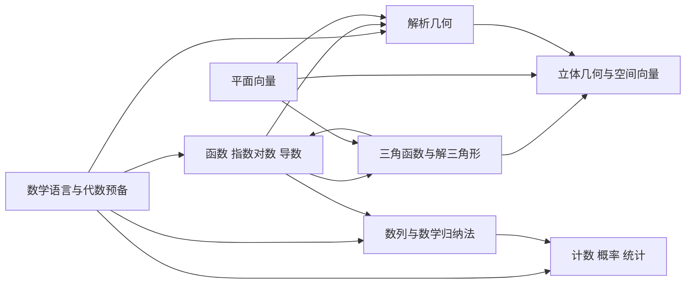

# 新高考全国I卷数学知识图谱主线与跨线桥研究

## 执行性摘要

本报告以《普通高中数学课程标准（2017年版2020年修订）》、人教A版2019现行教材目录与配套资源、安徽省新高考实施办法，以及可核对到的近年新课标I卷/新高考I卷数学真题与试题评析为依据，在不突破现行课标与教材边界的前提下，把高中数学重组为 **8 条“操作性主线”**：数学语言与代数预备、函数与导数、三角与解三角形、数列、平面向量、立体几何与空间向量、解析几何、计数概率统计。这样做不是改写课标，而是把课标的四条总主线（函数、几何与代数、概率与统计、数学建模/探究）按现行教材章法和新课标卷稳定题源进一步细化，便于知识图谱做“共享地基层—主线子图—跨线桥”的分层建模。安徽自 2024 年起实行“3+1+2”，其中数学使用全国卷；2024 年数学新课标卷题量变为 19 题并强化思维过程，2025 年继续强调基础性与思维能力，这使得“主线清晰、桥接显式”的图谱结构比传统章节树更适合备考分析。 citeturn48search0turn48search1turn24search1turn22search2turn23search0turn37search3

## 研究依据与适用边界

用户写作中的“选修1、2、3”，在现行教材正式书名中对应为 **“选择性必修第一、二、三册”**；下表统一按现行正式书名映射。课标层面，必修课程被组织为“预备知识、函数、几何与代数、概率与统计、数学建模活动与数学探究活动”五个主题；选择性必修中，“函数”主题明确包含“数列、一元函数导数及其应用”，“几何与代数”主题明确包含“空间向量与立体几何、平面解析几何”，“概率与统计”主题包含“计数原理、概率、统计”。这为本报告把总主线细化成 8 条高考操作线提供了直接依据。 citeturn24search1turn25search22

排除规则采用“现行教材正面表 + 旧教材反向核对”的方式执行：旧A版《数学2（必修）》含“空间几何体的三视图和直观图”，旧A版《数学3（必修）》含“算法初步”“算法与程序边框图”，旧A版《数学A版 选修1-2 同步解析与测评》目录含“推理与证明”“框图”；而现行人教A版2019目录对应位置已改为“立体图形的直观图”，并不再出现算法、程序框图、推理与证明独立章节。因此，**三视图、算法与程序框图、独立推理与证明章节**不进入本图谱；**简单线性规划**则按用户限定边界同步排除。 citeturn20search3turn20search2turn18search0turn29search1turn30search0turn29search2turn17search1

## 主线划分表

| 主线ID | 主线名称 | 划分理由 | 覆盖教材章节 | 主干逻辑链 |
|---|---|---|---|---|
| M1 | 数学语言与代数预备 | 把课标“预备知识”与低权重、强通用的代数对象合并成一条基础线，可降低其在其他主线中的重复挂接成本；高考中多以选择填空或综合题首步条件出现。 citeturn24search1turn22search2 | 必修第一册第1章1.1–1.5、第2章2.1–2.3；必修第二册第7章7.1–7.2，7.3*为教材拓展。 citeturn30search0turn29search1turn29search4 | 集合表示→集合关系与运算→充分条件/必要条件与量词→等式与不等式性质→基本不等式→一元二次函数、方程、不等式→复数概念→复数四则运算。 citeturn30search0turn29search1 |
| M2 | 函数、指数对数与导数 | 课标把“函数”设为总主线之一，选择性必修又把“导数及其应用”并入函数主题；从教材到高考，函数与导数都是主干中的主干。 citeturn24search1turn25search22turn23search0 | 必修第一册第3章3.1–3.4、第4章4.1–4.5；选择性必修第二册第5章5.1–5.3。 citeturn30search0turn29search2 | 函数概念与表示→定义域/值域/单调性/奇偶性→幂函数→指数与对数→指数/对数函数→函数模型→导数概念→导数运算→用导数研究单调性、极值最值、切线与参数问题。 citeturn30search0turn29search2 |
| M3 | 三角函数与解三角形 | 教材把三角函数完整放在必修第一册，同时又在必修第二册向量应用中引出正弦定理、余弦定理；高考中二者常以“角—函数—三角形”一体化方式命题。 citeturn30search0turn52search4turn35view0 | 必修第一册第5章5.1–5.7；必修第二册6.4中借助向量引出的正弦定理、余弦定理与解三角形应用。 citeturn30search0turn52search4 | 任意角与弧度制→三角函数概念→诱导公式→图像与性质→三角恒等变换→函数 y=Asin(ωx+φ)→正弦定理/余弦定理→解三角形→三角模型应用。 citeturn30search0turn52search4 |
| M4 | 数列与数学归纳法 | 课标在选择性必修“函数”主题中明确把“数列”并列于“导数”；高考中数列既保留独立大题题源，又经常承担与证明、求和、参数结构相关的深题功能。 citeturn25search22turn45search1 | 选择性必修第二册第4章4.1–4.4*。 citeturn29search2 | 数列概念→等差数列→等比数列→前n项和→递推与通项互化→数列与函数/不等式综合→数学归纳法*→结构化证明。 citeturn29search2 |
| M5 | 平面向量 | 现行教材把平面向量单列于必修第二册第6章；高考中它既能独立出小题，又是通往解三角形、解析几何和空间向量法的关键工具线。 citeturn29search1turn52search4turn35view0 | 必修第二册第6章6.1–6.4。 citeturn29search0turn52search4 | 向量概念→向量加减与数乘→平面向量基本定理→坐标表示→数量关系与位置关系表示→平面几何/实际问题应用。 citeturn29search0 |
| M6 | 立体几何与空间向量 | 课标在选择性必修“几何与代数”主题中明确包含“空间向量与立体几何”；教材也形成“直观几何→公理关系→空间向量法”的清晰升级链。 citeturn25search22turn29search1turn30search2 | 必修第二册第8章8.1–8.6；选择性必修第一册第1章1.1–1.4。 citeturn29search1turn30search2 | 基本立体图形→直观图→表面积与体积→空间点线面位置关系→平行与垂直判定性质→空间向量概念→空间向量基本定理→坐标表示→向量法求角、距与证明。 citeturn29search1turn30search2 |
| M7 | 解析几何 | 课标在选择性必修“几何与代数”主题中把“平面解析几何”单列；从教材和近年全国卷看，直线、圆到圆锥曲线构成稳定、连续的大题来源。 citeturn25search22turn30search2turn33search1 | 选择性必修第一册第2章2.1–2.5、第3章3.1–3.3。 citeturn30search2 | 倾斜角与斜率→直线方程→交点与距离→圆的方程→直线与圆/圆与圆→椭圆→双曲线→抛物线→圆锥曲线综合。 citeturn30search2 |
| M8 | 计数、概率与统计 | 课标把“概率与统计”设为总主线之一，选择性必修第三册又把计数原理、随机变量、相关回归串成一册，是最适合独立成线的数据与随机机制子图。 citeturn24search1turn17search1turn23search0 | 必修第二册第9章9.1–9.3、第10章10.1–10.3；选择性必修第三册第6章6.1–6.3、第7章7.1–7.5、第8章8.1–8.3。 citeturn29search1turn29search4turn17search1 | 随机抽样→用样本估计总体→随机事件与概率→事件独立性→频率与概率→分类加法/分步乘法→排列组合→二项式定理→条件概率/全概率→离散型随机变量分布列→期望方差→二项/超几何/正态分布→相关、回归与列联表。 citeturn29search1turn17search1 |

## 主线关系图

下图是按任务一、任务二压缩后的主线关系示意；它展示的是“知识依赖方向”，不是教材先后次序。 citeturn24search1turn30search0turn29search1turn30search2turn29search2turn17search1

## 跨线桥总表

| 桥ID | 源主线ID/知识点 | 目标主线ID/知识点 | 依赖性质 | 典型高考题型示例 | 说明该桥如何被考查 | 核实状态 |
|---|---|---|---|---|---|---|
| B01 | M1/集合运算 | M8/随机事件的关系与运算 | 常用工具 | 全国I卷概率选填常先把事件写成交、并、补后再计算；对应题号未核实。 citeturn29search3 | 教材 10.1.2 明确强调“事件的关系和运算”与集合关系、集合运算的联系与区别；高考通常先做事件拆分，再代入概率公式。 citeturn29search3turn24search1 | 未核实 |
| B02 | M1/充分条件与必要条件、量词 | M2/函数性质命题判断与参数讨论 | 思想方法迁移 | 2024 新课标I卷第 10 题：多选判断函数 \(f(x)=(x-1)^2(x-4)\) 的若干性质真假。 citeturn35view0 | 函数多选题本质上常是命题真值判断，要把“单调”“极值”“零点个数”等改写成充分/必要关系链。 citeturn30search0 | 已核实 |
| B03 | M1/一元二次方程与不等式 | M2/函数定义域、零点、单调区间与参数范围 | 必需前置 | 2024 新课标I卷第 6 题：分段函数在 \(\mathbf R\) 上单调递增，求参数 \(a\) 的取值范围。 citeturn35view0 | 此类题往往要对二次式、对数式和分段边界做同解变形，再做区间拼接与比较。 citeturn30search0turn29search2 | 已核实 |
| B04 | M1/基本不等式与代数放缩 | M2/导数综合中的最值证明 | 常用工具 | 2024 新课标I卷第 18 题：由 \(f'(x)\ge 0\) 求参数最值，并完成参数与不等式综合。 citeturn35view0 | 导数给出单调性后，结论层往往仍要回到代数不等式、放缩与等号条件判断。 citeturn29search2turn24search1 | 已核实 |
| B05 | M1/基本不等式与正项估计 | M4/数列求和与界的证明 | 常用工具 | 2022 新课标I卷第 17 题第 2 问：证明 \(\frac1{a_1}+\cdots+\frac1{a_n}<2\)。 citeturn45search1 | 数列证明常把递推整理成正项估计，再用比较、放缩或基本不等式封顶。 citeturn29search2 | 已核实 |
| B06 | M1/不等式与范围约束 | M7/圆锥曲线中的参数范围和最值 | 必需前置 | 2024 新课标I卷第 11 题：由曲线条件推出 \(y_0\le \frac{4}{x_0+2}\) 并判断选项。 citeturn35view0 | 圆锥曲线与轨迹题经常把几何约束翻译成代数不等式，再做范围与真假判断。 citeturn30search2 | 已核实 |
| B07 | M2/函数概念与图像性质 | M3/三角函数图像与性质 | 必需前置 | 2024 新课标I卷第 7 题：求 \(y=\sin x\) 与 \(y=2\sin(3x-\pi/6)\) 在 \([0,2\pi]\) 的交点个数。 citeturn35view0 | 三角函数首先是函数；周期、单调区间、零点个数等研究框架直接继承自函数主线。 citeturn30search0turn44search3 | 已核实 |
| B08 | M2/函数观念 | M4/数列是定义在正整数集上的特殊函数 | 思想方法迁移 | 2024 新课标I卷第 19 题：等差数列删项后的“可分”性质分析。 citeturn35view0 | 把 \(a_n\) 看成定义在正整数上的函数，有助于理解递推、分段、参数化与结构保持。 citeturn25search22turn29search2 | 已核实 |
| B09 | M2/函数单调性与最值 | M4/递推数列单调性判定 | 常用工具 | 2023 北京卷第 10 题：递推 \(a_{n+1}=\frac14(a_n-6)^3+6\)，判断数列递减与下界。 citeturn42search1turn45search1 | 常见做法是构造迭代函数 \(\varphi(x)\)，再用其单调性、不动点与区间不变性研究数列行为。 citeturn29search2 | 已核实 |
| B10 | M2/函数与方程思想 | M7/直线圆锥曲线联立求交 | 必需前置 | 2024 新课标I卷第 16 题：过点 \(P\) 的直线与椭圆相交，并由面积条件反求直线方程。 citeturn35view0 | 解析几何的核心是“方程化”：设直线、联立曲线、再用根与系数或面积关系收束。 citeturn30search2 | 已核实 |
| B11 | M2/导数 | M7/圆锥曲线长度最值与切线问题 | 常用工具 | 2025 全国新高考I卷第 18 题，被题后解析概括为“圆锥曲线，长度最值问题”。 citeturn32search0turn33search3 | 当几何量被代数化为单变量函数后，最值、单调区间与参数范围通常借导数处理。 citeturn29search2turn30search2 | 部分核实 |
| B12 | M3/三角恒等变换 | M2/导数压轴中的三角化简 | 常用工具 | 2025 全国新高考I卷第 19 题，被多源解析概括为“三角函数&导数，和差化积”。 citeturn32search0turn32search2turn32search3 | 先把 \(\cos 5x\)、\(\sin 5x\) 或和差式降到单角表达，再用导数研究最值与不等式。 citeturn30search0 | 部分核实 |
| B13 | M3/正弦定理与余弦定理 | M6/立体几何中平面截面边角计算 | 常用工具 | 2025 全国新高考I卷第 17 题为立体几何题，次级分析指出涉及球；此类题常在截面三角形中回落到边角求解，细节未核实。 citeturn32search0turn33youtube28 | 空间角、线段长和二面角计算往往要落回某个平面三角形，再用正余弦定理闭环。 citeturn52search4turn30search2 | 未核实 |
| B14 | M5/平面向量 | M3/正弦定理、余弦定理与解三角形 | 必需前置 | 教材 6.4.3 明确“借助向量的运算，探索三角形边长与角度的关系”；全国I卷对应题型见 2024 第 15 题解三角形。 citeturn52search4turn35view0 | 向量模长与内积关系自然导出余弦定理，再进一步引出正弦定理和解三角形。 citeturn52search4 | 已核实 |
| B15 | M5/平面向量坐标表示 | M7/解析几何的向量化求解 | 常用工具 | 2024 新课标I卷第 16 题（椭圆+直线+面积）可用向量坐标与面积式求解；第 3 题也直接考向量垂直的坐标关系。 citeturn35view0 | 解析几何中的斜率、距离、面积与共线条件，常能被向量坐标关系更紧凑地表达。 citeturn29search0turn30search2 | 已核实 |
| B16 | M5/平面向量垂直与夹角 | M6/空间向量法 | 必需前置 | 选择性必修第一册第 1 章从“空间向量及其运算”到“空间向量的应用”连续展开；全国I卷立几题长期可用向量法重构，如 2024 第 17 题、2025 第 17 题。 citeturn30search2turn35view0turn32search0 | 空间向量法本质上是把平面向量的坐标、数量关系与夹角公式提升到三维。 citeturn30search2 | 已核实/部分核实 |
| B17 | M5/向量面积式 | M7/三角形面积与定值问题 | 常用工具 | 2024 新课标I卷第 16 题以三角形面积为条件求直线 \(l\) 的方程。 citeturn35view0 | 面积条件一旦写成向量式或坐标行列式，就能直接转成方程约束。 citeturn29search0turn30search2 | 已核实 |
| B18 | M7/直线方程与距离公式 | M6/建系求角求距 | 常用工具 | 2024 新课标I卷第 17 题与 2025 第 17 题都可通过建立空间直角坐标系，把角度和距离转交给坐标/向量处理。 citeturn35view0turn32search0 | 解析几何提供的“设点坐标—列方程—算距离/夹角”方法，是立体几何坐标法的二维原型。 citeturn30search2turn29search1 | 部分核实 |
| B19 | M4/数列求和 | M8/离散型随机变量期望 | 常用工具 | 2023 新课标I卷第 21 题第 3 问：求前 \(n\) 次中甲投篮次数 \(Y\) 的期望，结果显式出现等比型求和。 citeturn40view0 | 期望本质是加权求和；一旦 \(q_i\) 呈等差、等比或递推结构，就会落到数列求和。 citeturn17search1turn29search2 | 已核实 |
| B20 | M1/逻辑条件与独立性表述 | M8/条件概率、全概率与独立性判断 | 必需前置 | 2024 新课标I卷第 14 题：四轮抽卡后甲总得分不小于 2 的概率；教材 10.2 与 7.1 都依赖“且/或/至少/已知/独立”等条件表达。 citeturn35view0turn17search1turn29search7 | 不先区分“且、或、至少、至多、已知、独立”，概率模型就会整体错位。 citeturn29search3 | 已核实 |

## 地基层类别表

下表不是课标题目原名，而是把现行课标、教材与近年题型中被多条主线反复调用的“共通操作层”做的抽象归类，用于后续单独展开微技能树。 citeturn24search1turn30search0turn29search1turn30search2turn29search2turn17search1

| 类别名 |
|---|
| 符号规范与负号、括号、等号管理 |
| 整式恒等变形与公式调用 |
| 因式分解与配方法 |
| 分式通分、约分与恒等化简 |
| 根式化简、有理化与分数指数幂互化 |
| 指数幂与对数运算规则 |
| 方程同解变形、换元与消元 |
| 不等式同解变形与区间表示 |
| 绝对值拆分与分类讨论 |
| 函数表达—图像—性质三表征互译 |
| 定义域、值域、参数范围意识 |
| 坐标、斜率、距离、面积基础计算 |
| 向量坐标与数量关系基础运算 |
| 几何图形识读、作图与辅助线意识 |
| 表格、频数表、频率分布图与统计图读取 |
| 枚举、分类计数与样本空间组织 |
| 方程组、方程—不等式—函数的互相转化 |
| 数形结合、化归与转化、特殊到一般 |
| 结果检验、范围回代与增根漏根排查 |
| 数学表达规范与逻辑书写 |

## 核验说明

本报告的**教材边界、章节映射、安徽适用范围、2024 试卷结构变化、2025 命题方向**均已核对到公开来源；其中 2023、2024 新课标I卷的题号与题干提要可直接由经人工审核题库页核对，可靠性相对较高。**2025 年具体题号与题型**，本报告主要依据教育部教育考试院试题评析转载、题后解析文章与公开视频题名，因此在跨线桥表中单列“已核实 / 部分核实 / 未核实”三种状态，避免把未直接见到原卷全文的细部说成百分之百确定。 citeturn36search3turn35view0turn40view0turn23search0turn32search3turn32search0