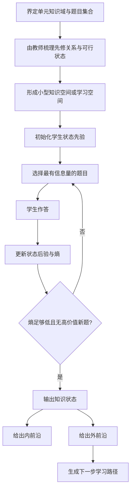
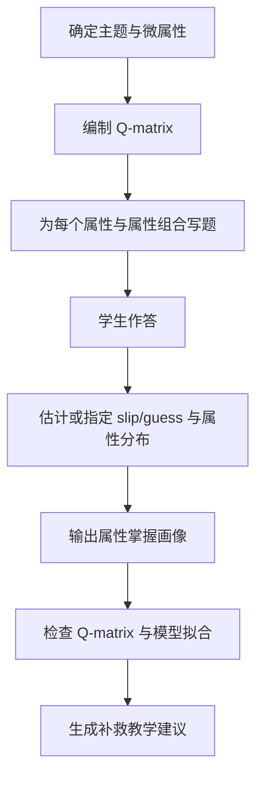
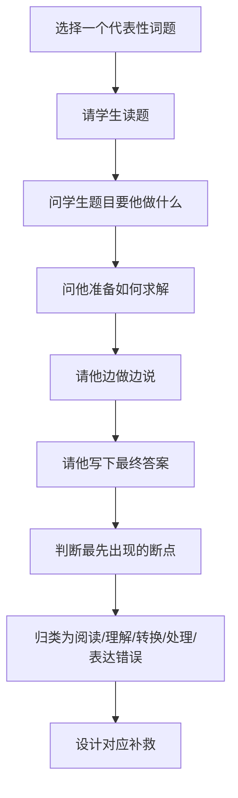
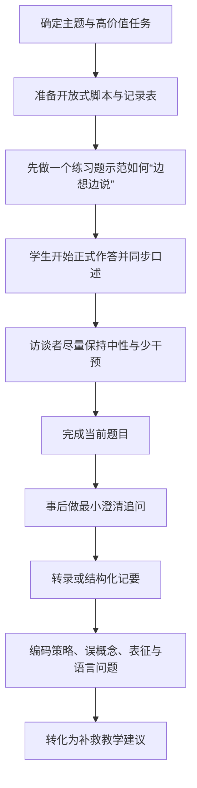

# 面向数学基础薄弱高中生的一对一个性化诊断辅导系统方法调研

## 执行摘要

在“单名高中生、数学基础薄弱、无大量历史作答记录、可做一次或多次 30–90 分钟访谈/测验”的前提下，**最适合一对一诊断、且不依赖大数据的方法**，按优先级大致是：**Newman 错误分析法**、**出声思维法**、**专家建模版的知识空间理论**，其次是**小规模/课堂级 CDM 变体**与**用专家先验初始化的 BKT**；**DKT 不适合作为起步方案**。原因很直接：前者主要依赖**高质量任务设计、访谈脚本与教师判断**，而不是大规模训练数据；后者，尤其 DKT，核心优势来自**大量交互日志训练**，在 n=1 的场景下很难稳定、可解释地工作。citeturn8view4turn25view0turn29view0turn22view1turn23view3turn17view4

如果你的目标不是“做一个像大厂平台那样的全自动预测器”，而是“为单个学生快速定位薄弱环节、理解错误成因、形成可执行的补救路径”，那么最稳妥的方案不是单押某一个模型，而是采用**分层诊断**：先用 **KST 或 CDM-lite** 做“结构定位”，回答“学生会什么、不会什么、下一步最该学什么”；再用 **Newman + think-aloud** 做“原因定位”，回答“错在读题、建模、变换、计算还是表达”；随后再用 **BKT** 做“会话间跟踪”，回答“经过练习后某项技能的掌握概率是否上升”。这类组合既保留了结构化与实时性，也保留了对个体推理过程的可解释性。citeturn15view4turn26view0turn34view0turn36view6turn22view1

从开发与实施成本看，**ALEKS 式 KST** 和 **标准 DINA/G-DINA** 的真正难点不在“算法”，而在**知识域建模**：前者要构造可信的知识空间/学习空间，后者要构造可用的 **Q-matrix**。公开文献明确指出，KST 可以首先由专家教师给出初稿，再用数据迭代；CDM 的 Q-matrix 传统上也由领域专家编制，但这一过程本身很难，而且错设会带来误导性诊断。因此，在一对一场景下，**少做“大而全”的数学全域建模，多做“单元级、主题级”的小范围高质量建模**，更现实也更可靠。citeturn25view0turn26view2

最推荐的落地顺序是：**先做 Newman + think-aloud 的深描诊断，建立错误分类与思维证据；再把证据固化成一个“小知识空间”或“小属性图”；最后用 BKT 跟踪补救后的进展。**如果后续你积累到足够多学生的数据，再考虑将 CDM 做成稳定的预校准量表；而 **DKT** 应放在最后，除非你能长期获得大量、连续、标准化的题目日志。citeturn35view2turn19view1turn25view0turn30view4turn22view3turn23view2

## 总体比较与选型基线

### 先给出结论

面向一对一数学诊断，**“无/少量历史数据即可运行”的方法**包括：**Newman 错误分析法**、**出声思维法**、**专家建模版 KST**、**以专家 Q-matrix 和小样本规则驱动的 CDM-lite/R-DINA**，以及**参数由专家先验或文献先验初始化的 BKT**。其中，Newman 与 think-aloud 几乎不需要历史数据；KST 需要的是**专家建模**而不是大规模学生日志；CDM 在“从零校准”时往往需要更大样本，但**课堂级/小规模变体**已在近年文献中出现；BKT 可以在**固定参数**前提下跟踪单个学生，但若要“从单个学生数据中学参数”，公开文献并不支持把它当作稳定做法。相比之下，DKT 的优势来自**序列深度学习**，本质上更依赖大量训练样本和标准化日志。citeturn25view0turn29view0turn22view1turn23view3turn17view4

### 比较表

下表默认的“数据需求”是指：**在没有现成预校准题库与参数的前提下**，要把方法真正用于诊断所需的开发与运行数据量；如果你未来先用多名学生做过预校准，KST、CDM、BKT 的运行数据需求都会下降。该表是基于原始论文、官方文档与工具文档的综合判断。citeturn25view0turn26view4turn22view3

| 方法 | 无/少量历史数据可运行 | 数据需求 | 实时诊断能力 | 可解释性 | 实施复杂度 | 所需专业知识 | 推荐场景 | 主要依据 |
|---|---|---:|---:|---:|---:|---:|---|---|
| 知识空间理论 KST | 是 | 低到中 | 强 | 高 | 中高 | 知识域建模、先修关系梳理 | 单元级自适应测验；定位“会什么/下一步学什么” | citeturn17view0turn16view2turn25view0turn15view4 |
| CDM / DINA | 部分可 | 中到高 | 中到强 | 高 | 高 | Q-matrix 设计、诊断测量 | 细粒度技能画像；已有题库或可做课堂级 R-DINA 时 | citeturn26view0turn27view0turn8view3turn30view4 |
| Newman 错误分析 | 是 | 极低 | 强 | 很高 | 低 | 数学访谈、错误分类 | 词题/应用题；快速找出卡点层级 | citeturn8view4turn34view0turn35view2 |
| BKT | 是 | 低到中 | 很强 | 中高 | 中 | 技能标签、概率更新 | 练习过程/多次会话中的掌握跟踪 | citeturn22view1turn22view3turn17view3 |
| DKT | 否 | 高 | 很强 | 低 | 高 | 深度学习、日志工程 | 大规模在线题库与日志预测 | citeturn23view3turn23view2turn17view4turn39view1 |
| 出声思维法 | 是 | 极低 | 中 | 很高 | 中 | 访谈、转录与编码 | 深描思维过程；验证误概念与建模假设 | citeturn18view8turn36view6turn36view3turn38search0 |

### 方法间关系

如果你要做的是**“个性化诊断辅导系统”**而不是单次人工面谈，那么这些方法最有效的关系不是互斥，而是分工。**KST/CDM** 负责给出“结构化画像”，即知识状态、属性掌握、学习前沿；**Newman/think-aloud** 负责给出“因果解释”，即学生到底是读不懂、不会表征、不会选方法、还是算错/写错；**BKT** 负责给出“时间维度”，即补救后是否真的掌握。ALEKS 的公开资料也显示，它的关键价值并不只是“分到一个分数段”，而是把学生放在其**outer fringe**，也就是“正好可以学”的学习前沿。citeturn15view4turn16view2turn26view0turn34view0turn22view1

## 知识空间理论与 ALEKS

### 核心原理

知识空间理论把某一知识域中的学生理解为处于某个**知识状态**：这个状态是“学生当前能解决的问题集合”。所有可行状态的集合构成**知识结构/知识空间**。在学习空间中，题目之间通过 **surmise relation** 体现先修依赖，因此并不是所有答题模式都被认为是“可行状态”；这使得系统可以通过少量精心选择的问题，排除大量不可能的状态。KST 的一个重要优点是：知识空间的初稿可以通过**系统访谈经验教师**获得，再用经验数据逐步修正。citeturn25view0turn25view1

ALEKS 是 KST 的大规模商业实现。其官方资料说明，ALEKS 将 Algebra 1 看作约 **350 个基本概念**构成的知识域，对应**数以百万计**的可行知识状态；尽管状态数巨大，基于该结构的自适应评估仍可用约 **25–30 题**估计学生知识状态。ALEKS 公开解释中点出了两个关键产出：一是学生“**会做什么**”，二是学生“**准备好学习什么**”；在学习空间里，这分别对应**内前沿**与**外前沿**，且二者共同决定学生的知识状态。citeturn17view0turn15view0turn15view4turn15view6

ALEKS 风格的诊断效率，来自对状态概率分布的持续更新与信息增益控制。其公开论文显示，评估会在两个条件同时满足时停止：**状态分布的熵降到足够低**，且**再没有足够有用的问题可问**。在一个算术示例中，系统用 **24 题**就在 **57,147** 个可能状态中定位到最可能的学生状态，并将后续教学放到该状态的**outer fringe** 上。citeturn16view0turn16view1turn16view2

### 典型诊断流程

以下流程图是依据 KST 基本理论与 ALEKS 公开实现逻辑整理的一对一版落地流程。citeturn25view0turn16view2turn15view4



将上述流程缩到一对一系统中，可操作版本通常是：先只建**一个主题级知识空间**，例如“线性函数图像—斜率—截距—函数值—一次方程—实际情境建模”；再用 **10–20 个代表性题型**与若干同构题构成题池；系统每次只定位这个主题内的状态与外前沿，而不是试图一次覆盖全高中数学。这样的缩域做法最符合 KST 的理论前提，也最符合一对一诊断的时间预算。这个建议是对 KST 文献关于“专家先建模、再做经验修正”的直接工程化转写。citeturn25view0turn25view3turn25view4

### 对单个学生场景的适用性评估

**优点**在于：它几乎是为“少题定位状态”而生的；它给出的不是一个粗分数，而是“当前状态 + 学习前沿”；解释性很强，尤其适合你要做的“诊断后辅导”。ALEKS 的公开说明恰恰强调了这一点：系统的目标不是对学生打一个总分，而是精准地找出“已掌握”和“准备好学”的边界。citeturn15view0turn15view4turn16view2

**局限**主要不在运行阶段，而在前期建模阶段。你必须先有一个足够可信的知识空间，或至少有较稳妥的先修关系。公开文献明确指出，知识空间可先由专家给出草图，再用数据修正；这意味着 KST **不以大数据为前提**，但非常依赖**教师/学科专家的内容分析质量**。如果先修关系设计错误，后面的“少题定位”就会建立在错误空间上。citeturn25view0turn17view0

**数据需求**方面，在一对一场景中，KST 的关键不是“很多学生历史作答”，而是：一个较小但高质量的题目集、一个经过专家梳理的知识结构、少量用于检查空间合理性的试测。**时间成本**上，前期开发偏高，但每位学生的在线诊断时长可以控制得很短。**可解释性**非常高，因为所有输出都可映射到具体概念、题型和前沿。citeturn25view0turn17view0turn16view2

**未明确**之处在于，ALEKS 的完整课程构建细节、项层面的题目选择启发式以及不同课程中的实际知识空间生成流程并未完全公开。公开资料清楚说明了**Markovian 程序、熵停止条件、内外前沿与学习模式**，但并未把所有工程规则开源。若你要验证“小知识空间是否足够稳”，最实用的小规模试验是：在一个主题上让学生做两套**同构自适应测验**，比较两次定位出的知识状态与外前沿的一致性。citeturn17view0turn16view2turn17view1

### 公开实操资料或开源实现

可直接上手的公开资料与实现，优先推荐以下几类：

- **ALEKS 官方 KST 页面**：简明解释 ALEKS 与 KST 的关系、状态空间规模、约 25–30 题的自适应评估思路。citeturn17view0  
- **《The Assessment of Knowledge, in Theory and in Practice》**：ALEKS/作者团队的官方综述，详细说明熵、停止规则、内外前沿与“24 题定位 57,147 状态”的示例。citeturn8view0turn16view2  
- **《Introduction to Knowledge Spaces》**：经典导论，明确提出知识空间可先经教师专家咨询构建，再用经验数据检验与修正。citeturn25view0  
- **R 包 `kst`**：用于生成、操作知识结构/知识空间的基础工具，附带 vignette。citeturn25view4turn25view1  
- **R 包 `DAKS`**：包含从二元数据推导 quasi-order、模拟与可视化等高级数据分析功能。citeturn24search0turn25view2  
- **R 包 `kstMatrix`**：矩阵表示版知识空间工具，包含一些通过专家询问得到的知识空间数据。citeturn25view3  
- **GitHub `milansegedinac/kst`**：社区维护的 Python 基础实现，适合做原型。citeturn17view5  

### 实施建议

如果你现在就要在一对一诊断中最小化数据需求，最好的做法不是复制 ALEKS 的“大课程”，而是先做一个**微型 ALEKS**。建议只选一个主题，如“函数概念与一次函数”或“相似三角形与比例”，把它拆成 **8–12 个微概念**，用两位数学教师独立标注先修关系，再用 12–20 道题建立小型学习空间。系统运行时只输出三件事：**当前确定会的点、当前不稳的点、下一步最可能学得会的点**。然后把**边界点**交给后续的 think-aloud 或 Newman 访谈做确认。这样既保持 KST 的高效，又避免“一步到位建全域模型”的高风险。这个建议直接呼应了 KST 文献里“专家初构—经验修正”的路线。citeturn25view0turn15view4

## 认知诊断模型与 DINA

### 核心原理

CDM 的目标不是给学生一个连续分数，而是把作答表现映射为若干**离散属性**的掌握/未掌握模式。最关键的对象是 **Q-matrix**：它规定“哪道题需要哪些属性”。NCIEA 的实践指南把 Q-matrix 定义为“项目—属性关系表”；在教育测量里，它相当于“对每道题所需技能的显式假设”。citeturn26view0

DINA 是最经典也最容易解释的 CDM 之一。它是一个**非补偿型**模型：某题若需要多个属性，则默认学生**必须全部掌握**这些属性，才有高概率答对；同时仍允许两类噪声：**guess**（不会但碰巧答对）与 **slip**（会但粗心答错）。de la Torre 2009 的 didactic 文章把 DINA 描述为一个“tractable and interpretable”的技能诊断模型，并专门讨论了用 EM/MCMC 估计参数。citeturn27view0

在数学学科中，CDM 的典型吸引力在于：它可以把“数学差”拆成更细的技能画像。公开教程给出的玩具例子是：题目 `3 + 5 × 4` 需要“会小数加法”“会乘法”“知道乘法优先级”三种属性；TIMSS 数学研究也显示，CDM 可提供比总分更直接可用的教与学信息。de la Torre 的 DINA 文章还使用了著名的**fraction subtraction** Q-matrix 作为实证示例。citeturn29view1turn18view3turn27view0

### 典型诊断流程

下图将 DINA/CDM 在一对一诊断中的最小可行流程压缩为“先属性、后题目、再分类”。citeturn26view0turn8view3turn29view0



在单个学生场景里，真正可做的通常不是“复杂参数估计”，而是更接近**CDM-lite** 的流程：先根据课程标准与专家共识定义 6–10 个属性；每个属性编 2–3 题，并设计少量组合题；对学生作答后，使用 DINA、GDINA 或课堂级变体做分类，必要时再用访谈去确认争议属性。这个流程综合了 Q-matrix 的实践定义、GDINA 的估计框架，以及课堂级 R-DINA 的现实取向。citeturn26view0turn8view3turn30view4

### 对单个学生场景的适用性评估

**优点**是显而易见的：如果属性定义得好，CDM 的反馈比“总分 58 分”有用得多。它能直接回答“学生不会的是斜率概念、一次函数表征转换、还是函数情境建模”。这种粒度尤其适合个别化补救。公开综述也一再强调，CDM 的主要价值就在于给出更有教学意义的强弱项反馈。citeturn18view3turn28search20

**限制**同样非常明确：标准参数型 CDM 对样本量与 Q-matrix 质量比较敏感。Cambridge Assessment 的综述直接指出，Q-matrix 传统上依赖专家开发，但这一过程“quite challenging”，而且错设会导致误导性结果；同一综述还指出，课堂情境下样本量要求常使传统 DCM 应用“almost impossible”，有观点甚至认为如果需要 1,000–2,000 的样本，它们就很难真正进入课堂。citeturn26view2turn26view4

但近年的小样本研究给了更现实的中间路径。关于小样本，已有模拟研究表明，一些 DCM 在很小样本下也能得到可用的分类结果；更关键的是，**R-DINA** 这类专门面向课堂/小规模诊断的变体，明确把目标设为“classroom-level assessments”，并报告其可作为**small-scale diagnostic assessments** 的合适替代方案。该文也明确指出：在如 **N < 50** 的挑战性设置里，直接用参数型 CDM 往往会出现参数偏差与分类准确率高估。对 **n=1** 的个别诊断，若没有预校准题库，我不建议把“从学生数据估参数”当成可信流程；更合理的做法是**借助专家 Q-matrix 与小规模规则分类**。这最后一句是对小样本文献的保守推论。citeturn26view5turn30view4turn30view1turn30view2

**数据需求**方面，若你有预校准项目和共享参数，CDM 的运行数据可以很少；但若“从零开发”，前期数据需求不低。**时间成本**方面，前期开发表与 Q-matrix 验证较重；单名学生施测则可以控制在 20–40 分钟。**可解释性**高，但前提是属性和 Q-matrix 真的反映了学科认知结构。citeturn26view0turn26view2turn30view4

### 公开实操资料或开源实现

就“能否公开拿来做原型”而言，CDM 是这五类方法里资源最完整的之一：

- **de la Torre 2009《DINA Model and Parameter Estimation: A Didactic》**：DINA 的经典入门文献，聚焦模型定义与参数估计。citeturn27view0  
- **GDINA 包与文档**：当前最成熟的 CDM 开源生态之一，支持 DINA、G-DINA、Q-matrix 验证、拟合诊断等。citeturn17view2turn8view3  
- **R 包 `CDM`**：提供 `din`、`gdina`、Q-matrix 修改、分类准确率、TIMSS/分数减法等示例数据。citeturn29view2turn31search13  
- **`cdmTools`**：包含 **R-DINA / R-DINO / GNPC / Q-matrix 估计与验证**，非常适合课堂级或小规模应用原型。citeturn32view0  
- **George & Robitzsch《Cognitive Diagnosis Models in R: A Didactic》**：带例子的 R 教程，面向非专家解释 CDM。citeturn29view1  
- **NCIEA《Primer on Diagnostic Classification Models》**：面向实践团队的 FAQ 式说明，适合你这种需要“系统设计视角”的项目。citeturn18view0  

### 实施建议

对你当前的一对一场景，我不建议一开始就做“标准 DINA 全参数估计系统”，而建议做一个**属性图驱动的 CDM-lite**。具体来说：先把某个主题收缩为 6–10 个属性；让两位教师先独立给出 Q-matrix，再开一次共识会议；每个属性至少设计 2 个单属性题和 1 个组合题；在 n=1 的运行阶段，不估 slip/guess，而把 CDM 当作**结构化作答解释器**。如果你希望形式上更接近测量模型，可优先考虑 **R-DINA/GNPC** 这类小规模更友好的方法。等以后累积到几十或上百名学生后，再启动数据驱动的 Q-matrix 验证与参数校准。这个策略与课堂级 CDM 文献的方向是一致的。citeturn30view4turn32view0turn26view2

## Newman 错误分析法

### 核心原理

Newman 错误分析法的核心判断是：数学词题/应用题的失败，不一定首先出在“不会算”，而可能出在更前面的环节。ACER 的实操资料把其基本框架概括为五个阶段：**阅读与解码、理解、转换、处理、表达/编码**。也就是说，学生可能卡在“读不准题”“读懂了但不知道题目要什么”“知道要什么但不会把文字转成数学操作”“会方法但算错”“算出来了但答得不对/不完整”中的任意一步。citeturn8view4turn35view2

从历史脉络看，Newman 1977 是原始来源，但公开可直接下载的稳定原文并不容易获得；Clements 的 1980 文章和后来的 White 2009 论文都清楚保留了这一路线，并说明 Newman 诊断程序在澳大利亚数学教育中长期被用来分析书面数学任务的错误。Clements 的回顾还提到某些版本会把 **careless** 单列为额外类别，但课堂中最常用、也最清晰的实操框架仍是前述五阶段。citeturn35view0turn35view1turn35view2

### 典型诊断流程

ACER 的实操模板几乎已经把 Newman 做成了标准化脚本。以下流程图就是基于 ACER 的“五个提示语”整理而来。citeturn34view0turn34view4



Newman 的典型五个提示语是：**“请把题目读给我听”“告诉我题目要你做什么”“告诉我你打算怎样找到答案”“把过程做给我看，并边做边说”“现在把答案写下来”**。这套脚本非常适合一对一，因为它把“错误定位”嵌入了一个几乎零技术门槛的结构化访谈。citeturn34view0turn34view2turn34view4

### 对单个学生场景的适用性评估

这是五类方法里**最不依赖大数据、最适合一对一快速上手**的方法之一。它几乎不需要历史作答数据，只需要题目、脚本和记录表。对白板题、代数应用题、几何文字题特别有用，因为这些题目恰恰高度依赖读题、表征转换与完整表达。ACER 也明确给出它适用于数学词题错误定位；White 的回顾则说明它在中小学生乃至较高年级学生中都被用于支持问题解决。citeturn8view4turn35view2

**优点**是：上手快、解释性极高、能直接指向教学动作。与其说它是“测量模型”，不如说它是一个强力的**诊断透镜**。**局限**是：它更擅长处理“词题/应用题链条中的断点”，不擅长给出整个知识域的结构化画像；而且如果访谈者不够中性、随意追问，分类可靠性会下降。White 2009 也指出，教师使用时应把它当成“找出误解发生在哪里”的框架，而不是机械打标签。citeturn35view2turn36view1

**数据需求**接近零。**时间成本**大约每题 5–10 分钟，非常适合作为 30–90 分钟诊断中的一个模块。**可解释性**极高。对你这种“数学基础薄弱的高中生”场景，它尤其有价值，因为基础薄弱学生常见的问题正是“读题—表征—方法选择”链条中的前置故障，而不是纯粹运算错误。后半句是基于 Newman 框架对弱基础学生的教学推论。citeturn8view4turn35view2

### 公开实操资料或开源实现

Newman 本身不是代码算法，公开资源主要是模板与教师手册：

- **ACER《Newman’s error analysis》概念单页**：最适合直接拿来做访谈脚本，五阶段与提示语写得非常清楚。citeturn8view4turn34view0  
- **Clements 1980《Analyzing children’s errors on written mathematical tasks》**：保留了 Newman 1977 的历史引用链，是理解该方法源流的重要文献。citeturn35view1turn35view0  
- **White 2009《A Revaluation of Newman’s Error Analysis》**：总结了该方法在 NSW 项目中的再应用、教师使用方式与改编问题。citeturn35view2  
- **NSW Newman’s prompts 教师材料**：ACER 的资料将其列为进一步阅读，但公开稳定链接在当前检索中未完全明确；如要采用，可先以 ACER 模板替代，再自行整理本地版表单。citeturn34view1  

### 实施建议

在一对一系统中，Newman 最好的位置不是“单独使用”，而是作为**错误原因校验器**。最小化数据需求的最佳办法是：你先准备 **6–8 道代表性高中文字题**，覆盖代数、函数、几何三类情境，并刻意控制语言负荷高低；学生做完后，不对所有题都完整访谈，而只挑**错题中最有代表性的 2–3 题**做 Newman 面谈。记录时只打一个主标签：**最早的阻塞点**。这样分类会更稳定，也更便于后续教学处方。如果学生在“转换”与“处理”边界上反复摇摆，就把该题交给 think-aloud 再做深描。citeturn34view0turn35view2

## 知识追踪方法

### 核心原理

**BKT** 的核心是：把每一项技能的掌握状态看成一个二值隐变量，并在每次作答后更新其掌握概率。标准 BKT 有四个经典参数：**初始掌握概率 P(L0)**、**学习概率 P(T)**、**猜对概率 P(G)**、**失误概率 P(S)**。公开文献把 BKT 视为特定形式的隐马尔可夫模型；其优势在于**参数少、结构清晰、能实时更新**。citeturn22view1turn22view0

**DKT** 则把知识追踪改写为**循环神经网络/ LSTM** 的序列学习问题。原始论文明确强调，DKT 的一个重要优点是：它**不需要显式编码人工领域知识**，而是从交互序列中学习学生潜在知识状态的表示；该表示由高维神经元向量承载，而不是由少数显式参数承载。citeturn23view0turn23view3

两者最本质的区别不是“谁更先进”，而是**谁在什么约束下更合适**。BKT 倾向于“**先假定技能标签与更新规则，再用数据更新概率**”；DKT 倾向于“**先给大量序列数据，再让模型自己学表示**”。后者在某些公开基准上获得更高 AUC，但这类收益建立在大规模数据、交叉验证、超参数训练与工程细节之上；而后续研究也对早期 DKT 基准中的数据处理、泄漏与过拟合问题提出了批评。citeturn23view2turn23view3turn23view4

### 典型诊断流程

考虑到你的实用目标，本节把 BKT 与 DKT 放在一个分叉流程里：同样输入“技能标签 + 作答序列”，但后续路径完全不同。citeturn22view1turn23view3

```mermaid
flowchart TD
    A[定义技能或属性标签] --> B[采集学生按时间排序的作答序列]
    B --> C{采用哪类追踪器?}
    C -- BKT --> D[设定或估计 P(L0) P(T) P(S) P(G)]
    D --> E[每次作答后更新单技能掌握概率]
    E --> F[输出下次练习与复习建议]
    C -- DKT --> G[将序列编码为 skill-response 输入]
    G --> H[训练 LSTM/RNN 预测下一题正确率]
    H --> I[输出预测概率与隐藏状态表示]
```

在单个学生系统里，BKT 的**最小可行实现**其实非常简单：只要你能把题目映射到技能，就可以对每个技能维护一个掌握概率，并在学生每次练习后按 BKT 公式更新。Yudelson 等人的公式写得很清楚：先根据“本次答对/答错”用 Bayes 规则修正 `P(L_t)`，再根据学习概率 `P(T)` 计算新的 `P(L_{t+1})`；预测下一次答对概率则由 `P(L_t)*(1-P(S)) + (1-P(L_t))*P(G)` 给出。citeturn22view2turn22view1

一个极简的 BKT 计算骨架可以写成：

```text
初始化每个技能：
  P(L0), P(T), P(G), P(S)

对每次同技能作答：
  若答对：
    posterior = P(L)*(1-P(S)) / [P(L)*(1-P(S)) + (1-P(L))*P(G)]
  若答错：
    posterior = P(L)*P(S) / [P(L)*P(S) + (1-P(L))*(1-P(G))]
  P(L) = posterior + (1-posterior)*P(T)
```

这不是对任何现成代码的复制，而是对公开公式的最小工程转写。citeturn22view2

相比之下，DKT 的**最小可行实现**虽然也有现成开源仓库，但“可运行”不等于“适合你的场景”。原始 DKT 论文使用了模拟数据、Khan Academy 数据与 ASSISTments 基准，并在训练集上学习超参数；开源实现通常也要求你准备标准化的 `user_id / skill_id / correct` 序列数据，并使用 LSTM、batch 训练、若干 epoch 和验证集。citeturn23view2turn39view0turn39view1

### 对单个学生场景的适用性评估

**BKT**：适合。它最大的现实价值在于：即使你没有大数据，也可以把它当成一个**会话间追踪器**。2023 年的纵向分析指出，BKT 仍然有用，尤其因为其**可解释性**明显高于更大的深度模型，而且即使带扩展，它要训练的参数也远少于深度学习追踪模型。对你的一对一系统，这意味着：BKT 非常适合作为“诊断之后的练习跟踪层”，而不是一开始就单独承担“全域诊断”。citeturn22view3turn22view1

**DKT**：不适合作为起步方案。原始论文本身就强调 DKT 是从数据中学习学生知识表示；其公开实验依赖较大的数据集与交叉验证，而且后续复现实验指出原始基准中存在数据处理与信息泄漏问题。pyKT 这样的工具包也明确把自己定位为**基于多种公开数据集的深度知识追踪基准工具**，而不是“单个学生、零历史数据”的诊断器。citeturn23view2turn23view3turn23view4turn17view4

**数据需求**方面，BKT 可以用专家给定的初始参数运行，但如果你想从单个学生数据中拟合四参数，公开文献并没有把这当作标准做法。DKT 则天然需要大量序列样本。**时间成本**方面，BKT 极低，DKT 高。**可解释性**方面，BKT 高于 DKT。对你当前项目来说，最合理的判断是：**BKT 可作为后续跟踪层，DKT 暂不进入首版系统。**citeturn22view1turn22view3turn23view3turn17view4

### 公开实操资料或开源实现

- **pyBKT**：Berkeley 团队维护的 Python 开源库，支持拟合、预测、数据生成与常见 tutor log 格式。citeturn17view3turn9search5  
- **《An Introduction to Bayesian Knowledge Tracing with pyBKT》**：带代码与流程的 BKT 实操文章。citeturn22view0  
- **pyKT toolkit**：深度知识追踪模型基准库，包含 DKT 及多种后续模型。citeturn17view4  
- **`lccasagrande/Deep-Knowledge-Tracing`**：较简单的 TensorFlow DKT 实现，明确要求 `user_id / skill_id / correct` 形式的数据。citeturn39view0  
- **`knowledge-tracing-collection-pytorch`**：包含 DKT、DKT+、DKVMN、SAKT 等模型，适合做对比实验而非首版个体诊断系统。citeturn39view1  

### 实施建议

你当前最推荐的做法是：**用 BKT，而不是 DKT，做第二阶段系统。**第一阶段先用 Newman/think-aloud/KST 或 CDM-lite 做“静态定位”；第二阶段在后续 2–6 次辅导中，每个微技能维护一个 BKT 概率，观察掌握是否真正上升。为了最小化数据需求，第一版可以直接把 `P(L0)` 由初诊结果给定，把 `P(T)` 设为你希望的教学步长，把 `P(G)`/`P(S)` 设为保守固定值，然后只做在线更新，不做参数学习。一旦未来积累到足够多的学生日志，再考虑更复杂的参数估计与个性化扩展。**DKT 应当等你有了机构级日志、稳定技能标签与离线评测流程后再考虑。**前一句是对 BKT 公式和其可解释性的工程化建议，后一句则与 DKT 的公开工具定位完全一致。citeturn22view2turn22view3turn17view4

## 出声思维法与数学诊断访谈

### 核心原理

出声思维法的核心不是“让学生解释自己为什么这样想”，而是更严格地要求学生在解决问题时，**把当下进入注意的想法同步说出来**。Ericsson 与 Simon 的经典理论认为，这类并行 verbal report 主要反映短时记忆中的思维内容；他们早期论文也明确指出，只有当你要求个体去 verbalize 那些原本不会被注意到的信息时，口述才更可能改变认知过程。citeturn18view8turn38search14turn38search8

这也是为什么“标准 think-aloud”强调**少解释、少诱导、少追问**。Fox 等人的元分析进一步支持了这一点：针对并行 verbalization 的研究中，其反应性效应总体上并不显著；真正容易引入偏差的是让被试做解释、描述或回溯性合理化。对数学诊断而言，这意味着：如果你想看到学生真实的建模与推理链条，应该先做**纯并行**出声，再做**事后澄清**。citeturn38search0turn38search2turn38search3

### 典型诊断流程

下图把一般 think-aloud 与数学临床访谈文献结合，整理成适合单个学生的标准流程。citeturn36view6turn36view3turn18view4



数学教育里的临床访谈文献通常把工作分成**计划、实施、解释**三阶段。以 Hunt 的实用框架为例，准备时要先确定**任务、工具和问题**；提问上应从“**How did you solve it?**”这类开放问题出发，再逐渐聚焦；实施时要准备必要的数学工具和记录方式，并允许根据儿童/学生当场的思路做有限而尊重性的跟进。Hunting 1997 也强调，访谈者的目标不是判对错，而是理解学生**怎样得到这个答案**。citeturn36view3turn36view4turn18view4turn36view1

NCEO 的 think-aloud 指南则给出了非常可直接复用的操作规范：先给练习任务，先由访谈者示范“我边解边把想到的都说出来”，再请学生照做；正式开始时告诉学生“我更关心你怎么想，而不仅是最终答案”；正式任务中尽量少打断，完成后再做必要澄清，并建议用音视频记录以便后续分析。citeturn36view6turn36view7turn20view0

### 对单个学生场景的适用性评估

在一对一诊断里，think-aloud 的价值非常高。它几乎是获取**过程证据**最直接的方法：你能看到学生如何读题、如何画图、如何选变量、如何切换表征、何时卡住、何时自我监控失败。相比只看纸面答案，它更适合定位“这名学生为什么看似会公式却做不出应用题”“为什么函数图像题老是选错变量”“为什么几何证明只会堆结论”等过程性问题。citeturn18view5turn19view1turn20view7

它也确实有成本。**优点**是：几乎不依赖历史数据、解释力极强、对模型建构也有帮助；**局限**是：时间成本较高，分析较主观，部分学生不善言说，且访谈者若提问不当会改变思维过程。Ulusoy 等人的中学几何研究发现，纯 think-aloud 有助于看到自然解题过程，而在此基础上再做 open-ended prompting，会进一步提升学生的注意与反思，从而暴露更多先前没看见的问题。对一对一系统来说，这个发现很有价值：**先纯观察，再最小追问。**citeturn19view1turn20view6turn20view7

**数据需求**方面几乎为零。**时间成本**方面，建议一场诊断只做 3–5 题深描，否则转录和编码成本会很高。**可解释性**几乎是所有方法中最高的。对于数学基础薄弱的高中生，它尤其适合验证“是否真的形成概念”“是否只是套模板”“是否存在语言或表征层面的阻塞”。后一句是对临床访谈使用价值的教学推论。citeturn18view5turn19view0turn36view1

### 公开实操资料或开源实现

- **Ericsson & Simon 经典论文/著作线索**：理论基础，解释何时 verbal report 有效、何时会有反应性。citeturn38search14turn38search1  
- **NCEO《Using Think Aloud Method To Evaluate Assessment Design》**：最可操作的程序化指南之一，含练习、少干预、录音录像、后续澄清等规范。citeturn18view8turn36view6  
- **Hunt 2015 临床访谈框架**：面向教师，强调计划—实施—解释以及开放到聚焦的问题梯度。citeturn19view0turn36view4  
- **Hunting 1997《Clinical Interview Methods in Mathematics Education Research and Practice》**：数学教育临床访谈的经典方法文章。citeturn18view4turn36view1  
- **Ulusoy & Argun 2019**：中学几何词题中比较 think-aloud 与 open-ended prompting 的研究，和你的高中数学场景最接近。citeturn19view1turn20view7  

### 实施建议

如果你的目标是提高诊断可靠性，同时不把访谈成本做爆，我建议把 think-aloud 设计成**“三题深描”**而不是“大题海”。每次诊断选 3 类任务：一题纯符号运算/变形，一题函数或几何的多表征转换，一题高语言负荷词题。正式开始前一定做**练习示范**；正式题中只用“继续说”“你现在在想什么”这类中性提醒；等学生写完后，再进入第二阶段的澄清与验证。编码时至少记录四类信息：**策略、表征、监控、语言**。若题目是词题，可直接套 Newman 五阶段作为二级编码框架。这样，你不仅得到“错因证据”，还能反过来修正你的 KST 先修关系和 CDM 属性定义。citeturn36view6turn36view4turn34view0

## 结论与优先级建议

针对你的目标——**为一名数学基础薄弱的高中生设计一对一个性化诊断辅导系统**——我给出的优先级建议如下。

**第一优先级：Newman 错误分析 + 出声思维法。**  
这是最不依赖大数据、最适合一对一的起点。它们能快速回答两个关键问题：学生**卡在哪一层**，以及学生**脑子里到底在做什么**。前者适合快速分型，后者适合深描误概念与策略。对“基础薄弱但题目做不出来”的学生，这两种方法往往比任何统计模型都更快产生可执行的教学结论。citeturn8view4turn34view0turn36view6turn38search0

**第二优先级：主题级 KST。**  
如果你要把诊断做成“系统”，而不只是访谈，KST 是最值得优先结构化实现的方法。原因是它本来就擅长**用少量题定位状态与学习前沿**，且不强依赖大数据，只强依赖专家建模。你完全可以先做一个主题级“小 ALEKS”，而不是全学科版 ALEKS。citeturn17view0turn16view2turn25view0

**第三优先级：CDM-lite 或 R-DINA/GNPC。**  
如果你特别希望系统输出“属性掌握画像”，CDM 是合适方向；但首版不宜追求“大样本参数估计”，而应走**小范围属性图 + 小规模分类**路线。近年来面向课堂级的小样本方法恰好说明了这条路的合理性。citeturn30view4turn32view0

**第四优先级：BKT。**  
它非常适合作为“诊断后的追踪层”，即在后续练习中持续更新技能掌握概率。若把它放在首版系统里，最佳角色不是“主诊断器”，而是“学习进展仪表盘”。citeturn22view1turn22view3

**最后优先级：DKT。**  
DKT 不是“不能用”，而是**不适合你当前的约束条件**。它适合大规模平台、标准化日志、长期序列和成熟的离线评测，而不适合“一名学生、没有历史日志、还需要高度可解释”的首版个性化诊断系统。citeturn23view3turn17view4turn39view1

### 推荐的首版系统架构

一个高可靠、低数据依赖的首版系统，可以这样组合：

1. **主题级结构定位**：用 KST 或 CDM-lite 在 10–20 题内定位“当前状态/属性画像”。citeturn16view2turn26view0  
2. **原因校验**：对最关键的 2–3 个错误点，做 Newman 与 think-aloud 访谈。citeturn34view0turn36view6  
3. **处方生成**：把结论转成“立刻可教”的微技能清单与外前沿任务。citeturn15view4turn18view3  
4. **会话间跟踪**：后续练习用 BKT 维护每个微技能的掌握概率。citeturn22view2turn22view3  

这实际上对应一种很实用的分工：  
**KST/CDM 负责“在哪里”**，**Newman/think-aloud 负责“为什么”**，**BKT 负责“有没有变好”**。citeturn15view4turn34view0turn22view1

### 开放问题与局限

有几处公开文献仍然**未明确**，需要你通过小规模试验来验证：

- **ALEKS 的完整工程细节未公开**：公开材料说明了 KST、Markovian 程序、熵停止与内外前沿，但没有公开每门课程的完整知识空间构建细节与全部选题启发式。验证方法：在一个主题上做 2 套同构自适应诊断，测试状态定位一致性。citeturn17view0turn16view2  
- **标准 DINA 在 n=1 场景下的参数估计不可视为已被文献充分支持**：公开研究主要讨论“小班级到上百人”而非单人。验证方法：首版不估参数，只做专家 Q-matrix 分类；积累样本后再比较 DINA、R-DINA 与 GNPC 的一致性。citeturn26view4turn30view4  
- **DKT 的最低可用训练规模没有通用结论**：公开研究通常依赖公开大数据集与批量训练。验证方法：只有在你积累到稳定日志后，再离线比较 BKT 与 DKT 的预测与教学可解释性。citeturn23view2turn17view4  

综合而言，若你的首要目标是**在无大数据条件下，为单个高中生做高可信、可解释、可直接转化为补救教学的一对一诊断**，那么最稳妥的路线是：**Newman + think-aloud 打底，KST 做结构骨架，BKT 做后续追踪；CDM 作为可选增强，DKT 暂缓。**citeturn8view4turn36view6turn25view0turn22view3turn23view3