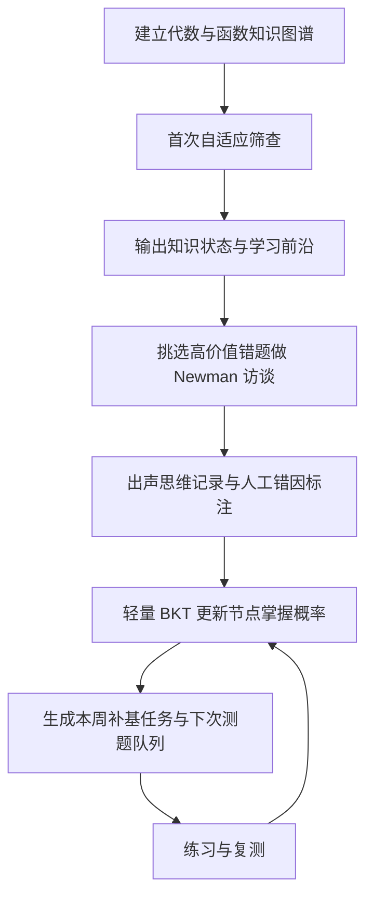

# 面向高中数学薄弱学生的个性化诊断辅导系统调研报告

## 执行摘要

对单个高中生，最稳妥的方案不是一开始上复杂大模型，而是“先修知识图谱 + 少量自适应测题 + Newman错因分析 + 出声思维访谈 + 轻量BKT更新”。CDM适合作为增强层，DKT通常不适合单学生冷启动。公开产品里，ALEKS与Math Academy最接近“少题定位前沿”，Khanmigo更像对话式追问器；国内产品普遍强调“错因分析”，但公开披露通常不足以证明其能稳定区分“粗心”与“概念性错误”。 citeturn1view0turn7view3turn14view0turn18view0turn20view0turn30view4turn34view0turn39search3turn39search1

## 诊断方法全景

### 知识空间理论与 ALEKS

知识空间理论把一个学科看作由若干题目或知识单元构成的集合，并假设学生“可能会、可能不会”的组合并非任意，而是受先修关系约束，只落在一组可行的“知识状态”中。Doignon 与 Falmagne 的学习空间理论把这些可行状态组织成闭包结构；ALEKS 的核心做法不是把学生映射到一个连续分数，而是把学生归入一个知识状态，随后给出该状态的“内边界/已掌握核心”和“外边界/学习前沿”，也就是“下一步最可能学会什么”。ALEKS 的研究资料明确说明，系统通过自适应分类，把学生定位到一个与相同内外边界对应的等价类中，再由此生成个性化学习路径。 citeturn1view0

在诊断流程上，KST/ALEKS 不是“把题做完再判分”，而是“每答一题就缩小候选知识状态集合”。ALEKS 官方公开资料强调，初始诊断使用少量开放式题目，而不是大规模固定卷；搜索结果与官方介绍显示，初始测评通常只需大约二三十题，系统便能确定教学应从哪里开始。其知识检查还会周期性重测，以判断先前“掌握”的内容是否真正稳定保留。 citeturn0search9turn0search11turn27search11turn27search19

对“一对一、单学生”场景，KST 的优势非常明显：**运行时**并不依赖大数据；真正昂贵的是**前期建模**，也就是你要把“代数与函数”拆成合理的知识节点、先修关系和能代表节点的题目。一旦图谱做得好，它特别适合少题、实时、强可解释的诊断。它的局限也很明确：若知识点拆分失真、先修边画错，系统会非常“自信地错”；此外，它擅长判断“会/不会、准备好学什么”，但并不天然解释“为什么错”，更不能直接把“粗心”与“概念误解”分开。 citeturn1view0turn27search11

公开资源方面，最重要的是 Doignon & Falmagne 的 KST/learning spaces 理论文献，以及 ALEKS 自身的 science/knowledge check 资料。产业实现基本不开源；公开的研究实现多为学术型工具而非成熟产品化代码，因此如果你做 MVP，更现实的做法是借鉴其“候选状态削减 + 学习前沿输出”的思想，自行实现一个小型知识图谱版。 citeturn1view0turn27search11

### 认知诊断模型与 DINA

CDM 的核心思想是：把“数学能力”拆成若干离散属性，例如“等式变形”“函数单调性判断”“图像—代数表征转换”等，然后用题目—属性对应矩阵 Q-matrix 描述每道题到底依赖哪些属性。DINA 是其中最经典、也最容易解释的模型之一：它是**非补偿型**模型，意味着一道题所要求的属性必须都掌握，才能“真正会做”；若学生答对但属性不全，模型把它看作“guess”；若学生属性齐全但答错，模型把它看作“slip”。 citeturn10view1turn8view0turn8view1

实际流程通常分成四步：先由学科专家定义属性；再构造初始 Q-matrix；然后施测并用模型估计题目参数与学生属性后验概率；最后把学生归入某个掌握模式，并输出属性层面的强弱项。二级数学应用论文显示，在中学数学中，研究者通常先由领域专家构造 Q-matrix，再结合拟合指标与 Q-matrix 验证程序修正，随后输出属性流行率、潜在类别和个体技能画像。R 的 GDINA 与 CDM 包已提供完整流程，包括模型估计、Q-matrix 验证、GUI 和示例数据。 citeturn11view2turn10view1turn9view0turn9view1turn9view2turn9view3

对单个学生场景，CDM 的关键判断不是“能不能给一个学生出结果”，而是“参数从哪里来”。如果你手上已有外部校准过的题库与 Q-matrix，CDM 可以作为很强的个体诊断引擎；但如果你希望仅靠这一个学生的数据，同时估计题目参数和学生属性，那通常并不稳。样本量研究表明，参数恢复与分类精度会随着样本量和题长上升而明显改善；很多情形下，少于 200 的样本表现较差，500 以上才开始更稳，约 1000 时对若干特定 CDM 的参数恢复才较可靠。也有研究指出，极小样本下 DINA 仍可勉强做分类，但那更像“应急可用”而不是“理想做法”。因此，对你的系统，更现实的定位是：**CDM 适合作为离线增强层，不适合作为单学生冷启动的唯一核心。** citeturn7view3turn10view0turn7view4

它对“粗心/概念性错误”的区分也多半是**隐式**的，而不是显式标签。DINA 的 slip/guess 确实能在统计上容纳“本该会却错了”“不会却蒙对了”，这与“粗心/侥幸”有一定对应，但模型本身并不会告诉你这一次一定是粗心，还是表层会做但不稳，也不会像访谈那样直接揭示误解内容。它更像“属性缺口雷达”，不是“错因访谈器”。 citeturn8view0turn8view1turn10view1

### Newman 错误分析法

Newman 错误分析法的价值在于，它不试图先做概率建模，而是直接追问学生在解题流水线的哪个环节断掉了。其经典五类错误分别是：阅读/解码、理解、转化、加工/过程技能、表达/编码。后来很多数学教育研究沿用这个框架来分析应用题、代数题、几何题中的错误来源。 citeturn14view0turn14view1turn14view2

操作上非常朴素：给学生一题出错的题，然后用固定提示语追问。“请把题读给我听”“这题要你做什么”“你准备用什么方法”“边做边说”“现在把答案写出来”。ACER 的教师资源把这五个访谈提示和五类错误一一对应，并提供了各类错误的典型表现与干预策略。到高中代数层面，研究者也用 Newman 框架分析如“配方法解二次方程”等任务中的错误，并发现常见问题集中在理解、转化和过程执行，而这些错误往往暴露出前置概念没有真正建立。 citeturn14view1turn14view2

对一对一诊断，它几乎是“性价比最高”的方法之一：不需要大数据，不需要复杂算法，能直接落到教学语言上。尤其对基础薄弱学生，Newman 的优势是可以把“不会做数学”拆回更早的环节，例如其实不是“方程不会”，而是“没读懂条件”“没把自然语言转成式子”“会列式但运算失手”。它的局限也很清楚：它最适合文字题、应用题和程序化题，对纯概念证明、开放探究题要做改写；另外，它本身是分类框架，不是动态学生模型。 citeturn14view0turn14view1turn14view2

在“粗心 vs 概念性错误”上，Newman 非常适合作为人工判别器：如果学生在复述题意、解释变量关系、选择运算时就出问题，多半是概念性；如果前四步都顺而最后抄错、漏负号、单位漏写，则更接近“编码/执行失误”。但为了避免把真正的概念脆弱误判成粗心，最好配合同构题复测或出声思维。 citeturn14view1turn14view2

### 贝叶斯知识追踪与深度知识追踪

BKT 的经典形式是一个两状态隐马尔可夫模型：某个技能要么“未掌握”，要么“已掌握”；系统用四个参数跟踪该技能状态，分别是初始掌握概率、学习转移概率、guess 和 slip。其最大优点是可以在**每一次作答后实时更新**某个技能的掌握概率，而且参数含义直观。公开分析文献给出了标准更新形式，并指出 BKT 在智能导师系统中长期被用来决定学生何时达到 mastery。 citeturn18view0turn18view1turn21view0

如果你要做“最小可行实现”，BKT 的门槛很低：先把每个题目映射到一个或少数几个技能；每次学生答对时，用  
\(P(L|Correct)=\frac{P(L)(1-S)}{P(L)(1-S)+(1-P(L))G}\)，  
答错时用对应的 Bayes 更新；再应用学习转移 \(P(L_{next})=P(L|obs)+(1-P(L|obs))T\)。这足够支撑一个单学生系统的在线更新。公开实现里，pyBKT 已提供 Python 版本的拟合、预测、交叉验证与多种 BKT 变体；其论文和 GitHub 文档也强调了库的可用性与开放许可。 citeturn18view0turn16view2turn16view3

DKT 则把输入序列交给 RNN/LSTM 之类的网络，自动学习学生状态与题目间关系。原始 DKT 论文强调，它不需要显式编码专家知识，也能在大规模日志上学到复杂表征；论文使用了 Khan Academy 的 140 万次练习、47,495 名学生数据，以及 ASSISTments 公共数据，表现优于当时基线模型。作者也明确承认，其缺点是需要大量训练数据，因此更适合在线教育平台，而不适合小班或小样本场景。后续研究进一步指出，增强型 BKT 在加入 recency、个体差异等后，表现可与 DKT 接近，同时保留更高可解释性。 citeturn19view4turn20view0turn16view1turn21view0turn22search1turn22search3

因此，对你的场景，结论非常明确：**BKT 适合做单学生在线知识状态更新；DKT 不适合作为 MVP 或冷启动主模型。** 如果后续你积累了成百上千学生、长时序交互日志，DKT 才有讨论空间。至于“粗心/概念性错误”，BKT 的 slip 可以作为“疑似粗心或不稳定掌握”的统计代理，但它仍然需要过程证据来落地解释；DKT 的隐藏状态更黑箱，更不适合做这一类教师可用的错因解释。 citeturn18view0turn21view0turn20view0

### 出声思维法

出声思维法的经典原则，是让学生在做题的同时，把进入工作记忆的想法尽量原样说出来，而不是事后解释“我为什么这么想”。Ericsson 与 Simon 的框架，以及 van Someren 等人的实践指南，都强调并发 verbalization 比事后回忆更能减少记忆扭曲；但若研究者不断追问“为什么”，就会改变原始思维过程。 citeturn24view3turn25view1turn25view2turn25view3

适合数学诊断访谈的操作规范，大体是这样的：先给极简指令，例如“请一边做题一边把脑子里想到的都说出来”；随后安排 5–15 分钟热身，让学生先练习说；正式任务中，访谈者尽量不插手，只在学生长时间沉默时用最中性的提示语，例如“继续说”；全程音频或视频录制，之后做逐字转写，并最好由独立编码者按既定框架标注。实践指南特别提醒：指令不要太长；热身很重要；录音要核对；转写时宁可标“听不清”，也不要擅自美化。 citeturn25view0turn25view3turn24view3

它对一对一数学诊断极其重要，因为它是少数能真正帮助你分清“粗心”和“概念错”的手段：一个学生若一直在正确表征、正确选法、正确运算，只在最后抄漏号，那才接近粗心；若他从一开始就把函数单调性与图像左右方向混淆，哪怕最后偶然做对，也仍是概念性问题。Johnstone 等人的数学 think-aloud 研究同时提醒，这个方法在两种情况下会掉线：题太难时，学生往往说不出有用思路；以及对某些认知或语言表达显著受限的学生，think-aloud 产生的信息很有限。 citeturn24view1turn26search1turn24view3

公开实操资料方面，最值得直接拿来用的是 Ericsson & Simon 的 verbal reports 理论、van Someren 的《The Think Aloud Method》、以及 ACER/Johnstone 一类给教师准备的访谈流程范本。它们大都不是“开源代码”，但却是最适合诊断系统落地的“开源方法论”。 citeturn23search6turn24view3turn24view1

## 产品调研

### 松鼠 AI

松鼠 AI 的公开产品材料长期强调“纳米级/超纳米级知识点拆分”“精准化测评”“个性化学习路径”“错题原因分析”。其 App Store 文案写得很直白：把知识点拆成最基础颗粒，针对每个颗粒配置视频讲解、专项练习和专题测试；系统会采集答题、迟疑、鼠标移动和键盘输入等过程数据，输出个性化路径，并提供错题原因分析。人民网案例材料则把它概括为“错因重构知识地图”，并提到其方法组合包括图论、贝叶斯网络等。也就是说，公开口径里，松鼠 AI 的诊断机制明显偏向“细粒度知识图谱 + 行为数据 + 错因分析”。 citeturn38search10turn37search10

从“双减后现状”看，公开可核实信息显示它并未消失：一方面，国家网信办备案公告与相关报道表明，松鼠 AI 的教育大模型已完成生成式人工智能服务备案；另一方面，2025 年财经报道也显示其关联方存在减资、债务重整等经营压力。这说明它在政策后时代仍在运行和迭代，但业务与资本结构承压，是“仍然活着、但并不轻松”的状态。 citeturn38search0turn38search3turn38search4

就“真实效果”而言，公开可见的第三方严格实证并不充足。官方与媒体材料一致强调强个性化与提效，但我在本轮检索里没有找到像 ALEKS 或学术期刊那样易于核验的、面向基础薄弱群体的公开长期对照研究。因而更稳妥的判断是：它的**机制设计**对补基础很友好，因为知识颗粒细、路径可回溯；但它的**外部效果证据**更多来自宣传、案例与应用商店介绍，而非高透明度研究。 citeturn38search10turn37search10turn38search4

至于“粗心 vs 概念性错误”，松鼠 AI 的公开话术里有“错因分析”“追根溯源”“思维漏洞”这类表述，但我没有找到足够公开的技术文档来证明它以稳定、可复核的分类法区分“粗心失误”和“概念误解”。因此，较保守的结论是：**公开上它宣称做错因分析，但公开透明度不足以验证错因分类法。** 公开可用材料主要是产品页、应用商店说明、案例报道与政策备案信息；本轮未完成可核验专利号的逐项核对。 citeturn38search10turn37search10turn38search3

### ALEKS

ALEKS 是把 KST 工业化最彻底的代表产品。官方资料强调，它基于 Knowledge Space Theory，通过少量开放式题目，快速判断学生“已经会什么、准备学什么”，然后从“精确的起点”开始教学。其知识检查会周期性回头验证保留情况，避免把短时做对误认为真正掌握。作为产品机制，它非常接近你要做的“单学生少题定位知识漏洞”目标。 citeturn1view0turn0search9turn0search11turn27search19turn27search11

用户评价显示，它在“补漏洞、个性化节奏、基础技能提升”上得到不少正面反馈。Capterra 与 TrustRadius 的评论提到，它能针对学生薄弱处出不同题、帮助学生以自己的节奏补齐基础，并且让某些学生在一学期内完成更多发展性课程内容。与此同时，负面反馈也很一致：知识检查偏长、报告对学生不够友好、解题方式有限、容易让学生产生“被反复审核”的挫败感。更值得注意的是，McGraw-Hill 自己的培训材料就专门写过“如何和学生谈 knowledge checks”，其中明确承认一些学生会把知识检查视作障碍并感到挫败。 citeturn28view0turn28view2turn28view1turn27search8

对于基础薄弱学生，ALEKS 的长处是**先修修复非常强**；短处是**情绪体验管理很重要**。如果学生原本就自信不足，而系统又频繁要求“重新证明你会”，就可能把有效诊断体验成“不断被否定”。它也并未在公开方法上明确区分“粗心”与“概念性错误”；更准确地说，它通过反复知识检查和知识状态更新来检验所谓“掌握”是否稳定，而不是给出教师熟悉的错因标签。 citeturn27search11turn27search8turn28view2

### Khanmigo

Khanmigo 的定位并不是传统测评引擎，而是“苏格拉底式对话型 AI 导师”。Khan Academy 官方反复强调，Khanmigo 不直接给答案，而是通过分层提示和追问，引导学生自己说出第一步、关键条件和下一步想法。示例文章直接写到，它面对一道数学题时会先问“你觉得题里最重要的第一条信息是什么”。这类设计不是为了给出稳定的知识状态分类，而是为了在卡住时推动学生自我解释。 citeturn30view0turn30view1turn31search1turn31search8turn31search11

近年的官方公开实验表明，Khan Academy 正在把它从“泛聊天机器人”往“依托学习历史的嵌入式导师”推进。2026 年的产品学习总结显示，当 Khanmigo 能访问学生最近作题历史、技能水平和先修进度时，下一题正确率可提升 6.1%；同时，官方也公开承认真实使用并不均匀，平均工作日有 26.9 万次交互，但有权限的学生里只有约 15% 真正使用。另一篇官方文章进一步说明，它会根据学生是“初学某技能”还是“复习某技能”调整帮助方式，并在需要时提示先修回顾。 citeturn30view3turn30view4

从效果与评价看，Common Sense Media 给它四星，认为它在教育目的、透明性和安全性方面表现较好；但 Time 对 Khan Academy 首席学习官的采访也点出了关键短板：并不是所有学生都善于向 AI 求助，很多学生在聊天记录中只是不断说“idk”。这对你关心的“数学基础薄弱学生”很重要——Khanmigo 的机制假设学生至少能参与对话式求助；如果学生既不会做题，也不会描述自己卡在哪里，那么纯苏格拉底式追问可能卡住。 citeturn30view5turn32news19turn30view4

在“粗心 vs 概念性错误”上，Khanmigo 的优势是**它可以追问学生的推理过程**，因此天然比静态题库更有希望区分二者；但截至目前的公开资料更像产品实验总结，而不是严谨公开的错因分类体系。换句话说，它更像“诊断访谈助理”，而不是“心理测量模型”。 citeturn31search9turn30view3turn30view4

### Math Academy

Math Academy 的公开技术说明非常接近“知识图谱版的少题诊断 + 编排器”。官方页面写得很具体：学生进入课程先做一个大约 30–45 分钟的自适应诊断；诊断不仅看是否会做，还看**mastery 与 automaticity**；系统要找的是学生的 knowledge frontier，也会同时识别较低年级的基础空洞。更重要的是，它公开披露了核心诊断逻辑：压缩知识图谱、选择信息量最大的主题发问、用正反证据更新知识画像、在证据边缘时允许“conditionally completed”，一旦学生后续挣扎便沿学习路径“fall backwards”。这比多数产品页透明得多。 citeturn34view0turn34view1turn34view2

它的课程编排机制则建立在知识图谱、学生画像和 FIRe 式分布复习之上。官方说明指出，学生模型把答题历史叠加在知识图谱上，形成 knowledge profile；任务选择算法据此决定“学什么、复习什么、何时复习最划算”；而 FIRe 试图把高层主题练习对低层先修技能的“隐性复习”一并计入。公开主页与课程页也强调：每门课程覆盖数百主题，诊断会把缺失先修和已会内容一起纳入，生成个性化顺序。 citeturn34view0turn34view3turn34view4turn35search6

从公开评价看，支持者往往高度赞赏它的节奏控制、概念级追踪和高密度练习；但较平衡的独立评论也指出，如果把它单独当成全部数学教育，可能会更偏向程序性熟练与高效训练，而不是最丰富的概念讨论与审美体验。这类评论属于非学术、但有价值的用户侧证据，因此只能作为“使用体验线索”，不能替代严格研究。对基础薄弱学生而言，我认为它的机制上是友好的，因为它允许“一边补地基一边往前走”；但其高掌握阈值可能一次暴露大量旧漏洞，若没有教练式陪伴，也可能打击自我效能。 citeturn34view1turn36search9turn36search15

在“粗心/概念性错误”上，Math Academy 目前公开得最接近“可操作分辨”的，不是错因标签，而是**把速度/自动化程度也视作掌握证据**。其技术页明确写到：如果学生答对但耗时过长，证据权重会下降；若只是勉强够边界，后续一挣扎就回退。这比只看对错更接近“区分偶然做对、脆弱会做、真正稳固掌握”，但它仍不是直接输出“粗心”或“概念错”的分类器。 citeturn34view0turn34view1

### 猿辅导、作业帮与豆包 AI 辅导

这三类产品在“是否做跨会话学生知识状态建模”上的公开透明度并不一样。猿辅导方面，集团官方页只给出宏观描述；但 2025 年新华网关于“小猿 AI”的报道写得更具体：其底层包含学习内容数据和**动态学情数据**，并声称可基于文本、语音、视频、图像交互来评估学生的知识掌握能力、学习习惯、学习偏好和学习能力。这说明猿辅导系至少在公开口径上，已经不只是做单次问答，而是在尝试更持久的学生画像与跨会话学情建模。 citeturn39search0turn39search3

作业帮的公开材料则更偏“功能营销页”：App Store 文案强调 AI 智能答疑、深度解析解题思路、智能追问薄弱点、推荐关联知识点，以及“学—练—测”闭环；媒体报道还提到其拥有百亿级学情数据。由此可以合理推测，它确实具备持续个性化推荐的基础设施；但我没有在本轮公开检索材料里找到像 Math Academy 技术页或 Khan Academy 博客那样，清楚说明其如何维护一个跨会话、细粒度、可解释的学生知识状态模型。更稳妥的说法是：**作业帮公开展示的是持续个性化能力，而不是透明的知识状态建模方法。** citeturn39search1turn39search7

豆包则最不像“教育测量产品”。官方主页把它定义为通用 AI 助手，并没有像教育平台那样公开展示课程级知识图谱、知识掌握仪表板或长期学情报告。因此，如果问题是“是否有跨会话的学生知识状态建模公开披露”，目前公开证据最弱的是豆包。它当然可以做辅导、追问和例题讲解，但我没有找到足够公开的材料证明它在教育场景中维护了一个稳定、细粒度、跨会话的学生知识状态模型。 citeturn39search2

至于“粗心 vs 概念性错误”，猿辅导公开说法里已有“快速锁定学生错因和思考漏洞”；作业帮公开说法是“智能追问薄弱点、推荐关联知识点”；豆包公开站点没有呈现一套教育专用错因方法论。三者共同的问题是：**面向市场的公开资料都比技术方法公开得多，错因分类法与专利线索并不透明。** 因此，如果你要借鉴它们，更应借鉴“交互形态”和“产品闭环”，而不是假定其已公开了可直接复用的诊断算法。 citeturn39search3turn39search1turn39search2

## 方法与产品对比

### 方法对比表

| 方法 | 数据需求 | 实时性 | 可解释性 | 对单学生适用性 | 是否区分粗心/概念性错误 | 开源/实操资料 | 依据 |
|---|---|---:|---:|---:|---|---|---|
| KST / ALEKS 思路 | 运行时低；前期需要专家建图 | 高 | 高 | 高 | 弱，主要给知识状态与学习前沿 | 学术文献丰富，产业实现不开源 | citeturn1view0turn0search9turn0search11 |
| CDM / DINA | 若要自行校准，通常需中到大样本；若题库已校准则可低 | 中 | 高 | 中，依赖外部校准 | 中，靠 slip/guess 作隐式代理 | GDINA、CDM 包成熟 | citeturn7view3turn10view1turn9view0turn9view2 |
| Newman 错误分析 | 极低 | 中 | 很高 | 很高 | 高，尤其适合人工区分 | 教师访谈脚本公开 | citeturn14view0turn14view1turn14view2 |
| BKT | 低到中；单学生可在线累计 | 很高 | 高 | 高 | 中，slip 可作“疑似粗心”代理 | pyBKT 开源 | citeturn18view0turn16view2turn16view3 |
| DKT | 高，通常需要大量序列日志 | 高 | 低 | 低 | 低，黑箱 | 有开源代码但不适合冷启动 | citeturn19view4turn20view0turn15search1 |
| 出声思维 | 极低 | 低到中 | 很高 | 很高 | 很高 | 方法指南成熟 | citeturn25view0turn25view3turn24view1 |

从你的任务目标看，**最不依赖大数据、最适合一对一场景**的是 Newman 错误分析、出声思维访谈、KST 风格的小型知识图谱自适应测题，以及后端用 BKT 做在线更新。CDM 最适合做“第二阶段增强”；DKT 则应暂时排除在 MVP 之外。 citeturn1view0turn14view0turn18view0turn20view0

### 产品对比表

| 产品 | 诊断/定位机制 | 实时性 | 可解释性 | 对基础薄弱学生友好度 | 是否明确区分粗心/概念性错误 | 公开方法/专利透明度 | 依据 |
|---|---|---:|---:|---:|---|---|---|
| 松鼠 AI | 微颗粒知识点、精准测评、个性化路径、错因分析 | 高 | 中 | 中到高 | 公开号未见清晰公开分类法 | 方法宣传多，技术透明度一般 | citeturn38search10turn37search10turn38search4 |
| ALEKS | KST 知识状态定位、knowledge checks | 高 | 高 | 中到高 | 未公开按“粗心/概念”分类 | 官方文档成熟 | citeturn1view0turn27search11turn28view2 |
| Khanmigo | 苏格拉底式追问 + 学习历史增强 | 高 | 中 | 中，依赖学生会求助 | 通过对话可追问，但无固定公开分类法 | 官方实验透明度较高 | citeturn30view3turn30view4turn31search1turn32news19 |
| Math Academy | 知识图谱 + 诊断前沿 + automaticity + 编排 | 高 | 高 | 高，但可能一次暴露大量旧洞 | 未显式分类；靠时间与后续表现修正 | 官方技术说明很透明 | citeturn34view0turn34view1turn34view2 |
| 猿辅导系小猿 AI | 动态学情数据、多模态评估、错因/思考漏洞 | 高 | 中 | 中 | 公开提“错因”，未见细分类法 | 公开口径强于技术细节 | citeturn39search3turn39search0 |
| 作业帮 | 追问薄弱点、关联知识推荐、学练测闭环 | 高 | 中 | 中到高 | 公开提“薄弱点”，未见严格分类法 | 功能公开，建模方法不透明 | citeturn39search1turn39search7 |
| 豆包 AI | 通用对话/拍照辅导 | 高 | 低到中 | 中，取决于提示质量 | 未见公开教育专用分类法 | 教育测量透明度最低 | citeturn39search2 |

这张表背后的结论很简单：如果你想借鉴“**少题迅速定位知识漏洞**”，首选是 ALEKS 与 Math Academy 的公开机制；如果你想借鉴“**追问学生思路**”，首选是 Khanmigo；如果你想借鉴“**国内家校产品如何做错因反馈**”，松鼠 AI、猿辅导、作业帮值得看，但仍需自己补上公开透明的分类与验证框架。 citeturn1view0turn30view4turn34view0turn39search3turn39search1

## 面向单个高中生的可执行方案

### 诊断流程设计

对“代数与函数为主”的中国高中生，我建议你把系统做成“三层证据、两个节奏”。

第一层是**小型知识图谱诊断层**。不要一开始就追求“纳米级”几千节点，而是先做 40–80 个节点的可维护图谱，覆盖：实数与代数式、方程与不等式、函数概念与表示、一次/二次函数、幂指对基础、图像—解析式转换、函数性质与应用。每个节点准备 2–4 道高鉴别度题，其中至少 1 道是可解释的开放/半开放题。首次筛查建议 12–18 题，时长 25–35 分钟；若边界不清，再补 6–10 道确认题。这样总题量通常仍可控制在 18–28 题，接近 ALEKS/Math Academy 一类“少题定位前沿”的设计精神。 citeturn1view0turn0search9turn34view0turn34view1

第二层是**错因判别层**。不要在系统里把所有错题都自动标成“粗心”。我建议采用一个保守规则：只有当某技能已有足够正证据，例如近三次同类题稳定正确、BKT 掌握概率较高，而且学生在同构复测或口头解释里能说出正确思路，但本次只是漏号、抄错、单位遗漏，才标“疑似粗心”；否则默认归入“需诊断”，再通过 Newman 框架标成阅读、理解、转化、加工、编码，或“概念误解/方法误用”。这会比直接二分“粗心/不会”更可靠。这个规则本质上把 BKT 的 slip 思想、Newman 的流程分类、think-aloud 的过程证据合并起来。 citeturn18view0turn14view1turn25view0

第三层是**访谈校准层**。每次完整诊断不要超过 3–4 道访谈题。优先挑这三类：一类是知识前沿附近“差一点就会”的题；一类是高价值先修题；一类是系统最难判断“粗心还是概念错”的题。访谈时使用极少提示词，先让学生读题、复述、选法、边做边说；只有沉默时才说“继续说”。若学生在某个节点连续犯同类转化错误，你就不必再追加很多题，因为访谈证据往往已经比十道选择题更强。 citeturn14view1turn25view0turn24view3

学生模型的更新节奏则分为两个。**快节奏**是每题后更新：用轻量 BKT 按技能更新掌握概率，并记录最近一次证据、耗时、是否提示后完成。**慢节奏**是每周或每个单元后更新：根据一周的新证据，重算知识前沿，把“条件性掌握”的节点转为稳定掌握或回退到补基路径。若未来积累到足够多学生和题目，再考虑把 CDM 作为离线分析层，用于校验节点定义和 Q-matrix 设计，而不是替换在线引擎。 citeturn18view0turn34view0turn10view1

### 最小可行系统清单

下面这套 MVP，目标不是“像大厂一样全自动”，而是“一个月内做出能真正服务一个学生的诊断闭环”。

**功能清单**建议只保留六块。第一块是知识图谱编辑器，至少能维护节点、先修边、节点说明。第二块是题库与标签系统，每道题至少标：主节点、次节点、题型、预期耗时、是否适合访谈。第三块是自适应筛查器，先用基于先修图的启发式信息增益就够，不必追求完整 KST 推理器。第四块是学生证据日志，存对错、耗时、提示次数、访谈摘要、错误标签。第五块是轻量学生模型，在线用 BKT；第六块是教师/家长可读报告，必须能同时显示“知识前沿、先修漏洞、错因模式、下周任务”。这些功能已经覆盖了 ALEKS 式定位、Newman 式错因、BKT 式更新三大主轴。 citeturn1view0turn14view1turn16view2

**技术栈**上，最省心的组合是：后端用 Python + FastAPI；数据库用 PostgreSQL 即可，若你特别想可视化先修图，再加一个轻量图数据库，但 MVP 不强制；前端用 React/Next.js；在线追踪模型可直接调用 pyBKT 或自己实现标准更新公式；访谈录音与文本可先人工整理，不建议一开始就上复杂自动转写纠错链路。若你未来确实积累到多学生样本，再用 R 的 GDINA 做离线分析，帮助你修正属性定义与题目映射。 citeturn16view2turn16view3turn9view0turn9view1

**时间与人力**上，我的保守估计是：一个熟悉 Web 的全栈工程师、半个数学教研、再加半个一线诊断老师，4–6 周就能做出能服务首个学生的版本。真正耗时的不是代码，而是前 40–80 个节点的拆分质量、题目标签一致性，以及错因标注规范。也正因为如此，我不建议你先做“大而全”的知识点体系，而是从“线性函数—二次函数—方程不等式”三大簇起步，先把一个窄域做深。这个建议与 KST/CDM/BKT 文献给出的共同启发一致：**好结构永远比大数据更先决定诊断质量。** citeturn1view0turn10view1turn18view0

## 参考来源与开放问题

### 参考来源

以下按主题列出本报告主要依据；点击各引文即可访问原始链接或官方页面。

**教育测量与认知方法**  
- ALEKS Corporation, *The Science Behind ALEKS*，介绍 KST、知识状态、内外边界与自适应分类。 citeturn1view0  
- ALEKS 官方资料与介绍页，关于少量开放式初始测评与精确起点。 citeturn0search9turn0search11  
- de la Torre, *Cognitive Diagnosis Models*；以及 Cambridge Assessment 关于 CDM 的实务综述。 citeturn10view1turn10view0  
- Sen & Cohen, *Sample Size Requirements for Applying Diagnostic Classification Models*。 citeturn7view3  
- Ma & de la Torre, GDINA 包网站、CRAN 页面与 GUI 文档。 citeturn9view0turn9view1turn9view3  
- Alexander Robitzsch 等，CDM 包文档。 citeturn9view2  
- White, *Numeracy, Literacy and Newman's Error Analysis*；ACER 的 Newman 教师资源；Grade 11 数学应用研究。 citeturn14view0turn14view1turn14view2  
- Corbett & Anderson, *Knowledge tracing: Modeling the acquisition of procedural knowledge*；van de Sande, *Properties of the Bayesian Knowledge Tracing Model*。 citeturn17search0turn18view0  
- pyBKT GitHub 与 EDM 2021 论文。 citeturn16view2turn16view3  
- Piech et al., *Deep Knowledge Tracing*；Khajah et al., *How Deep is Knowledge Tracing?*。 citeturn16view1turn22search1turn22search3  
- Ericsson & Simon 系列 verbal reports 文献；van Someren 等 *The Think Aloud Method*；Johnstone 等数学 think-aloud 指南。 citeturn23search6turn24view3turn24view1

**产品与官方页面**  
- 松鼠 AI App Store 页面；人民网案例；国家网信办备案信息及相关报道。 citeturn38search10turn37search10turn38search0turn38search3  
- 关于松鼠 AI 2025 年经营与重整压力的财经报道。 citeturn38search4  
- ALEKS 官网、Knowledge Checks 说明、McGraw-Hill 培训页与用户评论平台。 citeturn27search19turn27search11turn27search8turn28view0turn28view2turn28view1  
- Khanmigo 官方站、官方博客关于 tutoring experiments、Common Sense Media 评测与 Time 采访摘要。 citeturn30view0turn30view1turn30view3turn30view4turn30view5turn32news19  
- Math Academy 官方技术页、FAQ、How it works 与课程页。 citeturn34view0turn34view1turn34view2turn34view3turn34view4  
- 关于 Math Academy 的独立体验评论。 citeturn36search9turn36search15  
- 猿辅导官方页与新华网关于“小猿 AI”的报道。 citeturn39search0turn39search3  
- 作业帮 App Store 页与媒体关于其学情数据的报道。 citeturn39search1turn39search7  
- 豆包官网。 citeturn39search2

### 开放问题与限制

本报告对“哪些方法适合单学生”这一核心问题已经可以给出高置信结论，但有三点仍需保留。其一，针对松鼠 AI、猿辅导、作业帮、豆包的**专利号级别**核验，本轮未完成逐项验证，因此报告只使用了高置信的公开页面、媒体与应用商店说明，不虚构专利号。其二，若你未来要把 CDM 作为核心引擎，就必须单独投入一轮 Q-matrix 设计与题库校准，而不是直接照搬论文名词。其三，所有产品的“粗心/概念性错误区分”在公开层面都远不如其营销表述透明；就实际可用性而言，最可靠的做法依然是把**统计模型**与**访谈证据**结合，而不是指望某个黑箱产品自动给出可信错因。 citeturn7view3turn10view1turn38search10turn39search3turn39search1turn39search2