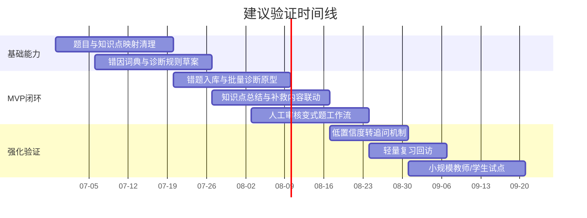
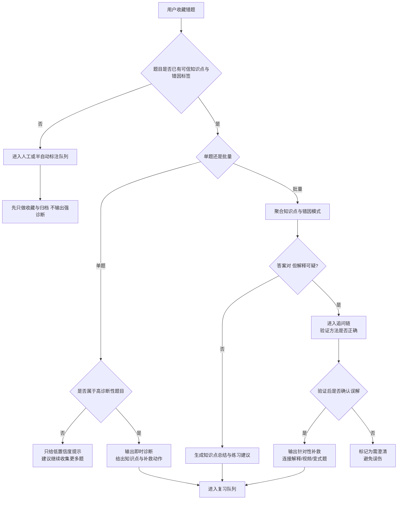

# Nana 数学错题诊断闭环工单深度研究报告

## 执行摘要

附件并不是传统意义上的设备维修工单，而是一份**产品研究型工单**：它要求围绕名为 **Nana** 的教育产品做外部调研，核心设想是让学生先在题库中浏览并保存题目，随后系统对其进行诊断，再输出知识点总结与相似题练习；同时，附件要求重点考察八类能力，包括即时诊断、批量诊断、知识点关联、方法族地图、类 Newman 诊断、视频推荐、相似题生成和复习机制。附件中**没有提供**设备编号、序列号、固件版本、错误码、运行日志、截图、照片或故障时间戳，因此这些字段均应视为“未说明”。 fileciteturn0file0

基于对官方产品页、官方研究页、发布说明与原始论文的交叉核验，我的核心判断是：**这个方向有机会做成，但不适合一开始就把“保存即诊断 + 知识图谱 + 方法族地图 + 视频切片 + 自动变式题 + 复习排程”一次性打包上线**。公开可验证的成熟案例显示，真正有效的系统通常先把三件事做扎实：一是**高质量题目/错因/知识点标注**，二是**把“答案对错”与“方法是否正确”分开判断**，三是**把诊断结果连接到一个简单、明确、低摩擦的补救动作**，例如提示、解释、下一题或短练习。Eedi、ASSISTments、Khanmigo、ALEKS/Knowledge Space Theory 与 Anki/FSRS 的公开材料几乎都指向这个结论。 citeturn9view0turn9view1turn9view2turn21view0turn21view1turn8view2turn18view0turn26view0turn27view0turn13academia0

如果只做一个最小可行版本，我建议 Nana 的 MVP 应该是：**错题入库 → 轻量诊断 → 知识点总结 → 一跳补救内容 → 少量人工审核变式题 → 轻量复习回访**。其中，“单题即时诊断”只应在题目本身已经有高质量错因标签时启用；其余场景优先采用“低置信度即时反馈 + 高置信度批量诊断”的混合模式。这样更符合 Eedi 的“诊断题驱动”路线、ASSISTments 的“即时反馈 + 报表 + 再测再学”路线，以及近期关于“正确答案陷阱”与“逐步验证学生推理”的研究结论。 citeturn9view0turn9view1turn8view2turn21view0turn34view1turn35academia2

## 工单提取事实

附件明确描述的对象是 **Nana**，定位为一个与数学学习相关的产品/浏览器应用。工单要求输出中文研究报告，重点不是排查某个具体设备故障，而是评估一个“错题收集—诊断—补救—复习”的产品闭环是否可行，并结合市场与研究案例提出 MVP 设计建议。 fileciteturn0file0

下表按你要求的“工单抽取字段”拆解；凡附件未给出的内容，均标注为“未说明”。

| 字段 | 提取结果 | 备注 |
|---|---|---|
| 工单类型 | 产品研究工单 | 不是传统售后/维修故障单。 fileciteturn0file0 |
| 问题描述 | 围绕 Nana 设计一个“浏览题库→收藏题目→后续诊断→知识点总结→相似题练习”的学习闭环，并调研八个相关方向 | 附件核心诉求。 fileciteturn0file0 |
| 项目/产品名称 | Nana | 已指定。 fileciteturn0file0 |
| 平台形态 | 浏览器应用 | 附件提及。 fileciteturn0file0 |
| 时间戳 | 未说明 | 无创建时间、无故障发生时间、无处理时间。 fileciteturn0file0 |
| 设备/装备 ID | 未说明 | 附件未涉及硬件资产。 fileciteturn0file0 |
| 序列号 | 未说明 | 附件未涉及。 fileciteturn0file0 |
| 固件版本 | 未说明 | 附件未涉及。 fileciteturn0file0 |
| 软件版本 | 未说明 | 附件未给 Nana 的版本号。 fileciteturn0file0 |
| 错误代码 | 未说明 | 附件不存在具体报错。 fileciteturn0file0 |
| 日志 | 未说明 | 附件无系统日志、控制台日志、服务器日志。 fileciteturn0file0 |
| 截图 | 未说明 | 未附截图。 fileciteturn0file0 |
| 照片 | 未说明 | 未附照片。 fileciteturn0file0 |
| 指定人员 | 未说明 | 附件未点名业务 owner、工程负责人或维护人员。 fileciteturn0file0 |
| 期望产出 | 外部案例、结构化分析、MVP 反思与建议，报告需用中文 | 已指定。 fileciteturn0file0 |

由此可见，这份附件更像是**“诊断型学习产品立项说明”**，而不是“某设备异常待修”的运维单。因此，传统的“固件/报错码/备件”类字段并非遗漏于研究过程，而是**源文件本身没有提供**。 fileciteturn0file0

## 时间线

附件**没有提供任何绝对时间戳**。唯一可以抽出的“时间线”是一个**用户学习流程时间线**：学生先浏览题库并收藏题目，之后系统再介入做诊断，诊断后输出知识点总结和相似题练习。这说明附件关注的不是“实时设备故障处置时间线”，而是“学习行为闭环时间线”。 fileciteturn0file0

从外部证据看，如果 Nana 想把这个流程做成稳定产品，最合理的实施顺序不是先做最炫的生成式能力，而是先补齐题目标注、错因词典、知识点映射和低风险补救链路；这与 Eedi 对“诊断题—误解识别—干预”的强调、ASSISTments 对“即时反馈—数据报告—再测再学”的路线、以及 Anki/FSRS 对“先记忆建模、后优化排程”的演化逻辑是一致的。 citeturn9view0turn9view1turn9view2turn21view0turn21view1turn26view0turn27view0

下面的时间图不是附件原始时间线，而是**基于公开案例推导出的建议验证节奏**。

如果必须从附件原意中提炼一句时间线判断，那就是：**“先收题，再诊断；先总结，再练习”**。真正需要补充的是：系统何时应该给出结论、何时应该保持保守、何时应该延迟到批量分析。这个分流点，正是成败关键。 fileciteturn0file0turn34view1turn35academia2

## 官方案例与外部证据

公开可验证的成熟产品大多并不追求“一次解决所有学习问题”，而是在各自最强的教学环节上做深做透。Eedi 强于**误解诊断与下一步干预**；ASSISTments 强于**即时反馈、教师数据与再评估**；Khanmigo 强于**不直接给答案、把引导与内容库耦合**；ALEKS/Knowledge Space Theory 强于**知识状态评估与可学路径选择**；Anki/FSRS 与 SuperMemo 强于**复习排程**；而近两年的研究更清楚地指出：如果系统看重“最后答案”胜过“解题方法”，就会掉进“正确答案陷阱”，从而强化而不是纠正误解。 citeturn9view0turn9view1turn9view2turn21view0turn21view1turn18view0turn13academia0turn26view0turn27view1turn34view1turn35academia2

下表按附件提出的八个方向，把“已有先例”“证据强度”和“对 Nana 的直接启示”并排比较。

| 工单方向 | 可验证先例 | 外部证据 | 对 Nana 的直接启示 |
|---|---|---|---|
| 收藏后即时诊断 | Eedi Diagnostic Questions / DQR；ASSISTments 即时反馈 | Eedi 可在课堂中依据诊断题与错误选项即时给出“常见误解”分解；ASSISTments 可自动评分并给学生即时反馈与提示。 citeturn9view0turn21view0 | **能做，但前提是题目本身要具备高质量错因设计**。没有错因标签的普通题，单题即时诊断不应过度自信。 |
| 收藏一批题后再诊断 | ALEKS / Knowledge Space Theory；Eedi predictive models | Knowledge Space Theory 的目标本来就是在少量问题下高效估计知识状态；Eedi 官方也强调答案会驱动预测模型，从而给出更深层、可行动的判断。 citeturn13academia0turn9view1 | **批量诊断比单题诊断更稳**，应作为 Nana 的主干能力。 |
| 关联知识点 | ALEKS；Eedi knowledge graphs；Khan 内容库 | ALEKS 建立于 Knowledge Space Theory；Eedi 官方明确写到其学习设计团队会构建 knowledge graphs；Khanmigo 与 Khan Academy 内容库绑定。 citeturn13academia0turn34view0turn18view0 | **知识点图谱是必要底座**，且比“方法族图谱”更成熟。 |
| 关联方法族/策略图 | 公开产品先例较弱 | 当前公开材料中，Eedi、ASSISTments、Khanmigo、ALEKS 都强调整体技能、误解、先修关系与下一步动作，但**没有哪一个把“方法族地图”作为成熟、公开、学生可见的核心界面**。这是基于上述官方产品公开材料做出的推断。 citeturn9view0turn9view1turn21view0turn18view0turn13academia0 | **不建议在 MVP 把方法族地图做成重前台能力**；更适合作为内部标签层。 |
| 类 Newman 逐步诊断 | 正在形成的“推理错误分步验证”路线 | “正确答案陷阱”论文指出仅凭答案会漏掉隐藏误解，并提出 detect-verify-escalate；“Stepwise Verification” 论文表明先找出学生推理中首个出错步骤，再生成补救反馈，效果更稳。 citeturn34view1turn35academia2 | **“Newman-lite” 可以做，但表现形式应是追问链，而不是先做完整理论框架 UI**。 |
| 推荐相关视频 | Khanmigo + Khan 内容库 | Khanmigo 官方明确强调其与 Khan Academy 内容库绑定，并且对学生采取“引导自己找到答案”的风格。 citeturn18view0 | **知识点到视频的链接是可行的**；但“方法节点到精确视频片段”的粒度，初期更适合人工策展。 |
| 生成相似题 | 人机协作式出题；基于错因的干扰项生成 | 2024 年研究表明，LLM 生成题干可以帮老师提效，但对“真正抓住学生误区的干扰项/变式”仍有限；DiVERT 通过显式建模错误语义，能比通用 LLM 更好地产出高质量数学干扰项。 citeturn35academia3turn35academia0 | **相似题生成应走“模型起草 + 人工审核”路线**。 |
| 复习机制 | ASSISTments ARRS；Anki FSRS；SuperMemo | ASSISTments 的 ARRS 专门用于“再评估 + 再学习”；Anki 自 23.10 起支持 FSRS；FSRS 明确以 DSR 记忆状态建模，并能在相同保持率下减少复习量；SuperMemo 的最新公开算法继续沿着个性化记忆建模方向演进。 citeturn8view2turn26view0turn27view0turn27view1 | **复习机制是成熟能力，适合在诊断与补救闭环稳定后接入。** |

从这些案例里，最重要的不是“别人有某个功能”，而是**别人把什么能力放在底层、什么能力放在表层**。公开材料反复显示：底层应该先做**题目质量、误解标签、知识状态估计、反馈安全边界**；表层才是地图、推荐、生成与排程。若顺序倒过来，学生会感觉系统很聪明，但老师会很快发现它“不够准”。 citeturn9view2turn21view0turn34view1turn35academia1turn35academia2

## 可能根因与诊断步骤

由于附件本身是一份产品研究工单，这里的“根因”不应理解为硬件故障根因，而应理解为：**为什么附件设想的闭环在产品化时容易失败，或者为什么它会在教学上失真**。 fileciteturn0file0

最可能的根因排序如下。

| 可能根因 | 可能性 | 依据 | 应如何确认 | 确认信号 |
|---|---|---|---|---|
| 题目缺少高质量错因标签与知识点映射 | 很高 | Eedi 的诊断能力建立在“诊断题 + 误解识别”之上；ASSISTments 的有效反馈也依赖题目级提示与解释；Knowledge Space Theory 同样依赖结构化知识状态建模。 citeturn9view0turn9view1turn21view0turn13academia0 | 抽样 200–500 题，统计“有明确知识点”“有错因标签”“有补救内容链接”的覆盖率 | 覆盖率低于约 70% 时，诊断稳定性会明显不足 |
| 系统把“答案正确”误当成“理解正确” | 很高 | “正确答案陷阱”明确表明，学生可能在错误推理下得到正确答案；该论文中的自动检测在真实低基率情境下会产生大量误报，因此建议 detect-verify-escalate，而不是直接下判断。 citeturn34view1 | 对正确答案样本追加“简短思路说明”，人工复核其方法是否正确 | 若大量“答案对但方法错/说不清”，说明现有设计会高估学生掌握 |
| 方法族地图定义过早、语义不稳 | 中高 | 公开成熟产品的可见层多呈现知识点、技能、误解与下一步动作，而非学生可见的方法族地图；这说明“方法”在产品中往往更适合做内部标签而非首屏主结构。此为基于官方材料的归纳推断。 citeturn9view0turn9view1turn21view0turn18view0turn13academia0 | 让 5–10 名一线老师独立给同一批题打“方法标签”，测一致性 | 若教师间一致性偏低，说明暂不适合前台化 |
| 视频、题目、知识点、方法之间的内容元数据债务过大 | 中高 | Khanmigo 的优势来自与内容库绑定；ASSISTments 的优势来自题目、提示、报表一体化；这都说明“内容互链”比“单点智能”更关键。 citeturn18view0turn21view0turn21view1 | 检查每道题是否能一跳进入解释/补救/视频/变式题 | 若大量题目无法闭环跳转，用户体验会断裂 |
| 自动生成题目或反馈的教学有效性不足 | 中等 | 2024 年研究显示，通用 LLM 对数学题干生成有帮助，但若没有人类参与，很难持续产出真正捕捉学生误区的高质量干扰项与反馈；另有研究强调要同时优化正确性与教学对齐。 citeturn35academia3turn35academia0turn35academia1 | 让教师双盲评审自动生成题/反馈，打“数学正确性”“贴合误区”“可教学性” | 如果教师一致性较差或低分过多，应先保留人工审核 |

这些根因的共同特征是：它们都不是“模型不够大”造成的，而是**教学结构、内容结构和置信度控制没有先搭起来**。近期研究已经很明确地提示：即便模型可以在某些场景下侦测隐藏误解，它在真实低基率场景里仍会带来大量误报，因此高风险场景应采用“先发现疑点，再追问验证，再决定是否升级处理”的路线。 citeturn34view1turn35academia2

下面给出一个更适合作为 Nana 故障排查/诊断分流逻辑的流程图。这里的“故障”，指的是**用户学习闭环为什么不能稳健地产生可信诊断**。

这条流程最关键的设计原则有两个。第一，**没有高质量标签，就不要强行给高置信度诊断**。第二，**遇到“答案对但解释可疑”的场景时，系统应该先追问，而不是直接肯定学生**。这正是近期“正确答案陷阱”研究提出的 detect-verify-escalate 思路。 citeturn34view1

## 修复建议、资源、时间与成本

短期修复建议应围绕“让闭环先成立”展开，而不是“让系统看起来无所不能”。因此，我建议 Nana 的短期版本把目标收敛到四个动作：**收题、诊断、补救、回访**。在这个阶段，知识点图谱可以做前台展示；方法族图谱只做内部标签。即时诊断只在“高诊断性题目”上开放；其余题目采用轻提示，等待批量诊断。相似题不追求全自动，优先采用“模型起草 + 数学编辑审核”。视频推荐先做“知识点到视频”的映射，不强行做“方法节点到精确片段”的自动跳转。这样的路线最接近 Eedi、ASSISTments、Khanmigo 和近期数学反馈生成研究的交集。 citeturn9view0turn9view1turn21view0turn21view1turn18view0turn35academia0turn35academia1turn35academia3

长期修复建议则是把系统从“能给建议”升级到“能解释为什么给这个建议”。这要求方法标签逐步稳定下来，并经过教师一致性验证；还要求系统在诊断时记录依据，例如：哪几道题、哪个错因模式、哪个追问回答、为什么判断为某类误解。Eedi 的研究与产品公开材料都显示，真正有教学价值的不是只看对错，而是理解学生**为什么卡住**，并把这种理解连接到可执行的下一步。 citeturn9view2turn34view0

下表把“短期修复—长期修复—所需部件/工具—时间/成本”并排列出。这里的时间是**研究估算**，而不是附件中已给出的排期；成本方面，由于附件没有给出地区、人力单价、外包方式或预算口径，因此金额只能标注为“未说明”。 fileciteturn0file0

| 方向 | 短期修复 | 长期修复 | 所需部件/工具 | 时间估算 | 成本范围 |
|---|---|---|---|---|---|
| 诊断能力 | 先做“题目 → 知识点/错因 → 补救动作”三元映射 | 逐步加入批量诊断、置信度校准与追问链 | 题目标注后台、错因词典、知识点树、质量抽检流程 | 3–6 周 | 未说明 |
| 即时/批量分流 | 单题只在高诊断性题上启用；普通题延后到批量分析 | 加入基于历史表现的个体化诊断权重 | 规则引擎、聚合分析模块、学生状态存储 | 2–4 周 | 未说明 |
| 方法族能力 | 先做内部标签，不做重型前台地图 | 教师共建方法库，通过一致性检验后再前台化 | 教师标注协议、方法 taxonomy、审稿机制 | 4–8 周 | 未说明 |
| 视频推荐 | 先做“知识点→视频/讲解页”的人工策展 | 再做“方法节点→视频片段”的更细元数据 | 内容 CMS、视频元数据、人工策展台 | 2–6 周 | 未说明 |
| 相似题生成 | 模型草拟、人工审核后上线 | 再逐步扩大自动化比例，并建立退回机制 | 题目生成服务、数学编辑审核台、版本管理 | 4–8 周 | 未说明 |
| 复习机制 | 先做固定回访节奏 | 后接入类似 ARRS/FSRS 的自适应排程 | 复习调度器、回访报表、表现回流 | 2–4 周 | 未说明 |

如果一定要进一步压缩成一个最小开发包，我建议把资源集中在下面这套“最少但闭环完整”的工具栈上：**题目标注后台、错因词典、知识点树、学生错题仓、批量诊断聚合器、补救内容映射表、人工审核变式题工具、轻量复习调度器**。这个组合已经足够支持附件所描述的核心产品体验，而不会过早被方法地图和高风险生成式能力拖慢。 fileciteturn0file0turn21view0turn21view1turn8view2turn26view0

## 风险影响与后续责任

对 Nana 来说，最大的风险不是“少做了一个复杂功能”，而是**过早给出一个看起来很确定、实际上不可靠的教学判断**。在学习产品里，这类错误的伤害比一般推荐系统更大：它不仅会让用户失望，还可能把学生的错误方法误当成正确理解，从而越学越偏。近期关于隐藏误解与推理验证的研究已经明确提醒了这一点。 citeturn34view1turn35academia2

| 风险 | 影响 | 严重度 | 缓解方式 |
|---|---|---|---|
| 把“答案对”误判为“理解对” | 直接强化错误方法 | 高 | 正确答案场景下引入追问链，不以最终答案直接判定理解。 citeturn34view1 |
| 错因标签质量不稳 | 诊断建议前后矛盾，教师失去信任 | 高 | 先做高频题高质量标注，再扩大覆盖。 citeturn9view0turn21view0 |
| 方法族地图前台化过早 | 学生困惑，教师标注不一致 | 中高 | 方法先做内部标签层，等一致性成熟再前台展示。 citeturn9view0turn21view0turn18view0 |
| 自动生成变式题不教学对齐 | 题目表面相似，误区却不对位 | 中高 | 模型起草、教师审核，重点检查“是否命中该错因”。 citeturn35academia0turn35academia3 |
| 反馈文本数学正确但教学无效 | 学生被“说服”却没有真正纠错 | 中高 | 采用明确的评价 rubric，同时评估正确性与教学对齐。 citeturn35academia1 |
| 复习机制接入过早 | 前端看似完整，底层诊断却不准 | 中等 | 先稳定诊断与补救，再上自适应复习。 citeturn8view2turn26view0 |

就职责划分而言，后续最合理的责任归属应当是：

| 角色 | 主要责任 | 交付物 |
|---|---|---|
| 产品负责人 | 收敛 MVP 范围，定义“何时立即诊断、何时延迟诊断” | 诊断分流规则、成功指标 |
| 数学内容负责人 | 建立知识点树、错因词典、补救内容映射 | 标注规范、样例库、审核标准 |
| 数据/算法负责人 | 设计聚合诊断、置信度校准、追问链逻辑 | 诊断模型、置信度阈值、评估报表 |
| 工程负责人 | 打通错题仓、题目标注后台、补救跳转与复习队列 | 可运行原型、事件埋点、后台工具 |
| 教研/教师顾问 | 验证标签一致性与教学可用性 | 一致性评审、课堂反馈、修订意见 |
| QA/评测 | 关注“正确答案陷阱”、误报、漏报与内容跳转断裂 | 测试用例、红线场景、回归清单 |

综合以上证据，我的最终结论是：

**最可行的首版路径**不是“把所有智能层都前置”，而是**批量诊断优先、单题诊断限高质量题、知识点图谱优先、方法族图谱后置、生成式题目先做人机协作、复习机制在闭环稳定后接入**。这条路径既最符合附件原始意图，也最符合当前公开可验证的成熟产品与研究证据。 fileciteturn0file0turn9view0turn9view1turn21view0turn18view0turn34view1turn35academia0turn35academia1turn35academia2turn35academia3turn26view0