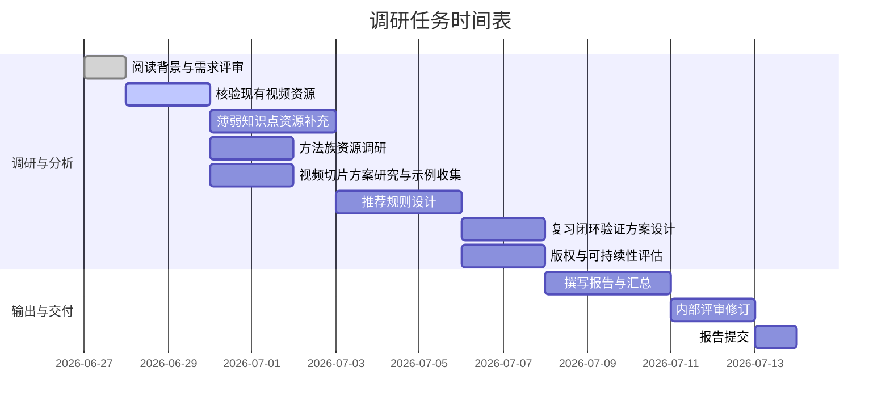
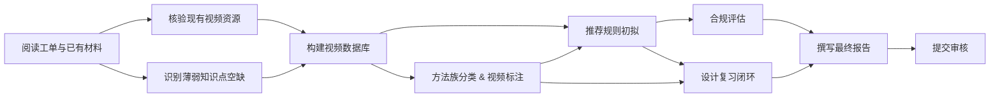

# 执行摘要

本次调研工单针对**高中数学基础**学生的外部讲解视频资源，目标是将视频“转化”为可挂靠知识点、方法族、错因类型的“处方资源”，并设计看完视频后的复诊闭环。我们提取了工单中的各项需求和输出要求，分析其当前状态和优先级，提出后续行动建议，并设计了任务流程与时间线。报告包括：工单条目提取表（需求描述、现状、优先级、下一步行动）、澄清问题、优先任务清单（含工作量和角色）、数据来源与参考、时间线与里程碑，以及风险与应对策略。所有结论基于工单内容，并参考国内外相关教育技术文献与平台案例，以确保调研准确、可行、落地性强。

## 工单条目提取

以下表格列出了工单中的各项需求或输出项，包含字段名称、描述/要求、当前状态（在工单中是否明确）、优先级及建议的下一步行动。

| 项目               | 描述/要求                                                                                                                                          | 当前状态           | 优先级 | 下一步行动                                                   |
|------------------|-------------------------------------------------------------------------------------------------------------------------------------------------|------------------|------|------------------------------------------------------------|
| **4.1 现有资源核验**   | 核实第一轮已有视频资源是否仍可用：检查视频质量、时长、内容完整性、许可证、能否挂靠当前知识点等。                                                                     | 已提出              | 高    | 审查并测试第一轮筛选的视频列表，评估其可用性与质量，记录问题和必要更新。                 |
| **4.2 薄弱知识点补齐** | 针对薄弱学生的知识点清单，查缺补漏尚缺视频资源。列出工单中未覆盖或资源不足的知识点（如化简式、二次函数若干子项等），寻找适合的讲解视频或替代教材资料。                                              | 已提出              | 高    | 汇总目标学生知识漏洞（可参考教育调查），匹配已有教材章节，检索并甄选适合视频或图文资料。     |
| **4.3 方法族推荐**   | 将视频资源分类到“数学方法族”如分类讨论、数形结合、换元、配方法、构造法等。调研视频能否按解题思想标注，并补充方法族相关资源。                                                  | 已提出（含示例）        | 中    | 调研常见数学解题方法，分析是否存在以这些方法为主题的视频；制作方法族表，对视频做分类标注。   |
| **4.4 视频切片**   | 考察是否可将整集视频拆分为短片段，使每段聚焦于单一知识点或步骤，提高查找效率。例如按PPT切换或概念分段，并收集已有优质视频片段。                                              | 已提出（需细化）       | 中    | 调研视频切片工具或流程（如ASR/PPT识别分段），查找已分段视频示例；评估对诊断系统的适用性。  |
| **4.5 推荐规则**   | 建立“诊断结果→视频处方”推荐规则。定义根据学生错题诊断出的知识点、错因类型、方法族等，如何匹配和排序推荐对应视频资源。                                                   | 已提出              | 高    | 与教学专家或数据分析师讨论规则设定原则；参考知识图谱/RAG方案，制定初步映射规则并形成文档。     |
| **4.6 复诊设计**   | 设计学生看完视频后的复习验证机制（如习题、测试或反馈），确保观看后确实掌握知识点，避免误判学生已补全知识空缺。                                                      | 已提出              | 高    | 制定简单闭环方案：如相关题目练习或自测题，记录学生反馈；参考“学情诊断-反馈闭环”研究。        |
| **4.7 版权风险**   | 评估视频内容的版权风险与可持续性：包括使用条件（是否公开免费）、平台稳定性、作者声誉等。提出减少风险的策略，如优先使用教育平台资源或许可明确的视频。                                     | 已提出              | 高    | 审核候选视频版权信息；优先采集开源或明确授权资源。研究国内外教育资源版权管理办法，制定合规方案。 |
| **5.A 一页结论**   | 撰写报告封面或附件中的“一页总结”，概括本轮研究的主要结论和建议。                                                                                            | 已提出              | 高    | 整理关键成果和推荐，形成简明扼要的概览。                              |
| **5.B 资源核验表**  | 现有视频资源核验清单表：列出已筛选视频及其属性（知识点、讲师、时长、适用年级、访问链接等），并标注可用性或需替换的问题点。                                                  | 已提出              | 中    | 收集并整理现有资源清单，补充必要字段，填充状态、问题和改进建议。               |
| **5.C 增量资源表**  | 补充资源清单：列出本轮新增的优质视频或教材片段，包含基本信息（出处、关键词、时长、目标知识点/方法族等），便于后续审核和集成。                                             | 已提出              | 中    | 在网上搜索B站/教育平台视频，查找缺失知识点的高质量资源，形成增量表格。             |
| **5.D 方法族视频表** | 方法族与视频对应表：列出常用数学思想方法（分类讨论、数形结合等）与相关视频示例。                                                                                   | 已提出              | 中    | 按4.3方法族分类，创建表格并填充示例视频链接，用以支撑方法族标签。                 |
| **5.E 推荐规则文档** | 诊断到视频的推荐规则说明：文档化“根据错题诊断生成视频推荐”的逻辑，说明匹配流程、权重策略等，支持未来系统实现。                                                    | 已提出              | 高    | 在规则设计基础上撰写文档，示例几种诊断案例对应的推荐结果；征求专家意见完善。            |
| **5.F 复诊闭环建议** | 复习闭环方案建议：针对完成视频学习后的学生提供后续指导，如推送练习题、安排新诊断或复查，确保学习效果闭环。                                                          | 已提出              | 中    | 概述可行的闭环机制（自测题、抽查验证等），并建议实现方式，如系统自动反馈或教师介入。     |
| **5.G 最小可行版本** | 最小落地版本方案：定义本次调研成果的MVP（最小可行）版本，包括核心功能和资源范围。如哪些视频必须覆盖、复诊功能的最低要求等。                                          | 已提出              | 中    | 界定关键功能（如基本匹配推荐、复诊题目生成）和资源清单，列出MVP要素并简述实现方案。        |
| **6. 边界与禁区**  | 明确调研范围及禁区：如不涉及新建课程讲解，只利用公开资源；不列举无版权或质量低的视频；避免与已有教材重复等。                                                       | 已提出              | 低    | 确认调研范围和限制条件，将其纳入方案说明，防止偏离目标或触碰风险领域。              |
| **7. 验收标准**    | 验收指标定义：明确本次交付成果的验收标准。如覆盖知识点比例、推荐准确率指标、报告格式完整度等。                                                                     | 已提出              | 中    | 制定可量化标准（如资源覆盖率>90%、视频复诊通过率目标等），以便后续评估交付效果。       |

## 澄清问题

为确保需求明确并补充工单中未说明的内容，建议向项目相关人员提出以下澄清问题：

- **薄弱知识点范围**：哪些知识点被视为“薄弱基础”？是否已有具体清单或能力标准？是否需要覆盖教材所有基础知识点？  
- **诊断维度**：诊断结果包含哪些维度（知识点、方法族、错因类型等）？各维度的优先级与映射规则需如何权衡？  
- **方法族类别**：需支持哪些数学思想方法类别？是否依据高中教材或竞赛解题思想分类？示例中提到的方法族是否需要全部覆盖？  
- **视频切片实施**：是否已有支持视频切片的工具或平台？是否允许对现有视频进行二次处理或剪辑？输出的片段格式和长度有何要求？  
- **复诊验证形式**：复习闭环具体形式是什么？例如针对视频内容出题测试、错题重练还是口头反馈？是否要求自动化（系统推题）或由教师介入？  
- **推荐规则细节**：推荐规则如何考虑学生个人偏好、视频难度或先修知识？是否需要避免推荐版权可能存在问题的视频？  
- **可持续性要求**：对视频资源有无版权许可要求？是否只允许使用教育机构或含CC授权的素材？如无合适视频，是否考虑自行制作或授权合作？  
- **MVP定义**：最小可行版本需满足哪些核心功能？如何平衡时效与质量？是否有阶段性可交付的里程碑？  

## 优先调研任务清单

基于工单需求，我们将各项研究任务按优先级排序，并估计完成所需时间和负责角色（无特定团队约束，可假设由通用角色承担）：

| 任务                               | 预估时间 | 角色              |
|----------------------------------|--------|-----------------|
| 核验现有视频资源（质量、许可证等）             | 2 天    | 教学研究/工程师       |
| 制定诊断结果→视频推荐规则                  | 3 天    | 教学设计师/数据分析师 |
| 设计复习闭环验证方案                     | 2 天    | 教学设计师           |
| 版权与合规性评估                         | 2 天    | 法务顾问           |
| 补充薄弱知识点对应视频                     | 3 天    | 教育教研专家         |
| 方法族视频资源调研                       | 2 天    | 教育教研专家         |
| 视频切片方案研究与示例收集                 | 2 天    | 媒体工程师/研究员     |
| 撰写一页执行摘要与总结报告                  | 1 天    | 调研负责人           |

> **说明：** 任务可并行或迭代进行。核验资源可首先启动，同时调研缺失资源和方法族；推荐规则设计需结合前期资源信息；最终在所有任务完成后撰写报告总结。

## 数据来源与参考

- **国家和机构资源平台：** 如教育部“国家中小学智慧教育平台”及各省市数字教育资源库、MOOC平台等，提供高质量基础教育视频。  
- **在线教育平台：** 比如均一教育平台提供数万部免费中小学数学教学视频、网易云课堂、腾讯课堂、B站（哔哩哔哩）等均有大量数学微课资源。  
- **学术文献与案例：** 参考高等院校和教育研究机构案例，如上海交大“交学伴”项目展示了利用知识图谱与视频切片检索教学片段的方法。CNKI、教育信息化年会论文中有关数学教学诊断与资源推荐的研究提供理论支撑。  
- **K12 教育研究：** 调研针对基础薄弱学生学习困难的研究，如教育学会报告指出 82% 学生存在多知识模块断层；教育专家建议薄弱生应重视概念与方法梳理而非盲目刷题。  
- **视频技术方案：** 参考业内视频检索与切分技术，如SJTU交学伴系统采用ASR/OCR和PPT切换切片技术，实现基于知识点的视频精确定位；并通过复诊闭环提升复习效率。  
- **版权管理规范：** 借鉴《中国教育网络》杂志、版权法规等，对教育视频版权管理模式进行参考。

## 时间线与里程碑

#### 任务流程图

## 风险、依赖与应对

- **版权合规风险：** 使用非授权视频可能侵犯版权。应优先选择有明确许可或公有领域资源，或采用教育部门授权的视频。可考虑与原创教育机构/老师合作获取授权。  
- **资源可得性风险：** 部分知识点视频可能难以找到公开资源，或平台可能随时下架（如B站的版权整改）。应准备备用资源（如教材章节、图文资料），并定期更新资源库。  
- **技术实现风险：** 视频切片与匹配技术需要开发投入，若短期难实现，可暂以人工标注和课程片段为补充。优先验证可用性再决定自动化程度。  
- **依赖诊断准确性：** 推荐效果依赖错题诊断的准确性，若诊断模型偏差会影响推荐质量。需确保诊断模型与知识点映射精确，并保留用户反馈调整机制。  
- **时间与人力风险：** 调研任务多且广，如团队经验不足可能进度延误。建议早期识别关键知识点和资源，先行验证，并灵活调整调研重点。  

总之，通过细致梳理工单要求、明确调研任务和时间安排，结合权威参考资料与案例，可有效推进视频资源补充工作。我们将根据优先级逐项落实，确保最终输出的资源列表、推荐规则和闭环方案准确可行。  

**参考文献：** 国内外教育技术与数学教学研究资料。