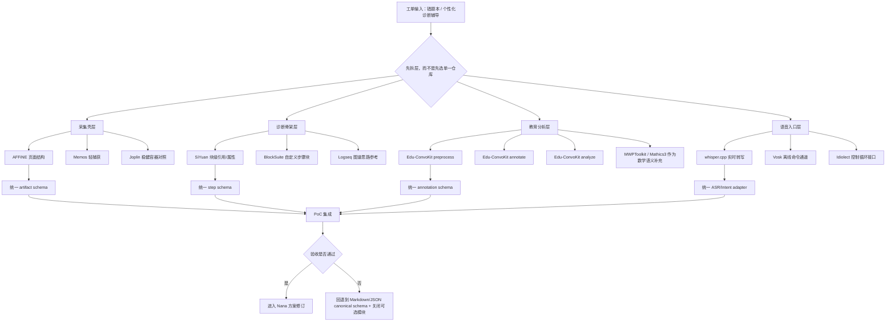
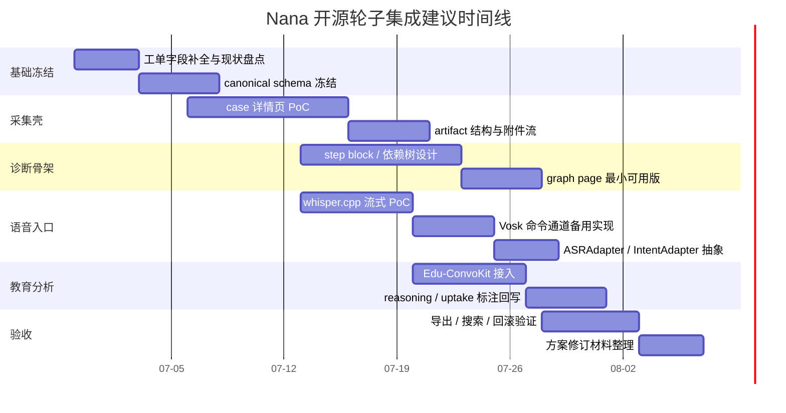

# 开源轮子工单深度调研报告

## 执行摘要

这份附件并不是设备维修工单，而是一份**“开源轮子调研工单”**：目标是为一个面向数学基础薄弱高中生的“错题本 / 个性化诊断辅导”项目，寻找最值得借鉴的开源仓库，重点覆盖四类能力：采集壳、诊断骨架、语音交互、教育内容结构化；并且要求把结果整理成后续方案可直接消费的输入，而不是直接下技术选型结论。附件还明确要求优先看 GitHub 开源仓库，并区分“借结构”与“借实现”。 fileciteturn0file0

基于对附件中给出的候选仓库，以及继续扩展到更贴近“错题本 + 采集壳 + 过程知识库 + 语音入口”的官方 GitHub/官方文档调研，我的结论是：**最值得优先借的三个主轮子**不是原始名单中的“Joplin + Logseq + idiolect”这一组合，而是 **AFFiNE、SiYuan、Edu-ConvoKit**。其中，AFFiNE 最适合承接“单条错题 case 的采集壳与前端页面边界”，SiYuan 最适合承接“步骤级、块级、可回溯的诊断骨架”，Edu-ConvoKit 最适合承接“教育对话/学习过程数据的预处理—标注—分析管线”。这三个仓库分别在“容器层”“知识结构层”“教育分析层”上具有最强的直接借鉴价值。 citeturn20view2turn15view3turn20view1turn15view4turn7view3turn8view3turn21view1

但在**语音交互**这个子问题上，没有发现一个成熟的开源“笔记容器型产品”能够同时满足“录音不是附件，而是高频入口、可触发动作、可持续转写、可融入 case 结构”的要求。更合理的做法不是硬选一个单仓库，而是采用**可替换语音模块**：用 **whisper.cpp** 或 **Vosk** 解决本地/离线/流式 ASR，再借 **Idiolect** 的 `AsrProvider -> NlpProvider -> AsrControlLoop -> IntentHandler` 架构思想，把“说话”设计为驱动 case 更新、步骤追加、标签补全、摘要生成的入口。换言之，语音部分应当被定义为**模块化子系统**，而不是一个“附加按钮”。 citeturn14view5turn14view3turn22view1turn22view0turn19view3

如果要把结果直接喂给 Nana 后续方案修订，我建议采用这样的总原则：**采集壳借 AFFiNE 的页面与 block 融合思路，诊断骨架借 SiYuan 的块级引用和属性机制，教育分析借 Edu-ConvoKit 的三段式管线，语音实现采用 whisper.cpp/Vosk 的可替换底座并用 Idiolect 的控制环思路设计接口。** 这样既能少造轮子，又能避免把业务核心锁死在某一个现成产品的实现细节里。 citeturn20view2turn17view0turn20view1turn8view3turn14view5turn14view3turn22view1

## 工单关键信息提取

附件中可提取到的关键信息如下。由于这是一份**研究型软件工单**，不是实体设备维保单，所以大量硬件维修字段并未提供，或在本上下文中不适用；这些字段不应被臆造，而应明确标记为“未提供”。 fileciteturn0file0

| 字段 | 提取结果 | 说明 |
|---|---|---|
| 工单标题 | 工单 · 开源轮子调研 | 来自附件标题。fileciteturn0file0 |
| 工单 ID | 未提供 | 建议从项目管理系统、邮件主题、任务平台 issue 编号获取。fileciteturn0file0 |
| 工单日期 | 未提供 | 建议从附件创建时间、邮件时间戳或任务平台创建时间获取。fileciteturn0file0 |
| 提出人 requester | 未提供 | 建议从任务系统指派人/创建人获取。fileciteturn0file0 |
| 地点 location | 未提供 | 本工单为软件调研任务，物理地点不适用；如需环境信息，应补充团队、代码仓库、部署环境。fileciteturn0file0 |
| 设备品牌 / 型号 / 序列号 | 未提供 | 本工单不涉及实体设备。若后续要落地到终端设备，应补移动端/桌面端平台矩阵。fileciteturn0file0 |
| 固件 / 软件版本 | 未提供 | 应补当前 Nana 原型的前端、后端、移动端、ASR 与存储版本。fileciteturn0file0 |
| 症状 symptoms | 现阶段最想借鉴四类能力：采集壳、诊断骨架、语音交互、教育内容结构化 | 这是本工单的核心“问题描述”。fileciteturn0file0 |
| 错误码 error codes | 未提供 | 附件没有任何运行错误或日志。fileciteturn0file0 |
| 日志 logs | 未提供 | 应补现有原型交互录像、控制台日志、埋点、用户访谈记录。fileciteturn0file0 |
| 环境条件 | 未提供 | 对该工单更关键的是端侧性能、联网条件、是否要求离线优先。附件仅在需求层面提到离线优先是考察点，没有给出现状。fileciteturn0file0 |
| 最近变更 | 未提供 | 建议补最近一次方案迭代文档、UI 变更记录、原型链接。fileciteturn0file0 |
| 维护历史 | 未提供 | 建议补既有调研结论、已试过的开源仓库、已放弃路线。fileciteturn0file0 |
| 照片 / 附图 | 未提供 | 附件无现有页面截图；建议补 case 列表、case 详情、语音录入、图谱页原型图。fileciteturn0file0 |

从附件的业务目标看，“故障”并不是代码报错，而是**产品能力缺口**。可归纳为四个“已报告问题”：

| 已报告问题 | 工单中的直接表述 | 需要解决的本质问题 |
|---|---|---|
| 采集壳不足 | 一条记录如何同时装下题图、语音、转写、摘要、标签、附件 | 缺少统一的多模态 case 容器与 artifact 模型。fileciteturn0file0 |
| 诊断骨架不足 | 题目如何拆成解法、步骤、依赖、结论、知识点价值、检索索引 | 缺少步骤级、依赖级、可回溯的数据结构。fileciteturn0file0 |
| 语音交互不足 | 录音怎样成为高频入口，而不是孤立附件 | 缺少可替换的语音输入/命令/转写/动作触发闭环。fileciteturn0file0 |
| 教育结构化不足 | 教育对话、教育文本、学习过程数据如何预处理、标注、分析、检索 | 缺少教育场景特化的数据处理与特征抽取管线。fileciteturn0file0 |

## 候选仓库与借鉴价值

先给出一张可直接用于后续设计会议的主表。这里既回答附件要求的“仓库名、核心能力、可借鉴点、风险点”，也回答“借什么 / 不借什么 / 借到哪一层 / 需要我们重新设计什么”。表内排序按**对 Nana 的实际借鉴价值**而不是按名气排序。 fileciteturn0file0

| 仓库 | 核心能力 | 借什么 | 不借什么 | 借到哪一层 | 主要风险点 | 官方依据 |
|---|---|---|---|---|---|---|
| **AFFiNE** | 文档、白板、表格融合；local-first；实时协作；自托管 | 借 **case 详情页的信息架构**、block 融合思路、artifact 不必局限文本的产品模型 | 不借整套产品 UI 与 AI 营销层；不建议直接照搬其全部工作台结构 | **产品结构层 + 页面边界层** | 范围很大；插件和第三方 blocks 仍在推进中；教育场景不是它的主战场 | AFFiNE 明确把 docs、canvas、tables “hyper-merged”，支持 local-first、实时协作、自托管，并把“一切都是 building blocks”作为核心模型。citeturn20view2turn15view3 |
| **SiYuan** | 块级引用、双链、自定义属性、SQL 嵌入、导出、API、Docker | 借 **题目 -> 步骤 -> 依赖 -> 结论 -> 索引** 的块级表示方式，尤其是 block reference、custom attributes、list outline、block zoom-in | 不借其整套富文本编辑器外观；不建议直接用它的知识管理心智替代业务模型 | **数据结构层 + 编辑交互层** | 有部分收费特性；实现较重；要防止把 Nana 变成泛 PKM | SiYuan 明确支持 fine-grained block-level reference、custom attributes、SQL query embed、list outline、block zoom-in、公式/图表/流程图、Markdown/PDF/Word/HTML 导出、API 与 Docker。citeturn20view1turn15view4 |
| **Edu-ConvoKit** | 教育语言数据的 preprocess / annotate / analyze 管线 | 借 **教育数据处理三段式**；尤其是 student reasoning、uptake、qualitative/quantitative/lexical/temporal/GPT analysis 的分析接口 | 不借它的最终 UI；它不是 end-user 产品，不解决 case 容器和录音入口 | **教育分析层 + 离线处理层** | 偏研究工具链；需把 conversation schema 改写为错题/辅导 case schema | 仓库与文档都将其核心定义为 `preprocess`、`annotate`、`analyze` 三模块，并提供 student reasoning、uptake 与多类分析器。citeturn7view3turn8view3turn21view1 |
| **BlockSuite** | 面向 block editor 与协作应用的编辑技术栈 | 借 PageEditor / EdgelessEditor、custom blocks、文档快照、多人协作和跨文档状态调度 | 不借其“仍在精炼中的组件细节”；不宜把早期 API 当稳定长期合同 | **编辑器内核层** | 官方明确说项目仍处“early stage”；直接重仓有 API 变动风险 | BlockSuite 提供 PageEditor、EdgelessEditor、custom blocks、real-time collaboration、snapshot/transformer，以及基于 Yjs 的 data layer；同时明确说明项目尚处早期阶段。citeturn17view0 |
| **whisper.cpp** | 本地/高性能 ASR；实时麦克风转写；语音命令示例 | 借 **本地实时语音识别能力**、时间戳、命令模式、HTTP transcription server | 不借它的 CLI 交互形态；不把它当成完整语音产品层 | **实现层** | 它解决的是 ASR，不解决业务动作编排和 case UI | whisper.cpp 提供高性能 Whisper 推理、实时麦克风转写、`whisper-command` 语音助手示例、服务器接口。citeturn14view0turn14view5turn14view1 |
| **Vosk** | 离线、流式、低延迟、多语言 ASR | 借 **离线流式命令通道**、重配置词表、说话人识别与多端绑定 | 不借它做复杂摘要或业务语义解析 | **实现层** | 官方最新 GitHub release 停在 2024；生态成熟但项目更新节奏较慢 | Vosk 提供离线识别、20+ 语言、流式零延迟接口、可重配置词表与说话人识别，覆盖 Android/iOS/服务器。citeturn14view2turn14view3 |
| **Memos** | 快速捕获；时间线式输入；自托管；Markdown 原生 | 借 **超低摩擦的 capture inbox**：打开即写、无文件夹负担、轻量部署 | 不借其“时间线即产品”的全部心智；它不擅长过程知识树 | **采集入口层** | 适合 inbox，不适合作为完整错题骨架 | Memos 强调 instant capture、timeline-first、Markdown 存储、单二进制部署、REST/gRPC API。citeturn20view3turn16view3 |
| **Joplin** | 多媒体笔记、离线优先、同步、E2EE、全文搜索、插件 | 借 **保守稳妥的附件容器逻辑**、导入导出与搜索模型 | 不借其“单 note 粒度过粗”的认知方式；不适合步骤级过程建模 | **基座参考层** | 更像成熟笔记底座，不像步骤知识引擎 | Joplin 支持多媒体 notes、offline first、同步、端到端加密、全文检索、多平台与插件。citeturn7view4turn8view0turn19view0 |
| **Logseq** | 图谱、链接、插件、Markdown/Org-mode、本地优先 | 借 **图谱视角与插件扩展哲学**、自由连接知识节点的能力 | 不借 DB beta 本身作为当前生产基座；不借其过自由的页面语义 | **思路参考层** | 官方明确 DB beta/mobile alpha/RTC alpha 存在数据丢失风险，建议专门测试图和备份 | Logseq 提供 plugin API、Markdown/Org-mode、本地优先与 knowledge-graph，但 DB 版本被官方标注为 beta，且提示可能丢数据。citeturn23view1turn23view3turn7view1turn19view1 |
| **AppFlowy** | Notion 风格工作台、项目/数据库/AI、跨端、自托管 | 借 **数据库视图、团队协作、跨端一致性** | 不借其重协作工作台心智；它不如 AFFiNE/SiYuan 那样直接对应步骤骨架 | **备选产品层** | 更偏团队协同工作台；对错题步骤结构不是直达 | AppFlowy 强调开放替代 Notion、跨端、自托管、项目/数据库/AI 工作台。citeturn20view0turn15view5 |
| **Trilium** | 树状 PKM、关系图、思维导图、脚本、API、自建同步 | 借 **关系图、思维导图、脚本化扩展** | 不借其整套个人知识库树结构 | **补充参考层** | 更偏个人 PKM；业务对象模型仍需自建 | Trilium 支持自托管同步、关系图、mind maps、REST API、离线客户端与大量 note 类型。citeturn16view2turn10view6 |
| **Zettlr** | Markdown 写作与发布、Pandoc 导出、全文搜索 | 借 **导出链路与长文输出通道** | 不借产品壳；它更像发布工作台，不像错题容器 | **导出层** | 多模态与语音都不是强项 | Zettlr 的强项是 publication workbench、Pandoc 导出、全文搜索与写作流程。citeturn7view2turn19view2 |
| **MWPToolkit** | 数学文字题求解框架，模块化、标准化、可扩展 | 借 **数学解题表示的模块化意识**，尤其是 seq2tree / graph2tree / configurable datasets | 不借其 benchmark-first 的训练框架到产品前端 | **算法/离线实验层** | 更偏模型研究，不是错题本产品壳 | MWPToolkit 将数据、模型、评测模块化，并覆盖 seq2seq、seq2tree、graph2tree 与预训练模型。citeturn13view0turn21view2turn21view3 |
| **Mathics3 Core** | 解析器、表达式、求值器分层 | 借 **数学表达的 parser / expression / evaluator 分层思路** | 不借 CAS 产品形态 | **语义内核参考层** | 只适合启发数学表达层，不适合做采集壳 | Mathics3 Core 明确将 parser、Expressions 与 evaluator 分层。citeturn6view5 |
| **Idiolect** | 语音控制循环、ASR/NLP/IntentHandler 扩展点 | 借 **语音控制架构思想**：ASR provider、NLP provider、intent handlers、control loop | 不借其 IDE 定位和交互外壳；也不把它当成熟主依赖 | **接口设计层** | 仓库小、最新 release 在 2023 年，成熟度与活跃度低于 whisper.cpp/Vosk | Idiolect 定义了 AsrProvider / NlpProvider / AsrSystem / IntentResolver / IntentHandler 架构，但仓库规模与更新频率都较小。citeturn22view1turn22view0turn19view3 |

附件还要求“对 Nana 的借鉴优先级排序”。下面给出我建议的排序，按**业务可复用度 × 结构可直接借用度 × 当前阶段适配度 × 官方成熟度**综合评估。 fileciteturn0file0

| 对 Nana 的优先级 | 仓库 / 组合 | 结论 |
|---|---|---|
| 最高 | **AFFiNE** | 最适合决定 case 详情页、artifact 结构、doc/canvas/table 的页面边界，直接影响前端信息架构。citeturn20view2turn15view3 |
| 很高 | **SiYuan** | 最适合决定“步骤级展开、块级引用、属性化索引、图谱与导出”的诊断骨架。citeturn20view1turn15view4 |
| 很高 | **Edu-ConvoKit** | 最适合补足教育场景的数据处理与标注能力，尤其是 reasoning / uptake 一类教学信号。citeturn8view3turn21view1 |
| 高 | **whisper.cpp** | 最适合做本地实时语音入口与转写。citeturn14view5turn14view0 |
| 高 | **BlockSuite** | 如果决定自建编辑器而不是借整个 AFFiNE 壳，它是最重要的实现级轮子。citeturn17view0 |
| 中高 | **Memos** | 最适合做“快速记一条”入口原型或移动端轻采集前门。citeturn20view3turn16view3 |
| 中高 | **Joplin** | 最适合作为稳健保守的“多媒体 note 容器”对照组。citeturn7view4turn8view0turn19view0 |
| 中 | **AppFlowy** | 如果团队优先级偏团队协作/数据库视图，可作为 AFFiNE 的替代观察对象。citeturn20view0turn15view5 |
| 中 | **Logseq** | 适合吸收 graph/plugin 思想，但不建议作为当前生产骨架的主参考。citeturn23view1turn19view1 |
| 中 | **Trilium** | 适合补 relation maps / mind maps / scriptability 的视角。citeturn16view2turn10view6 |
| 中低 | **MWPToolkit** | 更适合离线算法实验，不适合产品壳。citeturn13view0turn21view3 |
| 低 | **Zettlr** | 更适合写作/导出，不适合错题 case 采集与语音入口。citeturn7view2turn19view2 |
| 低 | **Mathics3 Core** | 适合启发数学表达层，不适合直接借产品结构。citeturn6view5 |
| 低 | **Idiolect** | 架构启发很有价值，但不是首选主实现。citeturn22view1turn19view3 |

有几类“明显更强的补充轮子”值得单独点名，因为它们比附件原始名单更贴近当下需求，不应埋在正文里：**AFFiNE、SiYuan、BlockSuite、whisper.cpp、Vosk、Memos**。前两者主要提升产品结构贴合度，后四者主要提升实现落地效率。 citeturn20view2turn20view1turn17view0turn14view5turn14view3turn20view3

## 根因判断与诊断路径

如果把这份工单当成“产品故障排查”，其最核心的问题并不是“缺少某一个仓库”，而是**试图用一个单仓库同时覆盖四种本质上分层的问题**。也正因为如此，原始候选名单会出现“笔记容器”“教育处理库”“数学内核”“语音控制插件”并列的情形。它们都相关，但位于不同层。 fileciteturn0file0

我认为造成当前能力缺口的根因，按**概率**与**影响**排序如下：

| 根因 | 概率 | 影响 | 说明 | 依据 |
|---|---|---|---|---|
| 没有把“容器层、结构层、分析层、语音层”分开建模 | 很高 | 很高 | 现有候选仓库横跨 note app、教育分析、数学内核、语音插件，本质说明业务层次尚未拆清。 | 附件本身就是按四类能力拆题；而官方仓库也分别处在不同层。fileciteturn0file0turn20view2turn20view1turn8view3turn14view5 |
| 采集壳仍容易退化成“文本 note + 附件” | 很高 | 很高 | Joplin 很强，但它天然仍以 note 为主；如果直接借它的心智，语音和步骤会继续退化成补充材料。 | Joplin 强在 multimedia notes、offline first、search/sync，但仍以 note 为中心。citeturn8view0turn7view4 |
| 诊断骨架缺少“块级强语义” | 很高 | 很高 | Logseq 的自由链接很强，但更像自由知识网络；SiYuan 的 block-level reference + custom attributes 更接近“步骤可计算对象”。 | citeturn20view1turn23view3 |
| 语音仍被当成录音文件而不是动作入口 | 很高 | 很高 | 现有 note app 很少内建“识别 -> 意图 -> 动作”的闭环；这个能力更接近 ASR 模块 + 控制循环，而非普通附件能力。 | whisper.cpp、Vosk 和 Idiolect 都指向“模块/控制循环”而不是“语音附件”。citeturn14view5turn14view3turn22view1 |
| 教育内容结构化缺少专门管线 | 高 | 中高 | 知识管理工具会存内容，但不会自动提供 reasoning、uptake、qualitative/temporal 等教育信号。 | Edu-ConvoKit 正是为这件事而建。citeturn8view3turn21view1 |
| 过度依赖 beta / 早期框架有稳定性风险 | 中高 | 中高 | Logseq DB 官方提示可能 data loss；BlockSuite 官方也说明仍在 early stage。 | citeturn7view1turn19view1turn17view0 |

基于这些根因，诊断路径不应再问“到底选 Joplin 还是 Logseq”，而应先问“每一层问题谁负责”。下面这张流程图更适合作为后续设计评审的共识图。相关分层依据分别来自 AFFiNE/BlockSuite、SiYuan、Edu-ConvoKit、whisper.cpp/Vosk/Idiolect 的官方说明。 citeturn20view2turn17view0turn20view1turn8view3turn14view5turn14view3turn22view1

## 推荐修复方案与实施计划

### 推荐主方案

我的推荐不是“直接 fork 某个现成产品”，而是采用**四层式借轮子方案**：

1. **采集壳：借 AFFiNE 的产品形态，必要时下沉到 BlockSuite。**  
   原因是 AFFiNE 官方明确把 docs、canvas、tables 融合为一体，并支持 local-first、实时协作与自托管；这很适合把“题图常驻、语音追加、转写摘要、步骤树、附件”放进同一个 case detail。若团队决定不借整壳，而是自建编辑器，那么 BlockSuite 的 PageEditor / EdgelessEditor / custom blocks 是更合适的实现底座。citeturn20view2turn17view0

2. **诊断骨架：以 SiYuan 为第一参考，而不是以普通 note 模型为第一参考。**  
   原因是 SiYuan 的 block-level reference、custom attributes、SQL embed、list outline、block zoom-in 比普通 note 粒度更适合“步骤节点化”，这会直接影响到 Nana 未来的 case 详情、步骤展开、图谱页、导出页边界。citeturn20view1turn15view4

3. **教育结构化：把 Edu-ConvoKit 放在转写后处理链路，而不是 UI 层。**  
   它最适合做 transcript 的清洗、匿名化、reasoning 标注、uptake 分析、qualitative / quantitative / lexical / temporal / GPT analysis。这些都不应该塞进前端编辑器里，而应当成为 transcript 到 case 结构的后台“增强层”。citeturn8view3turn21view1

4. **语音交互：采用“可替换语音模块”，首选 whisper.cpp，备用 Vosk，接口设计借 Idiolect。**  
   whisper.cpp 更适合高质量转写与实时麦克风输入；Vosk 更适合低资源、离线、可词表定制的命令通道；Idiolect 则说明怎样把 ASR、NLP、Intent、Handler 做成可替换接口。这样做的好处是：未来可以在不改业务壳的前提下替换 ASR 引擎。citeturn14view5turn14view3turn22view1

### 对前端组件边界的直接影响

附件特别要求回答“有没有能直接影响前端组件边界的轮子”。答案是**有，而且非常大**。结合 AFFiNE、BlockSuite、SiYuan 与 Idiolect 的官方结构，我建议 Nana 的前端至少拆成以下边界： fileciteturn0file0turn20view2turn17view0turn20view1turn22view1

| 组件 / 页面 | 是否应独立 | 结论 | 依据 |
|---|---|---|---|
| case 列表页 | 应独立 | 列表页负责检索、筛选、排序、状态，不应混入复杂编辑器状态 | 采集与结构分层更适合多视图工作台。citeturn20view2turn20view0 |
| case 详情页 | 应独立且为主页面 | 详情页要容纳题图、音频、转写、摘要、标签、步骤树、附件，是主工作台 | AFFiNE 的 docs/canvas/tables 融合与 BlockSuite 的多编辑器模式都支持这种主页面设计。citeturn20view2turn17view0 |
| 过程展开区 | 不必单独路由，但应为独立组件树 | 步骤树、依赖树、结论块必须独立于正文编辑器，实现 block/step 级展开 | SiYuan 的 block-level reference、list outline、block zoom-in 直接支持这种边界。citeturn20view1 |
| 图谱页 | 建议独立 | 图谱是 case 与 step 的另一种视图，不应只做详情页里的小窗 | Logseq/SiYuan/Trilium 均证明图谱是独立视图而非装饰。citeturn23view3turn20view1turn16view2 |
| 导出页 | 建议独立 | 导出涉及 Markdown/PDF/Word/HTML 等差异化流程 | SiYuan、Zettlr、Joplin 都把导出作为独立能力而非普通按钮。citeturn20view1turn7view2turn7view4 |
| artifact 结构 | 必须独立于正文 | 图片、音频、转写、摘要、标签、附件应有 typed artifact schema，不应都是富文本块 | 这是本工单“采集壳”的核心要求。fileciteturn0file0turn20view2 |
| 语音输入模块 | 必须可替换 | 建议抽象为 `ASRAdapter + IntentAdapter + RecorderController` | Idiolect 的 provider/control loop 设计与 Vosk/whisper.cpp 的替换性都支持该做法。citeturn22view1turn14view5turn14view3 |
| 图谱展开粒度 | 必须支持 step/block 级展开 | 不要只做 case 级圆点图；至少要支持“题目—步骤—依赖—结论—知识点”层级 | SiYuan 的块级引用与 BlockSuite custom blocks 更支持细粒度视图。citeturn20view1turn17view0 |

### 维修方案比较

为了符合你要求的“推荐 step-by-step repair plan with contingency options and rollback steps”，下面把可行路线整理成对比表。这里的“维修”可理解为**架构修复 / 能力补齐**。成本与工时为基于集成复杂度的工程估算，不是官方报价。  

| 方案 | 组成 | 优点 | 缺点 | 估算工时 | 何时采用 |
|---|---|---|---|---|---|
| **主推荐方案** | AFFiNE 思路 + SiYuan 结构 + Edu-ConvoKit + whisper.cpp/Vosk | 覆盖最完整；结构与实现分层清晰；最符合工单四类能力 | 设计工作量较大；需要自建业务 schema | 6–10 周 | 追求可持续产品基座时 |
| **快速 PoC 方案** | Memos capture + Joplin container 对照 + Edu-ConvoKit + whisper.cpp | 上手快；能迅速验证“录音入口 + transcript + 摘要”的闭环 | 过程骨架较弱；容易退化成 note+attachment | 3–5 周 | 需要快速做验证 demo 时 |
| **保守稳健方案** | Joplin + 独立步骤结构后端 + Vosk | 部署稳、离线强、学习成本低 | 产品形态更保守；前端体验不够“原生” | 4–7 周 | 团队暂时不想自建复杂 editor 时 |
| **重自研方案** | BlockSuite + Yjs + 自定义 schema + whisper.cpp + Edu-ConvoKit | 可控性最高；最能贴业务 | 研发投入最高；BlockSuite 仍在演进 | 8–12 周 | 团队已有 editor/CRDT 经验时 |

### 推荐修复步骤

下面给出**建议按顺序执行**的修复步骤、应急分支和回滚方法。这是我建议直接放进 Nana 后续实施文档的部分。相关步骤设计分别受 AFFiNE/BlockSuite 的编辑架构、SiYuan 的块级结构、Edu-ConvoKit 的处理管线和语音仓库的接口边界启发。 citeturn20view2turn17view0turn20view1turn8view3turn14view5turn22view1

| 步骤 | 操作 | 目标 | 失败时的应急方案 | 回滚方式 |
|---|---|---|---|---|
| 第一步 | 定义 canonical `case` / `artifact` / `step` / `annotation` 四类 schema | 先把业务主数据模型固定下来 | 如果争议过大，先只冻结字段，不冻结 UI 组件 | 所有持久化均以 Markdown/JSON 导出快照为准 |
| 第二步 | 用 AFFiNE/BlockSuite 思路做 case 详情页 PoC | 验证题图常驻、音频追加、转写区、步骤区共存 | 若编辑复杂度过高，先用 Joplin/Memos 做容器对照组 | 关闭自定义编辑器，保留 JSON + 附件存储 |
| 第三步 | 用 SiYuan 思路设计 step block：`步骤类型/父子关系/依赖/结论/知识点` | 验证诊断骨架不是纯文本 | 若图谱太复杂，先只做 step tree + backlinks | 回退到有序步骤树，不启用图谱渲染 |
| 第四步 | 接入 whisper.cpp 实时转写，Vosk 作为命令通道备用 | 验证“说话就是录入入口” | 若端侧延迟过高，改为录音后异步批转写 + Vosk 命令 | 关闭 streaming，仅保留录音文件与离线转写 |
| 第五步 | 让 transcript 进入 Edu-ConvoKit 的 preprocess / annotate / analyze | 输出 reasoning / uptake / summary / qualifiers | 若效果不稳定，先只保留 preprocess + summary | 停止写回 annotation，只保留原始 transcript |
| 第六步 | 打通导出：Markdown / PDF / HTML | 保证可迁移、可审查、可归档 | 若富导出过难，先做 JSON + Markdown | 导出失败不影响核心编辑，始终保留原始 case 数据 |
| 第七步 | 做 graph page 与 search page | 验证检索、索引、知识回流 | 若图谱价值低，延后 graph，仅保留倒排索引 | 用列表检索替代图谱视图 |

### 组件清单、替代件、估算成本与前置时间

本工单是软件研究工单，因此下面将“spare parts / part numbers”解释为**可复用软件组件**；“部件号”使用仓库名/包名标识，硬件料号未提供且不适用。许可成本以开源许可证为准，通常为 0；主要成本来自集成工时与算力。  

| 部件号 | 推荐组件 | 角色 | 替代件 | 许可 / 采购成本 | 估算集成前置时间 | 备注 |
|---|---|---|---|---|---|---|
| `toeverything/AFFiNE` | AFFiNE | 采集壳与前端信息架构主参考 | AppFlowy、Joplin | 许可证成本约 0 | 1–2 周 PoC | 用于定 case detail 页面结构。citeturn20view2turn15view3turn20view0turn19view0 |
| `toeverything/blocksuite` | BlockSuite | 自定义 block editor 内核 | Lexical、ProseMirror | 许可证成本约 0 | 1–3 周 PoC | 适合自建步骤块与 edgeless 视图；但官方提示仍在早期阶段。citeturn17view0turn18view2turn18view1 |
| `siyuan-note/siyuan` | SiYuan | 诊断骨架主参考 | Logseq、Trilium | 许可证成本约 0 | 1–2 周 schema 研究 | 最适合 block/step 引用与属性建模。citeturn20view1turn23view3turn16view2 |
| `EduNLP/edu-convokit` | Edu-ConvoKit | transcript 预处理、教育标注、分析 | 自研 NLP pipeline | 许可证成本约 0 | 3–7 天接入实验 | 适合 reasoning / uptake / summary / qualitative analysis。citeturn8view3turn21view1 |
| `ggml-org/whisper.cpp` | whisper.cpp | 本地实时 ASR | Vosk | 许可证成本约 0 | 3–7 天 PoC | 适合高质量转写与流式输入。citeturn14view5turn14view0 |
| `alphacep/vosk-api` | Vosk | 离线命令通道 / 低资源 ASR | whisper.cpp | 许可证成本约 0 | 2–5 天 PoC | 适合多端、低延迟、可定制词表。citeturn14view3 |
| `OpenASR/idiolect` | Idiolect | 语音控制接口设计参考 | 自研 FSM / command bus | 许可证成本约 0 | 2–4 天阅读与抽象 | 借架构，不建议做主要依赖。citeturn22view1turn19view3 |
| `usememos/memos` | Memos | 快速采集入口 | Joplin Quick Note | 许可证成本约 0 | 2–4 天 | 适合做“先记下来”的轻入口。citeturn20view3turn16view3 |
| `LYH-YF/MWPToolkit` | MWPToolkit | 数学解题表示实验 | Mathics3、规则引擎 | 许可证成本约 0 | 3–5 天离线验证 | 适合验证 step schema 是否可映射到数学求解结构。citeturn13view0turn21view2 |
| `Mathics3/mathics-core` | Mathics3 Core | 数学表达解析/evaluator 分层参考 | SymPy-based parser、自研规则层 | 许可证成本约 0 | 2–4 天概念验证 | 只建议借思想，不建议直接做产品壳。citeturn6view5 |

下面是建议时间线，适合做成项目周计划。时间从 2026 年 6 月 29 日所在周起算。这个时间线与上面的分层修复步骤一一对应。  

## 风险、技能与核验清单

### 风险评估

下面是最值得纳入工单结论的风险表。这里的“安全”以**数据安全、隐私、可回滚、架构稳定性**为主，因为本工单不是硬件维修工单，而是软件能力集成工单。  

| 风险 | 概率 | 影响 | 缓解措施 | 依据 |
|---|---|---|---|---|
| 使用 beta/早期编辑框架导致数据不稳 | 中高 | 很高 | Logseq DB 只做参考，不做生产主基座；BlockSuite 先做沙盒 PoC，不做强绑定 API 承诺 | Logseq 官方建议自动备份/SQLite 备份并使用专门 test graph；BlockSuite 官方自述 early stage。citeturn7view1turn19view1turn17view0 |
| 录音/转写涉及学生数据，隐私边界不清 | 高 | 很高 | 优先本地或自托管链路；关闭非必要遥测；保留 E2EE / local-first 能力 | Joplin 强调 E2EE 与 open format；AFFiNE 强调 local-first；Vosk 提供离线识别。citeturn8view0turn20view2turn14view3 |
| case 数据被富文本编辑器锁定，难导出 | 中高 | 很高 | canonical schema 独立于 UI；所有核心实体都可导出到 JSON/Markdown | Joplin/Memos/SiYuan/Zettlr 都把开放格式或导出作为重要能力。citeturn8view0turn20view3turn20view1turn7view2 |
| 语音入口延迟或识别率不够，导致入口反而变差 | 高 | 高 | 命令通道与全文转写分离；whisper.cpp 与 Vosk 双轨；噪声条件下做 A/B 测试 | whisper.cpp 支持实时转写；Vosk 支持 streaming API；Idiolect 建议减少背景噪音。citeturn14view5turn14view3turn22view1 |
| 过度借现成产品，业务核心语义被产品心智绑架 | 高 | 高 | 借结构，不借整壳；把“步骤、依赖、结论、知识点”定义成业务实体 | 这是工单约束本身要求。fileciteturn0file0 |
| 教育标注能力与真实错题场景不完全匹配 | 中 | 中高 | 先把 Edu-ConvoKit 用作后处理增强，而不是做唯一诊断引擎 | Edu-ConvoKit 面向教育对话/语言数据，不是错题前台产品。citeturn8view3turn21view1 |

### 需要的技能与认证

公开仓库与官方文档中，没有看到“必须持某厂商认证才能使用”的要求；但从实现复杂度看，至少需要以下能力组合。  

| 能力 | 是否必需 | 说明 |
|---|---|---|
| 前端 editor/组件工程 | 必需 | 因为采集壳和步骤编辑都直接依赖 block editor 与复杂组件边界。citeturn17view0turn18view2 |
| 数据建模 / schema 设计 | 必需 | 这决定错题 case、artifact、step、annotation 的长期兼容性。fileciteturn0file0 |
| CRDT / 同步机制理解 | 建议 | 如果采用 AFFiNE / BlockSuite / Yjs 路线则非常关键。citeturn17view0turn18view0 |
| ASR / 语音交互工程 | 必需 | 至少要能接 whisper.cpp / Vosk，并抽象可替换接口。citeturn14view5turn14view3turn22view1 |
| 教育 NLP / 标注分析 | 建议 | 用于正确落地 Edu-ConvoKit 的 reasoning / uptake 等能力。citeturn21view1turn8view3 |
| 数学表达建模 | 建议 | 若要把“步骤—依赖—结论”做深，Mathics3/MWPToolkit 的思路会涉及表达式与树结构。citeturn6view5turn21view3 |
| 正式厂商认证 | 未见强制要求 | 公开文档未见必须持证信息；该工单更依赖工程能力而非厂商维保资质。citeturn20view2turn20view1turn8view3 |

### 现场验证清单

这里把“on-site verification”解释为**原型验收 / 演示环境核验**。建议把下表作为后续里程碑验收单。

| 核验项 | 通过标准 |
|---|---|
| 单条 case 是否可同时容纳题图、音频、转写、摘要、标签、附件 | 全部在同一 case detail 内可查看、编辑、检索、导出 |
| 题图是否可以常驻，语音是否可以追加 | 不需要离开 case detail 即可连续补充内容 |
| 转写是否可回写为结构化字段 | transcript、summary、tags、steps 能被写回 canonical schema |
| 步骤是否具备唯一 ID、父子关系、依赖关系、结论字段 | 至少支持树状展开与反向定位 |
| 图谱页是否支持 step/block 级展开 | 不是只有 case 级圆点图 |
| 离线是否可录入与编辑 | 无网络条件下 case 仍可存草稿 |
| 同步 / 合并是否不破坏附件与步骤关系 | 音频、图片、steps、annotations 不丢失关联 |
| 搜索是否可命中 transcript、标签、步骤、知识点 | case 列表可按多维度检索 |
| 导出是否可产出 JSON/Markdown，最好还能 PDF/HTML | 至少保证无锁定导出 |
| 语音入口是否可在噪声可接受环境中持续工作 | 连续录入时不会频繁失焦或误触发 |
| Edu-ConvoKit 标注是否能输出 reasoning / uptake / summary 示例 | 至少在样例 transcript 上跑通 |
| 回滚路径是否可用 | 关闭 voice/graph 后，原始 case 数据仍完整可读 |

### 未提供信息与获取方法

最后，把附件里没有提供但后续实现一定会用到的信息明确列出。按你的要求，统一标记为“未提供”。  

| 未提供项 | 为什么关键 | 如何获取 |
|---|---|---|
| Nana 当前原型链接 / 截图 | 决定哪些页面边界已经存在，哪些要重构 | 补 Figma、截图、录屏或 staging 环境 |
| 当前技术栈与版本 | 决定是借产品壳、借 editor 内核还是只借 schema 思路 | 补前后端 repo、package lock、部署说明 |
| 是否要求完全离线 | 直接影响 whisper.cpp/Vosk 与同步方案选择 | 由产品/运营明确约束 |
| 目标端侧矩阵 | 决定 mobile-first 还是 desktop-first | 补 iOS/Android/Web/Desktop 优先级 |
| 样例错题数据 | 决定 step schema、annotation schema 是否合理 | 提供 10–20 条真实或脱敏样本 |
| 现有录音质量与场景 | 决定语音方案是否优先流式还是批转写 | 提供真实样音、采集环境信息 |
| 需要输出的正式文档格式 | 决定是否优先押注 Zettlr / Pandoc 类导出链 | 明确老师端、学生端、家长端输出格式 |
| 是否需要多人协作与老师批注 | 直接影响 AFFiNE/AppFlowy/Yjs 方案权重 | 产品需求补充 |
| 现有搜索/标签体系 | 决定迁移成本与 schema 映射策略 | 补现有字段定义、埋点与搜索词表 |
| 已尝试过的方案与失败原因 | 避免重复造轮子或重复踩坑 | 补历史调研、会议纪要、试验记录 |

从调研结果来看，**值得直接并入后续方案的**是：  
一是 **AFFiNE 式 case detail 页面架构**，二是 **SiYuan 式 block/step 结构建模**，三是 **Edu-ConvoKit 式教育分析后处理管线**，四是 **“语音作为可替换模块”而不是“语音作为附件”** 的架构原则。相对而言，**只适合作为开放项保留的**包括：直接采用 Logseq DB 作为生产基座、直接把 Idiolect 当主实现、把 MWPToolkit/Mathics3 直接前置到产品层。前者的问题是稳定性与产品贴合度，后者的问题是层级不对。 citeturn20view2turn20view1turn8view3turn14view5turn22view1turn19view1turn19view3turn13view0turn6view5