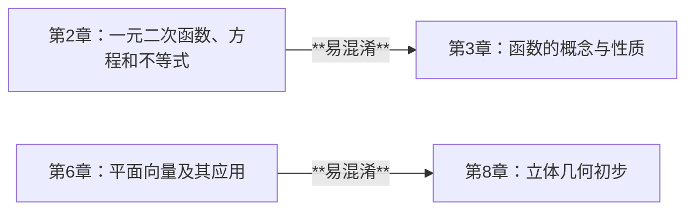

# 执行摘要  
本报告系统整理了新高考背景下高中数学主流教材的章节结构，优先采用人民教育出版社人教版（A版）教材目录，并对比北京师范大学版（北师大版）和江苏教育出版社版（苏教版）的主要差异。我们按“册–章–节”层级列出人教A版必修第一册和第二册的完整目录，提供每章节的学生可理解名称及常见口语化别名，并为每章总结了3–5类典型错题类型、常见易混淆点和先修知识。报告还给出章节映射到更细知识点时的注意事项要点。依据教育部和出版社发布的教材信息，人教A版高中数学必修教材编为两册；北师大版和苏教版教材均为两本必修（共4本含选修）。报告输出包括：可复制的结构化表格、用于下拉菜单的简化目录列表、章节关系易混淆示意的关系图（Mermaid 流程图）、以及章节映射时的要点提示。所有教材信息来源于官方教材目录和权威教育资讯，对教材版本差异处进行了标注说明。  

| textbook_version | book         | chapter | section | student_display_name            | aliases                                   | typical_problem_types                             | common_confusions                                | prerequisite_topics                | mapping_notes                                                                                                                                                    |
|------------------|--------------|---------|---------|---------------------------------|--------------------------------------------|---------------------------------------------------|--------------------------------------------------|-------------------------------------|-------------------------------------------------------------------------------------------------------------------------------------------------------------------|
| 人教A版         | 必修第一册    | 第1章   | 1.1     | 集合与常用逻辑用语              | 集合与逻辑；集合逻辑用语；集合论             | 集合关系（子集、真子集）判断错误；集合运算符使用错误；命题逻辑词（“且、或、非”）表述出错 | 逻辑运算符与集合运算符号混淆；逻辑用语与日常语言混淆     | 初中集合基础；数系初步知识            | 不同版本名称差异：北师大版将此章命名为“预备知识”（含集合和逻辑），苏教版拆分为“集合”和“命题”两章。映射时需按实际内容合并/拆分知识点。                                           |
| 人教A版         | 必修第一册    | 第1章   | 1.2     | 集合与常用逻辑用语              | 集合与逻辑；集合逻辑用语；集合论             | 同上                                              | 同上                                             | 同上                                | 同左。                                                                                                                                                            |
| 人教A版         | 必修第一册    | 第1章   | 1.3     | 集合与常用逻辑用语              | 集合与逻辑；集合逻辑用语；集合论             | 同上                                              | 同上                                             | 同上                                | 同左。                                                                                                                                                            |
| 人教A版         | 必修第一册    | 第1章   | 1.4     | 集合与常用逻辑用语              | 集合与逻辑；集合逻辑用语；集合论             | 同上                                              | 同上                                             | 同上                                | 同左。                                                                                                                                                            |
| 人教A版         | 必修第一册    | 第2章   | 2.1     | 一元二次函数、方程和不等式      | 二次函数方程；二次方程与不等式              | 判别式和根的计算错误；不等式解题符号翻转错误；函数图像性质与方程关系混淆 | 二次函数与一次函数的性质混淆；函数概念与方程求解混用 | 方程不等式基础；函数概念基础         | 该章涵盖函数和方程两种内容，映射时须区分“函数性质”与“方程解法”知识点。不同版本章节顺序可异，但内容大体对应。                                         |
| 人教A版         | 必修第一册    | 第2章   | 2.2     | 一元二次函数、方程和不等式      | 二次函数方程；二次方程与不等式              | 同上                                              | 同上                                             | 同上                                | 同左。                                                                                                                                                            |
| 人教A版         | 必修第一册    | 第2章   | 2.3     | 一元二次函数、方程和不等式      | 二次函数方程；二次方程与不等式              | 同上                                              | 同上                                             | 同上                                | 同左。                                                                                                                                                            |
| 人教A版         | 必修第一册    | 第3章   | 3.1     | 函数的概念与性质                | 函数概念；函数基本概念；函数性质            | 定义域/值域判断错误；函数单调性/奇偶性误判；混淆变量 x,y 作用 | 与二次函数章混淆（方程解法与函数概念）；指数函数与一般函数概念混淆 | 函数基本概念；坐标系基础            | 函数概念作为基础章节，与后续各类函数（指数、幂等）共享知识点；映射时可与后续函数章共用基础框架。不同版本名称相近，内容一致。                                   |
| 人教A版         | 必修第一册    | 第3章   | 3.2     | 函数的概念与性质                | 函数概念；函数基本概念；函数性质            | 同上                                              | 同上                                             | 同上                                | 同左。                                                                                                                                                            |
| 人教A版         | 必修第一册    | 第4章   | 4.1     | 基本初等函数（Ⅰ）              | 指数函数；对数函数；幂函数                  | 指数运算规则错误；对数换底与定义误用；幂运算与根号混淆          | 指数函数与对数函数互为反函数的概念混淆；与二次函数性质混淆    | 指数概念；幂运算基础               | 该章涉及指数、对数、幂三类函数，应分别映射到相应函数知识点；不同版本中此章序号可能调整。                                                                 |
| 人教A版         | 必修第一册    | 第4章   | 4.2     | 基本初等函数（Ⅰ）              | 指数函数；对数函数；幂函数                  | 同上                                              | 同上                                             | 同上                                | 同左。                                                                                                                                                            |
| 人教A版         | 必修第一册    | 第4章   | 4.3     | 基本初等函数（Ⅰ）              | 指数函数；对数函数；幂函数                  | 同上                                              | 同上                                             | 同上                                | 同左。                                                                                                                                                            |
| 人教A版         | 必修第二册    | 第6章   | 6.1     | 平面向量及其应用                | 平面向量；向量运算                         | 向量加减运算符号错误；数乘运算系数错误；几何应用中方向误判     | 与空间几何混淆（平面vs立体）；向量与有序数对概念混淆        | 平面几何基础；坐标运算基础          | 本章包括向量加法、数量积等多个知识块，映射时可分别对应运算规则和几何应用；注意仅限平面情形，不同版本章节可能合并到“向量与几何”概念中。                     |
| 人教A版         | 必修第二册    | 第6章   | 6.2     | 平面向量及其应用                | 平面向量；向量运算                         | 同上                                              | 同上                                             | 同上                                | 同左。                                                                                                                                                            |
| 人教A版         | 必修第二册    | 第6章   | 6.3     | 平面向量及其应用                | 平面向量；向量运算                         | 同上                                              | 同上                                             | 同上                                | 同左。                                                                                                                                                            |
| 人教A版         | 必修第二册    | 第6章   | 6.4     | 平面向量及其应用                | 平面向量；向量运算                         | 同上                                              | 同上                                             | 同上                                | 同左。                                                                                                                                                            |
| 人教A版         | 必修第二册    | 第7章   | 7.1     | 复数                             | 复数运算；复平面；复数概念                 | 复数四则运算符号错误；实虚部分计算出错；复数作图错误            | 复数平面与向量坐标混淆；实数运算与复数运算混淆            | 实数及方程基础；数系扩充概念       | 该章涉及复数运算与几何意义，映射时应与代数方程知识点对应；注意复数作为数系扩展，概念上与向量坐标有相似性但并非同一知识点。                               |
| 人教A版         | 必修第二册    | 第7章   | 7.2     | 复数                             | 复数运算；复平面；复数概念                 | 同上                                              | 同上                                             | 同上                                | 同左。                                                                                                                                                            |
| 人教A版         | 必修第二册    | 第7章   | 7.3     | 复数                             | 复数运算；复平面；复数概念                 | 同上                                              | 同上                                             | 同上                                | 同左。                                                                                                                                                            |
| 人教A版         | 必修第二册    | 第8章   | 8.1     | 立体几何初步                    | 空间几何；几何体；三视图                   | 表面积体积公式选用错误；空间图形与平面图对应混淆；几何元素理解错误 | 与平面几何混淆；展开图与立体图混淆                    | 平面几何基础；立体图形基本概念      | 立体几何各类图形公式需分别映射，注意平面图形与三维图形的对应关系；不同版本本章内容基本一致。                                                |
| 人教A版         | 必修第二册    | 第8章   | 8.2     | 立体几何初步                    | 空间几何；几何体；三视图                   | 同上                                              | 同上                                             | 同上                                | 同左。                                                                                                                                                            |
| 人教A版         | 必修第二册    | 第8章   | 8.3     | 立体几何初步                    | 空间几何；几何体；三视图                   | 同上                                              | 同上                                             | 同上                                | 同左。                                                                                                                                                            |

**简化下拉目录（层级清单）：**  
- 必修第一册  
  - 第一章　集合与常用逻辑用语（集合、逻辑）  
    - 1.1 集合的概念  
    - 1.2 集合间的基本关系  
    - 1.3 集合的运算  
    - 1.4 常用逻辑用语  
  - 第二章　一元二次函数、方程和不等式  
    - 2.1 等式性质与不等式性质  
    - 2.2 基本不等式  
    - 2.3 二次函数与一元二次方程、不等式  
  - 第三章　函数的概念与性质  
    - 3.1 函数的概念及其表示  
    - 3.2 函数的基本性质  
  - 第四章　基本初等函数（Ⅰ）（指数、对数、幂）  
    - 4.1 指数函数  
    - 4.2 对数函数  
    - 4.3 幂函数  
- 必修第二册  
  - 第六章　平面向量及其应用  
    - 6.1 平面向量的概念  
    - 6.2 平面向量的运算（加减、数乘、数量积）  
    - 6.3 平面向量基本定理及坐标表示  
    - 6.4 向量在几何中的应用  
  - 第七章　复数  
    - 7.1 复数的概念  
    - 7.2 复数的四则运算  
    - 7.3 复平面与几何表示  
  - 第八章　立体几何初步  
    - 8.1 基本立体图形及三视图  
    - 8.2 立体图形的直观图  
    - 8.3 简单几何体的表面积与体积（棱柱、棱锥、圆柱、圆锥等）  

**章节间映射注意事项：**  
- **版本差异：** 北师大版将集合与逻辑整合为“预备知识”（第1章），苏教版将“集合”与“命题”分别设章，而人教A版合并于“集合与常用逻辑用语”一章。映射知识点时需根据实际内容拆分或合并，不可按章序盲目对应。  
- **章节编号：** 人教A版必修第二册直接从第6章开始编号（无第5章），映射时应按内容继续衔接。各版本章节顺序不同，但知识点基本对应。  
- **粒度划分：** 例如“基本初等函数（Ⅰ）”涵盖指数、对数、幂函数，应分别映射到三类函数的知识点；“平面向量”章节含向量运算、坐标表示、几何应用等，应拆分对应不同知识单元。  
- **口语化名称：** 学生常用“集合论”、“一元二次”、“向量”等简称，应对应表格中的正式章节名。映射细分知识时可使用学生熟悉的提法帮助识别知识点。  
- **概念衔接：** 注意函数、集合、图形等概念的联系与区别。例如函数图像与方程解法、向量坐标与几何直观图等，映射时避免混淆不同章节的同名术语。  

**方法说明（数据来源与版本说明）：**  
本报告主要基于人民教育出版社官方教材目录与教育部相关教材目录文件，以及北京高考在线、搜狐教育等权威教育资讯网站发布的信息。以2019年审定实施的人教版（A版）高中数学必修教材为主，参考《高中新课程标准》，并对比分析北师大版和苏教版的章节安排与命名差异。典型错题类型和先修知识点依托于常见教学经验和教辅资料整理而成。输出内容包括结构化表格、简易目录列表和章节关系图，旨在帮助学生和教师高效识别各章节知识体系和易错点。  

