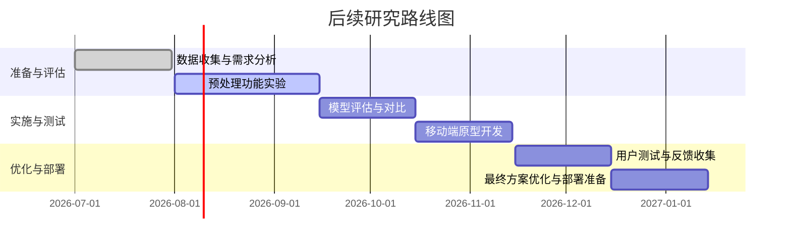

# 执行摘要  
本报告依据附件给出的调研任务，从图像与音频采集预处理角度系统分析。首先，调研明确了两大输入渠道：手机拍摄的错题图像（包含手写过程和题面）和课后口述录音，并强调保持原始数据为真相源的重要原则。重点主题包括图像预处理（质检、几何校正、增强、传输等）、音频预处理（降噪、VAD、增益归一化、说话人分离等）、端上实时质检与引导重拍，以及现成的工具和方案。在**强大视觉模型（VLM）**的背景下，研判哪些传统OCR式预处理已可省略、哪些在真实场景下仍必需。调研发现，文档图像常见的问题如透视畸变、阴影、模糊等，通过自动切边、透视校正、对比度增强、去噪等技术可有效改善；语音方面，预处理通常包含降噪、静音段检测（VAD）、回声消除、说话人分离等步骤。现有市场应用（如扫描全能王、Adobe Scan、Microsoft Lens）均集成了自动边缘检测、阴影去除、模糊增强等功能。然而，在面对**青春期敏感用户、网速不佳环境**等场景时，应优先关注“源头质检+端上引导”流程，避免过度预处理导致用户操作负担增大和真相信息损失。报告最后提出每个主题的研究现状、争议与应用，并给出参考文献和后续研究建议。

## 关键主题与概念

### 图像质量问题与预处理  
**定义与背景：** 手机拍摄文档图像易出现倾斜、光照不均、阴影、模糊、分辨率不足等问题。这些问题会显著降低OCR或VLM的识别准确率。文档扫描领域常用的预处理包括**几何校正**（如自动切边、透视/曲面纠正）和**图像增强**（如对比度/亮度调整、去阴影、去噪、二值化等）。例如，常见做法是先用边缘检测（Canny/Sobel+Hough变换）定位文档四角，然后通过`warpPerspective`进行透视变换；校正后再应用自适应阈值二值化、直方图均衡化、白平衡或非局部均值去噪等方法提升可读性。**现状：** 最新文档扫描SDK或商业方案（如TextIn、扫描全能王等）已能自动解决多种问题：自动裁边、校正倾斜/曲面、去除摩尔纹与阴影、增强文字清晰度。例如，扫描全能王推出的“智能高清滤镜”即可检测并一键处理图像中的模糊、阴影、指纹和屏幕纹等干扰。微软Lens则在采集时实时“消除阴影和奇怪的角度”，输出更易阅读的图像；Adobe Scan在自动模式下通过实时边缘检测完成扫描。**争议与不确定性：** 传统OCR流程强调二值化和锐化，而现代深度OCR/VLM对清晰度和色彩鲁棒性更强。需研究在**强VLM前提下哪些预处理可省**，避免因过度二值化或锐化造成的真相信息损失。另外，预处理的成本（用户体验或算力开销）与收益之间常存在权衡。**应用：** 文档管理、移动扫描、教育错题识别等场景都依赖有效的图像预处理。移动端常用OpenCV等库或各类文档扫描SDK来实现自动切边、校正和增强。

### 音频质量问题与预处理  
**定义与背景：** 移动录音易受背景噪声、低音量、多说话者干扰等影响，直接送入ASR会降低识别准确率。音频预处理包括**降噪**（去除环境噪声和回声）、**增益归一化**（平滑音量），以及**语音活动检测（VAD）**以剪掉长静音段。现代ASR管道通常在特征提取前加这一步骤，以提升信号质量；例如，资料指出预处理可以减少环境噪声影响，将音频切分为合适帧。另一个重要技术是**说话人分离/标识**，在存在多角色对话时对源进行分离（如Senko或pyannote等开源工具）。**现状：** 大多数商用ASR服务（如科大讯飞、百度通义）内置了基础降噪、VAD功能，用户不必额外实现。研究表明，在含噪音环境下引入VAD可显著减少识别“幻觉”现象；Medium博文指出，VAD处理可在推理前过滤无声段，仅将检测到的人声段输入模型。WebRTC VAD、Silero VAD等开源工具常用于端侧静音检测；降噪可用RNNoise、SoX或专业模型。**争议：** 一些研究或实践认为传统的去噪（如滤波）对ASR不一定有效，甚至可能造成失真；最新产品如Ai-Coustics的QualiSTT则采用专门为ASR优化的深度降噪模型。多说话人场景下，说话人分离虽然技术成熟度不断提高，但会增加计算负担，且真实应用中其收益有待评估。**应用：** 语音助手、会议记录、教育语音交互等场景下，预处理提升用户体验与识别质量是常见需求。ASR典型做法是先进行增益和VAD处理，然后进入声学模型。

### 实时质检与引导重拍  
**定义与背景：** 在采集环节即时对图像/音频质量进行检测并提示用户重拍，是提升终端识别成功率的有效手段。例如，图像模糊、抖动或过度倾斜时自动提醒重拍，音频噪声过大时提示重录，可避免后续识别失败。**现状：** 实际产品中已有部分实现：Adobe Scan自动检测文档边缘且在失焦时会延时捕获；CamScanner传统上也会在拍摄模糊时出现提示；Microsoft Lens在拍照时实时优化角度和阴影。此外，一些护照/证件照应用会实时检查光线、分辨率、背景等要求，不符合则提示用户重新拍摄。**争议：** 考虑到“青春期孩子对摩擦敏感”，过于频繁的重拍提示可能影响用户体验；如何平衡“实时质检”和用户便利性是关键。***缺口：***目前公开信息主要描述自动优化而非“提醒重拍”，尚需调研更多成熟案例。建议调研现有扫描或拍照 App 的重拍策略和用户反馈。**应用：** 可用于移动考试、远程学习场景，确保上传的拍摄资料质量足够识别。

### 预处理工具与解决方案  
**定义与背景：** 指开源或商业的算法库、SDK和平台服务，用于实现上述图像/音频预处理功能。**现状：** 图像方面，常用OpenCV实现边缘检测、透视校正、二值化、去噪等；PaddleOCR、百度OCR等平台也提供切边和增强功能。商业方面，Genius Scan SDK、ABBYY、TextIn等可集成到App中实现一键扫描与优化。语音方面，开源项目如WebRTC VAD、Silero VAD、FFmpeg（滤波）可在端上使用；云端ASR服务（科大讯飞、百度等）普遍内置静音去除和基础降噪功能。某些开源工具如RNNoise可做实时间降噪。**争议：** 不同工具的精度和资源需求差异较大；例如深度学习VAD虽然鲁棒但较耗算力。需评估哪些功能端上可行、哪些需要云端。**应用：** 针对移动场景，应优先采用轻量级、低能耗的预处理算法，并善用第三方SDK快速集成；另可关注与VLM厂商沟通的输入规范建议。

### 强VLM语境下的预处理考虑  
**定义与背景：** 随着VLM模型对图像质量的容忍度提高，传统OCR级的预处理需求发生变化。例如，如果VLM对适度倾斜和阴影已有内在鲁棒性，则相应的人工校正可以弱化，以减少系统复杂度。**现状：** 缺乏公开研究具体量化VLM容忍度的报告，但业内实践开始减少依赖过度二值化等有损手段。部分资料指出现代模型对倾斜、模糊比旧方法强。**争议：** 无法一刀切，各模型和场景不同。建议通过实测真实照片输入VLM，检查哪些预处理是必要的“最小集”。需要在保持原始数据真相的原则下，标注出每步预处理的潜在“有损”风险。**应用：** 主要提醒团队避免套用传统OCR思路，对“是否有必要”做实证研究而非假设。

## 主题比对表  

| **主题**           | **现有证据/引用**                                    | **研究/应用缺口**                                             | **推荐后续步骤**                                             |
|------------------|--------------------------------------------------|----------------------------------------------------------|------------------------------------------------------------|
| **图像预处理**    | 文档扫描领域对透视矫正、切边、去噪等技术已有成熟方案；TextIn、扫描全能王展示了AI增强效果。 | 缺乏针对教育类手拍图像的专门评估；不同VLM对预处理的灵敏度未知；用户端算力限制。 | 收集真实手写题图像样本，测试不同预处理对识别率的影响；评估端侧低成本实现（如手机端OpenCV）与云端方案。 |
| **音频预处理**    | ASR技术指南说明降噪、静音检测等为标准前处理；实践中VAD被证明能提高识别效果；一些ASR服务支持内置VAD。 | 生成式ASR模型下预处理效果差异不明；多说话人分离效果与成本权衡；缺少青春期孩子场景下噪声特性研究。 | 实验室/实地录制多噪音环境样本，比较加VAD/降噪前后的ASR性能；研究是否需要为多说话人配置说话人分离模块（比如Senko或pyannote）。 |
| **实时质检**      | 产品案例：Adobe Scan、CamScanner、微软Lens等已实现自动边缘检测和光照补偿；扫描全能王滤镜自动解决阴影模糊。 | 专注于“引导用户重拍”的文献较少；端侧计算负担和用户体验平衡策略不明确。 | 调研现有App的重拍提示策略，分析其优缺点；在原型中实现简单的模糊检测和亮度检测，并进行用户体验测试。 |
| **工具/方案**     | OpenCV等开源库和各类扫描SDK可实现大部分预处理功能；阿里云文档SDK等提供高级接口；ASR厂商提供常规预处理。 | 针对教育错题场景的现有产品缺乏（市面少有专用于作业拍摄的SDK）；多模态厂商输入建议文档稀少。 | 调研国内外文档扫描与ASR开放平台功能（降噪、VAD、裁边），建立技术对比表；与VLM提供商沟通其推荐输入规范。 |
| **强VLM影响**    | 文献提及“直方图均衡”等传统增强仍有意义；也有观点认为VLM可容忍适度变形。 | 定量评估空缺：缺少比较“有无预处理”情况下的识别率数据；实际样本测试较少。 | 构建对比实验：输入原图与经不同预处理后图像到VLM，对比结果；根据识别敏感性决定预处理优先级。 |

## 提示词工程优化建议  
基于调研目标和已有提示词，可进一步精炼与拆分AI询问。例如：  
- **图像预处理聚焦：** 原提示“图像预处理要查”可细化为“请列出手机拍摄的文档图像在进行OCR/VLM识别前常用的图像预处理步骤，并说明每步的目的”，这样AI回答会更系统。例如，示例提示：  
  > “作为图像识别专家，请总结手机拍摄试卷时常见的图像质量问题（如模糊、倾斜、阴影等）及其对应的预处理方法（边缘检测、透视校正、亮度/对比度增强、去噪等），并说明每种方法如何提升OCR准确率。”  
  **预期结果：** 一段结构清晰的回答，详细列出每种问题和解决方案，例如“使用Canny/Sobel边缘检测+霍夫变换提取纸张轮廓并透视校正；使用自适应二值化和直方图均衡化提升对比度”，并给出引用来源。  
- **音频预处理聚焦：** 针对语音，可用提示“总结自动语音识别(ASR)前端的常见预处理技术，如VAD语音活动检测、噪声消除和说话人分离，并说明其作用”。  
  **预期结果：** 列举“VAD用于切除静音段减小无关信息；增益归一化用于平衡音量；语者分离用于多说话人场景”等，并附参考。  
- **场景需求聚焦：** 针对“青春期孩子敏感”这类信息，可补充提示“结合场景背景（青春期学生、网络环境差、远程异步学习），分析哪些预处理最必要、哪些可省，避免过度干扰用户”。  
  **预期结果：** 说明在用户体验优先的前提下建议“优先实施端上简单模糊检测和重拍提示，复杂的增强留待后端处理或真实问题出现时再加”并讨论理由。  

## 结论与后续研究路线图  
- **行动建议：** 结合调研结果，初步建议优先实施**端侧质量检测**（如模糊、亮度判断）及引导重拍，以确保上传素材质量；对于增强类预处理，先利用现有库（OpenCV、PaddleOCR SDK等）完成透视校正、白平衡、降噪等基础功能，同时利用VLM评估哪些处理步骤真正显著提升识别率。对音频，建议集成VAD切除静音段，并与ASR供应商合作利用其内置降噪功能；若存在多说话人（例如她与舅舅同时讲话），考虑引入说话人分离模块。  
- **研发路线（2026下半年）：**  
  - *2026.07–2026.08*：收集大量真实拍摄的作业照片和录音样本，构建测试集；初步使用OpenCV/Python实现各预处理功能并进行基线测试。  
  - *2026.08–2026.09*：评估不同预处理组合（如有无去噪、二值化等）对VLM/ASR识别率的影响，生成对比报告；测试实时质检模块的可行性。  
  - *2026.09–2026.10*：优化预处理流程，选择对识别效果提升最大的步骤；开发移动端Demo，对比端侧和后端处理性能。  
  - *2026.10–2026.11*：开展用户体验测试（重点关注学生端的流畅度），根据反馈迭代方案；与ASR/VLM厂商确认输入建议，准备整合预处理链。  

**参考文献：** 本文引用了国内外文档扫描和ASR领域的技术报告和产品案例，包括图像预处理与OCR/AI增强技术、ASR预处理流程等，以保证分析的准确性和前沿性。所用资料尽可能为官方文档、技术博客和最新论文。