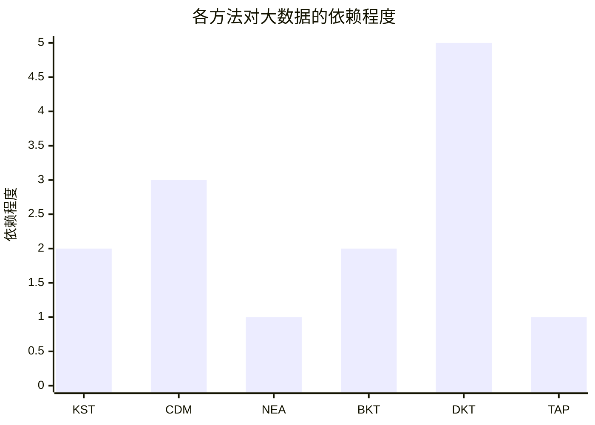
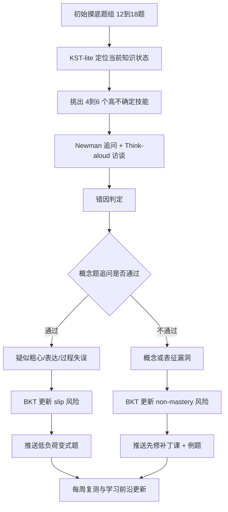
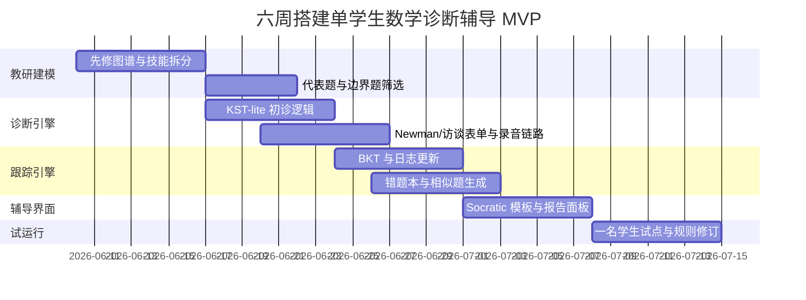

# 面向数学基础薄弱高中生的个性化诊断辅导系统深度调研报告

## 执行摘要

如果你的目标不是做一个依赖海量平台日志、面向成千上万学生的商业自适应系统，而是为**一个**数学基础薄弱的高中生构建可落地、可解释、可持续迭代的诊断辅导系统，那么最优先的技术组合并不是 DKT 这类深度序列模型，而是**低数据、强解释、可人工校正**的方法：**Knowledge Space Theory 的轻量化实现、Newman 错误分析、think-aloud 诊断访谈、以及按知识点在线更新的 BKT**。CDM 尤其是 DINA/G-DINA 也有价值，但更适合在你已经有一个较成熟的 Q-matrix、并把它用于“诊断打分”而不是“从单个学生数据里重新估计参数”时使用。**DKT 通常不适合单学生起步阶段**，因为它的优势建立在大量跨学生交互序列之上，而且解释性明显弱于 KST、NEA、BKT 与访谈法。 citeturn18search1turn19search0turn19search17turn22search6turn23search2turn35search2turn36search0turn36search8

从教育产品设计的角度看，公开资料显示：**ALEKS** 的强项是把知识状态与“学习前沿”做成了一个精细而可运行的系统，初始诊断只需大约 **20–30 道自适应开放题**；**Math Academy** 则把“先修关系图 + 诊断 + 节奏控制 + 间隔复习”做得非常工程化；**Khanmigo** 的亮点是苏格拉底式追问与作业中即时引导；而国内的 **松鼠 AI、猿辅导、作业帮** 更强调“错因分析”“学情数据”“动态规划”，其中松鼠 AI 与小猿 AI 在公开材料中对“错因分层”讲得最明确。相反，**豆包/豆包爱学** 在公开网页上更像“会追问、会讲解、会拍题”的通用或半垂直助手，本轮检索中没有找到与 ALEKS/Math Academy 同等明确、可核验的长期知识状态建模公开方法文档。 citeturn17search15turn18search6turn9search0turn9search4turn35search3turn35search15turn16view1turn16view2turn10search4turn12search13turn10search2turn12search2

就“**如何区分粗心错误与概念性错误**”而言，真正可靠的方法几乎都不是只看一次答错。公开文献与专利共同提示，更稳妥的做法是同时结合：**错误步骤位置、学生口头解释、即时概念追问、同构变式题复测、答题时间/自我修正行为、以及跨题重复模式**。Newman 错误分析和 think-aloud 访谈在这件事上最强，因为它们直接观察学生是卡在读题、理解、建模、运算还是表达；BKT 和 DINA 则只能从统计上给出“可能是 slip 还是 non-mastery”；DKT 最弱，通常只能给出预测分数而不能给出可执行的错因解释。 citeturn22search7turn22search11turn23search0turn35search2turn19search0turn36search0turn36search8turn15view1

下面这张表先给出结论性判断。表中的“低/中/高”并非文献原话，而是基于各方法的建模前提、开源工具成熟度、样本要求与实时性做的综合判断。 citeturn18search1turn19search0turn19search23turn22search6turn23search2turn35search0turn36search0turn36search8

| 方法 | 数据需求 | 可解释性 | 实时使用 | 区分粗心 vs 概念 | 单学生场景适合度 | 最适合作为 |
|---|---|---:|---:|---:|---:|---|
| KST / KST-lite | 低到中 | 很高 | 高 | 中 | 很高 | 初始诊断与学习前沿定位 |
| CDM / DINA | 中 | 高 | 中 | 中 | 中 | 属性级漏洞画像 |
| Newman 错误分析 | 很低 | 很高 | 中 | 很高 | 很高 | 访谈式错因分类 |
| BKT | 低 | 中高 | 很高 | 中 | 很高 | 练习过程中的连续追踪 |
| DKT | 很高 | 低 | 高 | 低 | 很低 | 大规模平台优化 |
| Think-aloud | 很低 | 很高 | 低到中 | 很高 | 很高 | 深入个案诊断 |

对于你要做的系统，最推荐的最小可行路径是：**先做 KST-lite + Newman + think-aloud + BKT**，把“粗心/概念/表达/读题”的判断做成**可解释规则**；等积累到较系统的题目-属性映射后，再引入 **DINA/G-DINA**；除非以后真的积累了大量跨学生时序日志，否则不建议一开始就做 DKT。 citeturn18search1turn22search6turn22search7turn23search2turn35search0turn36search0turn36search8

## 方法比较与一对一适配性

对于一个基础薄弱的高中生，诊断系统真正要回答的不是“学生总分多少”，而是四个更细的问题：**他现在确切会什么；离下一步能学什么还差什么；错题到底是概念、表征、过程还是注意力问题；以及下一次应该给什么难度、什么形式、什么粒度的任务**。KST 主要回答前两问，NEA 与 think-aloud 最擅长回答第三问，BKT 最适合支撑第四问，CDM 介于 KST 与 BKT 之间，而 DKT 更像大平台的后端优化器。 citeturn18search1turn22search6turn23search2turn35search2turn19search0turn36search0

更直白地说：

- **不依赖大数据、最适合一对一**：Newman 错误分析、think-aloud、KST-lite、BKT。 citeturn22search6turn23search0turn18search1turn35search2
- **可用于一对一，但前提是你先做好专家建模**：CDM/DINA。 citeturn19search0turn19search11turn19search17
- **不建议在单学生起步阶段上来就用**：DKT。 citeturn36search0turn36search8turn36search15

一个关键现实是：**弱基础学生的问题通常不是单一“不会”，而是多层叠加**。例如“函数题不会做”，可能同时包含：读题弱、代数变形弱、负号敏感度差、图像与表达式互译差、时间一紧就容易抄漏项。只有把“知识状态诊断”和“错误过程诊断”结合起来，个性化辅导才不会变成“给错题打标签然后无脑推类似题”。这也是为什么商业产品里，最有价值的并不是“会推荐题”，而是“能不能解释为什么这道题错、下一步为什么该学这个”。 citeturn17search22turn22search7turn23search2turn15view1turn11search3

## 核心诊断方法拆解

### Knowledge Space Theory 与 ALEKS 初始诊断

**核心原理。** Knowledge Space Theory 把“学生知道什么”定义为一个**知识状态**：即在某一限定领域内，学生当前能够解答的一组题目或任务。所有可能的知识状态构成一个知识空间；在学习空间理论里，还进一步要求这些状态满足一定的结构性质，从而能表达“哪些知识是先修、哪些知识是可达前沿”。这一路径与传统只给一个分数的测验不同，它追求的是**定位学生处于哪一个状态，以及从该状态往前最适合学什么**。 citeturn18search5turn18search1turn17search22

**在 ALEKS 中的实现逻辑。** ALEKS 官方明确写明其理论基础就是 KST。它不是用总分来描述学生，而是“快速且准确地确定学生在某科中的精确知识”，然后只开放学生“准备好学习”的主题。McGraw Hill 的官方说明称，ALEKS 的 Knowledge Check 大约会问 **20–30 道题** 来确定学生在课程中的**precise knowledge state**；官方学生文档则强调 Knowledge Checks 是**自适应、开放作答、且不超过 30 题**。这正是 KST 的工程化优势：利用预先构造好的知识结构，少量高信息量题目即可缩小候选知识状态集合，而不必把每个知识点都测一遍。 citeturn17search22turn18search6turn17search15turn17search11

**为什么可以用少量题目定位“知识状态”和“学习前沿”。** KST 的核心不是“题目少”，而是“题目之间有结构”。一旦你知道某些题目是另一些题目的先决条件，那么学生答对/答错某些关键题，候选状态空间就会迅速缩小。工程上可以把这理解为：不是在“所有知识点上平均抽样”，而是在“最能区分相邻状态的边界题”上抽样；一旦状态大体确定，学习前沿就是“从当前状态出发、最接近且可进入的下一批知识节点”。ALEKS 的“Ready to Learn”机制，本质上就是把这个前沿显化给学生。 citeturn18search1turn18search5turn18search6

**适用于单学生场景吗。** 非常适合，但前提是你愿意投入专家建模。KST 的大优势在于：**它可以更多依赖领域结构，而不是依赖海量历史数据**。如果你做的是高中数学基础补救，不妨把域先缩成“整数有理数运算—方程—比例—函数前置技能”这一段，手工构建一个 60–120 个微技能、带先修关系的图，再为关键边界节点配题。这样做出的 KST-lite 系统完全可以服务单学生。它最大的成本不在模型，而在**知识图与边界题库的教研构建**。 citeturn18search1turn17search22

**诊断流程建议。** 对于单学生，我建议把 KST 改造成比 ALEKS 更“访谈友好”的版本：先做一个 12–18 题的初筛，把学生大致放到某个状态区间；再对 4–6 个高不确定技能做追问或变式题确认；最后输出两部分结果：一是**当前已掌握状态**，二是**最小学习前沿**，即接下来一到两个最该修复的先修技能。这样比一次性给出十几个“弱项知识点”更适合基础薄弱学生，因为它能做到**只给最近端、最有可能学会的下一步**。 citeturn18search1turn17search15

**公开资料与可操作资源。** 最权威的公开资料是 Doignon 与 Falmagne 的学习空间理论综述，以及 ALEKS 官方的 KST 页面和 Knowledge Check 文档。相较于 pyBKT、GDINA 这类模型，KST 在公开网络上**没有同等成熟、通用、持续维护的“拿来即用”主流开源库**那么显眼；实际工程中更常见的是依据理论自行实现一个问题域的状态图、候选状态剪枝与边界题选择逻辑。 citeturn18search1turn17search22turn17search15

**对弱基础学生的局限。** KST 很容易给人一种“我已经精确到纳米级漏洞”的错觉，但如果知识图谱或先修关系建错了，整个诊断会显得很精准却不一定很真。对数学基础薄弱学生尤其如此：他们往往在题目语言、符号阅读、工作记忆、注意控制上有并行问题，而 KST 更擅长表示“学科结构”，不天然等于“认知过程结构”。所以 KST 适合作为骨架，但不应单独承担错因解释。 citeturn18search1turn22search6turn23search2

### CDM 与 DINA 在数学中的应用

**核心原理。** Cognitive Diagnostic Models 不再把学生看成“一个连续能力值”，而是看成“若干离散属性是否掌握”的组合。最经典的 DINA 模型是**非补偿型**：某题如果需要属性 A、B、C，那么学生只有在 A、B、C 都掌握时才被视为具备“理应答对”的条件；现实作答中的失误由 **slip** 参数解释，猜对则由 **guess** 参数解释。G-DINA 则是在此基础上放松了过于刚性的限制。 citeturn19search0turn19search8

**数学场景中的典型用法。** 数学里最常见的做法是先定义一个 **Q-matrix**，把每道题映射到若干认知属性，例如“分数通分”“含负号移项”“把文字条件转成方程”“读取函数图像单调性”。然后根据学生在题组上的响应模式，估计每个属性的掌握后验概率。经典的分数减法数据集和许多大规模数学评测研究，都在用这种框架来探索“学生到底缺的是哪几个关键属性”。 citeturn21search18turn21search19turn20search1

**对单学生是否适用。** 这里必须区分两件事：**模型训练/参数估计** 与 **用已定模型给单个学生诊断**。如果你只有一个学生，几乎不可能从零稳健估计出一个像样的 DINA 模型；但如果你已经有一个由专家构造并经小样本反复修订的 Q-matrix，并对 slip/guess 采用经验先验或保守默认值，那么 DINA 完全可以被用作**单学生属性诊断器**。换句话说，一对一系统里更现实的做法是“**把 CDM 当评分/解释层**”，而不是“把 CDM 当训练目标”。这也是为什么很多 CDM 文献把重点放在 Q-matrix 的构建与验证，而不是强调小样本端到端部署。 citeturn19search1turn19search3turn19search17turn20search3

**诊断流程建议。** 最可行的流程是：先用教研方式定义 6–10 个关键属性；每个属性至少配若干代表题，并尽量覆盖不同属性组合；初始诊断后，不直接给“会/不会”二元结论，而是输出“高把握掌握 / 边缘掌握 / 待确认”。对“边缘掌握”的属性，再配一个**等价但表征不同**的小题组做确认，这样可以减少把一次粗心答错误判为稳定性概念漏洞。 citeturn19search0turn19search11turn19search23

**公开实操资料与开源实现。** 目前最成熟、最适合实操的公开工具在 **R** 生态：`CDM` 包支持 DINA/DINO/GDINA 等模型估计，`GDINA` 包提供 Q-matrix 验证、模型拟合与可视化教程。`CDM` 和 `GDINA` 都提供典型数学数据集，例如 Tatsuoka 的分数减法数据，可用来快速搭原型、理解属性诊断结果长什么样。 citeturn19search2turn19search11turn19search23turn21search18turn21search19

**对弱基础学生的局限。** CDM 最大的问题不是算法，而是**属性设计的主观性**。如果你把“看懂题意”“设未知数”“负号处理”“列方程”这些步骤拆得太粗，诊断不够精细；拆得太细，又会让 Q-matrix 变得脆弱、属性间重叠严重、解释反而混乱。对基础薄弱学生来说，这一点尤其要小心，因为他们的瓶颈常常跨越语言、表征和运算三个层次，而 CDM 的属性往往偏“学科技能”，不一定天然覆盖“半懂不懂”“照猫画虎”“一看就慌”这类状态。 citeturn19search1turn20search15turn19search17

### Newman 错误分析法

**核心原理。** Newman 的经典框架把数学文字题求解过程拆成五个阶段：**阅读、理解、转换、过程技能、编码**。学生答错并不意味着“这个知识点不会”，而可能卡在这五个阶段中的任意一个。ACER 的教师资源与 White 对 Newman 的再讨论都强调，这种方法最初就是为了帮助教师把“错题”还原成“哪一步出了障碍”。 citeturn22search6turn22search7turn22search14

**Newman 的操作提示。** White 整理出的经典提示语包括：请把题读给我听、告诉我题目要你做什么、告诉我你打算怎么找答案、边做边说出你在想什么、然后把答案写出来。这套提示本质上就是一个超轻量的诊断访谈脚本。它特别适合基础薄弱学生，因为它不会一上来就追问抽象概念，而是先看学生有没有在最前面的“读懂—理解—转译”阶段掉队。 citeturn22search7

**它如何帮助区分粗心错误与概念性错误。** 严格说，**“粗心”并不是 Newman 原始五分类中的正式一类**。但后续研究和比较文章常常把 careless 作为一个额外分析桶，并发现大量错误集中在 comprehension、transformation 与 careless 这几类。如果一个学生能正确读题、能说清题意、也能阐明策略，但在抄写、符号、末尾表达或一步计算上出错，那么这更接近“粗心/编码/过程失误”；如果他在“题目要我做什么”或“我准备怎么做”这里就说不清，那更像概念或表征层面的问题。 citeturn22search11turn22search7

**适用于单学生吗。** 几乎是为单学生设计的。它不需要大数据、不需要题库参数、不需要复杂平台，只需要一组经过挑选的诊断题和一个会追问的访谈者。对于高中数学基础薄弱学生，Newman 尤其适合用在**应用题、函数文字题、几何证明起步题、含情境建模的题**上，因为这类题最容易把“看起来不会数学，其实是没读懂/没转译好”的学生筛出来。 citeturn22search6turn22search7

**公开实操资料。** ACER 的 Newman’s error analysis 概念指南非常适合作为教师/设计者的上手材料；White 的再评价文章适合用来理解它的访谈脚本与扩展用法。对系统设计者来说，最实用的不是把它当作“研究法”，而是把五阶段做成平台里的**错误标签本体**。 citeturn22search6turn22search7

**对弱基础学生的局限。** 它最大的局限是**效率**。Newman 适合诊断，不适合全自动规模化；而且如果学生非常害怕口头表达，think-aloud/追问可能会增加焦虑，导致你得到的是“语言表现”而不完全是“数学思维”。所以它最好用于初诊、复盘和关键节点抽样，而不是每道题都访谈。 citeturn23search0turn23search14

### BKT 与 DKT 的区别及最小可行实现

**BKT 的原理。** Bayesian Knowledge Tracing 本质上是一个针对单知识点的隐马尔可夫模型。它只需要四类核心参数：学生初始掌握概率、学习转移概率、猜对概率、失误概率；随着学生每一次作答，系统实时更新该知识点的掌握后验。Corbett 与 Anderson 的经典论文就是沿着这一思路建立学习跟踪模型的，后续 pyBKT 则把这一类模型做成了易用的 Python 库。 citeturn35search2turn35search0turn35search20

**DKT 的原理。** Deep Knowledge Tracing 用 RNN/LSTM 等深度序列模型直接从学生交互序列中学习下一个作答的预测，不需要显式把人类专家写出来的“领域知识结构”硬编码进模型。Piech 等人的原始论文明确把这一点列为优势：深度模型不要求显式的人类领域知识编码，并且能拟合更复杂的交互模式。 citeturn36search0turn36search1

**两者的根本区别。** BKT 的优点是：参数少、可解释、容易在线更新、很容易用于单学生；DKT 的优点是：表达能力强、可以吃复杂的历史序列，但代价是**需要更多数据、可解释性更差、很难告诉你“为什么错”**。后续研究甚至直接质疑“KT 领域是否真的需要深度”，指出浅层模型有时能打平或接近 DKT，同时提供更强解释力。 citeturn35search2turn36search8turn36search15

**哪一个适合一对一。** 对你的场景，BKT 明显更合适。你可以把它理解成：一旦 KST/Newman/CDM 告诉你“当前最该盯住的 6–10 个知识点是什么”，BKT 就能在后续练习里持续更新这些点的掌握概率，并且利用 slip/guess 来避免把每一次错答都解释成“不懂”。DKT 则更像“如果我未来做成平台，积累了很多学生、很多题、很多时序日志，也许可以尝试”。起步时直接上 DKT，往往是在用最难解释的工具解决最需要解释的问题。 citeturn35search2turn35search0turn36search0turn36search8

**最小可行实现。**  
BKT 的 MVP 非常清楚：给每道题打知识点标签；每次学生做题后，更新对应知识点的后验掌握概率；当某点长期高 mastery 时减少练习，低 mastery 时改推更基础的变式题，且把“疑似 slip”单独标记出来。`pyBKT` 与 `pyBKT-examples` 足以支持这一层。 citeturn35search0turn35search4turn35search20

DKT 的 MVP 也有公开代码，但它的“最小可行”与“单学生可行”不是一回事。Stanford 的原始代码仓库和 `pyKT` 都能跑 DKT，但 `pyKT` 本身的定位是**深度 KT 模型的标准化 benchmark 平台**，显然是面向研究与多数据集比较，而非一对一辅导刚起步的产品。 citeturn36search19turn35search16turn36search13turn36search2

### Think-aloud 在数学诊断访谈中的操作规范

**核心原理。** Think-aloud 要求学生在做题时同步说出脑中正在发生的想法。NCME 的模块将它与 cognitive labs 区分开：前者更适合研究**问题求解过程**，后者更偏重理解与作答过程的认知证据。PMC 的综述则指出，并发式 verbalization 往往比事后回忆更有生态效度，因为回忆会被遗忘与合理化污染。 citeturn23search2turn23search21turn23search0

**操作规范。** 公开方法论的一致建议是：先做一个与学科无关的简短热身，让学生学会“边做边说”；访谈时用**中性、最小干预的提示**，例如“继续说你在想什么”，而不是“你为什么这么做”；如果学生沉默，只做轻提示，不立刻教学；任务结束后再做针对性的追问。Ericsson 与 Simon 的《Protocol Analysis》至今仍是这一方法的理论基石，后续教育测量综述则把它具体化为可操作流程。 citeturn36search18turn23search2turn23search1

**为什么它特别适合数学弱基础学生的初诊。** 因为它能暴露“看起来像知识漏洞，其实是监控失败”的情况。例如学生说出“我知道要先移项，但我每次一着急就把负号看错”，这和“我根本不知道什么叫移项”是完全不同的辅导入口。前者需要练习设计与注意力干预，后者需要概念重建。纯日志数据很难看出这一区别。 citeturn23search0turn22search7

**公开实操资源。** NCME 的 think-aloud / cognitive labs 模块适合建立标准操作意识；Reinhart 等关于 think-aloud interviews 的文章则更接近课堂与学科教学应用。 citeturn23search2turn23search1

**局限。** 它费时间，也会增加认知负荷；有些学生一边算一边说会更差。因此最好的策略不是“全题全程 think-aloud”，而是：**在初诊阶段对少量代表题做深描，在日常练习阶段改用 20–40 秒的微型自解释**。 citeturn23search14turn23search0

## 产品机制与真实效果

### 核心产品比较

以下比较更关注“如何定位知识漏洞”，而不是泛泛地比较内容多少或模型大小。表中的“是否区分粗心/概念”指的是**公开资料中是否能看到明确机制**，不是宣传口号。若某产品只说“定位薄弱点”而没有说明是如何把粗心、误读、概念混淆、步骤错误拆开，我会把它记为“弱”或“有限”。相关判断综合官方文档、公开专利/方法页以及论坛和社区反馈。 citeturn16view1turn17search15turn35search15turn9search4turn10search4turn12search13turn12search2

| 产品 | 诊断/定位机制 | 跨会话知识状态建模 | 粗心 vs 概念区分 | 对弱基础学生的主要局限 | 可核验公开方法/专利 |
|---|---|---|---|---|---|
| 松鼠 AI | 微粒度知识点体系、错因分析引擎、学习路径推荐 | 强 | 强 | 依赖复杂教研与大规模行为数据；开放独立评测少；渠道/服务一致性问题显著 | 有：CN110414837A、CN105761183A citeturn16view1turn16view2 |
| ALEKS | KST + Initial Knowledge Check + 周期性 Knowledge Check | 强 | 有限 | 开放题与周期性重测对弱基础学生有挫败感；更擅长“会什么/能学什么”，较少显式解释认知错因 | 有：KST 官方理论页与 Knowledge Check 官方文档 citeturn17search22turn17search15 |
| Khanmigo | 苏格拉底式追问、作业中即时支架、区分尝试前后帮助 | 中 | 中 | 更像“会问问题的教练”，不等于稳定的知识状态图；动机弱的学生可能不用它 | 有：官方产品页、博客、微软专访 citeturn35search3turn35search15turn35search11 |
| Math Academy | 诊断报告 + 先修图谱 + 定制课程 + 间隔复习/定时测验 | 强 | 有限 | 偏依赖持续自驱和任务完成；公开资料未见明确粗心/概念 taxonomy | 有：官方 how-it-works/how-our-ai-works citeturn9search0turn9search4turn9search6 |
| 小猿 AI / 猿辅导生态 | 动态学情数据、五重错因分析、步骤级错误定位 | 强 | 强 | 公开论证以发布会与媒体稿为主，缺少可复现实验细节 | 有：发布稿、官方对外方法描述；本轮未锁定直接对应专利号 citeturn10search4turn11search3turn11search10 |
| 作业帮 | 一对一诊断规划模型、历史数据导入、动态学习计划 | 强 | 中 | 更像“题库+视频+计划”混合体；公开错因 taxonomy 不如小猿清晰 | 有：发布稿、App Store 功能描述；本轮未锁定直接对应专利号 citeturn12search13turn12search1turn10search1 |
| 豆包 / 豆包爱学 | 追问式讲解、拍题、多轮问答 | 弱到中 | 弱 | 公开资料不足以证明稳定跨会话学情建模；几何/图像类解释仍被用户指出不足 | 有：官方产品页与 App Store 评论；本轮未锁定方法论文/专利 citeturn10search2turn12search2turn33view4 |

### 松鼠 AI

松鼠 AI 公开的核心话术是“**纳米级知识点拆分**”，但最有价值的公开证据其实不是营销稿，而是它的专利。第一件专利，**CN105761183A**，明确写到教学系统应围绕完备的知识点体系展开，把知识点之间的逻辑关系、最佳学习路径、学习材料映射关系、对知识点掌握的测度都纳入系统；这说明“知识点体系化+路径化”确实是它的底层思路。 citeturn16view2turn15view2

第二件更关键的专利是 **CN110414837A**，其受让人为**上海乂学教育科技有限公司**。这件专利不是只说“定位薄弱点”，而是把错因分成**一级、二级、三级**数据，并让学生自己选择或自定义错因标签，再由错因分析引擎进行预测与归类。更重要的是，它还设计了一个**概念题**与虚拟个人助理模块：当学生错题后，系统会再问对应知识点的概念题，以判断学生究竟是概念没掌握、还是在原题中因粗心/输入/表达问题导致失败。就公开资料而言，这是本轮检索里最清楚地把“粗心错误”和“概念性错误”区分开来的商业教育专利证据之一。 citeturn16view1turn15view1

“双减”之后，松鼠 AI 的商业重心明显从校外智适应培训转向**学习机和线下 AI 自习室/门店**。21 世纪经济报道写到，松鼠 AI 曾有四千多家线下合作商；双减后，其中一千多家转为学习机代理商，2023 年已完成两千家线下学习机门店布局。也就是说，它不是简单“消失”了，而是进行了硬件化与渠道重构。 citeturn37search3

但从公开现实效果看，松鼠 AI 的问题不只在算法，也在**渠道与服务稳定性**。2025 年的“锁机/封号”争议显示，消费者如果通过非正规渠道购买学习机、充值课时或做定级分析服务，可能会遭遇账号停用，界面新闻报道把这一点归因为经销商和官方渠道治理边界不清。对基础薄弱学生而言，这种服务不确定性会直接伤害长期干预的连续性。 citeturn37search5

因此，对你的系统设计来说，松鼠 AI 最值得借鉴的**不是它的“大模型叙事”**，而是两点：一是把知识点体系、先修关系、路径推荐明确做成结构化层；二是把“错题 → 错因标签 → 概念追问 → 二次判定”的流程显式化。最不值得照搬的，是“把精度宣传得超出可公开验证程度”的产品表达方式。 citeturn16view1turn16view2turn37search3

### ALEKS Initial Knowledge Check

ALEKS 的 Initial Knowledge Check 是整个自适应数学诊断产品里最经典、也最值得研究的机制之一。官方支持文档写得很直接：一次 Knowledge Check 会问大约 **20–30 道题** 来确定学生在课程中的**精确知识状态**；官方学生 PDF 又补充说这些题是**adaptive、open-response、no more than 30 questions**。这背后不是题神奇，而是 KST 的状态收缩能力。 citeturn17search15turn17search11turn17search22

它的强项非常明确：**少题量、少猜测空间、学习前沿明确**。因为 ALEKS 不只是告诉学生“你错了哪些题”，而是把能学的内容限制在准备好了的区域内。对基础薄弱学生来说，这一点有时比“错因讲解很华丽”更重要：系统不会让他一边不会分数通分，一边去做复杂函数建模。 citeturn18search6turn17search22

但真实用户反馈也暴露了弱点。Reddit 上有学生直接抱怨 **knowledge checks 很痛苦、很烦、很容易让人崩溃**；也有人指出 ALEKS 更适合作为“有课程、有视频、有额外材料”的一部分，而不是单独承担教学；还有用户/指南明确提醒**不要乱猜**，因为这会扰乱自适应判断。综合起来，ALEKS 的问题不在“诊断不够精”，而在**弱基础学生往往把周期性知识确认感受为‘我明明学过了怎么又掉回去了’**。 citeturn38search0turn38search19turn38search15turn38search12

对你的系统来说，ALEKS 最值得借鉴的是：**一开始别追求“长期人格化 AI 辅导”，先把初始定位做好**。如果初始定位不准，后面再会讲、再会安慰、再会 Socratic 也会越导越偏。 citeturn17search15turn18search6

### Khanmigo 的苏格拉底式追问

Khanmigo 的公开定位非常清楚：它不是直接给答案，而是“像一个好 tutor 那样，温和地引导孩子自己发现答案”。微软对 Khan Academy 的报道也强调，Khanmigo 的设计目标就在于**通过提问而不是代写**来降低作弊和抄答案风险。到 2026 年，Khan Academy 官方博客进一步解释说，Khanmigo 已经不只是“等学生来问”，而是会在学生做题时更主动地提供帮助，并且根据**学生是否已经尝试过该题、是在首次学习还是在复习**来调整支持方式。 citeturn35search3turn35search11turn35search15

从方法论上看，这是一种**对话式元认知支架**，更接近“会追问的辅导老师”而不是“显式建模的学情系统”。它对粗心和概念错误的区分，主要依赖于**对话里的追问质量**，而非像松鼠专利那样有正式的错因标签体系。也就是说，它可以在个案上做得很好，但公开资料里并没有显示一个类似 ALEKS/Math Academy 的稳定知识状态图或显式技能后验曲线。 citeturn35search15turn35search3

真实效果呈现出两极化。一方面，r/HomeschoolRecovery 有用户明确说，Khan Academy 的 AI tutor 在自己卡住时“会继续拆得更细”，确实帮到了补数学基础；另一方面，也有 Reddit 用户吐槽 Khanmigo **延迟高、交互风格偏低龄、早期口碑一般**；更有教师讨论转述 Sal Khan 自己的说法：Khanmigo 对很多学生来说一度是“**non-event**”，因为学生根本不主动用。这个反馈非常重要——它说明**再好的苏格拉底式引导，也需要学生愿意开口、愿意暴露不会**。 citeturn34search0turn38search10turn38search2turn38search6

所以，如果你要借鉴 Khanmigo，真正该学的不是“把回答写得像老师”，而是两件事：第一，**先逼近学生当前尝试状态**，不要在他还没动笔时就滔滔不绝；第二，**把追问设计成可复用脚本**，而不是完全交给通用 LLM 自由发挥。 citeturn35search15turn35search11

### Math Academy 的诊断与课程编排

Math Academy 公开得最透明的地方，是它明确承认自己的 AI 更像一个**expert system**，即模拟专家家教为学生决定“下一步最该做什么”。官方说它的核心由**knowledge graph、student model、spaced repetition、task selection**等部分构成；诊断完成后，会生成**课程推荐、基础缺口、各主题掌握度、已评测主题表现、预计完成时间**等报告。并且如果推荐学生退回上一门课，系统也允许他留在当前课里，但会把前序课缺口作为 remediation 自动插入。 citeturn9search4turn9search0turn9search2turn9search6

从个性化诊断产品的角度看，Math Academy 的工程完成度很高：它不像很多 AI 产品那样只会“答疑”，而是把**先修关系、练习节奏、间隔复习、定时测验**全部串起来。官方成人学生页甚至明确写到：几天后间隔重复算法会启动，一周左右会开始出现 timed quizzes。也就是说，它在做的是“**诊断—教学—复习—确认**”闭环，而不是单次答疑。 citeturn9search6turn9search4

真实反馈也相对正面。Hacker News 上有用户说，Math Academy 确实善于发现自己的弱项并在短期内把这些弱项打磨得更锋利，而且比 Khan Academy 更不拖沓；但他也承认，自己没有坚持足够久，没真正吃到间隔复习的长期收益。这个反馈与官方设计是匹配的：Math Academy 更像一台**高纪律、低噪音的自适应训练机**，而不是一个会安慰你、会陪聊的 AI 同伴。 citeturn8search17turn9search6

它的局限也因此很清楚：对**自驱力弱、挫败敏感、需要大量情绪支持**的学生，Math Academy 式系统可能需要额外加一层人类/AI 教练支持，否则即使路径规划极优，执行也会断。公开资料中也没有看到它明确把“粗心错误”单列为用户可见诊断结果。它更擅长的是** prerequisite gap 与 mastery gap**，而不是显式错因 taxonomy。 citeturn9search4turn8search17

### 猿辅导、作业帮、豆包 的 AI 辅导与跨会话状态建模

**小猿 AI / 猿辅导生态。** 2025 年产品发布稿中，猿辅导明确提出自己有**动态学情数据**与“四层架构”，并借助大模型去评估学生的**知识掌握、习惯、偏好和能力**。更关键的是，其公开对外发布中提出了“**五重错因分析法**”：知识漏洞检测、思维路径回溯、概念关联分析、解题习惯诊断、认知水平评估；并给出示例说明系统能把一道数学应用题的错误点定位到“审题不清”与“概念错误”等不同来源。就公开资料看，这是国内产品里对“错因分层”表达得最清楚的一类。 citeturn10search4turn11search3turn11search10turn11search7

**作业帮。** 作业帮在 2023 年就公开过“**AI 老师一对一诊断规划模型**”，包括摸底测试、制定计划、全程跟练、督促学习四个环节，并且支持导入近半年的作业帮 App 学习数据用于学情诊断。到 2025 年，“AI 超级老师”又进一步强调通过语音与多模态分析、结合海量学情数据，生成 **1–2 周动态学习计划** 并按每日完成情况调整。App Store 描述中还可以看到它围绕“19 亿题库”“智能追问薄弱点”“AI 精准定位学习盲区”的产品表达。综合这些公开资料，作业帮**确实在做跨会话的学生状态建模**，且比单纯拍题答疑更接近完整辅导流程。 citeturn12search13turn12search1turn10search1

**豆包 / 豆包爱学。** 豆包官方公开网页仍然更偏通用 AI 助手定位；豆包爱学的 App Store 评论与媒体体验稿则强调拍题、讲题、多轮追问。一个典型评价是：数学/物理题虽然有解析，但有些题如果没有图像辅助会不够好懂；V2EX 用户则说“**大部分可以，偶尔会胡说八道**”。和小猿 AI、作业帮相比，我在本轮公开资料中**没有看到豆包公开、可核验的长期跨会话学生知识状态模型说明**，更像是“围绕具体题目展开的多轮解释器”。 citeturn10search2turn12search2turn33view4

**真实效果与局限。** 来自 V2EX 的真实讨论很有代表性：有家长说孩子数学物理薄弱，最后还是决定买学习机；有人认为作业帮、猿辅导的**真人录制讲解**比纯 AI 更详细；有人认为豆包拍题“多数可用但偶尔胡说”；也有人干脆认为，基础太差的孩子如果靠 AI 能学会，那本就能靠互联网自学，真正难的是**持续学习与监督**。这说明在国内家庭场景下，用户真正购买的往往不是“模型更会推理”，而是“**讲解资源+督学机制+学情反馈**”的整体。 citeturn33view4turn33view2

对你的系统设计，这一组产品给出的启示是：**跨会话学生模型如果不能转化成短期可执行计划和家长/老师可理解的反馈，就没有产品价值**。同时，如果你确实想分辨粗心和概念错误，小猿 AI 那种“多维错因 + 步骤级定位”的设计比豆包式通用追问更值得借鉴。 citeturn10search4turn11search3turn12search13

## 开源与民间项目案例

公开社区里的“AI 家教”项目很多，但真正能给你系统设计带来启发的，并不是谁把聊天 UI 做得更漂亮，而是谁把**诊断、记忆、练习、复盘、节奏控制**连起来了。下面只列本轮检索中最有代表性的项目/案例，并把它们的失败点也一起写出来。绝大多数都还处于早期或实验阶段，所以这些案例更适合用来提炼设计模式，而不适合直接拿它们的“效果宣传”当证据。 citeturn27view1turn27view3turn32view0turn30view2turn27view5

| 案例 | 来源 | 技术栈 | 用到的诊断/个性化方式 | 公开效果与参与度 | 失败复盘 / 风险点 |
|---|---|---|---|---|---|
| Mr. Ranedeer | GitHub + 少数派 | 主要是 Prompt 工程，依赖 ChatGPT Plus / GPT-4 | 通过配置学习深度、风格、语气、Socratic 模式来个性化；更像“可配置家教人格”而非真正学生模型 | 项目长期流行，仓库后来标记为 **DISCONTINUED**；作者还专门征集用户的学习截图，说明有实际使用者。 citeturn27view1turn33view0turn25search5 | 最大问题是**对底层模型版本变化极其敏感**；README 明说输出质量会随着 OpenAI 更新而变好或变差。这说明纯 prompt 型“AI 家教”缺少稳定可控的诊断层。 citeturn27view1 |
| OATutor | GitHub + 学术教程 | ReactJS + Firebase，BKT，内容与 scaffolds 作者维护 | 把知识组件映射到步骤级，使用 BKT 更新 mastery，并按启发式选题；提示链路和支架是显式编写的 | 仓库显示已在课堂 pilot；截至 2026-06 页面显示 212 stars、138 forks。 citeturn27view3turn28view0turn28view1turn31search14 | 失败成本不在模型，而在**内容制作**：每题都要写 hints/scaffolds、打 skills、设 BKT 参数。没有教研产能时很难扩张。 citeturn28view0 |
| Wrong Notebook | GitHub + 知乎/NAS 社区 | Next.js 16、React 19、SQLite/Prisma、Gemini/OpenAI/Azure | 围绕错题本做知识点标签、相似题生成、进度统计；更像“错题诊断工作台” | 仓库显示 569 stars、164 forks；知乎文章直接把它包装成“给孩子找一位 AI 家教”。 citeturn30view2turn29search1turn29search14 | Issues 和 release notes 反映了真实工程痛点：复杂题分析超时、重复保存、需要支持图片答案上传、管理员登录问题。说明“拍题—解析—复盘”链路里，**输入鲁棒性**比模型聪明更先卡脖子。 citeturn29search4turn29search6 |
| ChatTutor | V2EX + GitHub | 多 Agent、JSXGraph、Mermaid，可视化前端 | 不强调知识状态模型，强调“边聊边画”的 STEM 可视化教学 | V2EX 开发者社区有互动，路线图公开，仓库已有 v0.1.0。 citeturn27view5turn31search2turn31search13 | 目前更像“教具平台”而不是成熟诊断系统；公开互动主要来自开发者而非家长/学生，尚无可见学习成效数据。 | 
| OpenTutor | GitHub + Reddit | FastAPI + Next.js + SQLite，本地优先，Ollama/多模型路由，BKT、FSRS、知识图、认知负荷检测 | 上传材料后自动生成 notes/flashcards/quizzes；根据行为信号调深度，支持 Socratic 模式与知识图弱点跟踪 | 公开处于 local single-user public beta；仓库显示 32 stars，强调“runs locally, no data leaves your machine”。 citeturn32view0turn31search7 | README 明确承认：移动端未完全优化、图驱动流程仍实验性、质量和延迟取决于本地硬件。这是**本地优先 AI 教育工具**的典型困境。 citeturn32view0 |
| Reddit 上的 Algebra 1 AI tutor | Reddit | 语音 + 视觉 + 教师协作设计课程 | 更接近“课程内会话 tutor”，强调 guardrails 和 teacher-designed lessons | 发布者称课程设计有教师参与；但帖子下 AutoModerator 立即提醒“LLM 并非为数学计算设计，常常会错”。 citeturn33view5 | 这类项目普遍面临一个硬约束：**如果没有显式诊断层，用户感受到的就是“另一个会聊天的解题器”**。 citeturn33view5 |

这些案例放在一起看，会出现三个非常稳定的模式。

第一，**真正有效的个性化，几乎都离不开显式结构层**。OATutor 有 skillModel + BKT，OpenTutor 有知识图与复习器，Wrong Notebook 有错题标签与统计，而纯 prompt tutor 很容易随着基础模型更新而漂移。 citeturn28view0turn32view0turn30view2turn27view1

第二，**AI 家教的最大瓶颈常常不是“不会讲”，而是“不会监督、不会持续、不会控制输入噪声”**。V2EX 关于“AI 辅导机器人”的长讨论里，反复出现的不是“模型不够聪明”，而是“真正的痛点是监督”“孩子坐不住”“学习本身反人性”；在 Khanmigo 的教师讨论里，也出现“available 不等于会用”的同类问题。换言之，很多失败并非败在算法，而是败在**学生不会主动求助、不会持续练习、没有人负责节奏**。 citeturn33view2turn38search6turn38search14

第三，**对弱基础学生，最有用的往往不是纯聊天，而是“诊断 + 可视化讲解 + 相似题 + 计划 + 复盘”组合**。这也是为什么作业帮在 V2EX 讨论里被提及时，用户第一反应不是“它的 LLM 好厉害”，而是“真人录制讲解更详细”“学习机更适合基础差的孩子”。 citeturn33view4

## 最小可行系统设计建议

如果把这份调研压缩成一个你真的可以开工的系统，我建议不要模仿任何单一产品，而是把它们的优点拼成一个**低数据、强解释、可逐步升级**的诊断闭环。

### 推荐的系统骨架

这张图里的关键点在于：**不要让一个模型同时做结构诊断、错因解释和时序跟踪**。更现实的组合是：

- **KST-lite** 负责回答“你现在大体在哪儿、下一步能学什么”。
- **Newman + think-aloud** 负责回答“这次到底为什么错”。
- **BKT** 负责回答“这个点在后续练习里是正在掌握，还是只是偶尔做对”。  
  这样的分工天然比“让一个 LLM 读完答题记录后输出学情报告”更稳。 citeturn18search1turn22search7turn23search2turn35search2

### 建议的最小可行实现

下面的配置不是文献里的硬阈值，而是结合上述方法约束给出的**工程折中建议**。它的目标不是科研最优，而是尽快在单学生场景里跑通“诊断—干预—复测”的闭环。相关方法依据见表后引文。 citeturn18search1turn19search0turn22search6turn35search0

| 模块 | 推荐算法/方法 | 建议题量或交互量 | 推荐技术栈 | 为什么这样配 |
|---|---|---|---|---|
| 初始定位 | KST-lite + 专家先修图 | 12–18 题 | Python、FastAPI、NetworkX、SQLite/Postgres | 少题快速定位当前状态与学习前沿，最适合一对一起步 |
| 深入诊断 | Newman + think-aloud | 4–6 道代表题；每题 5–8 分钟 | 录音/转写、简单表单系统 | 用最少样本抓出“读题/理解/转换/过程/编码”中的主瓶颈 |
| 属性画像 | 轻量 DINA 打分层 | 20–30 题、6–10 属性 | R `GDINA` / `CDM`，离线跑 | 用于补一层“哪些属性没掌握”的结构化解释 |
| 日常跟踪 | BKT | 每个核心技能至少记录 20–50 次尝试后开始稳定 | `pyBKT` + Python 服务 | 参数少、可解释、适合单学生连续追踪 |
| 题目与复盘 | 错题本 + 变式题生成 | 每日 5–15 题 | Next.js/React 前端，题库服务，LLM 仅负责解释与变式 | 把 AI 用在讲解和出变式题，而不是用在底层判定 |
| 教练对话 | 受限的 Socratic LLM | 每次围绕单题/单技能 2–6 轮追问 | LLM + 模板化提示词 + 日志审计 | 借鉴 Khanmigo，但对话必须受显式诊断结果约束 |

在“**粗心 vs 概念**”上，我建议采用一个可落地的四步规则，而不是抽象地让模型判断。  
第一步，先看**错误发生在哪一步**：是读题、建模、运算还是最后表达。  
第二步，要求学生做一个 **20–40 秒微型自解释**。  
第三步，立即给一个**同知识点但更直接的概念题**。  
第四步，隔天再给一道**同构变式题**。  
如果学生在概念题和隔天变式上都能稳定做对，原题更可能是粗心/表征/执行问题；如果概念题都过不去，或在同构变式上重复犯同类错，更可能是概念漏洞。这个流程同时借鉴了 Newman 访谈、BKT 的 slip/non-mastery 区分思想，以及松鼠专利里的“错题后再问概念题”做法。 citeturn22search7turn22search11turn35search2turn15view1

### 一个现实可行的构建时间线

这条时间线的含义很明确：**先把结构层和规则层做出来，再接 LLM**。如果顺序反过来，你很容易得到一个“会说话但不稳定”的 AI 老师，而不是一个真正会诊断的辅导系统。 citeturn18search1turn22search6turn35search0turn35search15

## 最终判断

如果把所有方法和产品压缩成一句最实用的话，那就是：**单学生数学诊断系统的核心，不是“大模型有多强”，而是你能否把“知识结构”“错因过程”“时间上的掌握变化”三件事拆开建模，再在前端把它们重新组合成一个学生听得懂、家长看得懂、老师愿意用的闭环。** citeturn18search1turn22search6turn35search2turn35search15

最适合一对一场景、且**不依赖大数据**的方法，按优先级我会排成这样：

**第一梯队：** Newman 错误分析、think-aloud、KST-lite。它们最适合初诊，解释力最强。 citeturn22search6turn23search2turn18search1

**第二梯队：** BKT。它最适合把初诊结果带入日常练习中，形成持续更新的“掌握度曲线”。 citeturn35search2turn35search0

**第三梯队：** DINA/G-DINA。前提是你愿意做 Q-matrix，并接受它更像“属性剖面层”而不是“从单个学生数据里自动长出来的真相”。 citeturn19search0turn19search11turn19search17

**不建议起步就做：** DKT。它对平台级日志很有价值，但对你现在这个“一名基础薄弱高中生”的问题，成本高、解释弱、收益通常不如前面几种方法。 citeturn36search0turn36search8turn36search15

从产品借鉴角度看，**ALEKS** 最值得学的是少题量初诊与学习前沿控制，**Math Academy** 最值得学的是先修图谱与训练闭环，**Khanmigo** 最值得学的是受控的苏格拉底追问，**松鼠 AI / 小猿 AI** 最值得学的是显式错因分层，而**作业帮**提醒你别忽视“计划与督学”的价值。真正不该学的，是把“薄弱点定位”说成一个黑箱能力，而不给出可解释证据。 citeturn17search15turn9search4turn35search15turn16view1turn11search3turn12search13

最后，论坛与社区反馈反复证实了一件事：**基础薄弱学生的最大障碍经常不是解释资源不足，而是不会主动求助、坐不住、容易挫败、缺少复盘与监督**。所以你设计的系统如果只做“更聪明的讲题”，很可能不会显著优于现成的 AI；但如果它能做到“**先诊断、再分流、会追问、会复测、会记忆、还能把粗心和概念错误分开**”，它就很可能比绝大多数现成产品更适合一对一的真实辅导场景。 citeturn33view2turn34search0turn38search6turn38search14